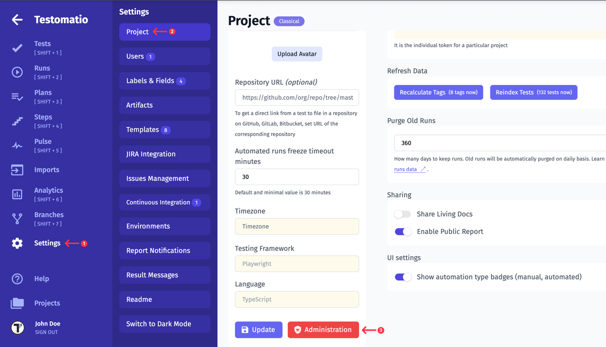
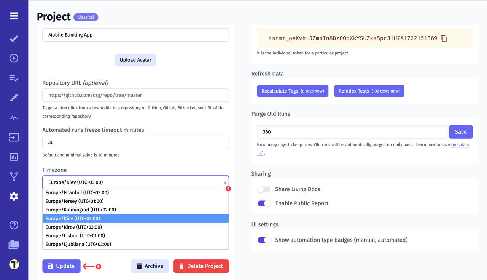

## Project Timezone

If you have a multi-national team and everyone is working in different parts of the world, you need to avoid time mismatches. All your actions in the project will be displayed at UTC+00:00 by default. So you need to specify the project time manually.

To do this, follow these steps:

1. Click on **Settings** in the sidebar 
2. Click the **Project** button 
3. Active **Administration mode

4. Select the required time in the **Timezone** field
5. Click the **Update** button to save changes

