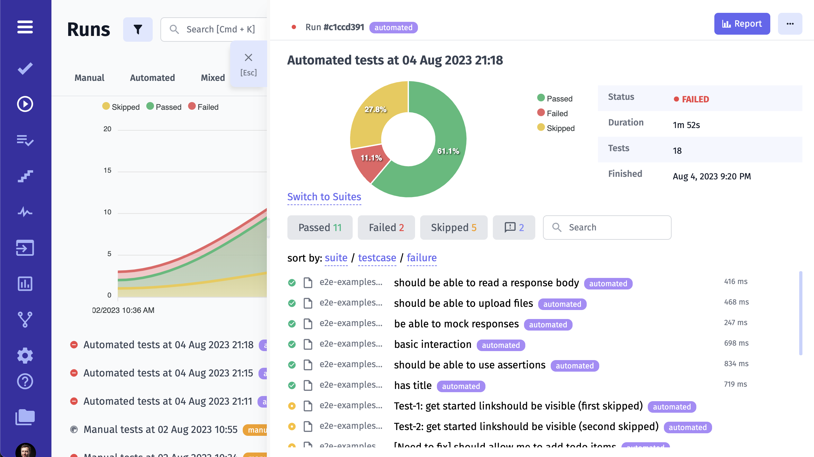

Testomat.io can receive and store test run reports from various test frameworks. 
You can use Testomat.io as a test management system or as a rich reporting tool. 

Depending on how you plan to use it we can look from different perspectives:

* In case of **Test Management System**, the key entity is a Test. So before reporting tests it is **required to import your tests** first. Test has its history and a lifecycle, so each test report will be attached to a corresponding test in a project. If a reported test doesn't exist, you will see message "Tests Not Matched". By default, new tests are not created from Run report, to avoid duplicates, or cases when you accidentally reported wrong tests.

* In case of **Reporting Tool**, you are more focused on getting reports rather than managing tests. In this case you may not need test history, so **importing tests is not required**. You can run tests with `TESTOMATIO_CREATE=1` option enabled, and all tests will be created from a test result.

If your project contains only automated tests, you may prefer using Testomat.io as reporting tool only. However, to unleash the full power of Testomat.io we recommend using it as a test management system, that means keep tests synchronized with the codebase. 


### Why Do I need to Import my Tests?

As described in a section above, Testomat.io require tests to be imported first in order to synchonize them wth the codebase and to keep track the history of tests between reports. If test was not found in a project it is marked as "Unmatched" in report. We use this notice to avoid duplicates or accidentally added tests. Read more about [importing tests](/getting-started/import-tests-from-source-code/).


This rule doesn't apply to test reported via JUnit XML. In this case all tests from XML file are created automatically on report.

### How to Receive Run Report

You have already [imported automated tests](https://docs.testomat.io/getting-started/import-tests-from-source-code/) and you wonder what's next? Testomat.io will help you to generate a run command to use on your machine or on your CI. As a result, you will get human-readable Run Reports with lots of additional information.

Testomat.io has a friendly UI that helps to set up automated test reporting. So there is no need to learn all technical documentation in the very first steps. Let's see how it works.

### Launch Automated Tests

First, go to the Runs page, click on the Extra button and pick **Setup Automated**


Then you need to pick your framework from the dropdown.


Testomat.io will generate instructions regarding your framework. You may need to make few changes to your code, namely, add the Testomat.io plugin.


Please note that you need to start generated commands in your terminal from your project folder.


> Also, you can add advanced options to your command to enable extra options. For example, you can give a title to your report by passing it as environment variable to `TESTOMATIO_TITLE` or can add environments to run by providing `TESTOMATIO_ENV`. 
Learn more about [advanced reporting options here](https://docs.testomat.io/reference/reporter/#advanced-usage).

If you have successfully launched your automated tests, a new Test Run will appear on Runs page.


You can see tests results in real-time in the Run Report.



As soon as all tests are completed you can check Run Report with details.


## Advanced Reporting

Testomat.io reporter can be configured to add additional information for Run report. For instance, you can specify:

* run title
* rungroup
* environemnt

[Learn more of all possible options](/reference/reporter/pipes/testomatio).

### Reporting Parallel Tests

When you enable reporing for tests running in parallel, you might end with multiple reports per each executed process. There are few options to deal with this case, which you can use depending on your setup.

**Strategy 1: Use start-test-run** 

Run tests via `npx start-test-run` command:

```
npx start-test-run -c "<actual run command>"
```

Under hood start-test-run creates a new empty run and passes its ID as environment variable into all spawned processes. So no matter how many parallel processes are started they will report to the single Run report.


However, this might not work in all cases. An alternative appriach would be:

**Strategy 2: Use shared run**

In this case multiple independent launches will report data to the report matched by the same Run title.


Pick the unique name for this run and use `SHARED_RUN` environement variable to enable shared report:

```
TESTOMATIO_SHARED_RUN=1 TESTOMATIO_TITLE="UniqTitleForThisBuild" <actual run command>
```

For instance, if you run tests on CI as a title you can use ID of this Build:

```
TESTOMATIO_TITLE="Build $BUILD_ID" TESTOMATIO_SHARED_RUN=1 <actual run command> 
```

If you prefer you can use Git commit as unique identifier:

```
TESTOMATIO_TITLE=$(git rev-parse HEAD) TESTOMATIO_SHARED_RUN=1 <actual run command> 
```

Please refer to documentation of your CI system and pick the variable which and be unique to all runs of this build. This approach **fits perfectly for sharded tests when you run tests on different jobs, different containers, different machines**.

We recommend to also append some more info into the `TESTOMATIO_TITLE`

**Strategy 3: Manually create and close run**

In this case you create a run, receive its ID and manually close it after all runs are finished.


Create a run via `start-test-run --launch`:

```
export TESTOMATIO_RUN=$(TESTOMATIO=xxx npx start-test-run --launch | tail -1)
```

then execute tests passing the `TESTOAMTIO_PROCEED` variable:

```
TESTOMATIO=xxx TESTOMATIO_RUN=$RUN_ID TESTOMATIO_PROCEED=1 <actual-run-command>
```

Once tests are finished close the run with `start-test-run --finish`:

```
TESTOMATIO=xxx npx start-test-run --finish
```

If you have a complex pipeline, you can start Run on the stage #1, execute tests in parallel on stage #2, and close the run on stage #3. 

### Terminated Runs

Sometimes, during test automation, unexpected issues may arise, or a test can be stopped for various reasons. 


For example, during the execution of the problematic test case, the some gateway becomes unresponsive due to a server issue. This issue was unforeseen and not within the control of the testing team. Testomat.io detects the problem and initiates a termination of the problematic test case. The custom timeout you defined (min 30 minutes) comes into play. If the test case does not complete within this time frame, it is terminated automatically.

So you can terminate test runs without causing disruptions and you can set custom timeouts for terminated runs.


### Stack Traces 

Testomat.io provides detailed information about the active stack frames during the execution of a program.

It extracts URLs from user logs and convert them into clickable links within the test result view, making it easy for users to access the URLs directly from the test results.


## How To Enable Playwright Trace Viewer

Traces in Playwright refer to detailed logs or recordings of browser interactions during a test script's execution. They capture a chronological sequence of events, including browser actions, network requests, and other relevant information.

Here are steps how to enable Playwright trace viewer for uploaded artifacts in Test Run:

1. setup S3 Bucket (see [dedicated documentation](https://docs.testomat.io/usage/test-artifacts#set-up-s3-bucket))
2. enable third-party cookies in your browser
3. run your tests
4. click on a test
5. click on the trace.zip

