## Running Tests Manually

Tests that are not automated (yet) can be executed by QA engineers in manual testing mode. In this mode, a user can check manual tests and mark them as passed or failed. It is possible to create a list of tests to check in test plan and assign users to a run. 

### **How To Run All Tests**

To launch a Manual Test Run you need: 

1. Click on Run button on left-side menu
2. Choose Manual Run button

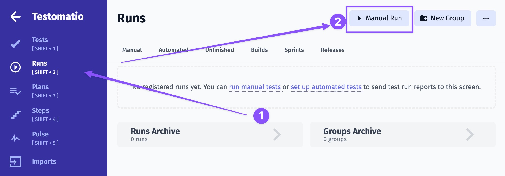

On Manual Run screen you need:

1. Select a Test Plan
2. Add a title (optional)
3. Pick up a testing environment
4. Click on Launch button

### How To Create a Test Plan

If you need to create a Test Plan you should click on + New Test Plan 

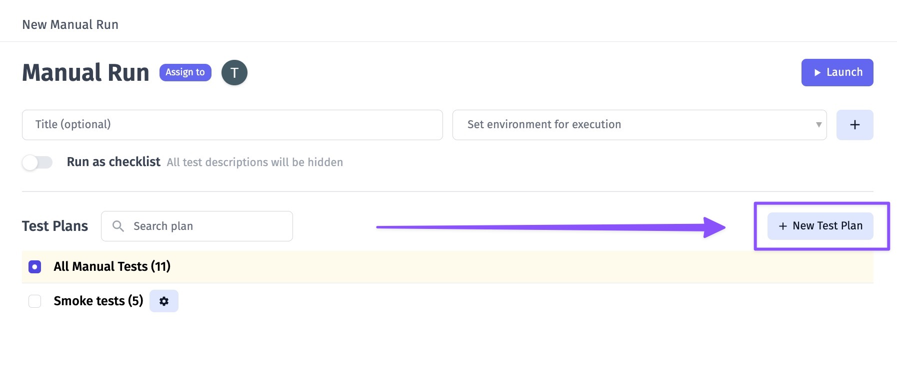

Or you can go to **Plans** page and create a new Test Plan there:

Now your next steps are:

1. Add a title to your Test Plan
2. Pick a suite/ tests 
3. Click on the Save Plan button

The new Test Plan will appear on Manual Run screen 

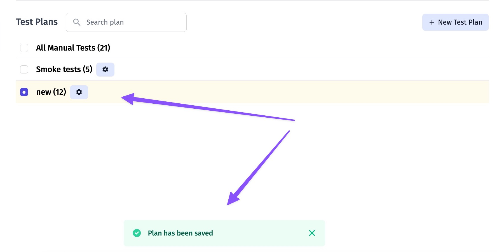

### **How To Filter Tests For a Test Plan**

Tests can be filtered in several ways:

1. By tags
2. Manually picked up from existing suites

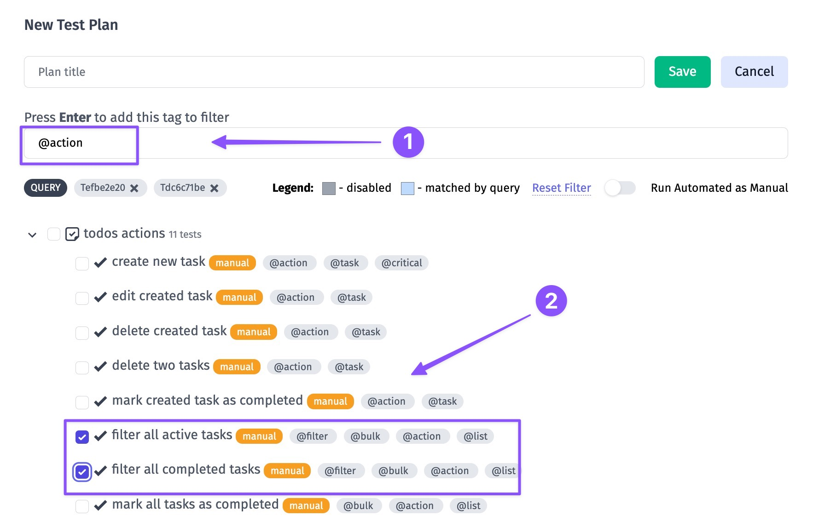

### **How To Select Environment**

To select a testing environment you need:

1. Click on Environment field
2. Choose the environment that you need

## **Multi Environment Tests**

Multi environment tests are used for performing the same tests in different environments. This option is very useful in cases when you need to perform testing with different types of operating systems/ browsers/ devices. They can be performed simultaneously or in a sequence. Let's get a look at this option.

### **How To Add More Environments**

To add more environment you need to click on the plus button

You will see a pop-up window where you should click on Add Environment button

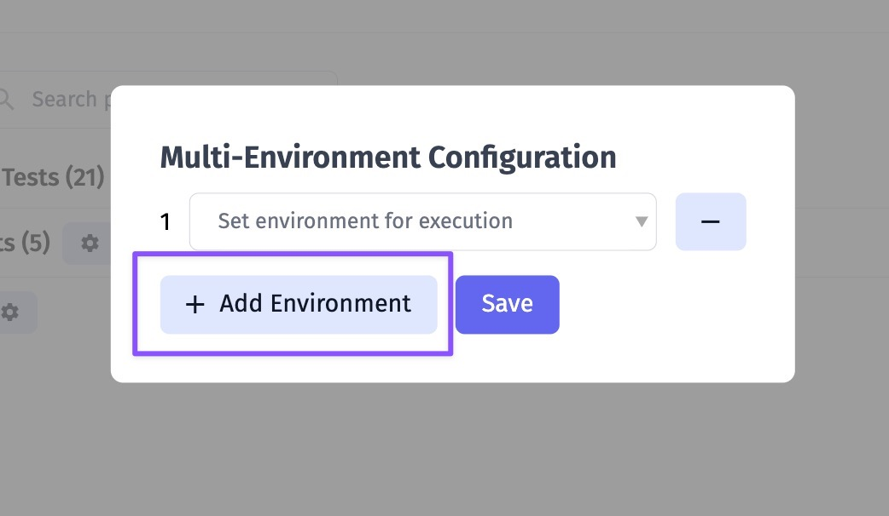

Then click on Environment field and choose the environment that you need

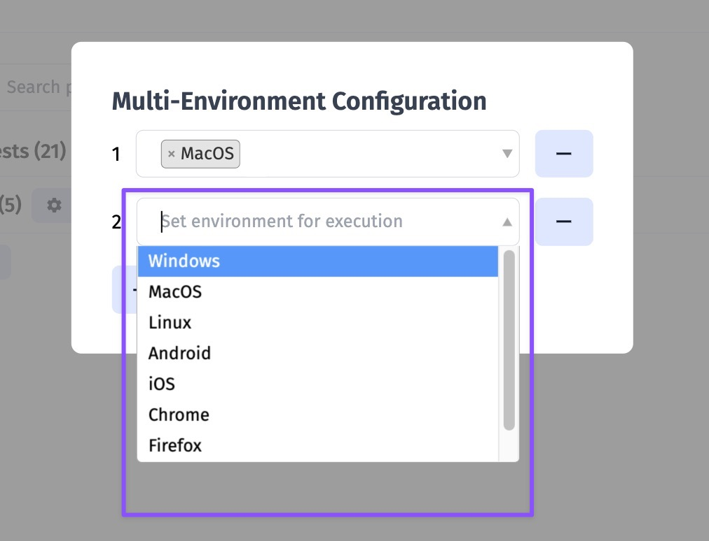

Once all environments were added click on Save button

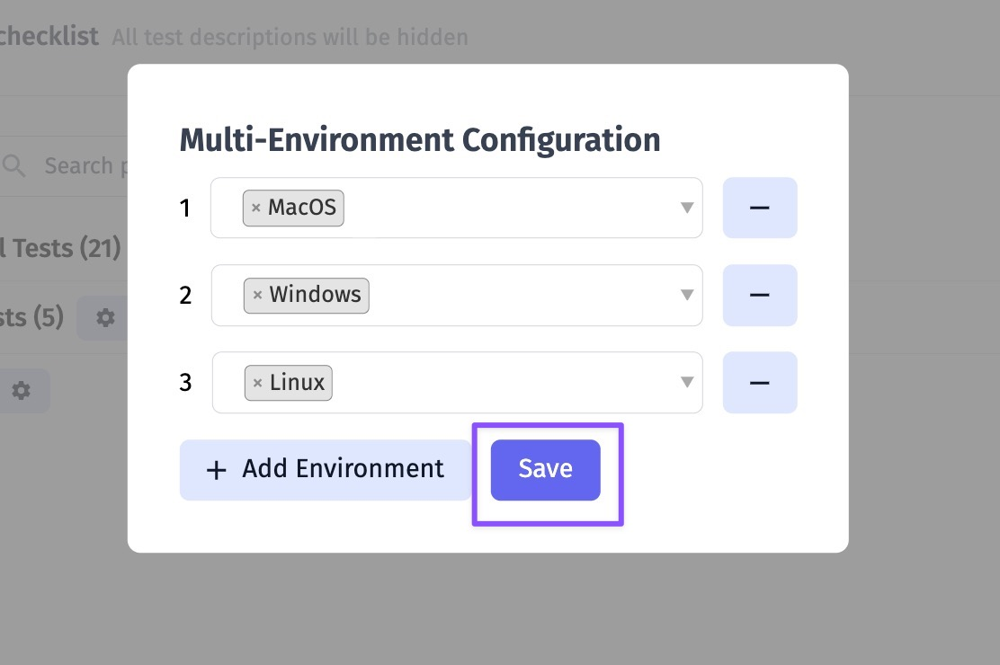

Now you have environment information updated on Manual Run screen 

### **How To Run Multi Environment Tests in Sequence**

To run Multi Environment Tests in sequence you need to click on Launch in Sequence button

### **How To Run All Multi Environment Tests**

To run Multi Environment Tests in sequence you need to click on Launch All button

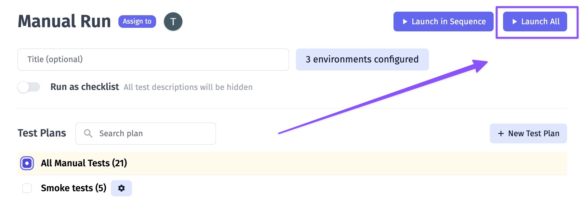

## **How To Run Tests As Checklist**

Checklists are widely used in day-to-day manual testing to quickly execute a set of tests without distracting to the additional details. In this mode, the test description is hidden by default. But you can still view the description when you click on the Description button.

To enable Checklist mode you need to launch Manual Run and switch on the Checklist toggle.

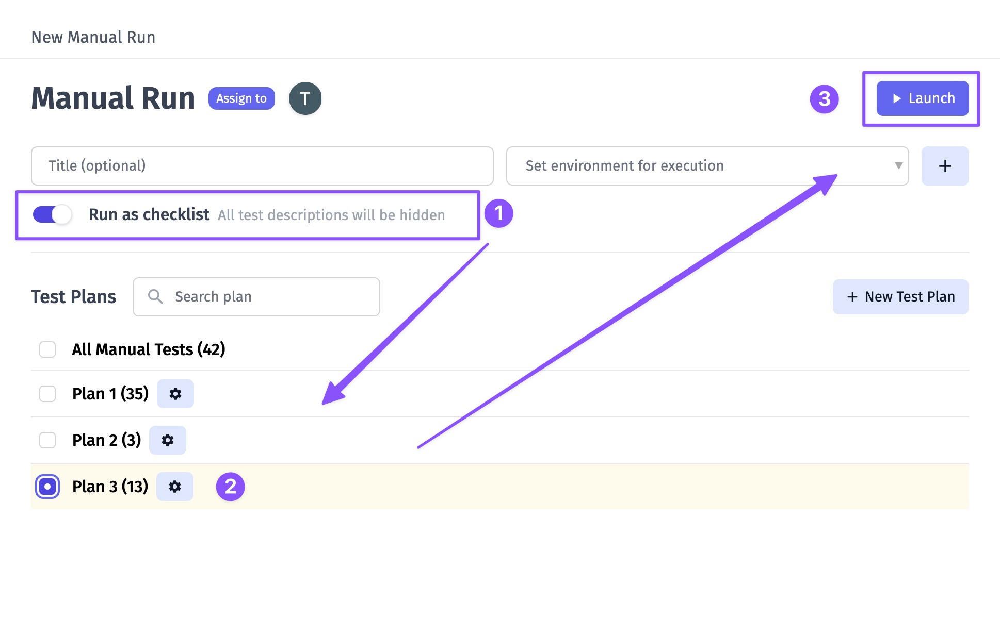

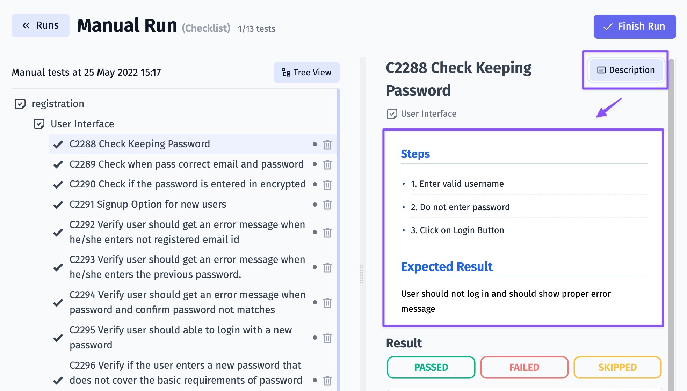

## **How To Run Automated Tests Manually**

When creating Manual Test Run automated tests are disabled by default.

But you can enable them with **Run Automated as Manual** toggle. 

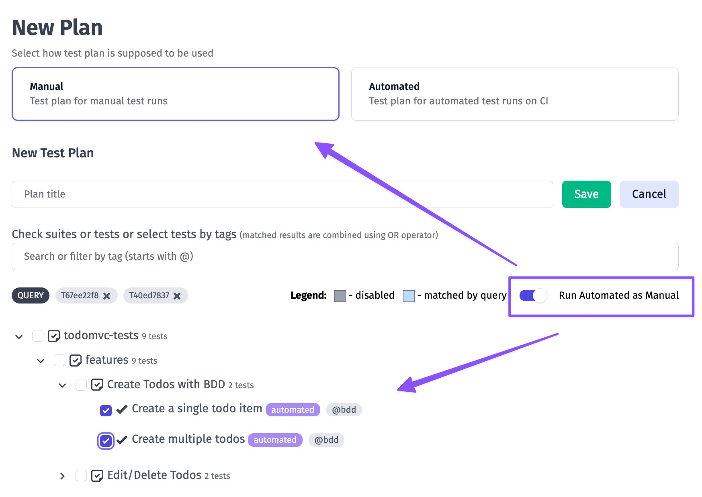

So can run automated tests manually as regular manual tests and see Code Description for reference

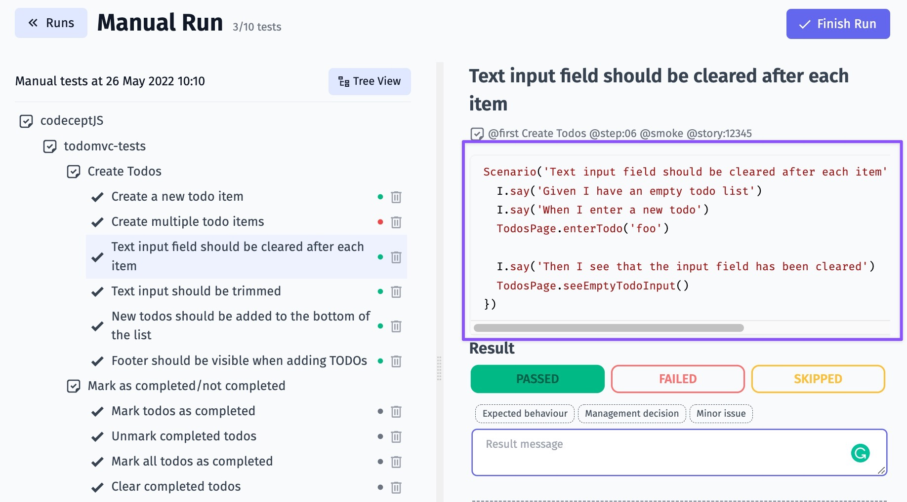

## **How Make Changes in The Launched Test Run**

As your testing journey unfolds, you might encounter new scenarios that warrant immediate attention. Fear not, Testomat.io provides you with options to inject additional tests into your already launched test runs. Discover how to expand your test scope effortlessly, ensuring that even the most unforeseen scenarios are accounted for without disrupting your testing momentum.

You can update your Test Run any time in few easy steps: 

1. open the Run
2. click Edit button

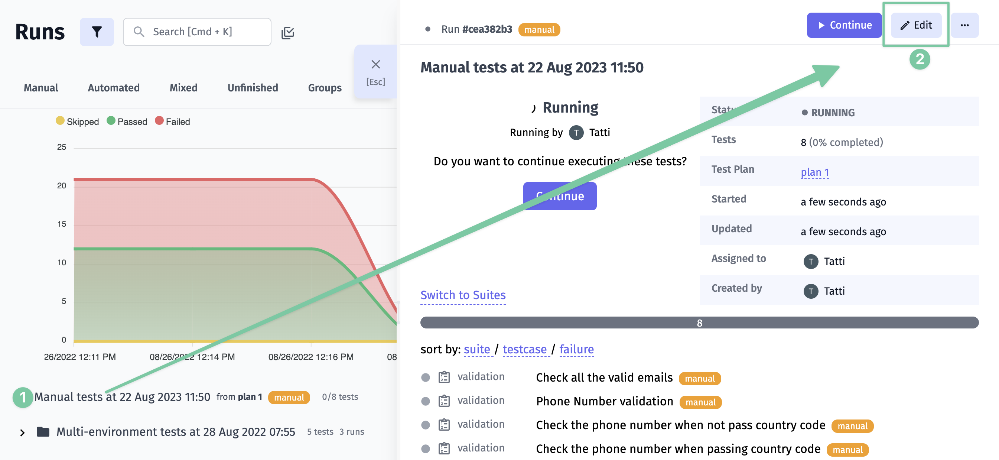

Let's see what we can do here:

1. Assign more users to the Run
2. Edit title of the Run
3. Add/remove testing environments
4. Add more tests to the Run
5. Add tests from another test plan
6. Don't foget to save ;)
