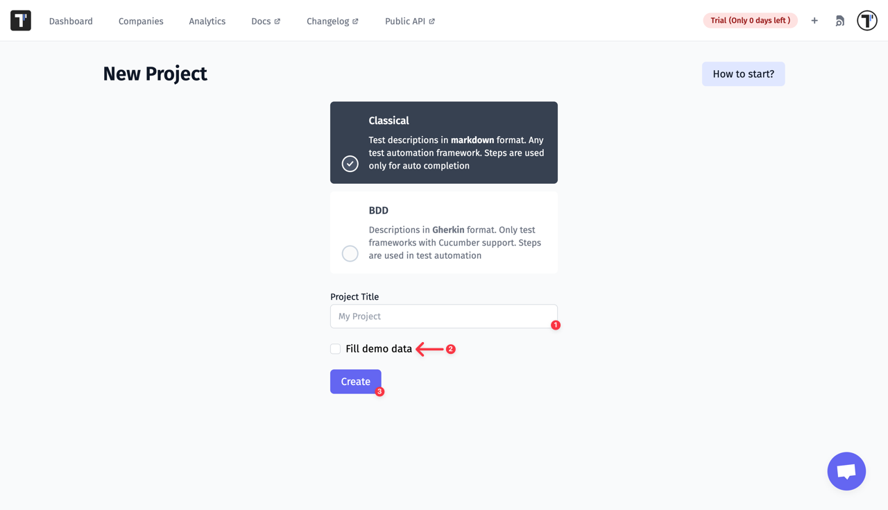
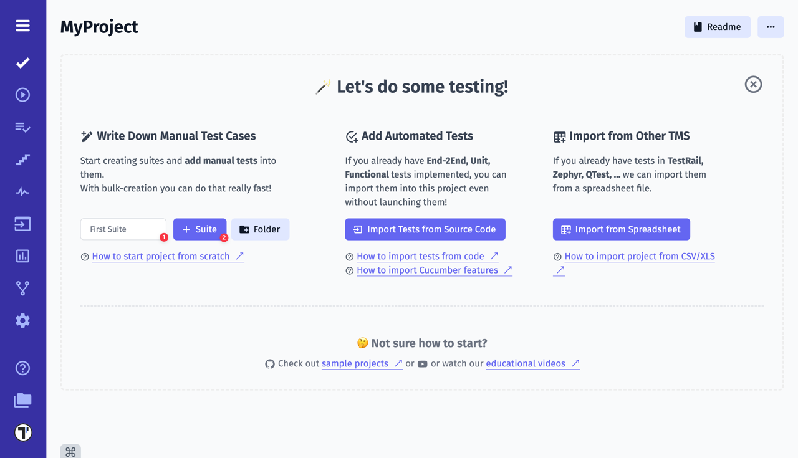
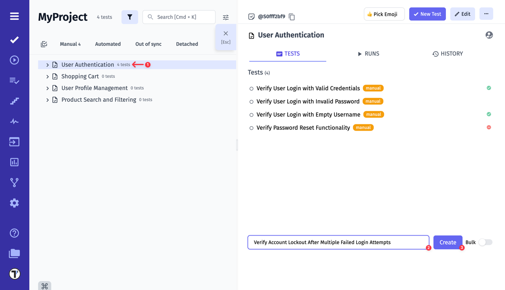
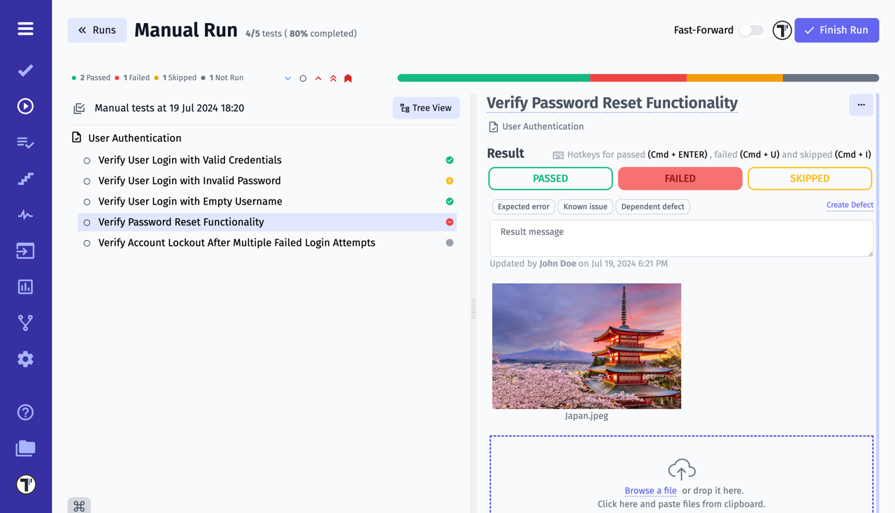
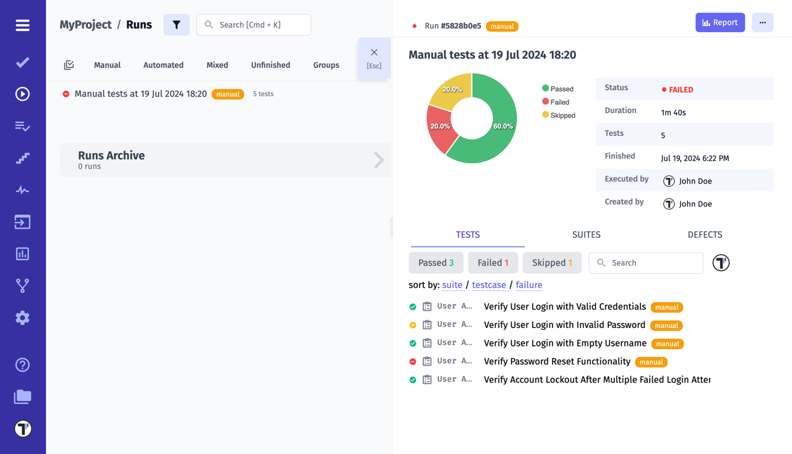

> If you don't have any manual or automated tests yet - follow this guide. Otherwise, pick the section of the guide relevant to your project. You might want to start from [this section](https://docs.testomat.io/getting-started/import-tests-from-source-code/) if you consider **importing tests from source code** into Testomat.io. For those interested in importing tests from the **Cucumber** framework, go straight to [this section](https://docs.testomat.io/getting-started/import-tests-from-cucumber/#why-do-i-need-to-import-my-tests)!

## Create a new project

Register at [app.testomat.io](https://app.testomat.io) and activate your user account. Then create a new project.

The type of your new project will influence the look of your interface, as well as its intended audience. Choose **BDD Project** if you plan to follow BDD descriptions or use the Cucumber framework in future. If you haven't decided yet, you can start with default **Classical Project**. Depending on your choice, the interface will differ, as follows:

* Within a **BDD Project**, you will have feature definitions written both in the source code (by engineers) and in Testomatio (by managers and QAs). So you will be able to track and plan Cucumber automation, as well as synchronize the actual feature files with relevant test cases. When a scenario has changed in the system, but has not been updated in the code yet, you will be notified that this certain scenario is out of date.
* Within a **Classical Project**, test cases will be written in free form using markdown. Automated tests will be synced up with test cases, so you will be able to see the test description in one tab and the corresponding test code in another tab. When a description of a test case undergoes changes, you will be notified that a certain test might need to be updated.

Let's start creating a project:

1. Fill the name of your project in the **Project Title** field.  
2. The **Fill demo data** checkbox is optional. This option fills the project with ready-made test data so that new users can try Testomat.io quickly and easily. You can simply skip it. 
3. Click the **Create** button to start a new project. 

You have just created your first project. Now you can start creating suites and test cases for your projects.

## Write First Test Cases

Let's take a look at creating test cases step by step.

1. Fill the name in the input field. 
2. Click the **+ Suite** button to create a new suite. 

Or another case:

Great, let's move on! Select a certain suite to nest the creation of new test cases in that suite. 

1. Select a test case.
2. Fill the name in the input field. 
3. Click the **Create** button to create multiple test cases.

When tests are newly created, they are marked as **manual** by default, which shows that they are ready for manual checks. Also, to create or edit multiple suits or test cases at once use [Bulk Edit](https://docs.testomat.io/usage/bulk-edit/).

As a result, you can add descriptions for each test case. However, the roles of these routine test cases are clearly seen from their titles, so we can probably try to run them to verify the user management part. 

## Run Manual Tests

Now let's take a look at how to run our tests and get a detailed report:

1. Select **Run** tab in the sidebar.
2. Click the **Manual Run** button to create new test run.

Before you execute your tests, you might want to specify the run environment options (a list of options is customizable) and the title for this run. In [this section](https://docs.testomat.io/getting-started/running-tests-manually/#multi-environment-tests) you will learn how to set up the environment for test execution. 

3. Select the checkbox next to **All Manual Tests**
4. Click the **Launch** button to execute the tests.

You will see the list of all test cases when the test execution is launched. Mark them as passed, skipped or failed. When a test check fails, you can write the description of the failure and attach a relevant image.

Once the run is finished, the overall results of it are available for your review, like this:

Here you can find all the important information about the completed test run. Such as the duration of the run, the performer, and so on. You can also filter by status, find specific tests by tags, or sort by available methods.

To get a detailed report of the test run, click on the **Report** button:

Now you can share the report with your stakeholders. It is just a tip of the iceberg, keep reading the documentation to discover [Testomat.io](https://app.testomat.io)!
