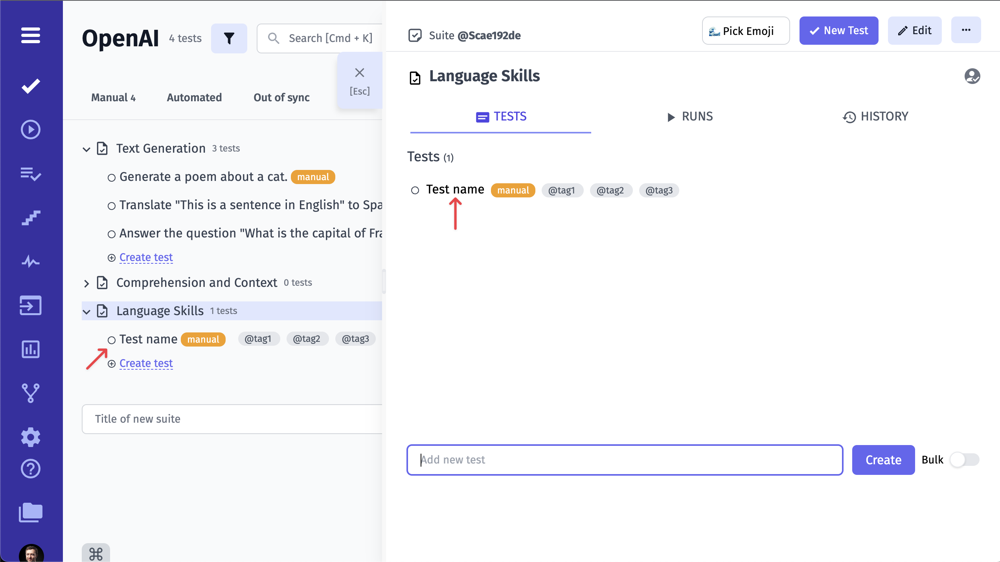

When a new project is created, there are multiple options to start:


1. Create new suite and start adding tests
2. Import automated tests from source code
3. Import tests from CSV file from another Test Management System

## Creating a test

Tests are created within a suite. 


To create a new suite use "+" button or input field. 
Open a newly created suite.

To add a new test to the suite you are currently in,  click on **New Test** button.


Then input the name and the description of your test. 


It is also possible to the test straightaway from this screen. Simply input the test's title and click on the **Create** button. You can add the description at any time later. 


Repeating these steps, you can easily add as many tests as you need within a reasonable period of time.

Also, you can use shortcut commands to create/edit Test Cases or Suites:

| Details                                        | Shortcut          |
|------------------------------------------------|-------------------|
| Opens the window to create a new **Suite**     | `Cmd + I`         |
| Save & Create New Suite in create mode         | `Shift + Cmd + S` |
| Save & View Suite in edit mode                 | `Shift + Cmd + S` |
| Opens the window to create a new **Test Case** | `Cmd + U`         |
| Save & Create New Test Case in create mode     | `Shift + Cmd + S` |
| Save & View Test Case in edit mode             | `Shift + Cmd + S` |

## **Test Case Editor**

Test Case Editor is a dynamic interface, designed to accommodate the diverse requirements of test case formulation. Through this platform, testers wield the power to architect meticulously structured test scenarios, encompassing a range of variables, actions, expected results, and potential outcomes.

Regarding test case creation, Testomat.io offers two distinct editor types: the **Classical** Editor and the **BDD** (Behavior-Driven Development) Editor. Each caters to different testing methodologies and user preferences, enabling testers to choose the approach that best aligns with their needs. 

Let's have a look at each of them.

## **Classical Editor Review**

Introducing the Classical Editor, a tool that places the art of test editing firmly in your hands. Crafting tests becomes a seamless endeavor as you immerse yourself in the Classical Editor's capabilities. 


1. Test title field - enter here your test title and tags (if needed)
2. Toolbar with formatting options
3. Editing Area - a place for preconditions, steps and expected results 
4. Preview button that allows you to see live representation of how the test will appear
5. Attachments button opens attachments dialog
6. Extra menu button
7. Autocomplete Steps switch
8. Autocomplete Snippets switch
9. Autocomplete Tags switch
10. Full screen button - offers you a seamless transition distraction-free environment
11. Change State - allows to change test state, namely manual test can be marked as automated and it will be treated as an automated test
12. Save - save your work
13. Close - escape the editor

However, the Classical Editor's influence transcends singular tests. With Pre-Requirements, you can now wield the power to define the contextual prerequisites that set the stage for entire test **suites**. Seamlessly integrate high-level descriptions of dependencies, system states, or configurations required to execute a suite effectively.


1. Suite title field - enter here your suite title and tags (if needed)
2. Editing Area - a place for suites description and pre-requirements
3. Preview button that allows you to see live representation of how the suite will appear
4. Extra menu button
5. Autocomplete Steps switch
6. Autocomplete Snippets switch
7. Autocomplete Tags switch
8. Full screen button - offers you a seamless transition distraction-free environment
9. Save - save your work
10. Close - escape the editor
              
### Why Do We Use Markdown In Classical Editor?

Markdown is a lightweight and versatile markup language that revolutionizes the way content is formatted and presented. It combines the simplicity of plain text with the ability to produce well-structured documents, making it a favored choice for various applications, including software documentation and test case creation. Here are its benefits:

**Simplified Syntax:** Markdown's straightforward syntax empowers testers to articulate intricate test scenarios with clarity. Utilize headings to structure test steps, employ bullet points for concise lists, and employ emphasis (bold, italic) to highlight crucial details.

**Swift Formatting:** Testers can bid adieu to convoluted formatting menus and endless mouse clicks. Markdown's minimalist syntax allows testers to swiftly format text, enabling them to focus more on the content itself and less on the mechanics of formatting. This efficiency translates to accelerated test case creation.

**Collaboration Amplified:** Collaborative testing endeavors thrive on clear communication. Markdown's plain text format is version control-friendly, facilitating seamless collaboration using tools like Git. Team members can easily track changes, suggest modifications, and merge contributions, ensuring that test cases evolve cohesively.

**Readable and Accessible Content:** Markdown's clean and uncluttered appearance translates into test cases that are effortlessly readable, even by non-technical stakeholders. This enhances cross-functional communication by bridging the gap between testers, developers, and business analysts.

**Media Integration:** Beyond text, Markdown accommodates image and file embedding. Testers can attach screenshots, diagrams, or supplementary documentation directly within test cases. This integration injects valuable context, aiding in comprehension and enabling more accurate bug reproduction.

**Consistency and Templates:** Markdown's consistent structure allows for the creation of reusable test case templates. This ensures that test cases adhere to a standardized format, streamlining comprehension and navigation across a myriad of test scenarios.


### Examples Of Markdown Written Test Cases

In the realm of Markdown-based test case creation, the handling of test unveils an array of versatile techniques. Below, we delve into several illustrative examples that showcase various methods for incorporating steps and expected results into your test cases.

In this pattern, the steps are listed one after the other, along with their respective expected results. This is a simple and straightforward way to document the steps for a test case. You can see expected results as plain text just after step. Need to mention that expected results in this way will no go to steps database and you won't have autocompletion for it.

```
## Steps

* Step 1
    Expected result: Step 1
* Step 2
    Expected result: Step 2
* Step 3
    Expected result: Step 2
```

Some example:

```
## Steps

* Go to the payment page
    Expected result: Payment page loads
* Enter credit card details and submit
    Expected result: Payment is processed and confirmation page loads
```


---
### Expected Results as steps one after another

This pattern is similar to the previous one, but instead of listing the expected results right after each step as plain text, they are listed after all the steps have been documented. This approach will give you ability to use autocompletion and expected results will be stored in steps database.


```
## Steps
* Step 1
* Expected result: Step 1
* Step 2
* Expected result: Step 2
* Step 3
* Expected result: Step 2
```

Some example:
```
## Steps
* Go to the payment page
* Verify that Payment page loads
* Enter credit card details and submit
* Verify that Payment is processed and confirmation page loads
```


---
### Steps with Expected Results as nested list

This format is useful for breaking down each step into multiple sub-steps, each with its own expected result. This can be helpful when a step is complex and has several different parts or when there are multiple expected behaviors that need to be documented for each step. By nesting the expected results under each step, it's easy to see which expected results are related to which sub-steps, making it easier to track and verify expected behaviors.

```
## Steps
* Step 1
    1. Expected result: Step 1.1
    2. Expected result: Step 1.2
* Step 2
    1. Expected result: Step 2.1
    2. Expected result: Step 2.2
* Step 3
    1. Expected result: Step 3.1
    2. Expected result: Step 3.2
```

Some example:
```
## Steps

* Go to the payment page
    1. Verify that Payment page loads
* Enter credit card details and submit
    1. Verify that Credit card number is accepted
    2. Verify that Expiration date is accepted
    3. Verify that CVV code is accepted
* Submit payment and confirmation page loads
    1. Verify that Payment is processed

```

---
### Steps with Separated Expected Results

Instead of listing the verification actions after each step, they are listed under a separate section for expected results. This can be a good way to provide a summary of the expected behavior and can be helpful in identifying any gaps in the test coverage.

```
## Steps
* Step 1
* Step 2
* Step 3

## Expected results:
* Verify that ...
* Verify that ...
* Verify that ...
```

Some example:
```
## Steps

1. Go to the payment page
2. Enter credit card details and submit

## Expected Results:

1. Payment page loads
2. Payment is processed and confirmation page loads

```

---

### Steps with Table of Expected Results

In this pattern, the steps are presented in a table format, with the expected results listed in a separate column. This can be a good way to provide a clear and concise summary of the test case and can be helpful in identifying any variations in the expected behavior.

```
## Steps

| Step          | Expected results |
|---------------|------------------|
| Success login | Check form       |
| Failed login  | Check form       |
```

Some example:

```
## Steps

| Step                           | Expected results                                           |
|--------------------------------|------------------------------------------------------------|
| Go to the payment page         | Payment page loads                                         |
| Enter credit card details      | Credit card number is accepted, Expiration date is accepted, CVV code is accepted |
| Submit payment                 | Payment is processed and confirmation page loads           |
```


---

### Steps with Expected Results as Subheadings

In this format, the expected results are included as subheadings under each step. This can be useful when you want to provide a more detailed description of the expected behavior for each step. So each section will provide more complex details and many verification point per each step

```
## Steps

### Step 1

* Expected result 1.1
* Expected result 1.2
* Expected result 1.3

### Step 2

* Expected result 2.1
* Expected result 2.2
* Expected result 2.3

### Step 3

* Expected result 2.1
* Expected result 2.2
* Expected result 2.3
```

Some example:

```
## Steps

### Go to the payment page

* Verify that Payment page loads

### Enter credit card details

* Enter credit card number
    1. Verify that Credit card number is accepted
* Enter expiration date
    1. Verify that Expiration date is accepted
* Enter CVV code
    1. Verify that CVV code is accepted

### Submit payment

* Verify that Payment is processed 
* Verify that Confirmation page loads

```

### Markdown Shortcuts

Use Markdown shortcuts to edit test case description quickly and easily.

| Function       | Windows          | macOS           |
|----------------|------------------|-----------------|
| Bold           | Ctrl + B         | Cmd + B         |
| Italic         | Ctrl + I         | Cmd + I         |
| Heading 2      | Ctrl + 1         | Alt + 2         |
| Heading 3      | Ctrl + 2         | Alt + 3         |
| Heading 4      | Ctrl + 3         | Alt + 4         |
| Quote Block    | Ctrl + Shift + K | Cmd + Shift + K |
| Link           | Ctrl + U         | Cmd + U         |
| Ordered List   | Ctrl + Shift + 7 | Alt + ,         |
| Unordered List | Ctrl + Shift + 8 | Alt + .         |


## **BDD Editor Review**

As you embark on the journey of crafting and refining BDD scenarios, this innovative platform empowers you to shape narratives into meticulously executable tests. At its core, the BDD Editor encapsulates the essence of collaboration, precision, and agility, delivering a comprehensive solution for modern testing workflows. Here, you'll create user stories, scenarios, and document expected behaviors with an eloquence that bridges the gap between technical and non-technical stakeholders. 

**Feature File Editor**

In the context of BDD, the Feature File serves as the canvas upon which your software's behavior is painted.

Let's see what we have here!


1. Editing Area - a place for the Feature File and its Scenarios with Given/When/Then steps
2. Extra menu button
3. Autocomplete Steps switch
4. Autocomplete Snippets switch
5. Autocomplete Tags switch
6. Full screen button - offers you a seamless transition distraction-free environment
7. Format button - brings your Scenarios to Gherkin structure
8. Save - save your work
9. Close - escape the editor

**Scenarios Editor**

Beyond Feature Files lies the individual tests. Here, the BDD Editor grants you the ability to sculpt scenarios with precision, breaking down user behaviors into granular steps and verifiable outcomes. Each test becomes a symphony of detail, harmonizing the user's journey with the software's responses. By editing separate tests within the BDD Editor, you orchestrate complex interactions, validations, and expectations.


1. Editing Area - a place for Scenarios with Given/When/Then steps
2. Extra menu button
3. Autocomplete Steps switch
4. Autocomplete Snippets switch
5. Autocomplete Tags switch
6. Full screen button - offers you a seamless transition distraction-free environment
7. Save - save your work
8. Close - escape the editor

## **URL/ID Quick Copy**

Depending on your needs, you can set up a convenient way to copy **URL/IDs** in **Test Cases**, **Suites** and **Runs**.

To start, you need to open a **Test Case** (**Suite** or **Run**):

1. Click the copy icon to open the modal window.
2. In the window that opens, you can copy the format you are interested in.
3. Turn on the toggle next to a format if you need to use it frequently.
4. Now, every time you click on the ID, the selected format will be copied to clipboard without any further actions.


## **How To Add An Attachment To A Test**

First of all, you need to open the test that you want to add the attachment to. 



Click on the **Attachments** tab.


Add your attachment via **Browse a file** or simply drag and drop it.


You can also add attachmennts directly to the test descrption:


Or use Attachment dialog by clicking Attachments button:


## How To Save Your Tests

Testomat.io Editor offers options designed to streamline your test and suite management workflow. Lets have look:


Save: promptly save your changes while staying on the current test.

Save + View Test: save your work while immediately viewing the test in question.

Save + Go To Suite: save your changes and seamlessly navigate to the suite you're working on.

Save + Close All: ensures all open tests and suites are saved and closed simultaneously.


## Suites and folders

Unlike other test management systems, **Testomat.io doesn't allow suite to include other suites and tests**. That's why you can either create a suite (a collection of tests) or folder (collection of suites).

<Aside>
When creating a suite you have to explicitly set its type: a suite or a folder.
</Aside>


This was designed so tests structure could match the filesystem. For instance, if you use BDD project, feature file can contain scenarios, but can't contain other feature files. The same for automated tests, a file can contain tests but can't contain other files. 

It's assumed that in any moment a manual test can be automated, so it is important to keep the filesystem structure in a project.

An empty suite can be converted to folder or vice versa


Also you can set an emoji icon for the suite


## **How to add a label/tag to a test**

This option is the easiest one! You simply need to add the label's name (preceeded by @ char) in the name field of the test.


And now you can see your label/tag in the test list next to the test's title.


## **How to assign a test to a user**

If you want to assign a certain test to a certain user, you should click on this user icon in the upper right corner of the window, as shown in the picture.


Assign a user from the list of users added to the project by clicking on the user's name. Please note, that you need to make sure the intended user is added to the project first!


Now you can see that this test is assigned to a certain user. The user icon has changed accordingly.


## **How to set a priority to a test**

First, you should open the test and click on the checkbox icon next to the test title, as shown in the picture.


You will see a list of priority types


Click on the priority type you need and you will see the checkbox changed


Also, you will see set priority in your suite


## **How to add parameters to a test**

If you need to add parameters to your test you need to click on the vertical ellipsis button


Then choose Add Parameter from the menu


You will see a pop-up with instructions. Now you can add your parameters using a comma


Click on Create button to apply your parameters


You will see your added parameters on the bottom of the pop-up


And on the test description page


## **Drag and Drop Your Tests**

You may need to move your tests within a project, for example to another suite. For this purpose, you can use drag and drop. You need to drag a test and drop it into a suite. Please note, you should drop a test to suite name on the top of the suite.

