Test Plan is a detailed document that outlines the testing strategy, objectives, schedule, resources, and scope of a testing effort. It acts as a blueprint for how testing will be conducted, ensuring all stakeholders are aware of what will be tested, when, how, and by whom. A well-defined test plan is essential for ensuring product quality and aligning the testing process with project goals.

To create a test plan in Testomat.io, go to the **Plans** page and click the **+** button. The **Plans** page allows to search and filter previously created plans. You can also view and edit test cases that contain plans.

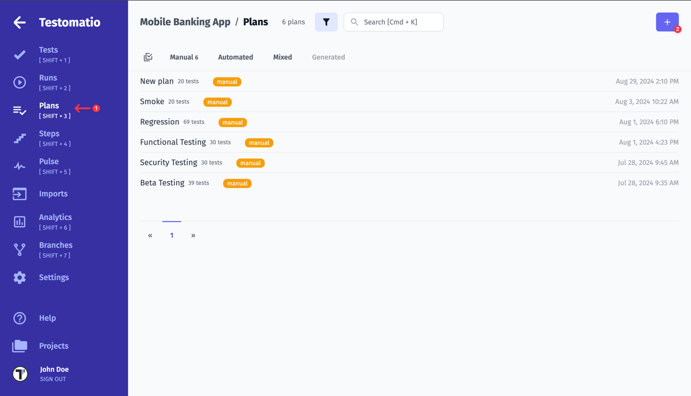

After that, you should select the type of plan you want to create:

* **Manual** - Test plan for manual test runs
* **Automated** - Test plan for automated test runs on CI
* **Mixed** - Automated tests on CI combined with manual run

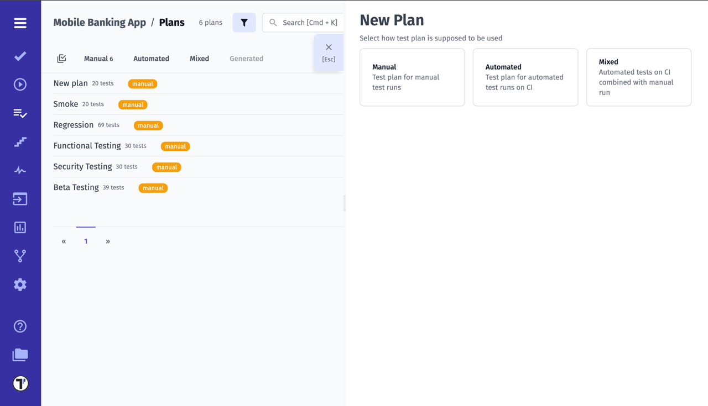

## Manual

By choosing manual plan, you can easily customize your selection of test cases:

* Select test cases by Checking Tests & Suites
* Select test cases by Tags
* Select test cases by Labels
* Select test cases by Query

Let's take a closer look at the work with filling the Plan with Test Cases:

1. To select specific test cases, open a suit by clicking on the arrow next to it and select tests you need. 
2. If you need all tests belonging to a particular suit, just click on suite name. All the tests in that suit will be selected automatically.

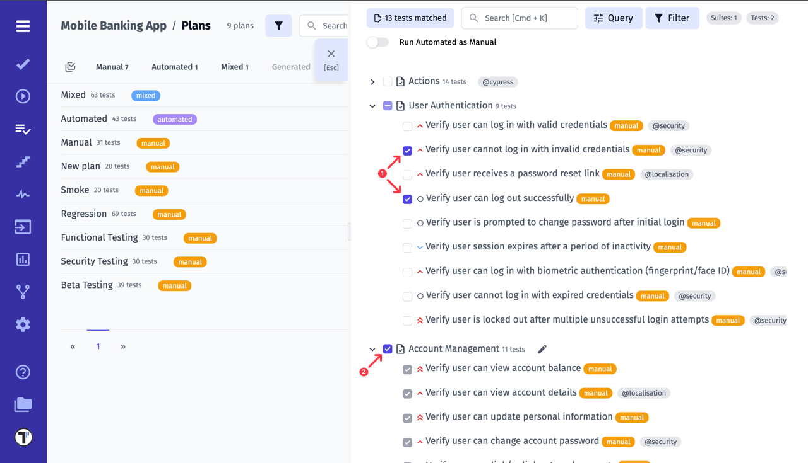

3. Use the search to find test cases by keywords.

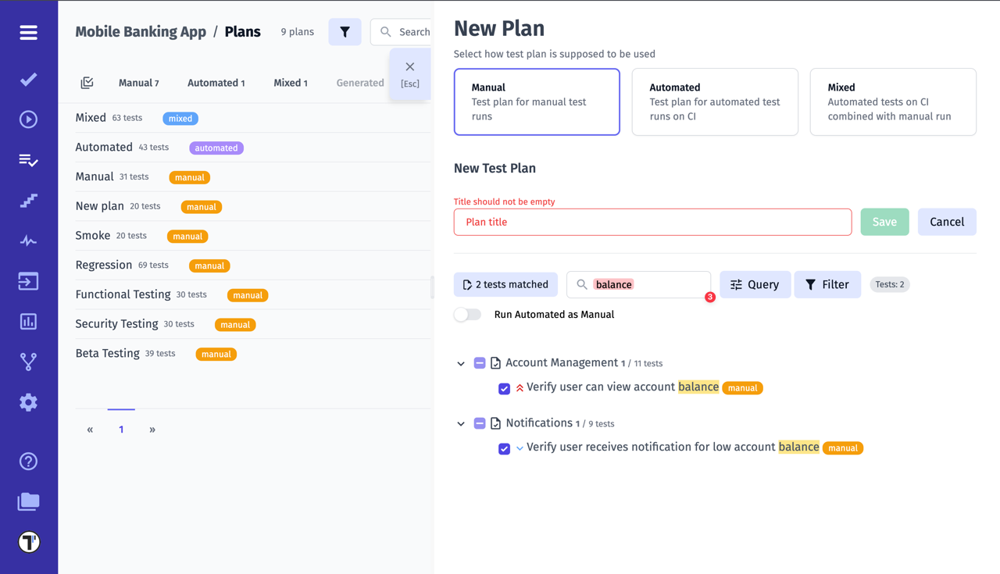

4. Use the filter to select test cases by specific criteria. You can filter by:

* by Tag
* by Priority
* by Assignee
* by Field

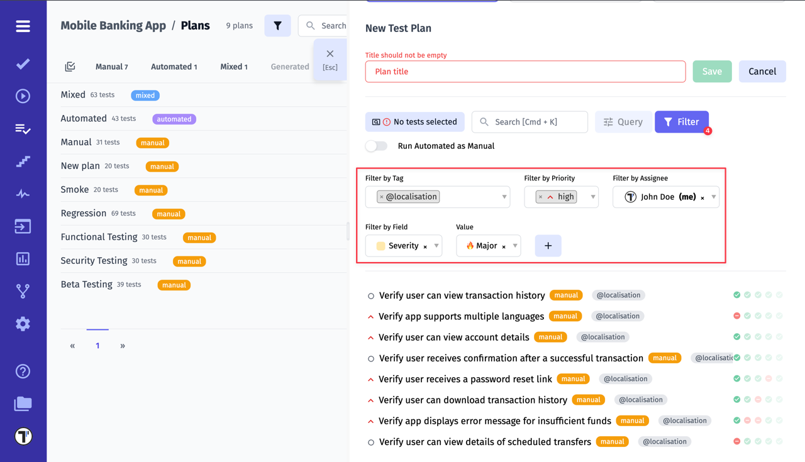

5. Or you can select test cases using the query language.

> Note: It is not possible to use a filter and a query language at the same time!

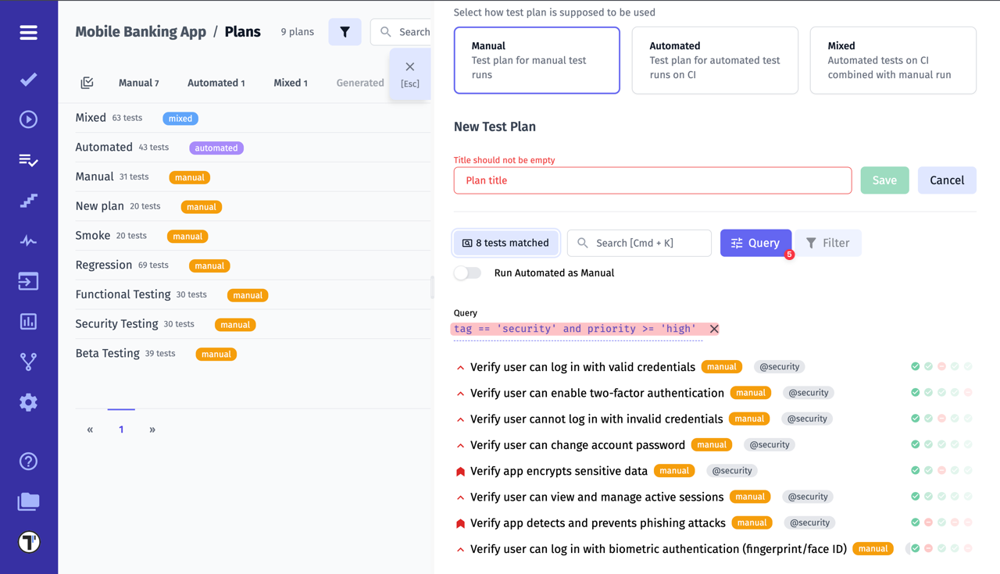

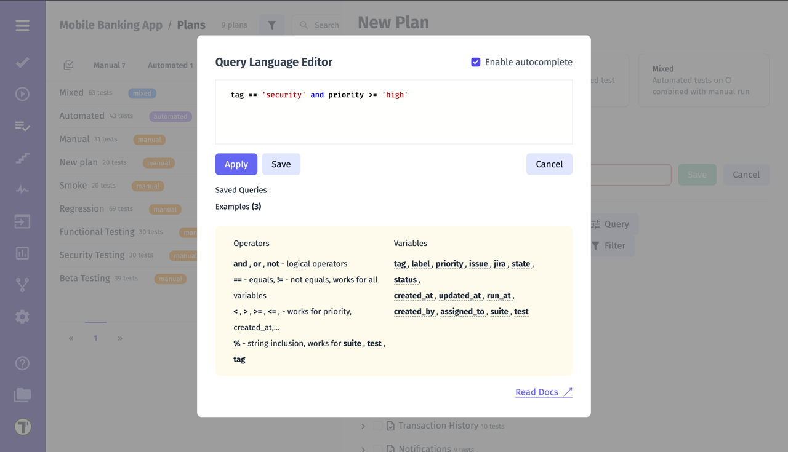

For more details on using the Query Language, visit the [dedicated page](https://docs.testomat.io/usage/query-language/).

6. Only the tests that meet the criteria will be displayed, when you click on the `.. tests matched` button

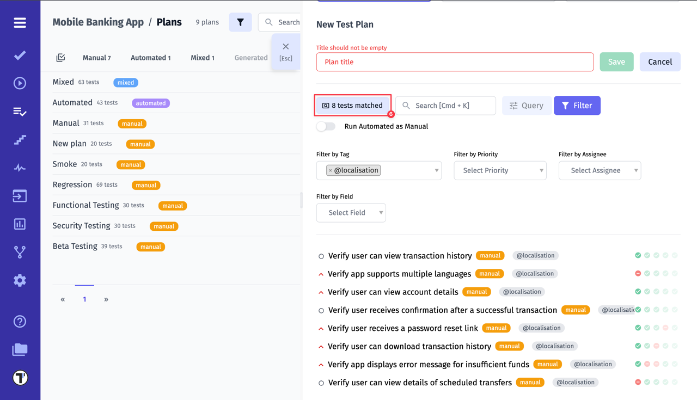

7. Additionally, you can run your Automated tests as Manual using a toggle switch. This gives you the option to include automated tests into a manual plan. It means that you will manually assign Passed/Failed statuses to automated tests during a test run.

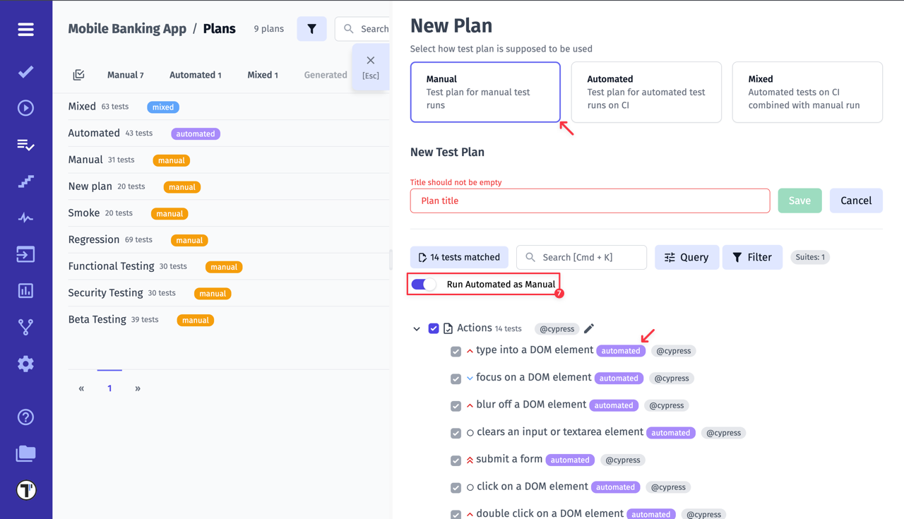

## Automated

By choosing automated plan, you need to configure **Continuous Integration**. Also, tests need to have IDs. This can be done by adding the `--update-ids` option when importing tests.

To learn how to set up Continuous Integration in Testomat.io, visit the [dedicated page](https://docs.testomat.io/usage/continuous-integration/).

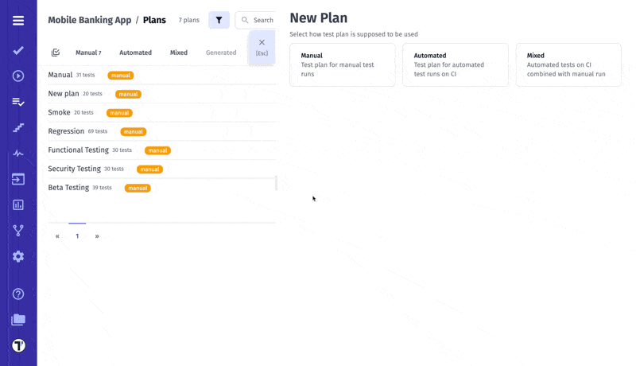

After running tests via CI, the report will be sent to Testomat.io. You can view it on the **Runs** page.

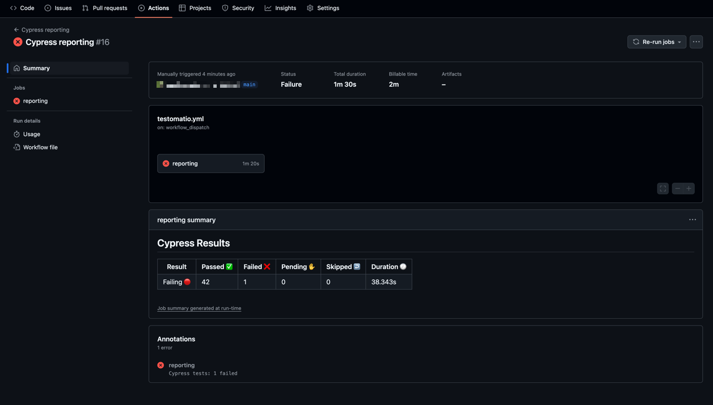

Automated run report:

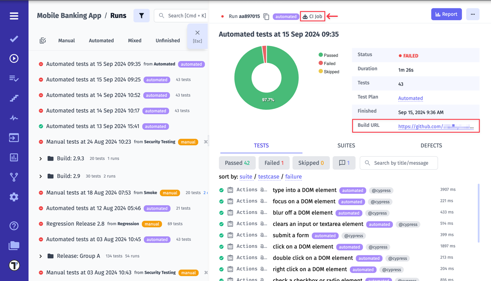

A **Plan ID** can also be used to run an Automated Plan. To learn how to do this, visit the [Filter Test](https://docs.testomat.io/reference/reporter/pipes/testomatio/#filter-tests) page (currently available for Playwright and CodeceptJS frameworks). 

## Mixed

Mixed Plan is a combination of automated and manual tests. Automated tests are running in **Continuous Integration**, while you run manual tests in parallel. As a result, you get one report for both automated and manual runs.

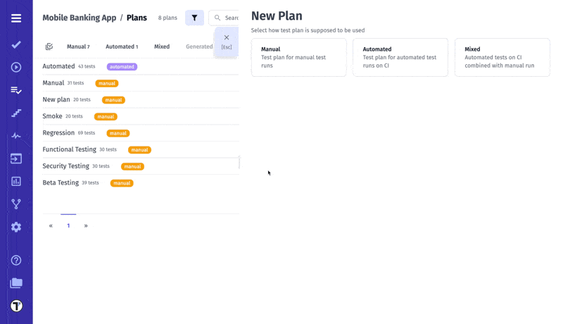