import { Aside } from '@astrojs/starlight/components';

## Installing Testomatio Plugin in JIRA

Install [Testomatio Plugin from Atlassian Marketplace](https://marketplace.atlassian.com/apps/1224120/testomatio?hosting=cloud&tab=overview)

> We also provide a Testomatio Plugin for Jira Server. Contact Testomatio Team to learn more about it.

## Connecting to JIRA project

<Aside type="caution" title="Watch out!"> Please note connecting to JIRA project requires admin rights to enable two-way integration capabilities like editing test cases or executing tests directly in JIRA. So user that is used to make JIRA configuration on project settings should have JIRA admin rights otherwise Testomat.io project won't possible to connect to JIRA.
</Aside>

To link tests to JIRA issues connect a Testomatio project to JIRA project.

* Open a Testomatio project
* Navigate to "Setting" > "JIRA Integration"
* Click "Add Jira project"

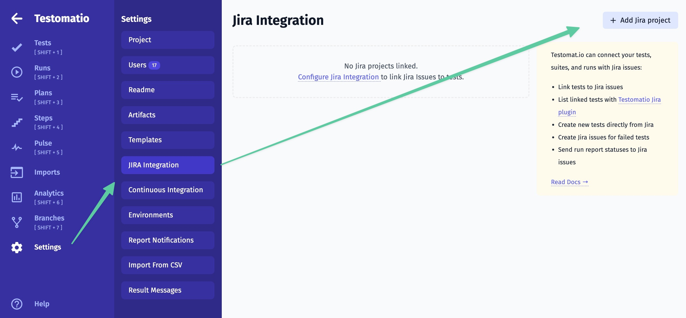

Provide connection details:

* Email (or username for Jira Server setup)
* API token (or password for Jira Server setup)
* Jira URL
* Project ID

If you use JIRA Cloud, obtain an API token for your user account.
If you use JIRA Server, use the password from your user account.

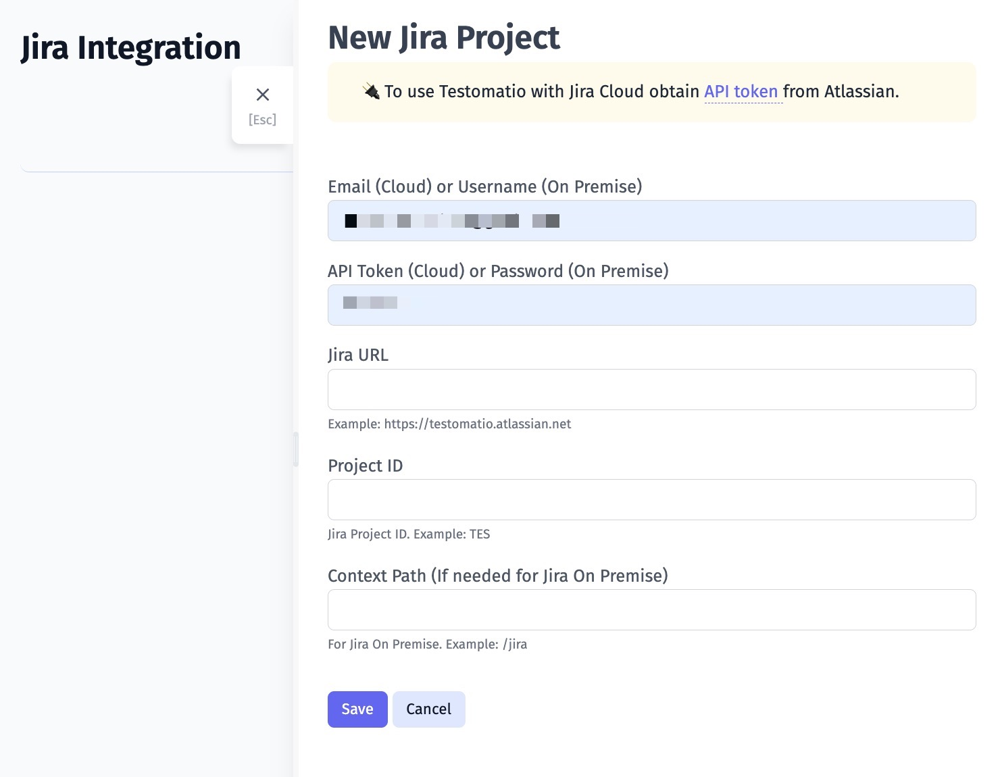

Click "Save"

Once the project is connected you will see your integration listed on the Settings page

> You can connect to multiple JIRA projects from a Testomatio project. Follow the same instructions to connect to another project.

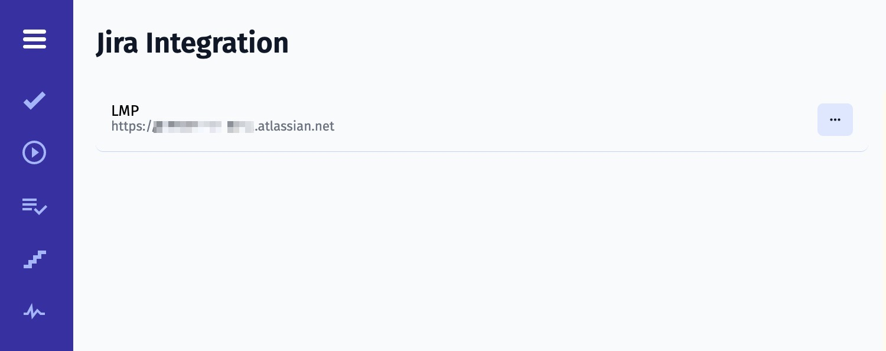

## Linking Test to JIRA Issue

To link a test to an issue, open a test in a Testomatio project that previously was connected to JIRA project. Select "Attach Jira Issue" in the dots menu.

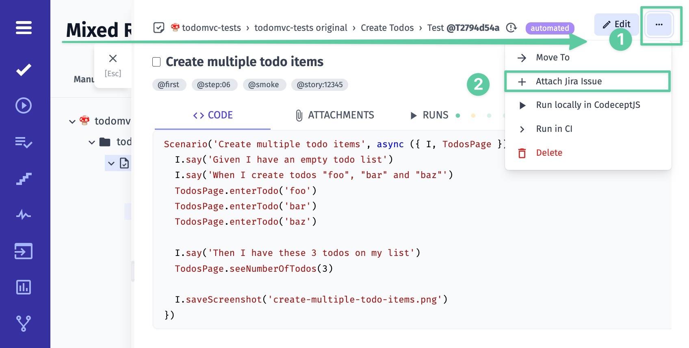

When attaching a test to an issue you can either link to an existing issue or create a new one.

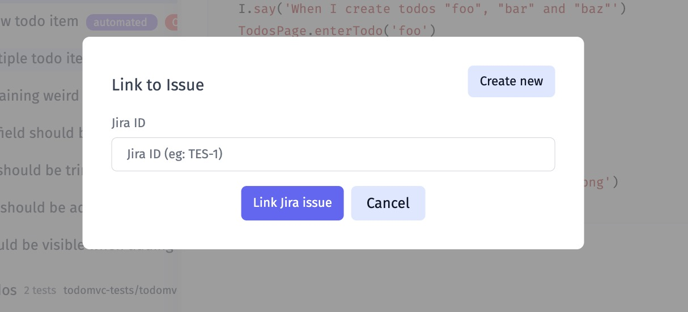

This test will be displayed in Jira under the Issue view:

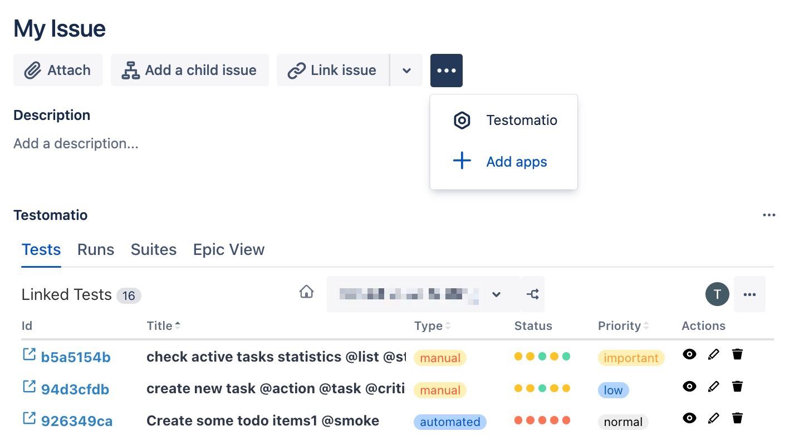

Please note, that you can link a test to multiple issues. In this case their IDs will be displayed in test view in Testomatio:

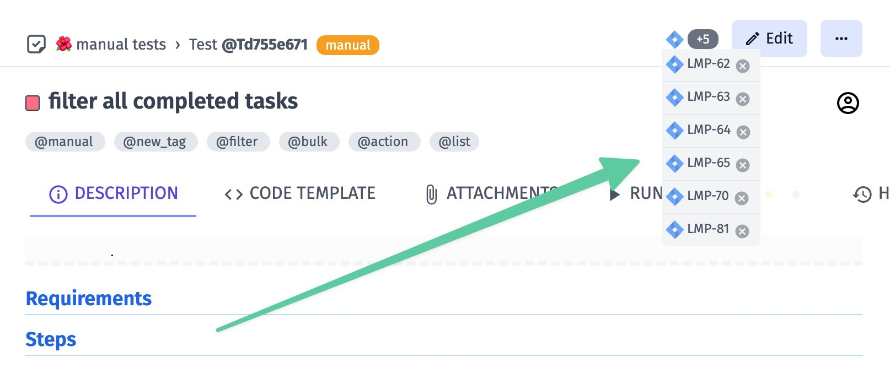

## Linking Suite to JIRA Issue

A suite can be attached to a JIRA issue similarly to a test. When attaching a suite, **all tests inside that suite will be linked to a JIRA issue** (this doesn't include tests from sub-suites). 

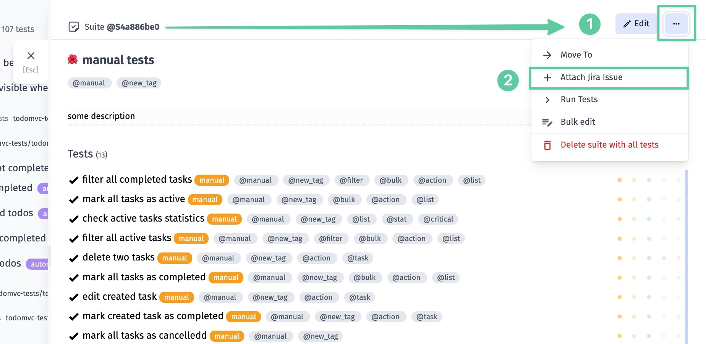

If your tests from the linked Suite are not shown in the Jira issue, click on the menu-button and on "Testomatio"

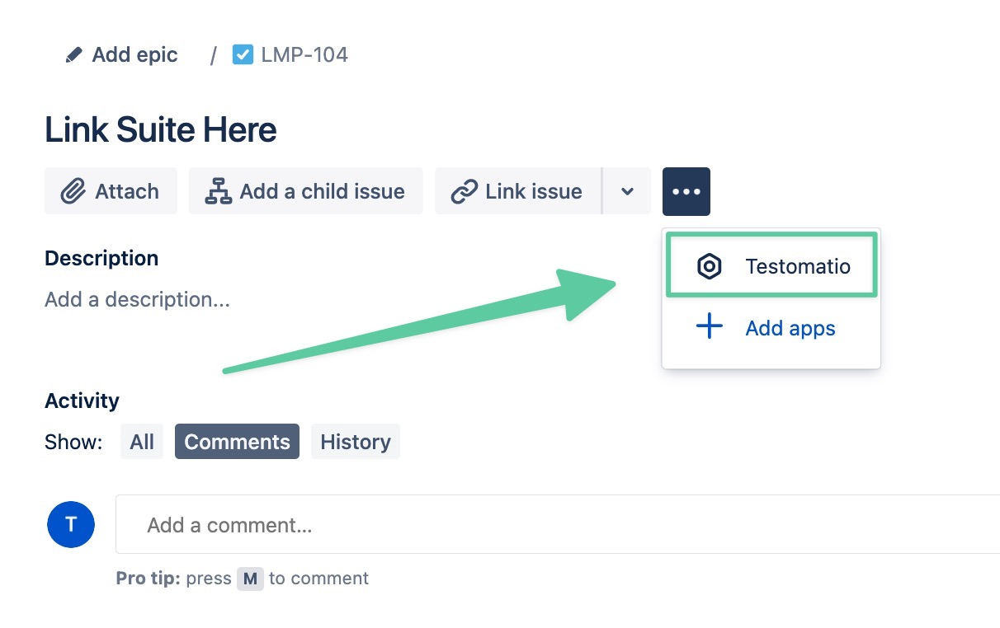

Now tests from added Suite are shown in the Jira issue:

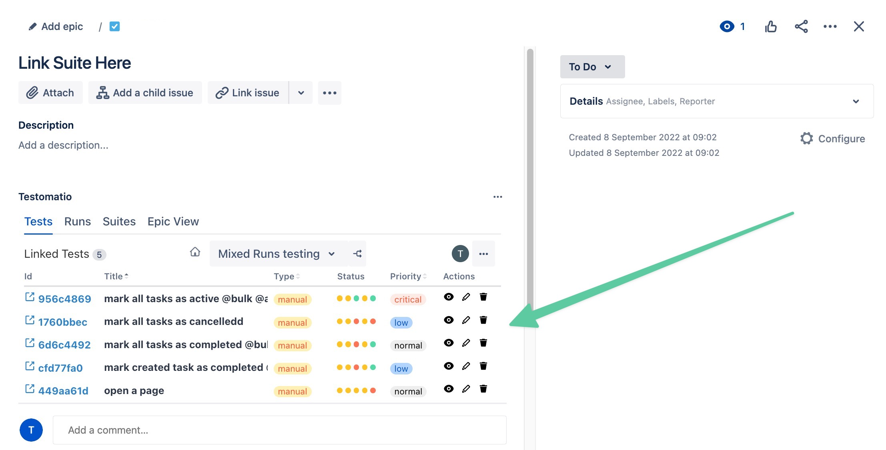

If you unlink an issue from a suite, all tests of this suite will be unlinked as well.

## Creating JIRA Issue for a Failed Run

To create a JIRA Issue for a failed manual or automated run open a run and select "Attach Jira Issue" in the dots menu: 

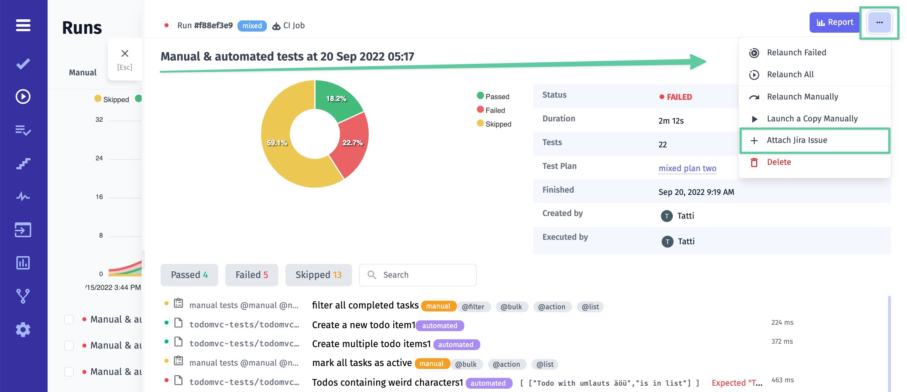

Create a new issue for a run or attach it to an existing issue.

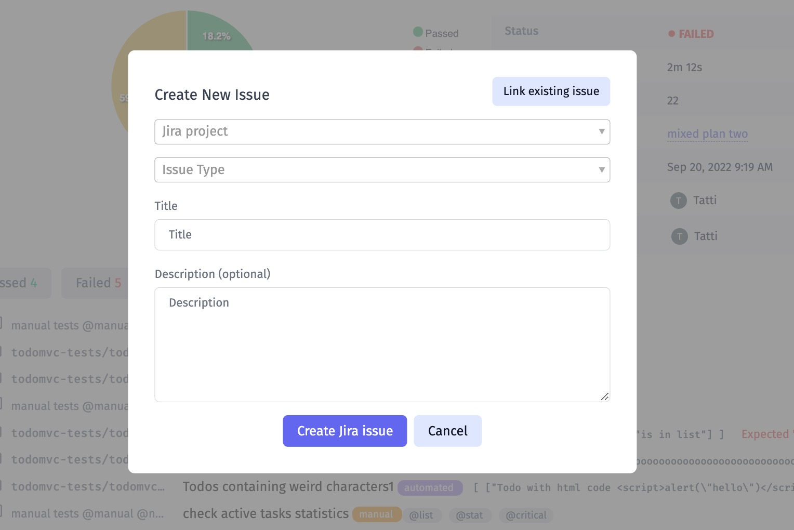

## Creating JIRA Issue for a Failed Test

Select a Run with a failed test. Find a test in a list and click "Create Jira Issue" button:

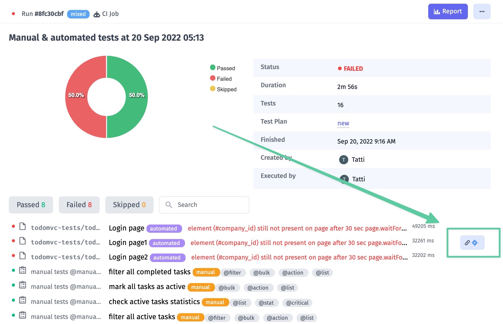

You will be able to create a new issue for this test or link it to existing issue.

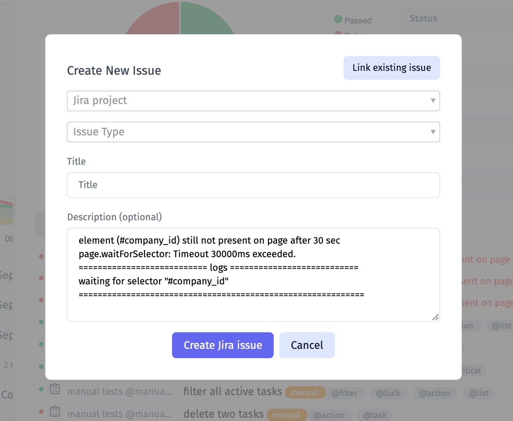

Created Issue will receive information on a test run and a web link to the Run report will be added:

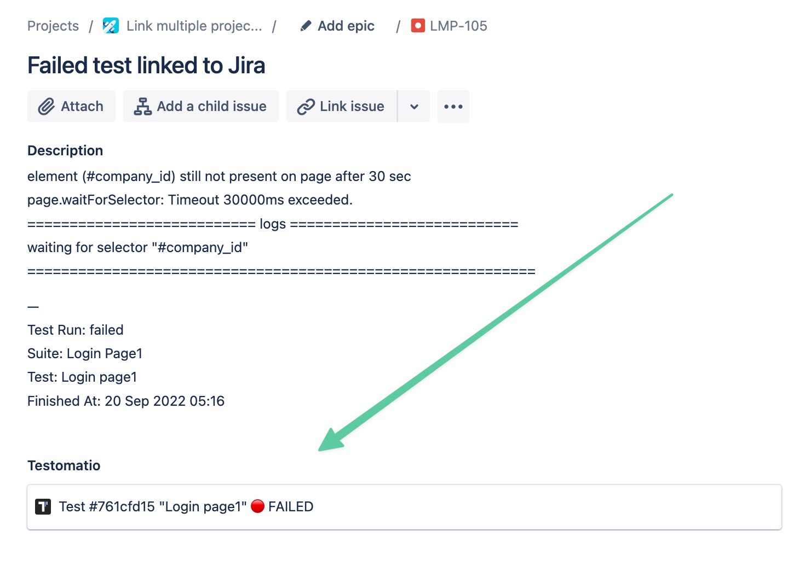
