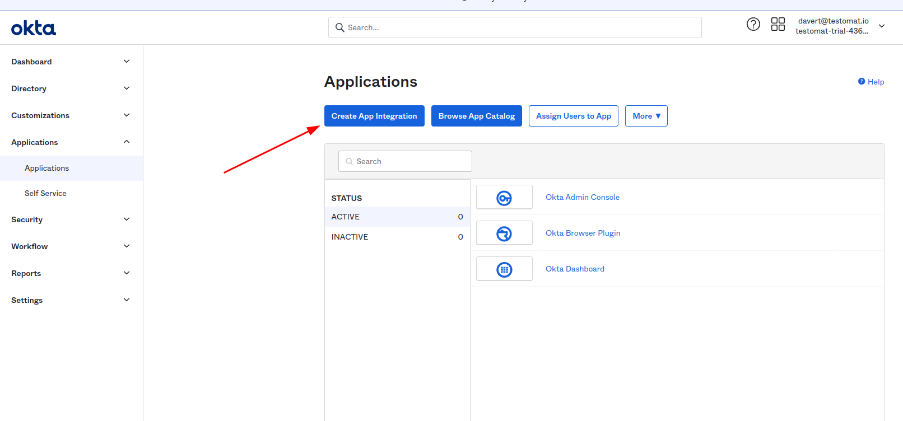
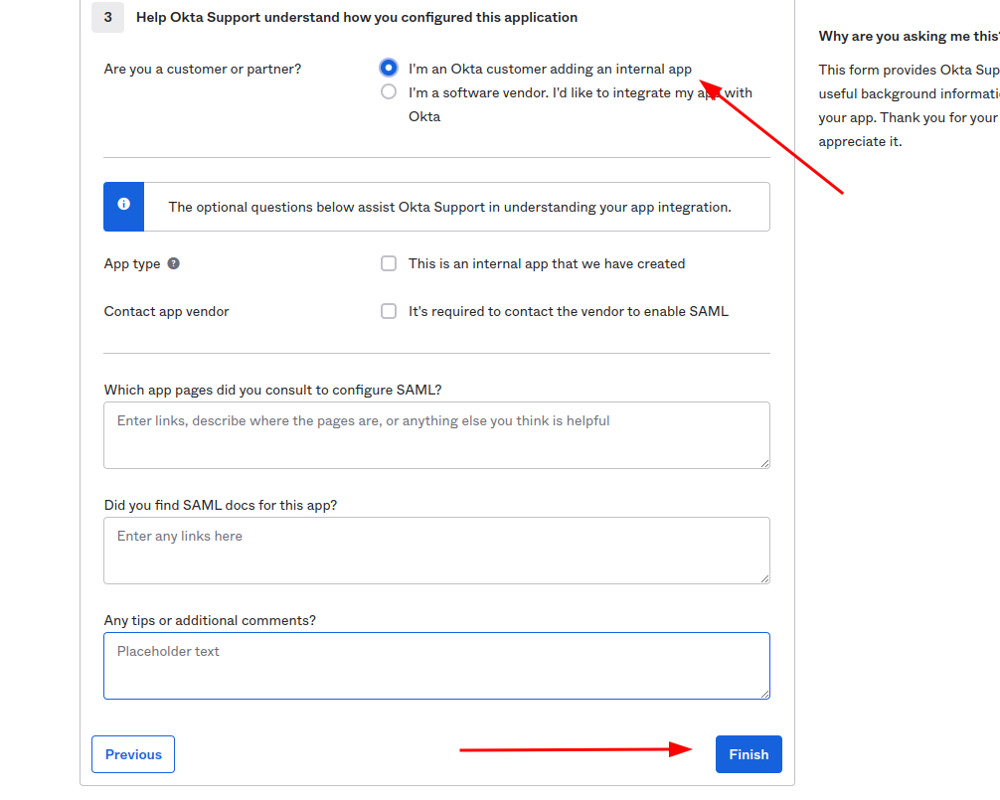
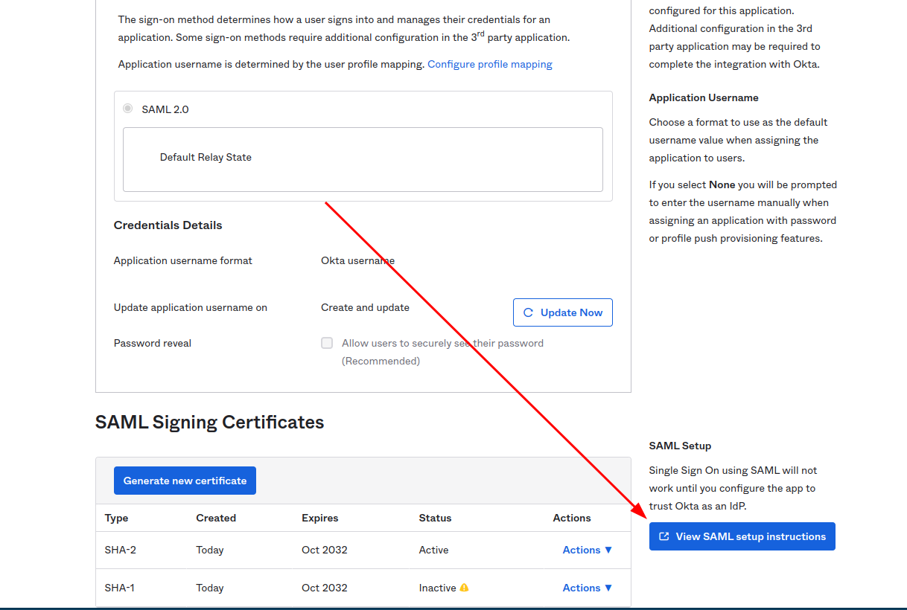
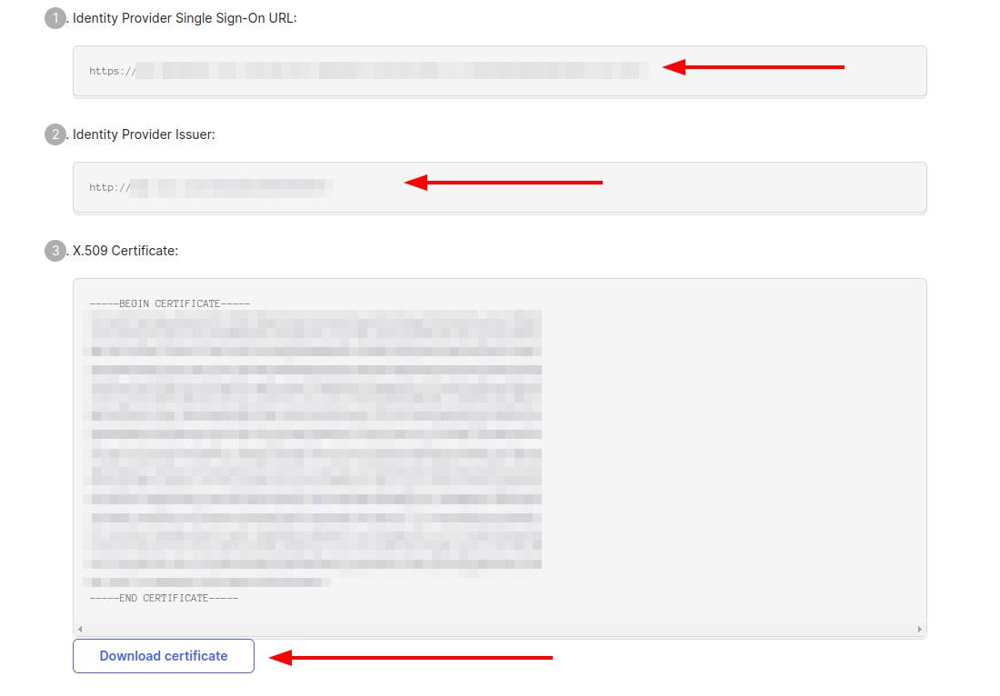
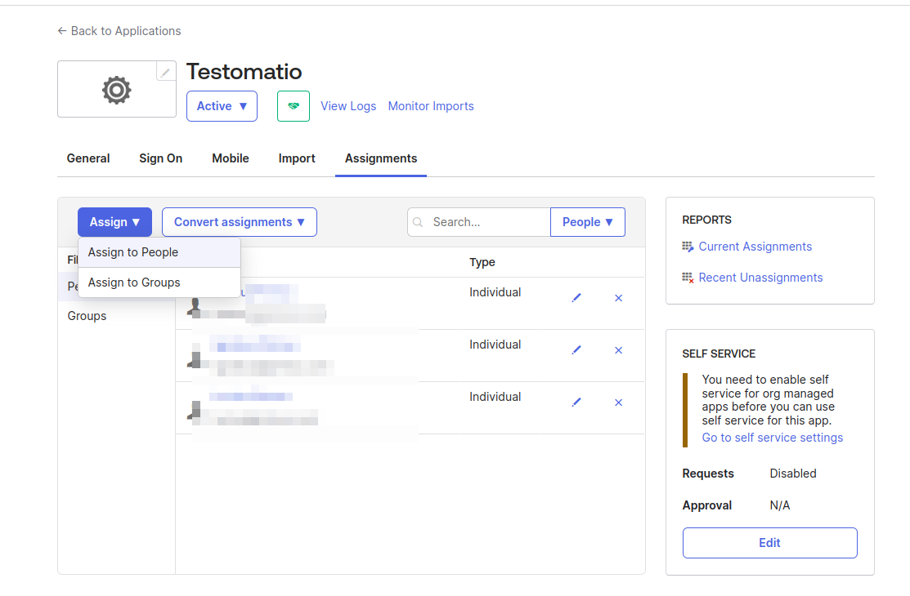
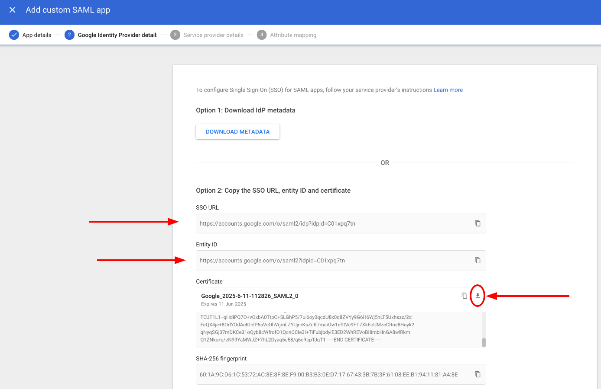
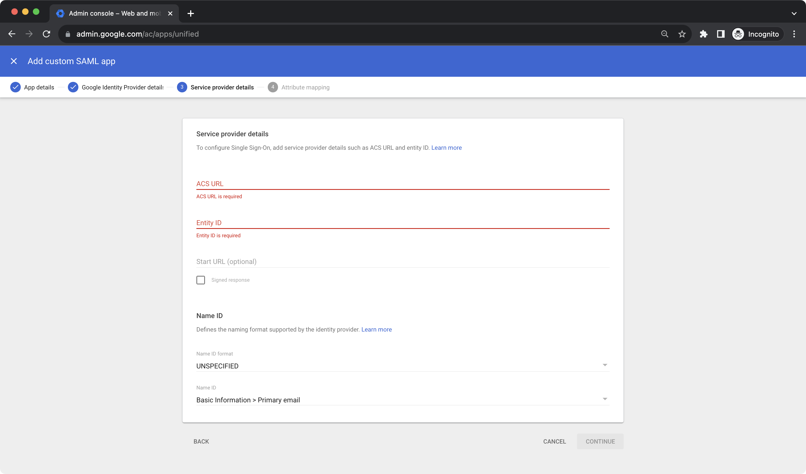
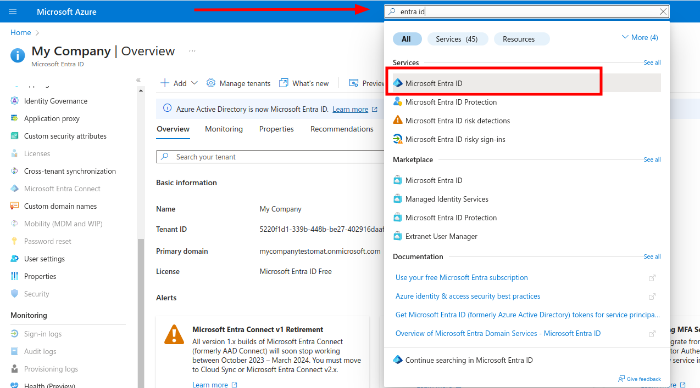
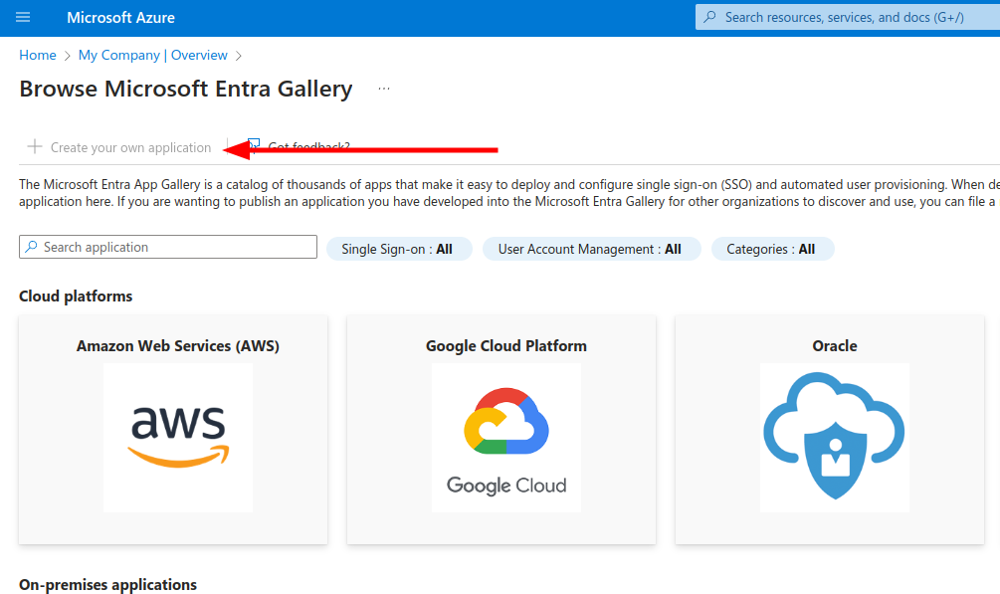

## Single Sign On

Single Sign On is **enterprise** feature that allows you to login users from your Identity Provider into Testomat.io. All new members will be auto-provisioned. If you reach limit of paid seats, all new members will be added as `read-only`. So no matter of how many peoples joined, you won't be charged more than your current plan. You can manage your seats, and specify which users should be active and which to be read-only on your [Company Members](https://docs.testomat.io/subscriptions/companies/#how-to-invite-a-user-to-a-company) page.

This guide shows how to set up SSO connection via SAML for various SAML providers

### Prerequisites

* You have a company in Testomat.io, and you are [**owner of this company**](/subscriptions/companies#roles-within-a-company).
* Company is on an enterprise plan.
* You have SAML identity provider like Okta or Google Workspace (formerly called G Suite)
* You and all potential company members use emails from the same domain name (like: user1@companyname.com, user2@companyname.com, etc)

If you are ready, proceed to configure identity provider:

* [Okta](#okta)
* [Google Workspace](#google-workspace)
* [Azure AD](#azure-ad)
* [Custom SAML](#custom-saml)

### Okta


Okta authorization can be enabled via SAML. As a prerequisite a [company](https://docs.testomat.io/subscriptions/companies/) for your domain should be created on Testomat.io. 

Log in to Okta as Administrator and **Create Application Integration**



Choose **SAML 2** as sign-in method


Set "Testomat.io" as the application name and click "Next"


In the next step, you need to set values for **Single sign on URL**:

```
https://app.testomat.io/users/saml/auth
```

and **Audience URI (SP Entity ID)**:

```
https://app.testomat.io/users/saml/metadata
```


Specify the **Attribute Statements**:

* `email` should be set to `user.email`
* `name` should be set to `user.firstName + " " + user.lastName`


Click "Next" to proceed.

On the lastest step check **I'm an Okta customer adding an internal app**



And finish the integration of application.

After interaction was saved click **View SAML setup instructions**



The following information is needed to proceed with integration.

* **Identity Provider Single Sign-On URL**
* **Identity Provider Issuer**
* **X.509 Certificate**



Assign users to this application so they could join Testomat.io:




Now, open Company page in Testomat.io and select Single Sign On options


> If you don't see Single Sign On option, check that you are an owner of this company

Fill in the form:

1. **Company domain**. This is required to identify SSO connection by user's email. Example: `mycompany.com`.
2. **Default Projects**. Select projects to new users will be added to(optional).
3. Enable SAML:


4. Set **Identity Provider Issuer** from Okta as **IdP Entity ID**
5. Set **Identity Provider Single Sign-On URL** from Okta as **Sign In URL**
6. Upload certificate.


7. Set `Authn Context` by selecting "Password Protected Transport". The actual value should become:

```
urn:oasis:names:tc:SAML:2.0:ac:classes:PasswordProtectedTransport
```


And save the form.

Now, use any assigned user from Okta to Log In into Testomat.io. Select "SSO" on the Sign In page, enter the email, and if everything is correct user will get inside Testomat.io, assigned to your company and added to default projects.

> In case user sees 404 page on Okta, check that Single Sign-On URL was correctly set.

### Google Workspace

Inside Google Admin open **Apps** > **Web & Mobile Apps**:


Add Custom SAML App.

Use "Testomatio" as **App Name** and continue


Copy the following information:

* **SSO URL**
* **Entity ID**
* **Certificate** should be downloaded as file

And continue.



On this step fill the form:

* **ACS URL**: `https://app.testomat.io/users/saml/auth`
* **Entity ID**: `https://app.testomat.io/users/saml/metadata`



On the next page add attributes mappings:

* Add `email`
* Last name as `last_name`
* First name as `first_name`


Finish set up.

Now, open Company page in Testomat.io and select Single Sign On options


> If you don't see Single Sign On option, check that you are an owner of this company

Fill in the form:

1. **Company domain**. This is required to identify SSO connection by user's email. Example: `mycompany.com`.
2. **Default Projects**. Select projects to new users will be added to(optional).
3. Enable SAML:


4. Set **Entity ID** you copied previously as **IdP Entity ID**
5. Set **SSO URL** you copied previously as **Sign In URL**
6. Upload certificate.


And save the form.

Now, use any assigned user from Okta to Log In into Testomat.io. Select "SSO" on the Sign In page, enter the email, and if everything is correct user will get inside Testomat.io, assigned to your company and added to default projects.

### Azure AD

Open Azure portal and search for Entra ID service:



Add new Enterprise application


On the next screen create a new Application



Enter the "Testomat" as the name of integration, select Integrate any other application you don't find in the gallery (Non-gallery) and click Create. 

Select **Single Sign On** on the left and click "SAML" to configure connection settings.

On the **Basic SAML Configuration** fill in following values

* `Identifier (Entity ID)` → `https://app.testomat.io/users/saml/metadata`
* `Reply URL (ACS URL)` → `https://app.testomat.io/users/saml/auth`
* `Sign on URL` → `https://app.testomat.io/users/sso`


Save this form. Now edit **Attributes & Claims**.

Remove default attributes.

Add the following attributes that will be sent to Testomat.io:

* `name` attribute:
  * Name: `name`
  * Source: Attribute
  * Source attribute: `user.displayname`
* `email` attribute:
  * Name: `email`
  * Source: Attribute
  * Source attribute: `user.mail`

Close the dialog. 

On **SAML Signing Certificate** card download **Certificate (Base 64)**.

On **Set up Testomat** card copy following values

* **Login URL** 
* **Azure ID Idenitifier** 

Add Users to application on the **Users and Groups** section in sidebar. This users will be able to log in to Testomat.io via SAML.

Now, open Company page in [Testomat.io](https://app.testomat.io/companies) and select Single Sign On options


> If you don't see Single Sign On option, check that you are an owner of this company

Fill in the form:

1. **Company domain**. This is required to identify SSO connection by user's email. Example: `mycompany.com`.
2. **Default Projects**. Select projects to new users will be added to (optional).
3. Enable SAML:


4. Set **Azure ID Idenitifier** from Azure AD as **IdP Entity ID**
5. Set **Login URL** from Azure AD as **Sign In URL**
6. Upload certificate.


7. Set `Authn Context` by selecting "Password Protected Transport". The actual value should become:

```
urn:oasis:names:tc:SAML:2.0:ac:classes:PasswordProtectedTransport
```


And save the form.


Now, use any assigned user from Azure AD to Log In into Testomat.io. Select "SSO" on the Sign In page, enter the email, and if everything is correct user will get inside Testomat.io, assigned to your company and added to default projects.

> In case user sees 404 page on Azure AD, check that Single Sign-On URL was correctly set.

### Custom SAML

SAML providers can have different UI and different terms. In this section we will try to narrow down what configuration should be done to integrate any custom SAML provider without getting into the details.

On the SAML provider side, you will need to create a new SAML application for `Testomat` and put the following values:

* Name: `Testomat`, basically the name of the application on provider's side.
* **ACS URL** (or Reply URL, SSO URL, etc): `https://app.testomat.io/users/saml/auth`
* **Entity ID**: `https://app.testomat.io/users/saml/metadata`

Testomat.io will need user attributes like name and email to receive from SAML provider.

Create attributes:
* `email` → email is used to identify the user on Testomat.io side.
* `name` → this will be a full name or a display name. If your SAML provider stores a first name and last name, use `first_name` and `last_name` attributes instead.

We will need the following information from SAML provider to proceed with configuration on Testomat.io side. All of these values should be generated by service provider:

* Certificate file (X509 or Base 64)
* IdP Entity ID (or just Entity ID)
* Sign in URL (or Login URL)

Add users into SAML connection to ensure that they will be able to login to Testomat.io

Now, open Company page in [Testomat.io](https://app.testomat.io/companies) and select Single Sign On options


> If you don't see Single Sign On option, check that you are an owner of this company

Fill in the form:

1. **Company domain**. This is required to identify SSO connection by user's email. Example: `mycompany.com`.
2. **Default Projects**. Select projects to new users will be added to (optional).
3. Enable SAML:


4. Set **IdP Entity ID**
5. Set **Sign In URL**
6. Upload certificate file.


And save the form.


Now, use any assigned user from SAML provider to Log In into Testomat.io. Select "SSO" on the Sign In page, enter the email, and if everything is correct user will get inside Testomat.io, assigned to your company and added to default projects.

> In case user sees 404 page on SAML provider, check that Single Sign-On URL was correctly set.