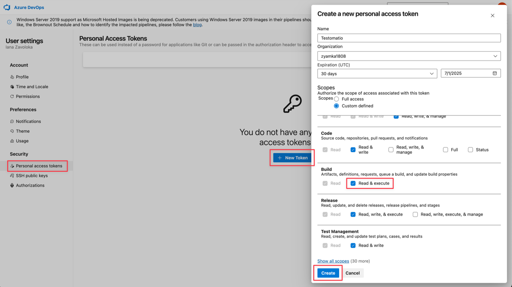
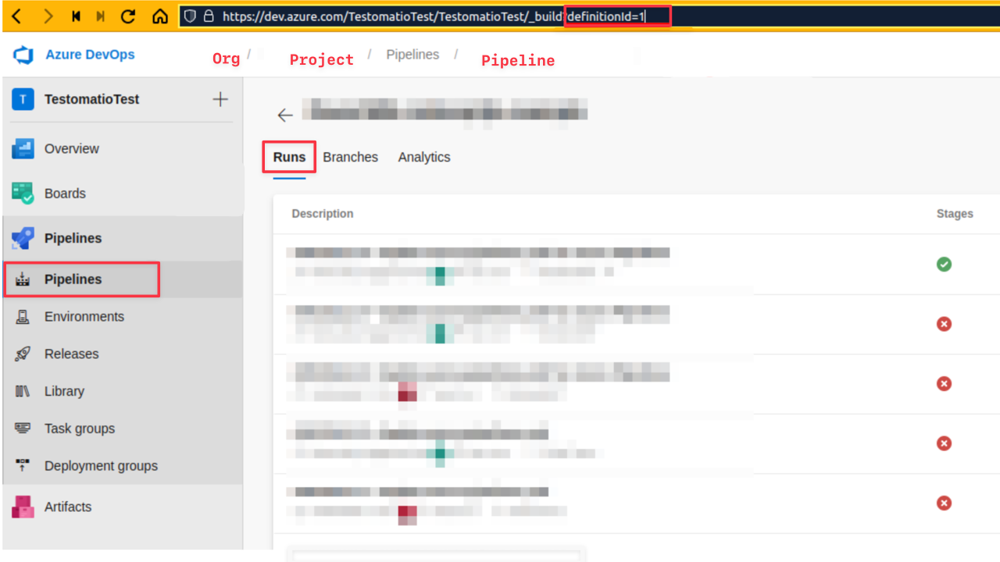
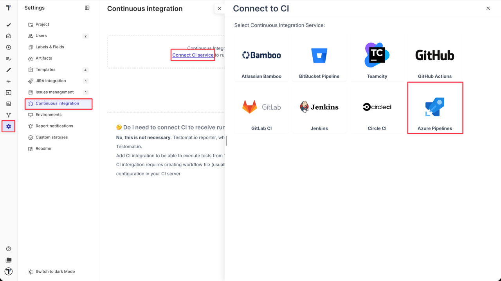
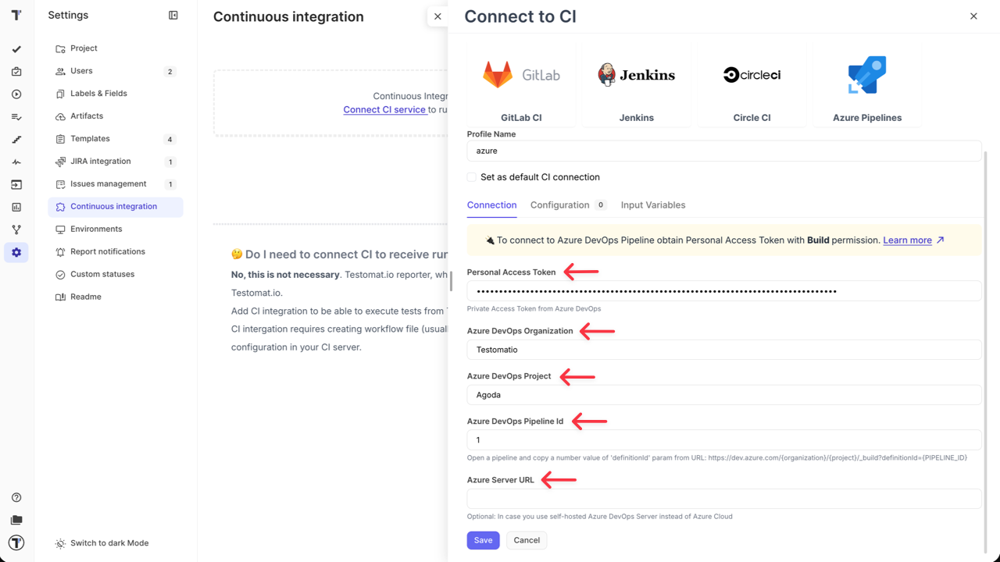
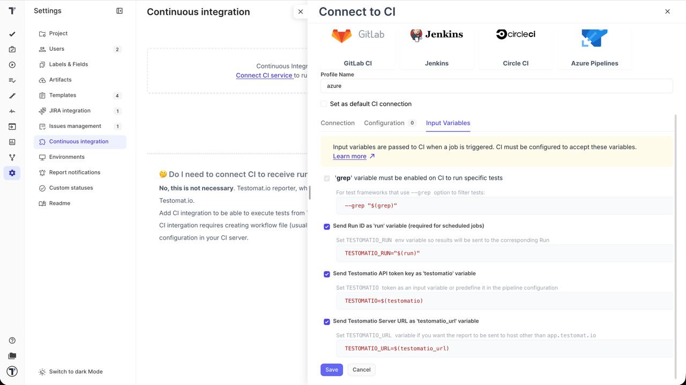
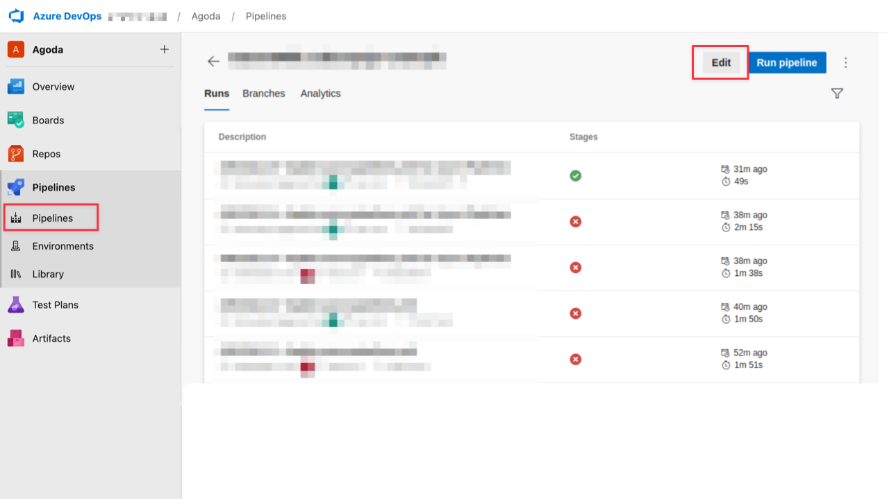
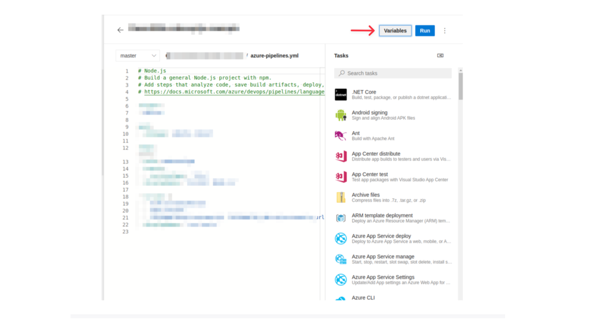
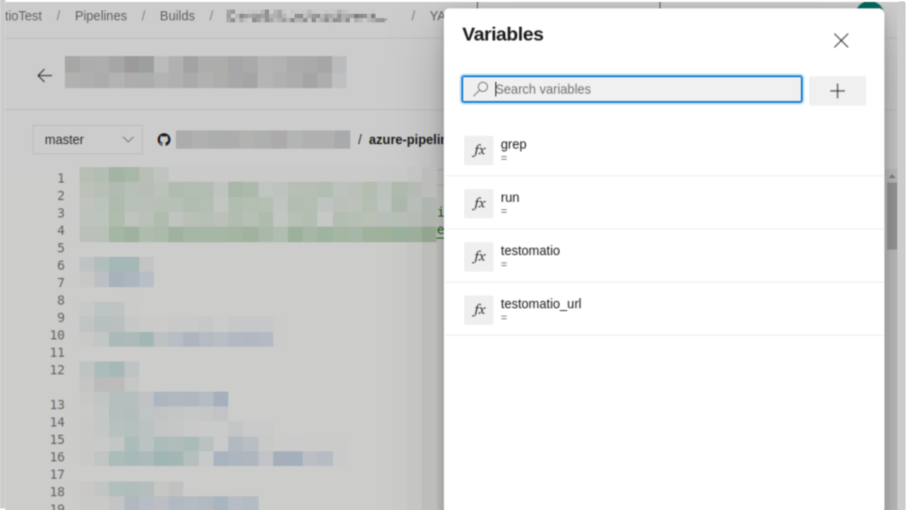
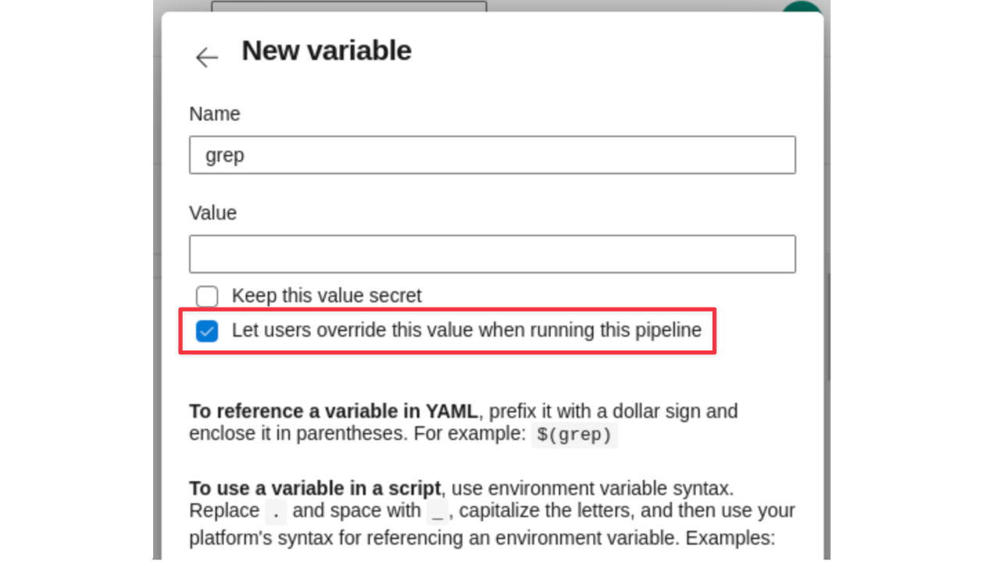
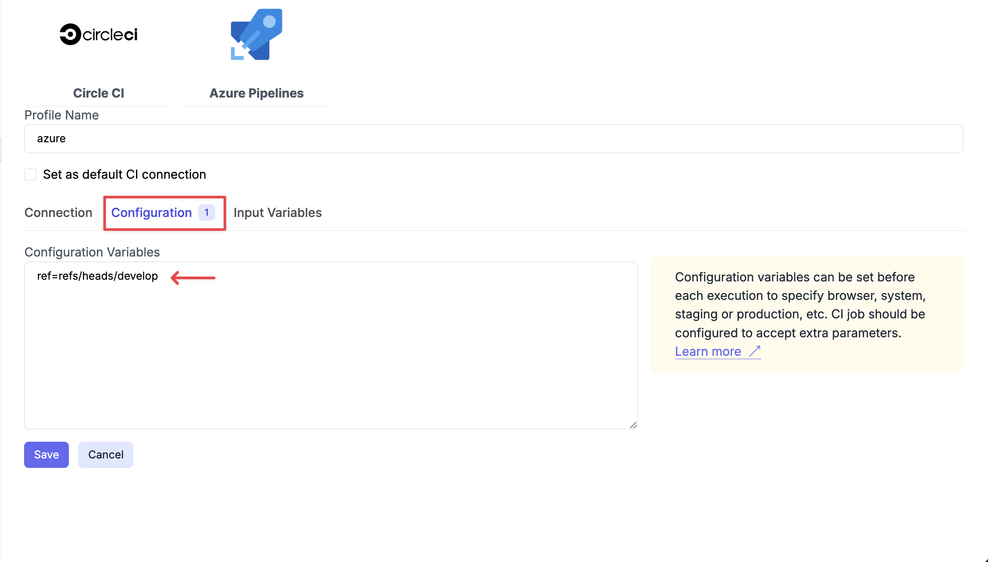

To connect Azure DevOps to Testomat.io, first you need to create an Private Access Token (PAT).
Learn how to create a PAT following the link - [Create PAT](https://learn.microsoft.com/en-us/azure/devops/organizations/accounts/use-personal-access-tokens-to-authenticate?view=azure-devops&tabs=Windows).

And follow the instructions below:

1. Create a **PAT** in your Azure DevOps account with permission to **Read & Execute Build**.



2. Obtain the **ID** of a Pipeline you want to execute. Open a Pipeline and copy its ID from `definitionId` query parameter. On this screenshot the ID is `1`.



3. Create a new **CI connection** inside your project in Testomat.io: go to **'Settings' -> 'Continuous Integration' ->** click **'Connect to CI'** select **'Azure Pipelines'**



4. Enter following details on the **'Connection'** tab:

- `Personal Access Token` - PAT created, in Azure DevOps during Step 1.
- `Azure DevOps Organization`.
- `Azure DevOps Project`.
- `Azure DevOps Pipeline Id` - open a pipeline and copy a number value of `definitionId` param from URL (in our case `definitionId = 1`).
- `Azure Server URL` - in case you use self-hosted Azure DevOps Server instead of Azure Cloud.



5. Switch to **'Input Variables'** tab and select checkboxes:

- Send Run ID as `run` input (required for scheduled jobs).
- Send Testomat.io API key as `testomatio` input.
- Send Testomat.io Server URL as `testomatio_url` input (if you use on-premise setup).

6. Save the conection



7. Testomat.io will need to send Input Variables into a Pipeline. For this, you need to enable them inside a Pipeline using **Azure DevOps UI**. Open a Pipeline and edit it.



8. Click **'Variables'** button



9. Create the following variables:

- `grep`
- `run`
- `testomatio`
- `testomatio_url`



Do not set defaults to this variable and tick **'Let users override this value when running this pipeline'** so Testomat.io could set these variables via API request.



10. Update the Pipeline to use passed variables. Update the script and pass environment variables to a test runner. Each variable can be accessed as `$(variable)`.
For CodeceptJS this command will look the following way:

```yaml
- script: |
    TESTOMATIO=$(testomatio) TESTOMATIO_URL=$(testomatio_url) TESTOMATIO_RUN=$(run) npx codeceptjs run --grep="$(grep)"
  displayName: 'run tests'
```

:::note

If you use Jest, Playwright, Cucumber, Cypress, etc. replace  `npx codeceptjs run` with the execution command of your test runner.

:::

You can pass more custom variables into a Pipeline defining them in a Pipeline UI first and listing them in Testomat.io configuration as well. These variables should be set in Azure in the same way as `grep`. See [Environment Configuration](./index.md#environment-configuration) to see how they can be configured in Testomat.io.

To specify a different branch to run tests add `ref` parameter on **'Configuration'** tab specifying target ref.



To specify `develop` branch add this as config parameter:

```
ref=refs/heads/develop
```