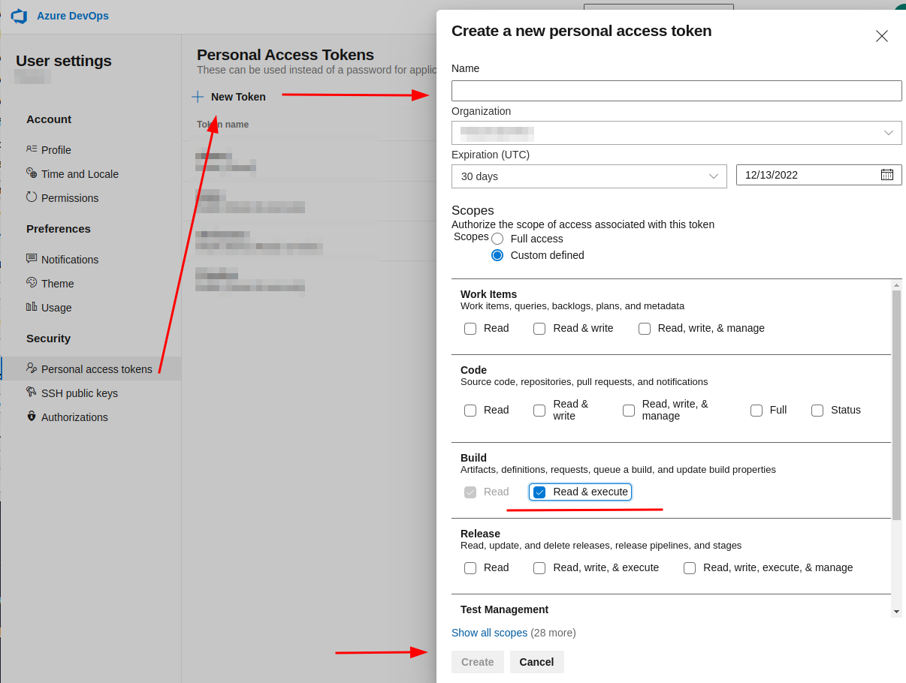
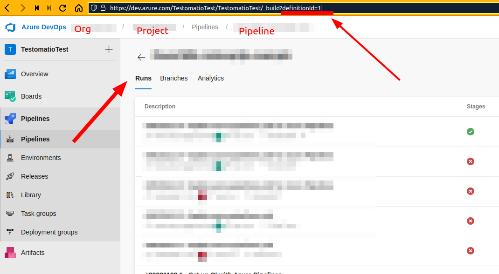
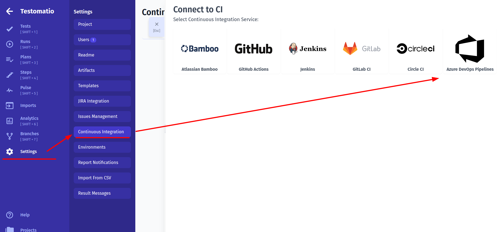
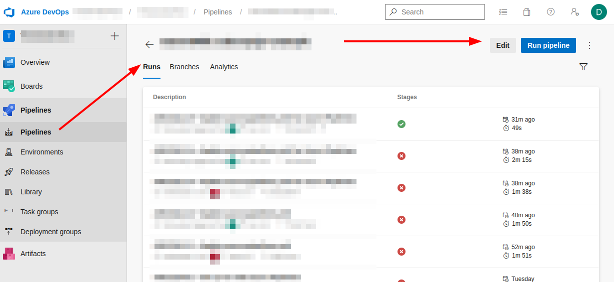
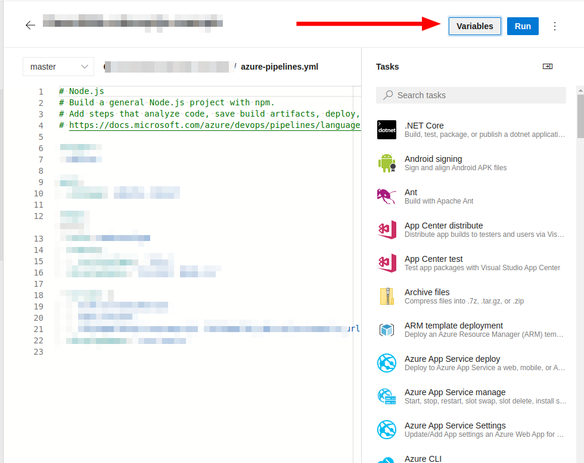
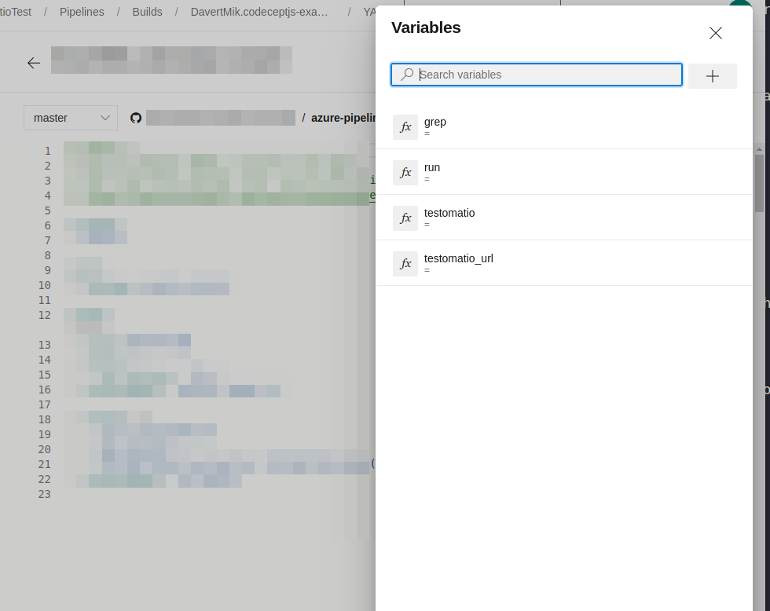
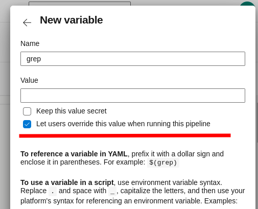
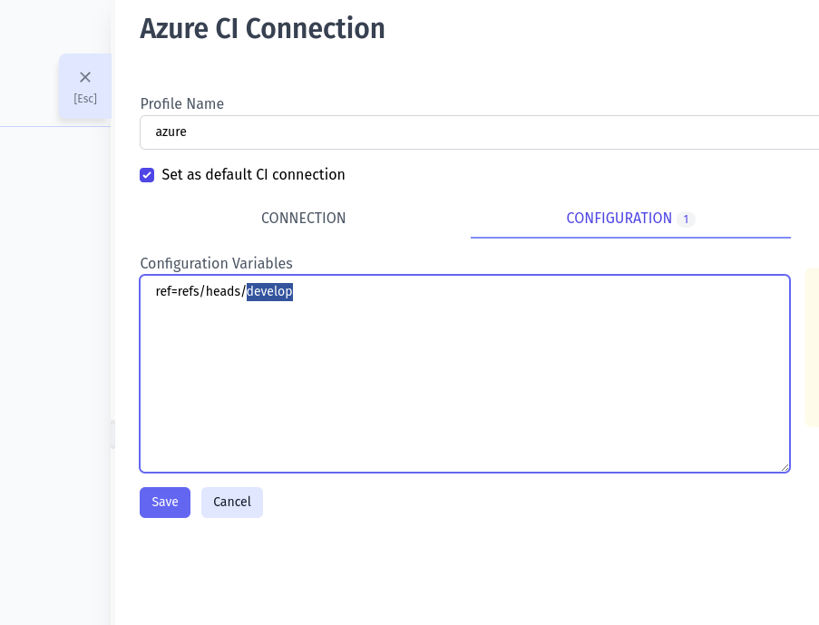

1. Create a Personal Access Token in your user account with permission to Read & Execute Build



2. Obtain the ID of a pipeline you want to execute. Open a pipeline and copy its ID from `definitionId` query parameter. On this screenshot the ID is `1`:



3. Create a new CI connection on Continuous Integration page in Settings in Testomat.io.



4. Fill in Private Access Token, Organization name, Project name, ID of a Pipeline

5. Switch to "Input Variables" tab and check boxes:

* Send Run ID as 'run' input (required for scheduled jobs)
* Send Testomatio API key as 'testomatio' input
* Send Testomatio Server URL as 'testomatio_url' input (If you use on-premise setup)

6. Save the conection

7. Testomat.io will need to send input variables into a pipeline. We need to enable them inside a pipeline using Azure DevOps UI. Open a Pipeline and edit it.



8. Click "Variables" button



9. Create the following variables:

* `grep`
* `run`
* `testomatio`
* `testomatio_url`



Do not set defaults to this variable and tick "Let users override this value when running this pipeline" so Testomat.io could set these variables via API request.



10. Update the pipeline to use passed variables. Update the script and pass environment variables to a test runner. Each variable can be accessed as `$(variable)`. For CodeceptJS this command will look the following way:

```yaml
- script: |
    TESTOMATIO=$(testomatio) TESTOMATIO_URL=$(testomatio_url) TESTOMATIO_RUN=$(run) npx codeceptjs run --grep="$(grep)"
  displayName: 'run tests'
```
> If you use Jest, Playwright, Cucumber, Cypress, etc replace  `npx codeceptjs run` with the execution command of your test runner.

You can pass more custom variables into a pipeline defining them in a Pipeline UI first and listing them in Testomat.io configuration as well. These variables should be set in Azure  in the same way as `grep`. See [Environment Configuration](./index.md#environment-configuration) to see how they can be configured in Testomat.io

To specify a different branch to run tests add `ref` parameter on Configuration tab specifying target ref.



To specify `develop` branch add this as config parameter:

```
ref=refs/heads/develop
```