Let's configure Bamboo CI server to work for CodeceptJS framework:

1. Create a plan in Bamboo for Testomat.io to run in Testomat.io.

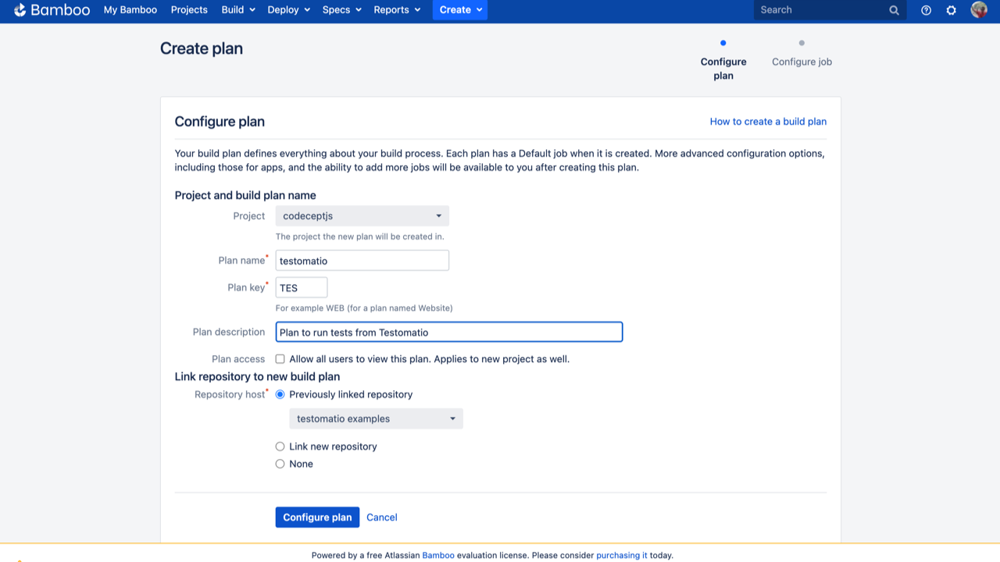

2. Note the **'Plan key'**. In this case its **'TES'**.
3. Configure the job to install node dependencies.

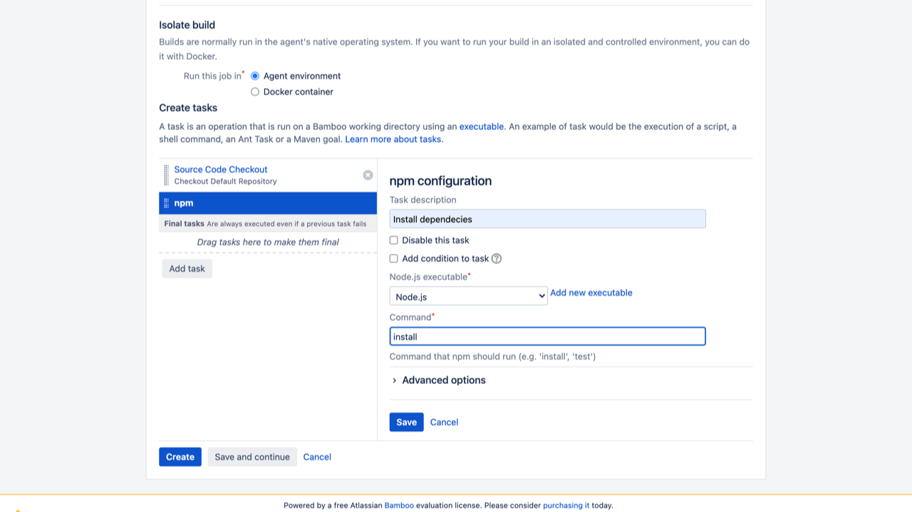

4. Add the script to run CodeceptJS tests:

```
TESTOMATIO_RUN=${bamboo.run} npx codeceptjs run --grep "${bamboo.grep}"
```
Following environment variables must be set:

- **Add `TESTOMATIO` environment variable with API key of Testomat.io project.**
- If you are running a self-hosted Testomat.io instance, add `TESTOMATIO_URL` variable to specify a host to which reports will be sent.

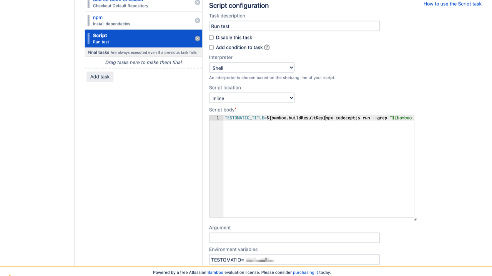

5. Set an input variable. Open Plan configuration:

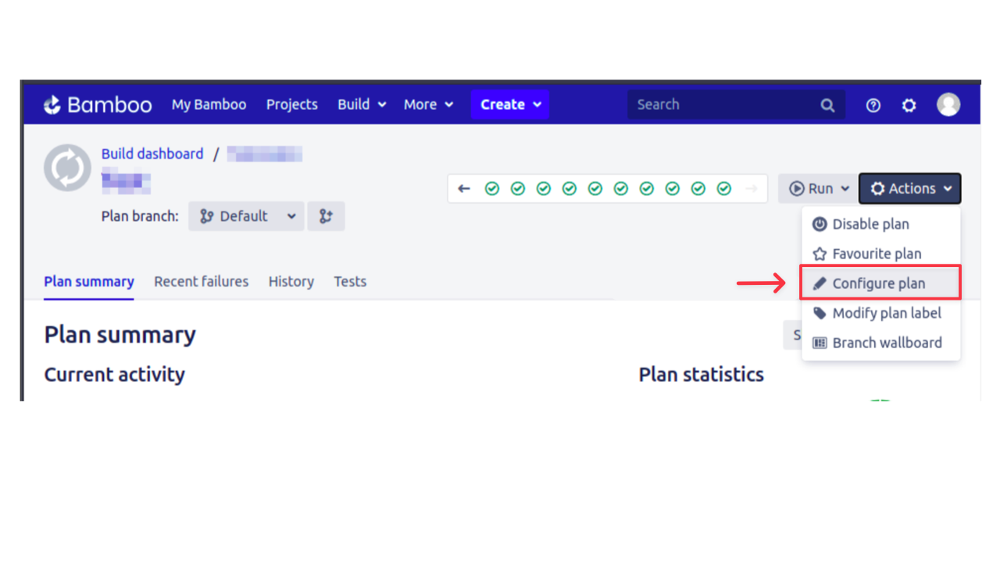

add `grep` and `run` variables with an empty string as a default value

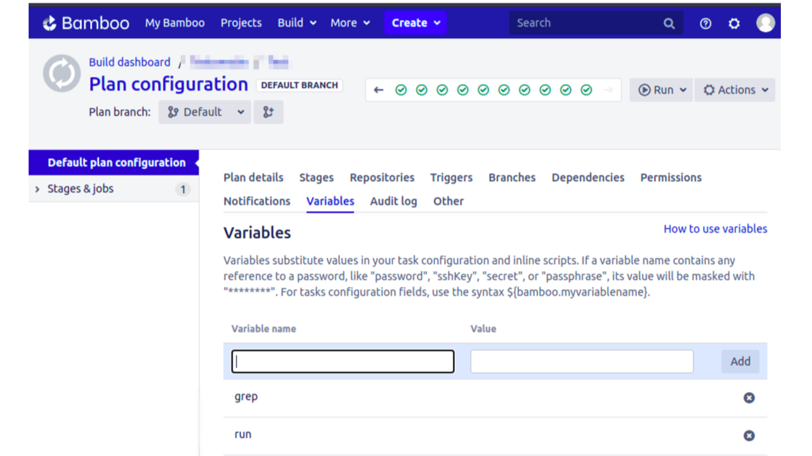

Now, as Bamboo is configured, you need to configure Bamboo integration at Testomat.io:

1. Go to **'Settings'**.
2. Select **'Continuous Integration'**.
3. Click **'Connect to CI'**.


4. Select **'Atlassian Bamboo'** and enter the details of Bamboo server on **'Connection'** tab:

- `Bamboo Hostname` - URL of Bamboo host.
- `API Token` - to generate API token [check this](https://confluence.atlassian.com/bamboo/personal-access-tokens-976779873.html).
- `Project Key` - Chars ID, in our example its `EX`.
- `Plan Key` - Chars ID, in our example its `TES`.

A project and plan keys can be found from URL:

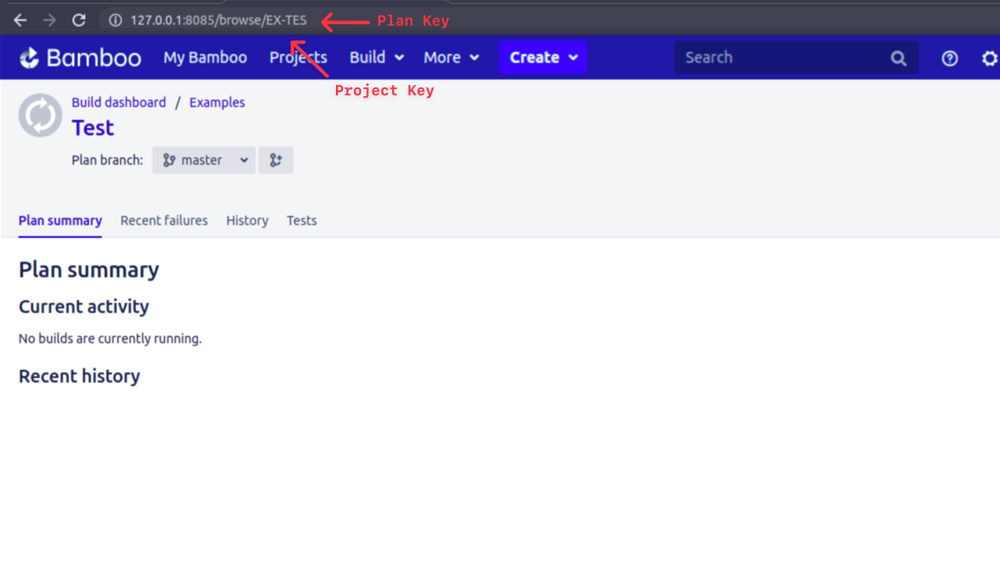

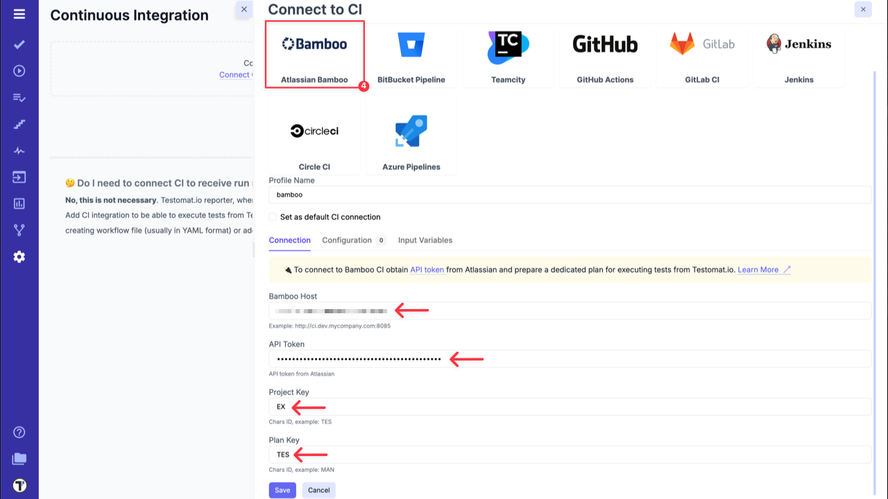

5. Enable `run` option on **'Input Variables'** tab. This allows CI to send a report to a specific Run inside Testomat.io.
6. Click **'Save'** button and check the connection.

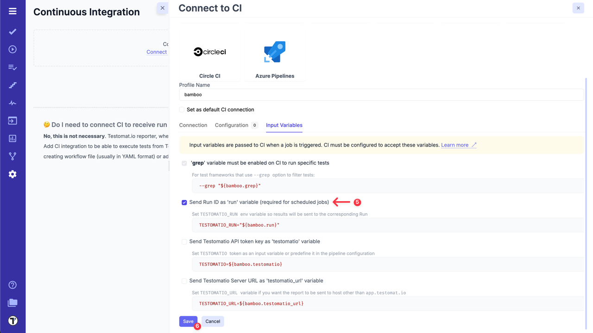

:::note

You can pass more input variables if you set them in [Environment Configuration](./index.md#environment-configuration). For example: test environment, browser, branch, etc.

:::

7a. Open **'Runs'** page then select `Run Automated Tests in CI` option in extra menu.


8a. Select **'Bamboo'** profile in a list. Optionally, select a **Test Plan** or create a new one.

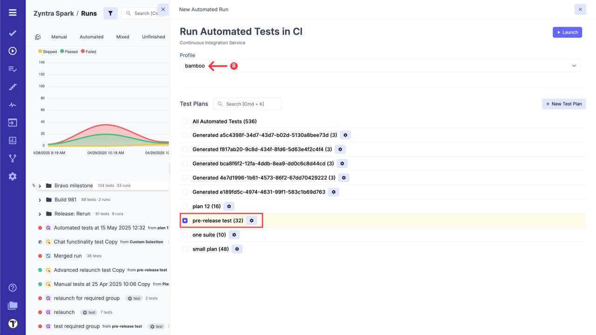

OR

7b. On **'Tests'** page select any automated suite or test case -> click **'Extra menu'** button -> select **'Run Tests'** option -> open **'Run in CI'** tab.

8b. Select **'Bamboo'** profile in a list.

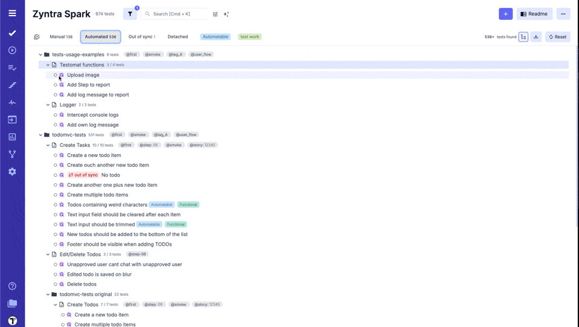

9. Launch a Run and wait for the results.

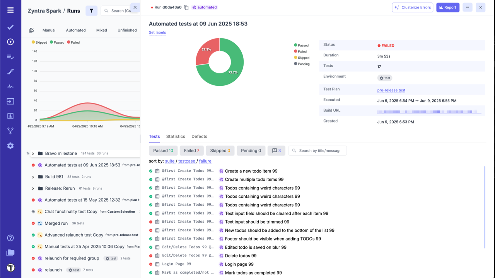
