Let's configure Bamboo CI server to work for CodeceptJS framework:

1. Create a plan for testomatio to run in testomatio

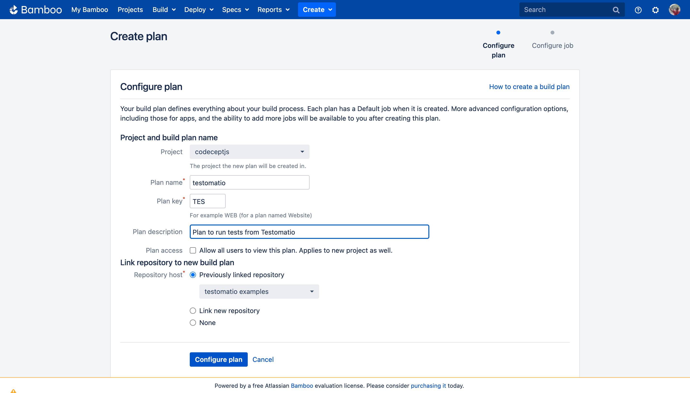

2. Note the plan key. In this case its "TES"
3. Configure the job to install node dependencies
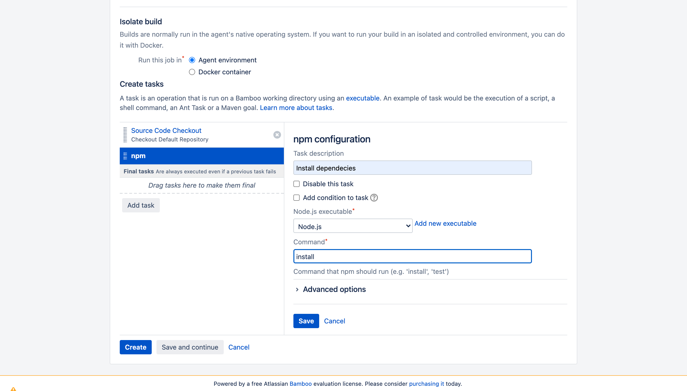

4. Add the script to run codeceptJS tests:

```
TESTOMATIO_RUN=${bamboo.run} npx codeceptjs run --grep "${bamboo.grep}"
```
Following environment variables must be set:

* **Add `TESTOMATIO` environment variable with API key of Testomatio project.**
* If you are running a self-hosted Testomatio instance, add `TESTOMATIO_URL` variable to specify a host to which reports will be sent.

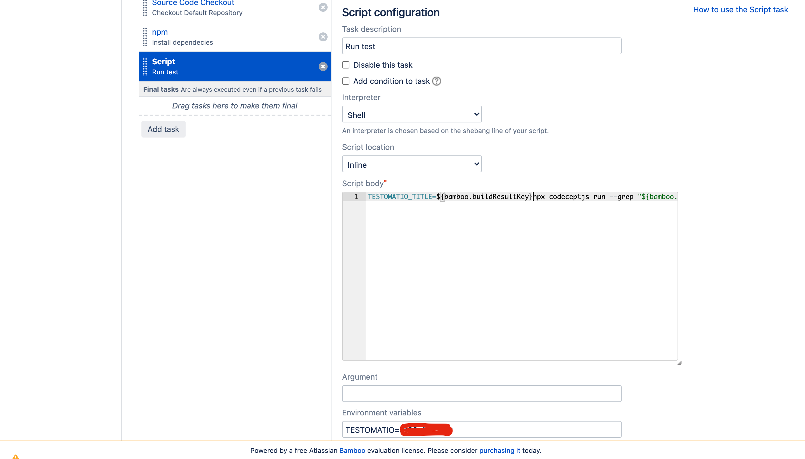

5. Set an input variable. Open Plan configuration:

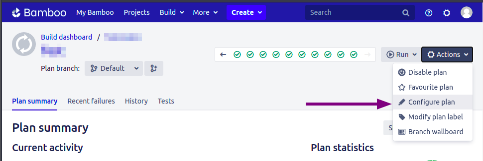

add  `grep` and `run` variables with an empty string as a default value

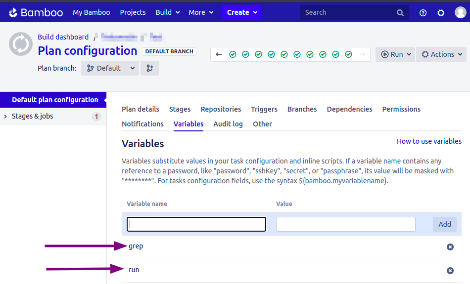

Now, configure Bamboo integration at Testomatio:

1. Go to settings > CI and enter the details of Bamboo server. [Check this](https://confluence.atlassian.com/bamboo/personal-access-tokens-976779873.html) to generate API token

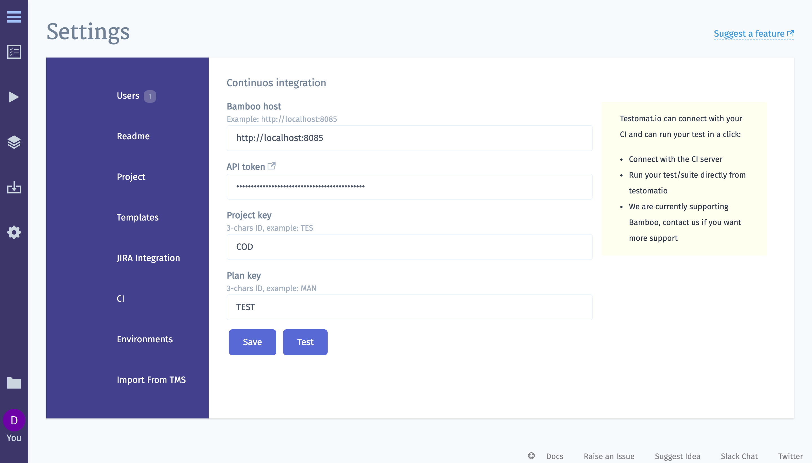

A project and plan keys can be found from URL:

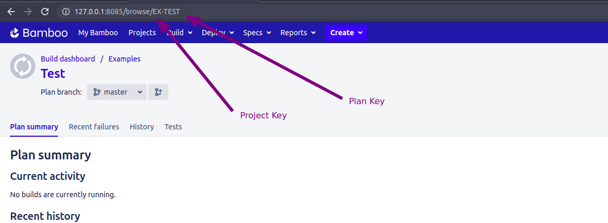

2. Enable `run` option on Input Variables tab. This allows CI to send a report to a specific Run inside Testomatio.

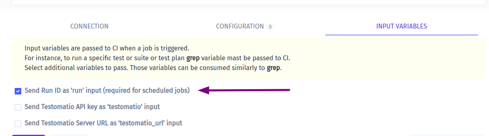

You can pass more input variables if you set them in [Environment Configuration](#environment-configuration)

3. Open Runs page (or any test or suite) then select `Run in CI` option in extra menu.

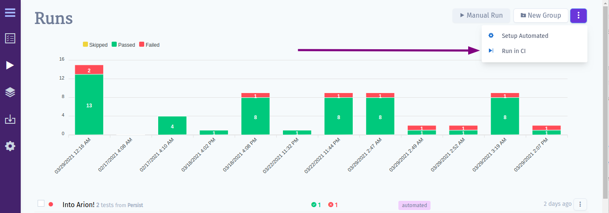

Select "Bamboo" profile in a list. Optionally, configure a Run Title and select a Test Plan.

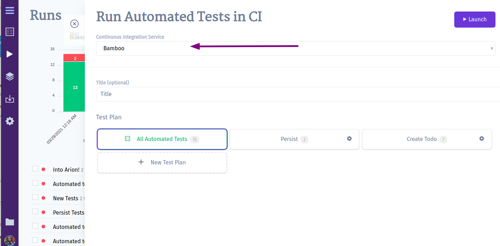

4. Launch a run and wait for the results.

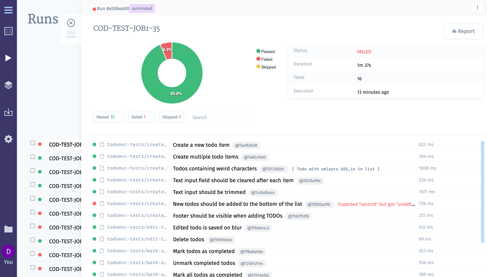
