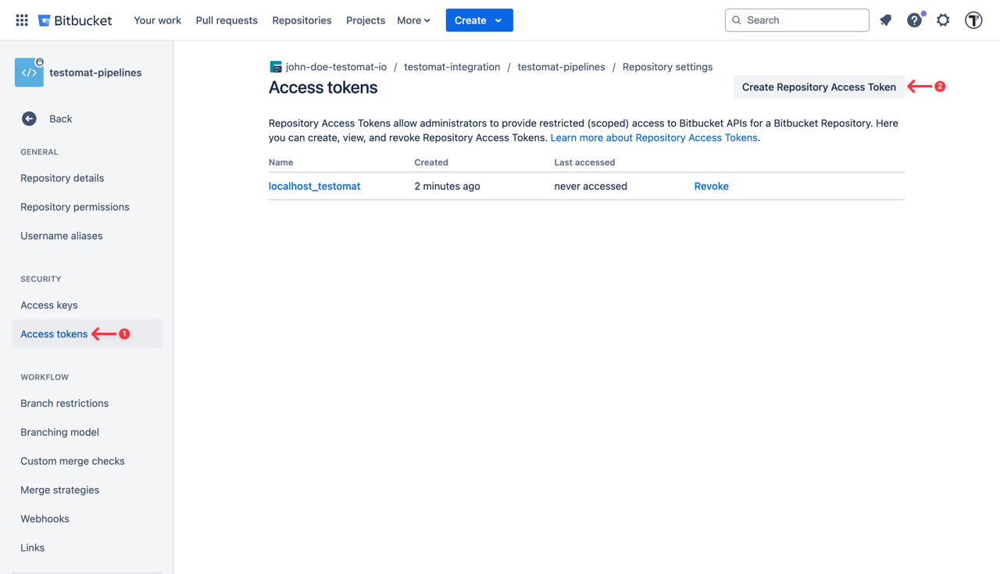
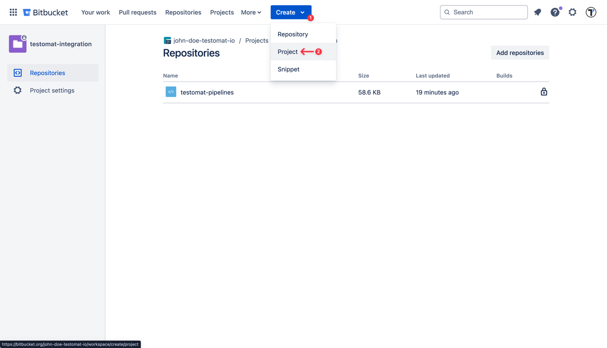
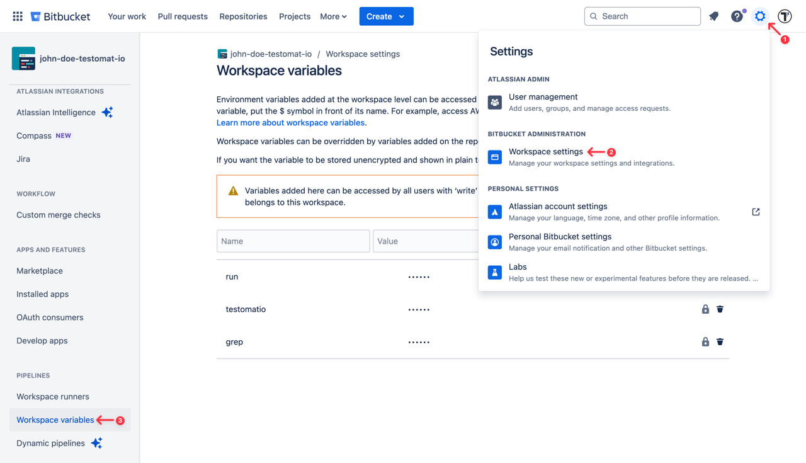
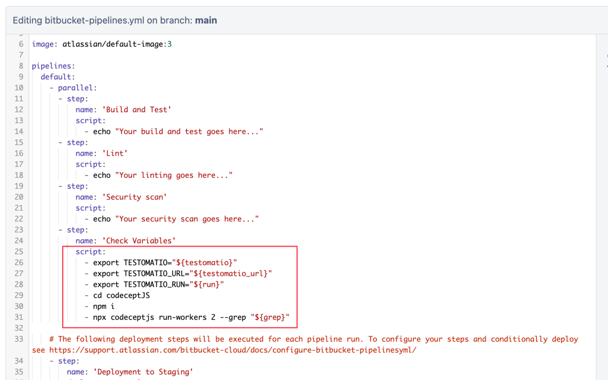
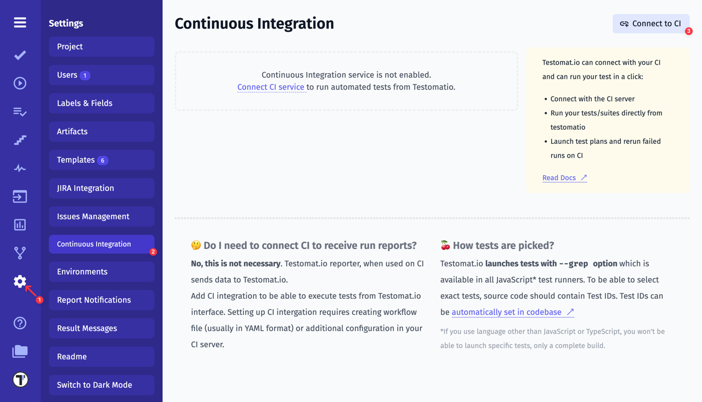
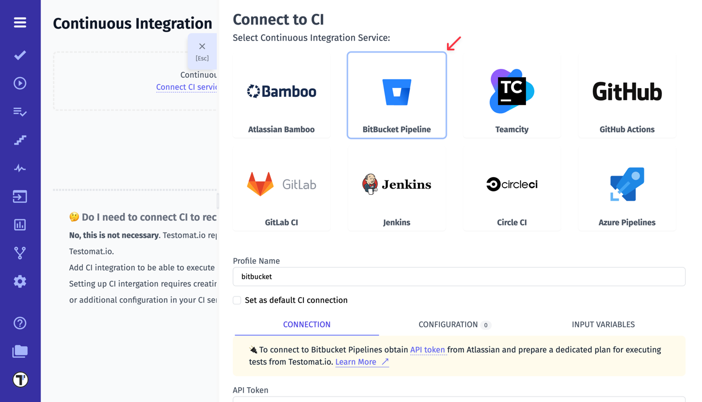

To connect Bitbucket to Testomatio you will need a API Token created. API token can be added on "Repository settings" page of current user:



Then create a new Bitbucket project. Select button "Create" on the top and "Project".



Make this build parametrized:



Add the following parameters as a string with empty default values:

- ```run```
- ```testomatio```
- ```grep```

The job should include a step where the test runner is executed with —grep option and TESTOMATIO environment variables passed in.

For instance: ```- npx codeceptjs run-workers 2 --grep "${grep}"```



If you use on-premise Testomatio setup you will also need to add ```testomatio_url``` parameter.

Save the build and switch to Testomat.io.



Connect Bitbucket Pipelines in Testomatio:

