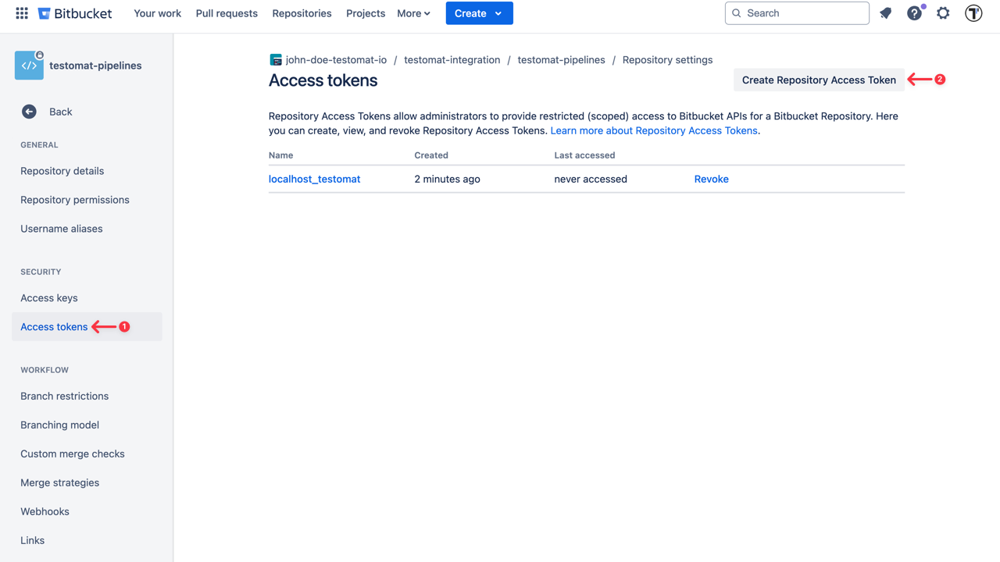
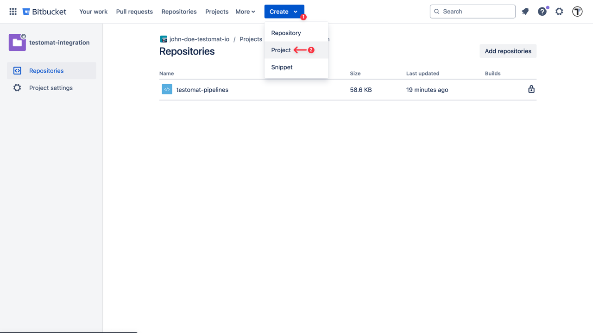
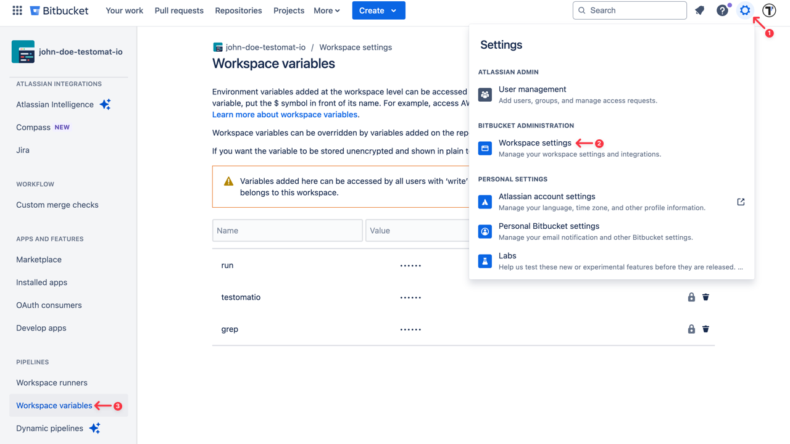
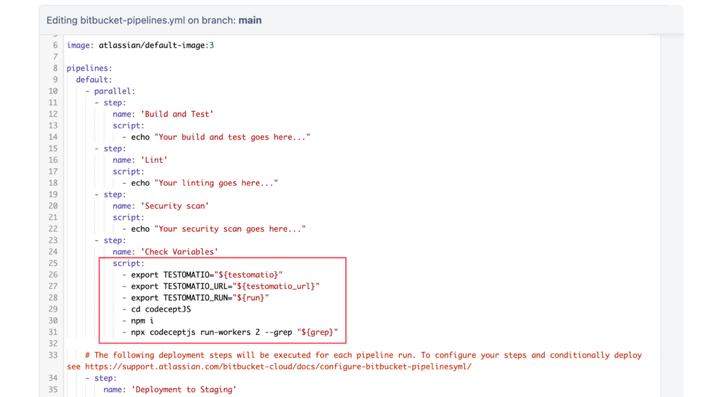
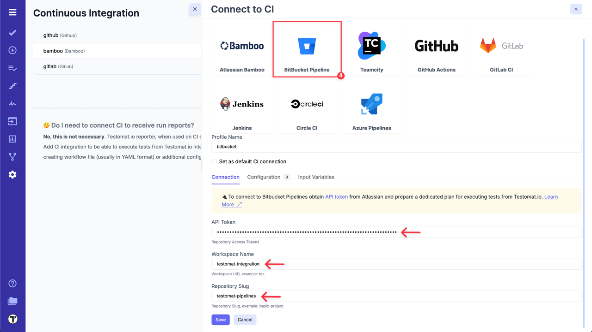
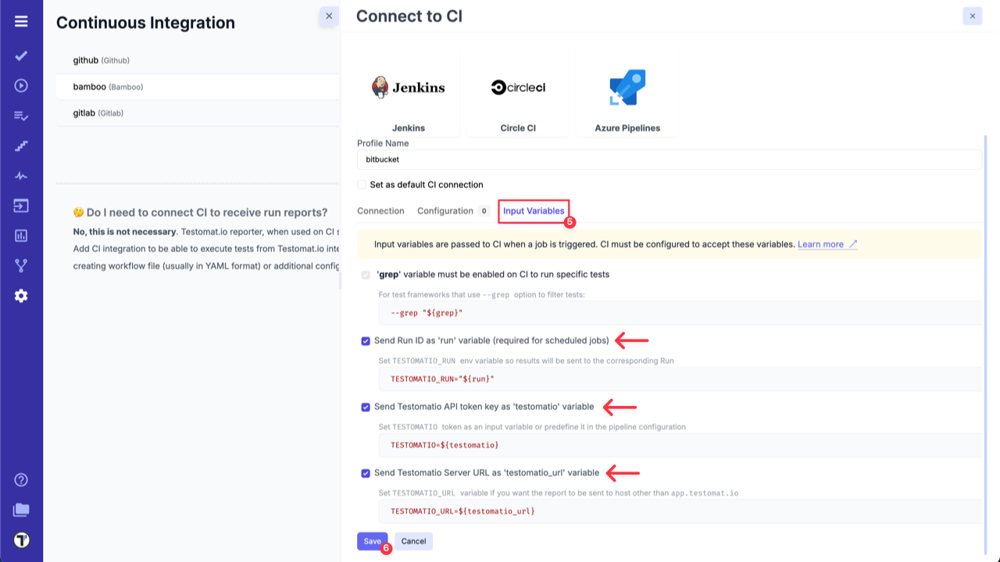
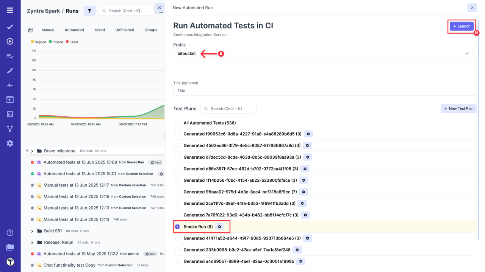
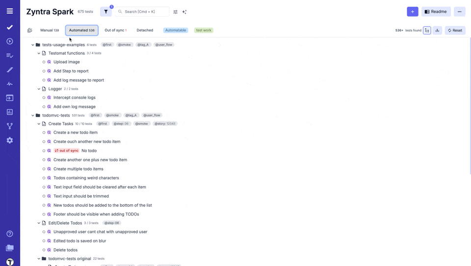
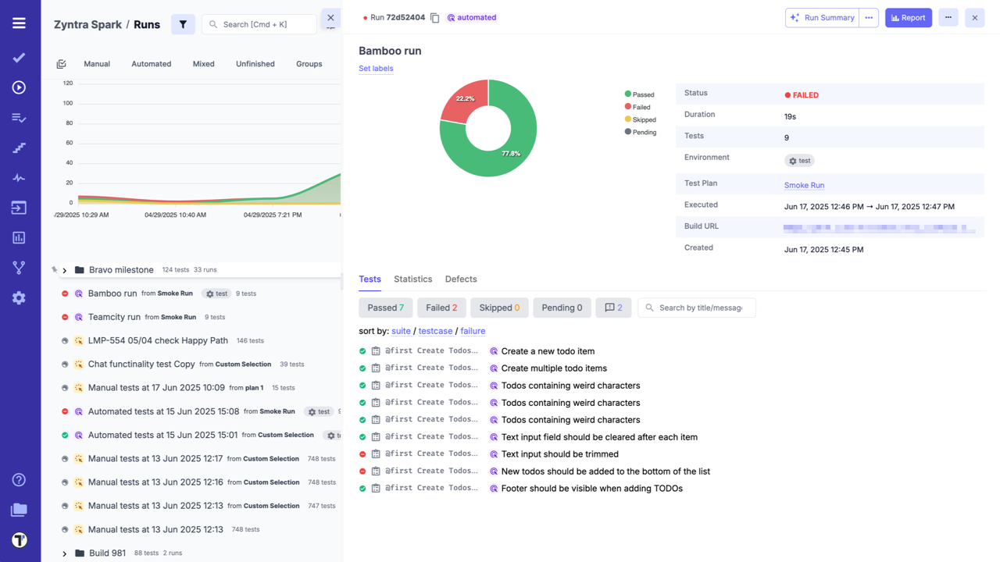

To connect BitBucket to Testomat.io you will need a API Token created in your BitBucket account.
API token can be added on **'Repository settings'** page of the current user - [create an access token for repository](https://support.atlassian.com/bitbucket-cloud/docs/create-a-repository-access-token/).



Then create a new BitBucket project. Click on **'Create'** button at the header menu and select **'Project'** option from the displayed dropdown list.



Make this build parametrized. Go to **'Settings' -> 'Workspace settings' -> 'Workspace variables'**



Add the following parameters as a string with empty default values:

- ```run```
- ```testomatio```
- ```grep```

The **Job** should include a step where the test runner is executed with `—grep` option and `TESTOMATIO` environment variables passed in.

For instance: ```- npx codeceptjs run-workers 2 --grep "${grep}"```



:::note

If you use on-premise Testomat.io setup you will also need to add `testomatio_url` parameter.

:::

Save the build and switch to Testomat.io. To integrate BitBucket with your Testomat.io project follow the steps described below:

1. Go to **'Settings'**.
2. Select **'Continuous Integration'**.
3. Click **'Connect to CI'**.


4. Select **'BitBucket Pipeline'** and enter following details on the **'Connection'** tab:

- `API token` - access token, created in BitBucket during Step 1.
- `Workspace Name` - Workspace UID.
- `Repository Slug`- a URL-friendly version of a repository name, automatically generated by BitBucket for use in the URL.



5. Switch to **'Input Variables'** tab and select checkboxes:

- Send Run ID as `run` input (required for scheduled jobs).
- Send Testomat.io API key as `testomatio` input.
- Send Testomat.io Server URL as `testomatio_url` input (if you use on-premise setup).

:::note

You can set and pass more input variables if you set them in [Environment Configuration](./index.md#environment-configuration). For example: test environment, browser, branch, etc.

:::

:::note

If a pipeline is specified in the configuration, the Bitbucket integration will trigger a custom pipeline instead of the default one.

:::

6. Click on **'Save'** button to save the connection.



7a. When the connection is saved, open **'Runs'** page and select `Run Automated Tests in CI` option in extra menu.


8a. Select **'BitBucket'** profile in a list, select a target ref or any other variables, if any were configured. Optionally, select a **Test Plan** or create a new one.

9a. Click on **'Launch'** button and wait for the results.



OR

7b. On **'Tests'** page select any automated suite or test case -> click **'Extra menu'** button -> select **'Run Tests'** option -> open **'Run in CI'** tab.

8b. Select **'BitBucket'** profile in a list, as well, select a target ref or any other variables, if any were configured.

9b. Click on **'Launch'** button and wait for the results.



This will start a new job in BitBucket, please check that the job was successfully triggered and completed. After the job has finished, a run report will be available on Runs page of Testomat.io.




