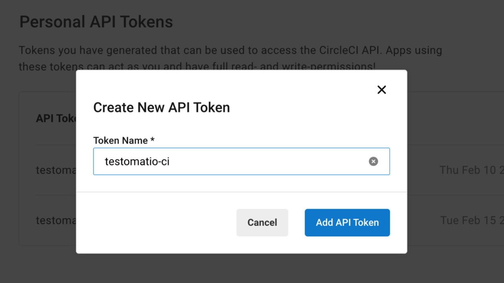
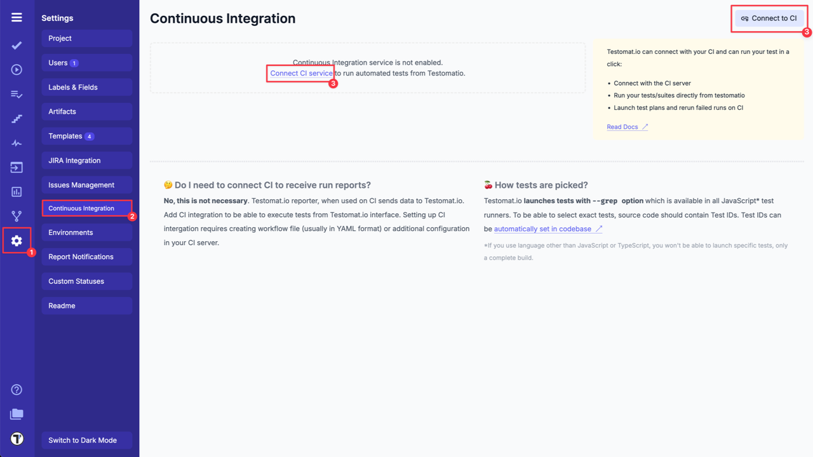
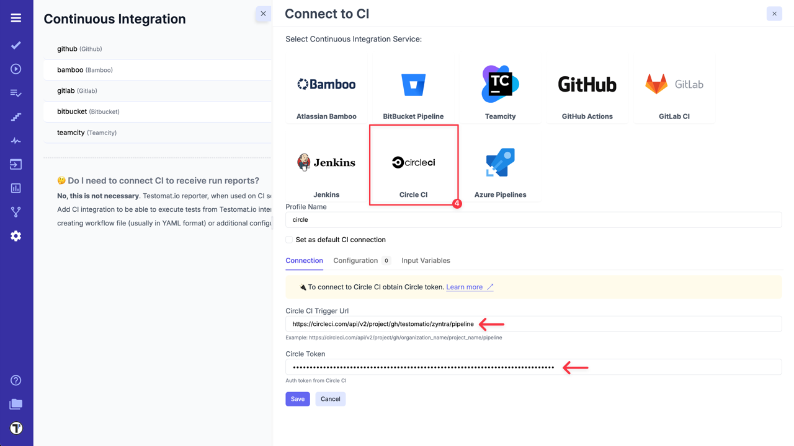
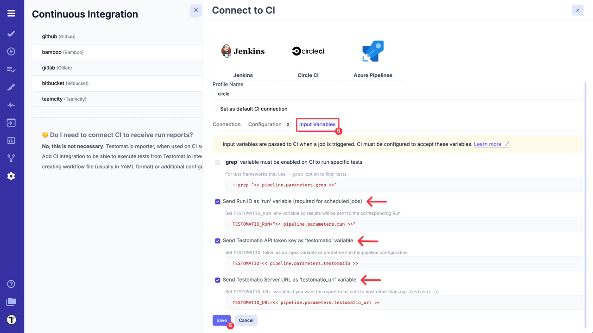
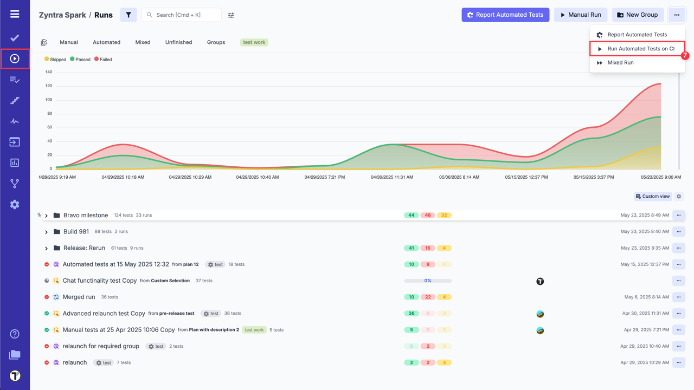
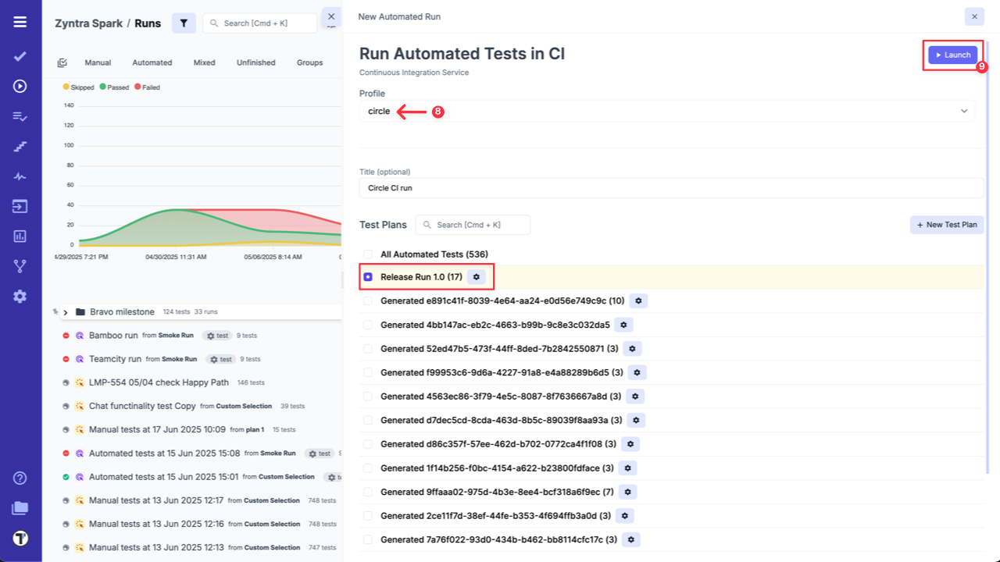
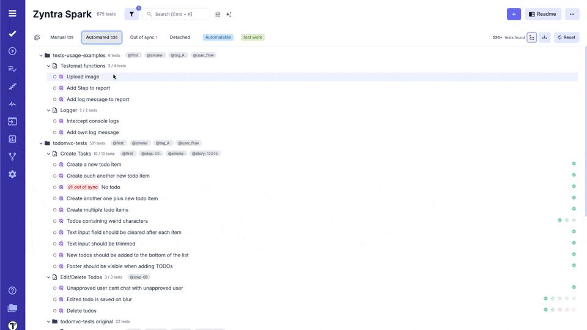
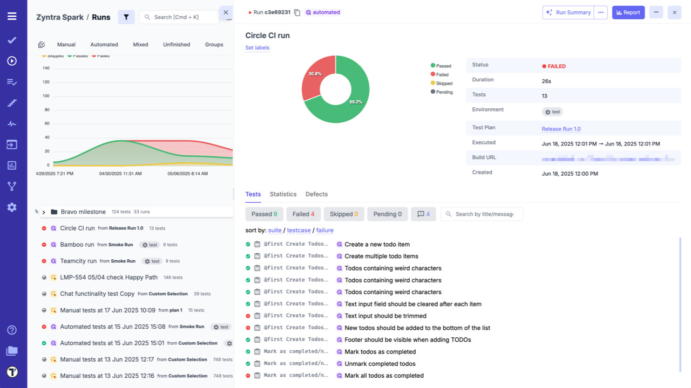

To connect Circle CI to Testomat.io, lets start with configuring your Circle CI:

1. Create an access token on Circle CI by following [the instuctions by link](https://circleci.com/docs/managing-api-tokens/#creating-a-personal-api-token).



2. Create a workflow in `config.yml` file in `.circle` folder in the root folder in your repository.

3. This workflow will be used solely by Testomat.io so it should start only on `workflow_dispatch` event. The event should be defined with the following input parameters:

```
parameters:
  testomatio:
    type: string
    default: ""

  run:
    type: string
    default: ""

  testomatio_url:
    type: string
    default: ""

  grep:
    type: string
    default: ""

```

4. The **Job** should include a step where the test runner is executed with `--grep` option and `TESTOMATIO` environment variables passed in. 
For instance:

 ```
      - run:
          name: Run tests
          command: npx codeceptjs run --grep "<< pipeline.parameters.grep >>"
          environment:
            TESTOMATIO: << pipeline.parameters.testomatio >>
            TESTOMATIO_RUN: << pipeline.parameters.run >>
            TESTOMATIO_URL: << pipeline.parameters.testomatio_url >>
```

:::note

If you use on-premise Testomat.io setup you will also need to add `testomatio_url` parameter.

:::

After Circle CI is set up, its time to open your project in Testomat.io and configure the connection between these two systems.

1. Go to **'Settings'**.
2. Select **'Continuous Integration'**.
3. Click **'Connect to CI'**.



4. Select **'Circle CI'** and enter following details on the **'Connection'** tab:

- `Circle CI Trigger Url` - (see how it works [here](https://circleci.com/docs/2.0/api-developers-guide/#getting-started-with-the-api)).
- `Circle Token` - Auth token from Circle CI, created in Circle CI during Step 1.



5. Switch to **'Input Variables'** tab and select checkboxes:

- Send Run ID as `run` input (required for scheduled jobs).
- Send Testomat.io API key as `testomatio` input.
- Send Testomat.io Server URL as `testomatio_url` input (if you use on-premise setup).

:::note

You can set and pass more input variables if you set them in [Environment Configuration](./index.md#environment-configuration). For example: test environment, browser, branch, etc.

:::

6. Click on **'Save'** button to save the connection.



7a. When the connection is saved, open **'Runs'** page and select `Run Automated Tests in CI` option in extra menu.



8a. Select **'Circle CI'** profile in a list, select a target ref or any other variables, if any were configured. Optionally, select a **Test Plan** or create a new one.

9a. Click on **'Launch'** button and wait for the results.



OR

7b. On **'Tests'** page select any automated suite or test case -> click **'Extra menu'** button -> select **'Run Tests'** option -> open **'Run in CI'** tab.

8b. Select **'Circle CI'** profile in a list, as well, select a target ref or any other variables, if any were configured.

9b. Click on **'Launch'** button and wait for the results.



This will start a new job in Circle CI, please check that the job was successfully triggered and completed. After the job has finished, a run report will be available on Runs page of Testomat.io.

