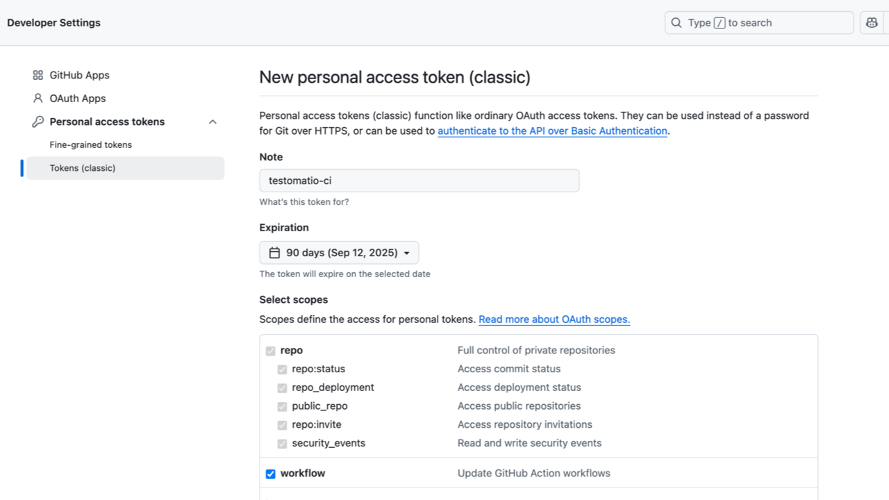
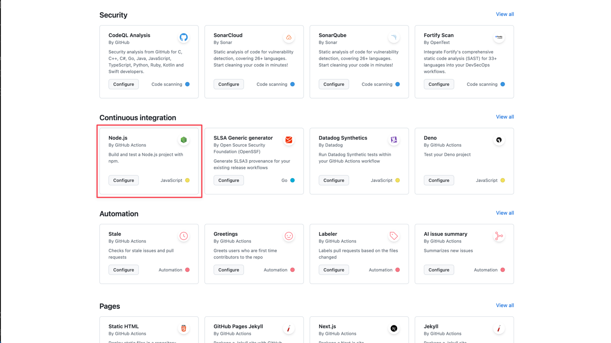
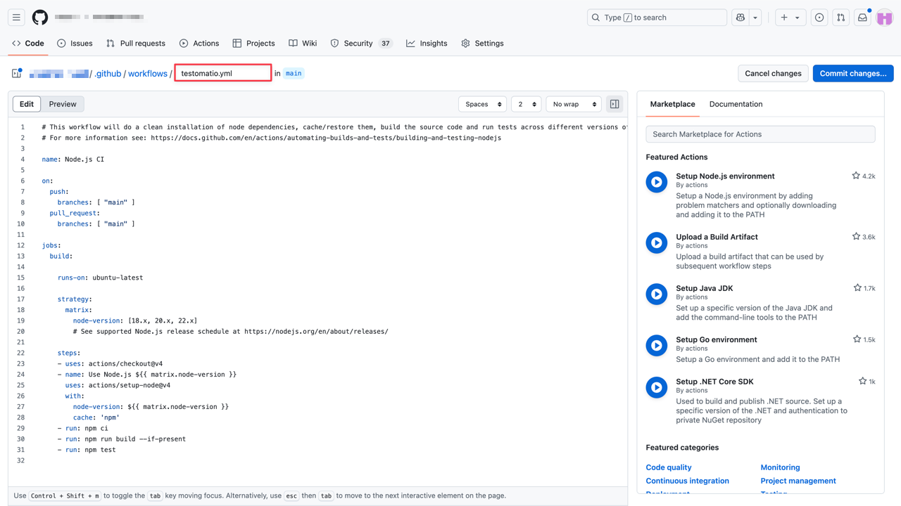
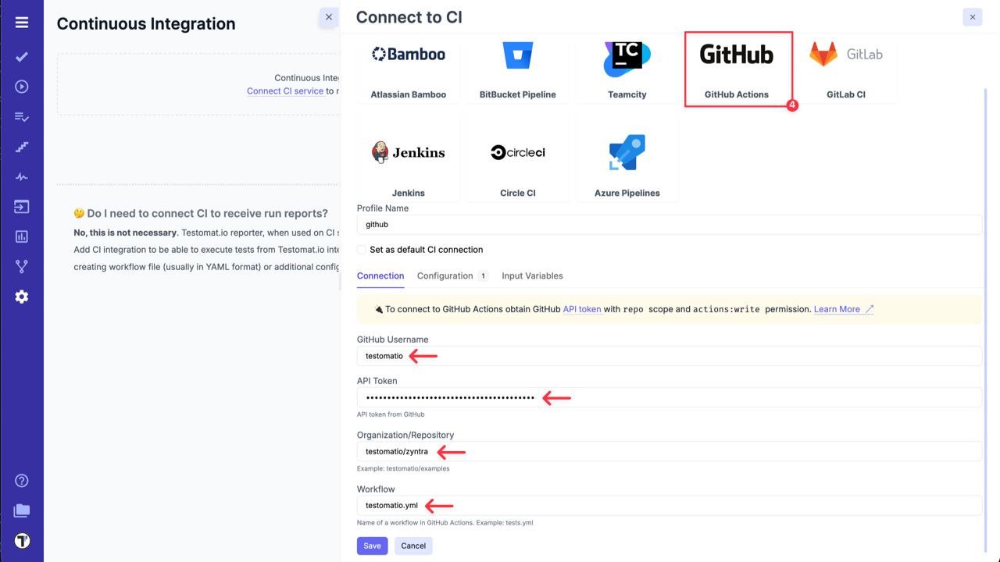
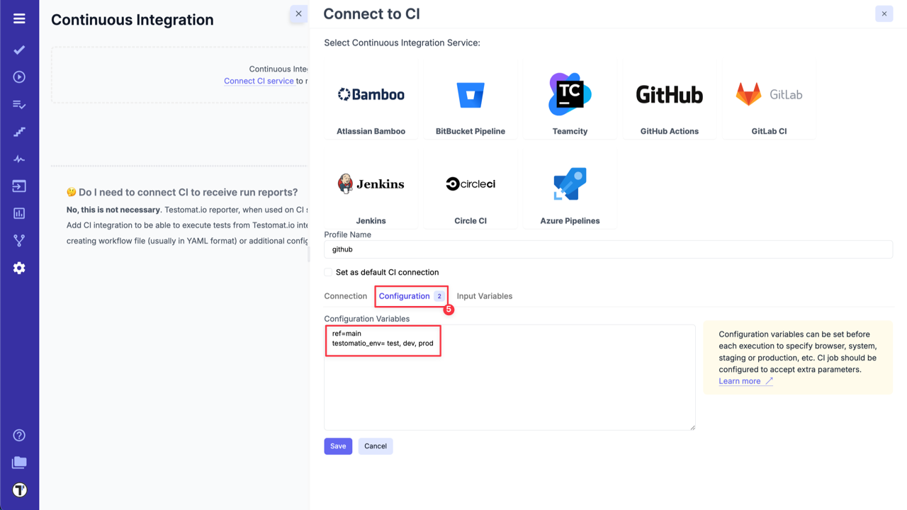
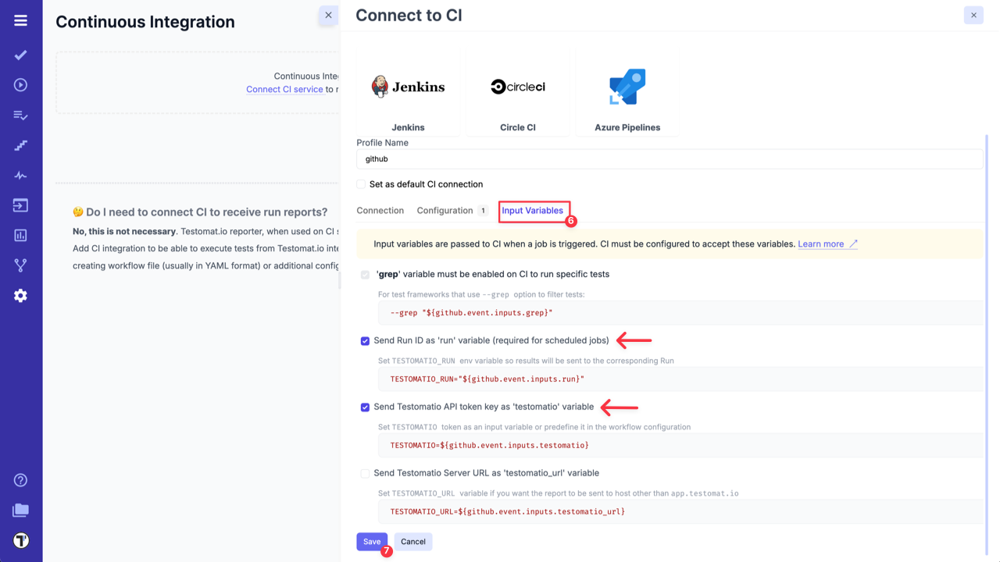
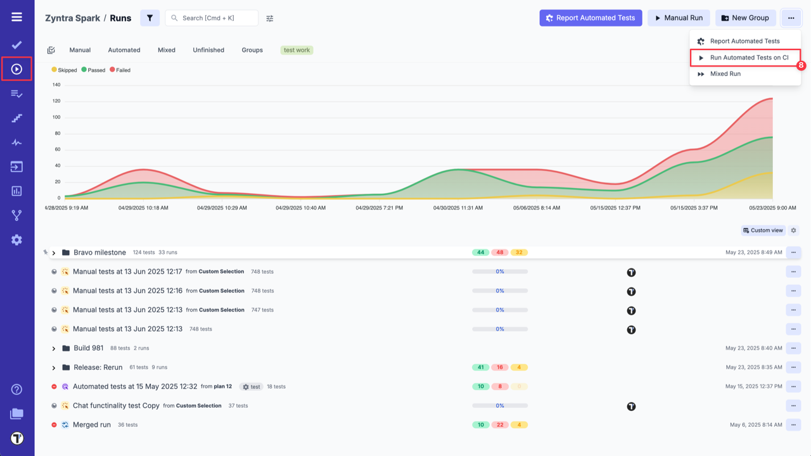
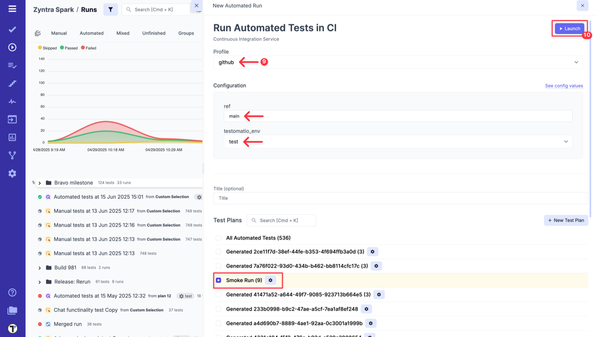
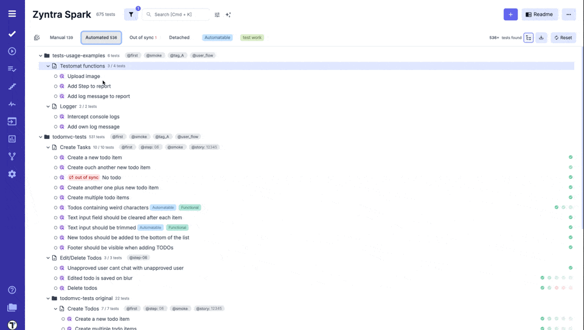
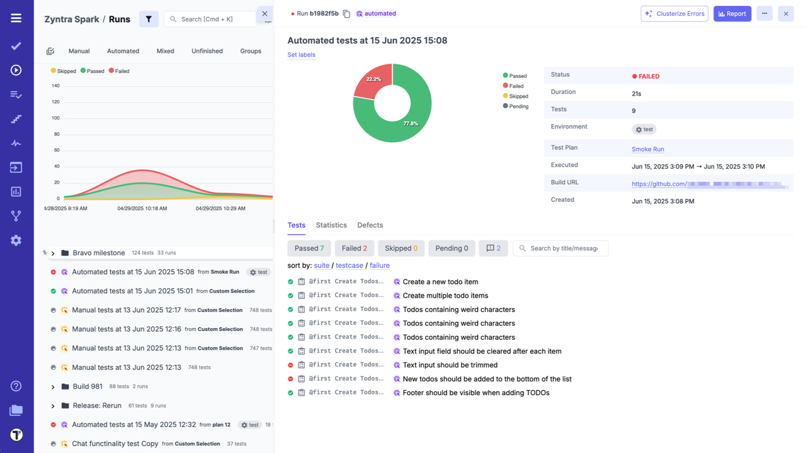

To set up connection between GitHub and Testomat.io, first, you need to configure your GitHub account:

1. Create a Personal Access Token on GitHub with access to workflow scope (follow the instructions by link - [Create PAT](https://docs.github.com/en/authentication/keeping-your-account-and-data-secure/managing-your-personal-access-tokens#creating-a-personal-access-token-classic)).



2. Create a Workflow in a GitHub Repository: Go to **'Actions'** tab in Repository -> Select Workflow template -> Click **'Configure'** button. Then you will get a workflow template. 
**A workflow filename will be used by Testomat.io to call a specific workflow.**





3. This workflow will be used solely by Testomat.io, so it should start only on `workflow_dispatch` event. The event should be defined with the following input parameters:

```yaml
name: Testomatio Tests

on:
  workflow_dispatch:
    inputs:
      grep:
        description: 'tests to grep '
        required: false
        default: ''
      run:
        required: false
      testomatio:
        required: false
```

4. The **Job** should include a step where the test runner is executed with `--grep` option and `TESTOMATIO` environment variables passed in. For instance:

```yaml
    - run: npx codeceptjs run --grep "${{ github.event.inputs.grep }}"
      env:
        TESTOMATIO: "${{ github.event.inputs.testomatio }}"
        TESTOMATIO_RUN: "${{ github.event.inputs.run }}"
```

After configuring your GitHub account, integrate GitHub Actions CI with your Testomat.io project:

1. Go to **'Settings'**.
2. Select **'Continuous Integration'**.
3. Click **'Connect to CI'**.


4. Select **'GitHub'** and enter following details on the **'Connection'** tab:

- `GitHub Username`.
- `API token` - PAT created, in GitHub during Step 1.
- `Organization/Repository (or User/Repository)`.
- `Workflow` - name of a workflow in GitHub Actions, in our case `testomatio.yml`.



5. Open **'Configuration'** tab and check the default `ref` value. `ref` specifies the target branch or tag for test execution. By default, it is set to `master`, but you can adjust this if your main branch uses a different name, such as `main`.



6. Go to **'Input Variables'** tab and enable `run` and `testomatio` inputs, to pass them from Testomat.io.

:::note

You can set and pass more input variables if you set them in [Environment Configuration](./index.md#environment-configuration). Like in our case, test environments were set.

:::

:::note

The `ref` parameter specifies which branch to run the workflow on. The provided workflow must be registered in the repository's GitHub Actions and must exist in the branch referenced by ref. A GitHub Action is considered registered if it exists in the project's default branch or has been triggered at least once.

:::

7. Click on **'Save'** button to save the connection.



8a. When the connection is saved, open **'Runs'** page and select `Run Automated Tests in CI` option in extra menu.

:::note

When using the "Test connection" button, workflow lookup is performed against the repository's default branch. The ref parameter from the config is ignored. This is a GitHub Actions API limitation.

:::



9a. Select **'GitHub'** profile in a list, select a target ref and any other variables, if any were configured. Optionally, select a **Test Plan** or create a new one.

10a. Click on **'Launch'** button and wait for the results.



OR

8b. On **'Tests'** page select any automated suite or test case -> click **'Extra menu'** button -> select **'Run Tests'** option -> open **'Run in CI'** tab.

9b. Select **'GitHub'** profile in a list, as well, select a target ref and any other variables, if any were configured.

10b. Click on **'Launch'** button and wait for the results.



This will start a new job in GitHub Actions, please check that the job was successfully triggered and completed. After the job has finished, a run report will be available on Runs page of Testomat.io.


