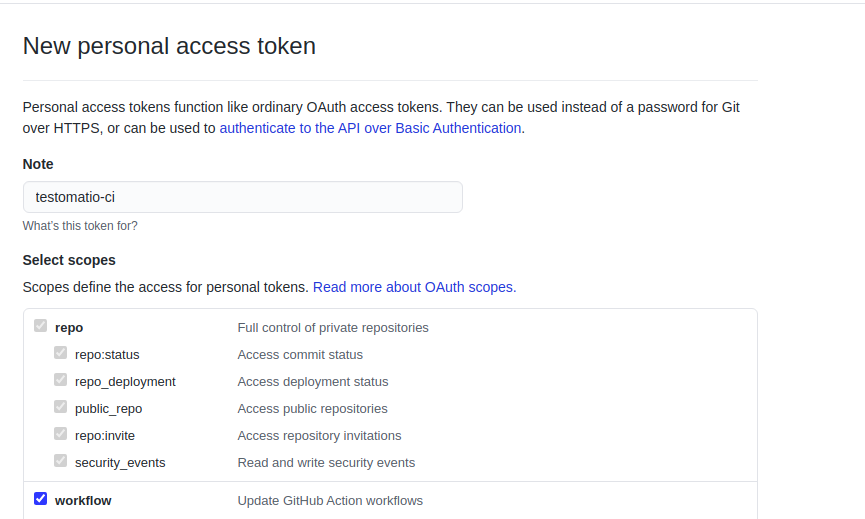
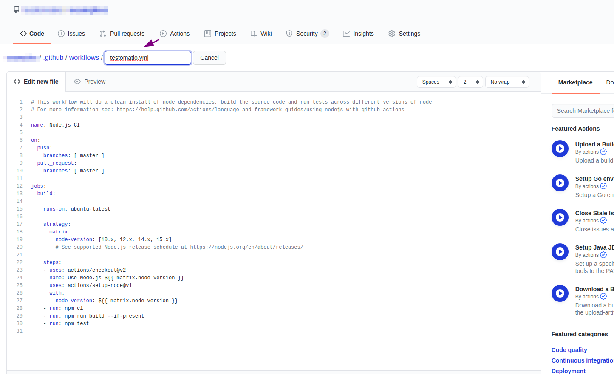
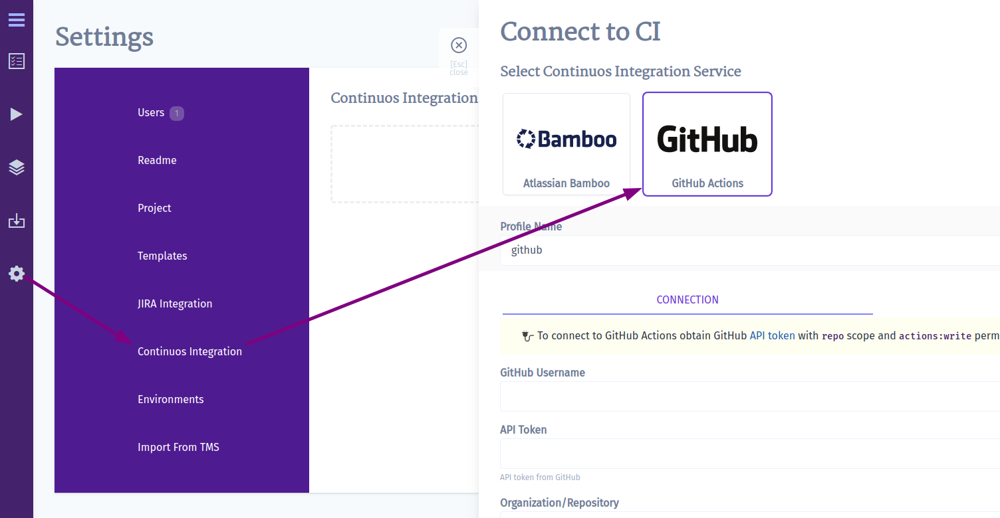
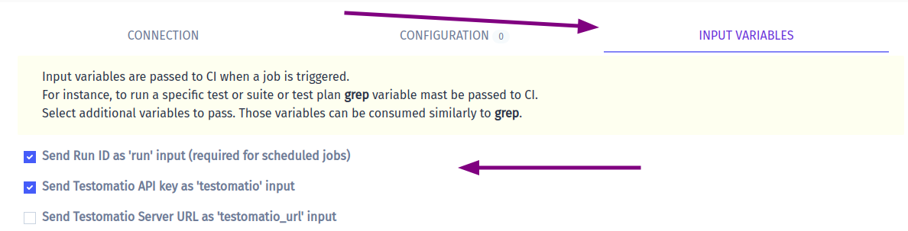
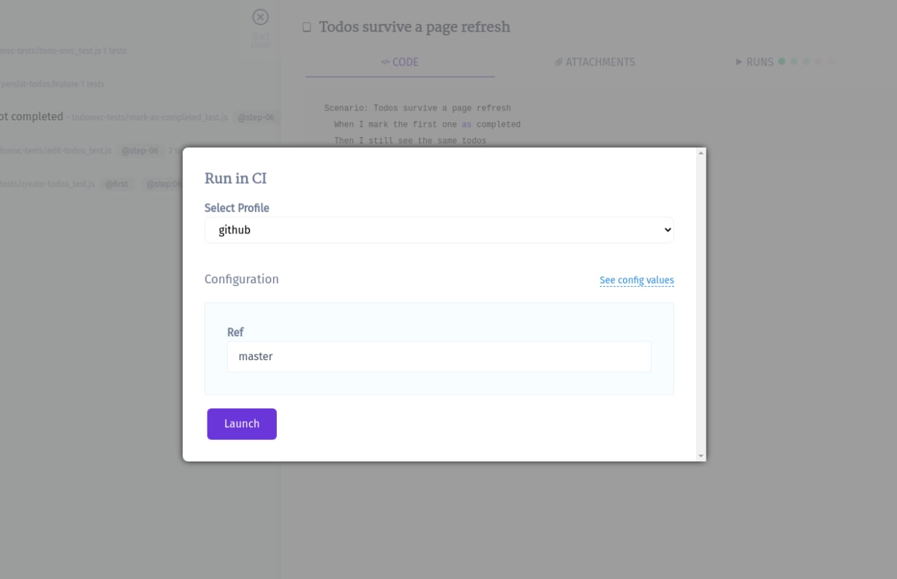

1. Create an [access token on GitHub](https://docs.github.com/en/github/authenticating-to-github/creating-a-personal-access-token) with access to workflow scope:



2. Create a workflow in a GitHub repository. Go to "Actions" tab in repository and click "Create Workflow" button. Then you will get a workflow template. A workflow filename will be used by Testomatio to call a specific workflow.



3. This workflow will be used solely by Testomatio so it should start only on `workflow_dispatch` event. The event should be defined with the following input parameters:

```yaml
name: Testomatio Tests

on:
  workflow_dispatch:
    inputs:
      grep:
        description: 'tests to grep '
        required: false
        default: ''
      run:
        required: false
      testomatio:
        required: false
```

4. The job should include a step where the test runner is executed with `--grep` option and TESTOMATIO environment variables passed in. For instance:

```yaml
    - run: npx codeceptjs run --grep "${{ github.event.inputs.grep }}"
      env:
        TESTOMATIO: "${{ github.event.inputs.testomatio }}"
        TESTOMATIO_RUN: "${{ github.event.inputs.run }}"
```

5. Connect a GitHub Actions CI in Testomatio:



You will need to enter the following

* GitHub Username
* OAuth token (created at step 1)
* organization/repository (or user/repository)
* workflow name, a file name with a workflow, like `testomatio.yml`

7. Save your connection
8. Now, open "Configuration" tab and check the default `ref` value. `ref` is a target branch or a tag on which a tests will be executed. By default, it is set to `master` (most of the repositories still use master as the main branch name, but we will adjust defaults accordingly when things change), but you can choose a different one, like `main`.
9. `run` and `testomatio` inputs are passed from Testomatio. Enable them on Input Variables tab



You can pass more input variables if you set them in [Environment Configuration](#environment-configuration)

9. When the connection is saved, open a test and select "Run in CI". Select a target ref and click "Launch"



10. This will start a new job in GitHub Actions, please check that the job was successfully triggered and completed. After the job has finished a run report will be available on Runs page of Testomatio