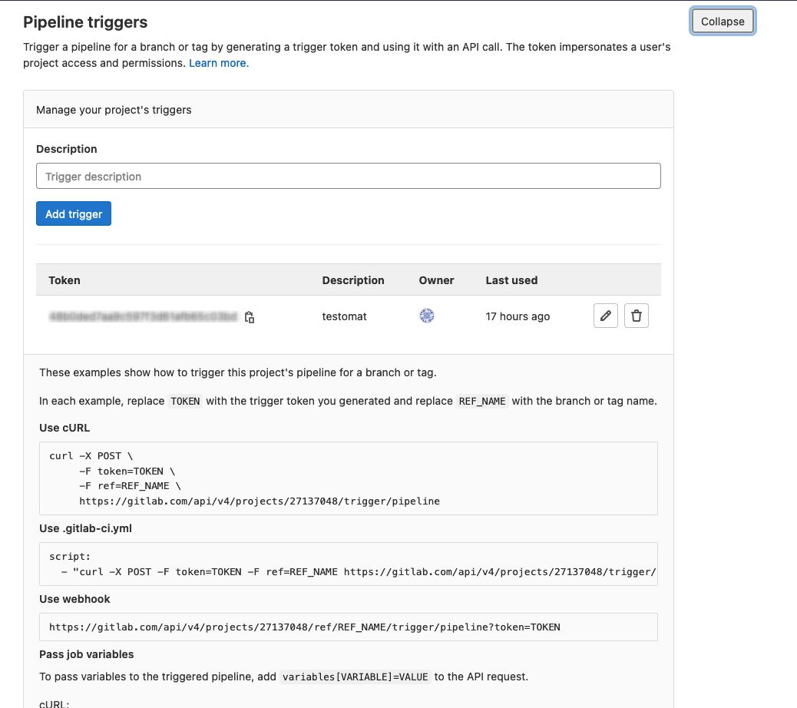
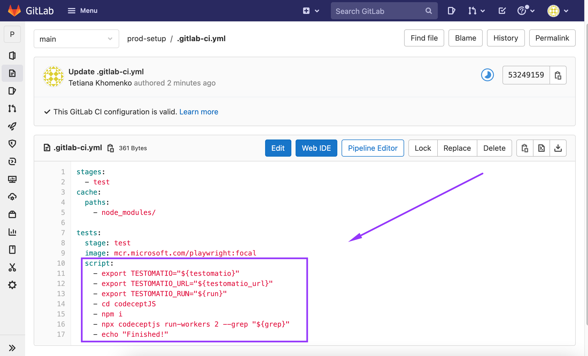
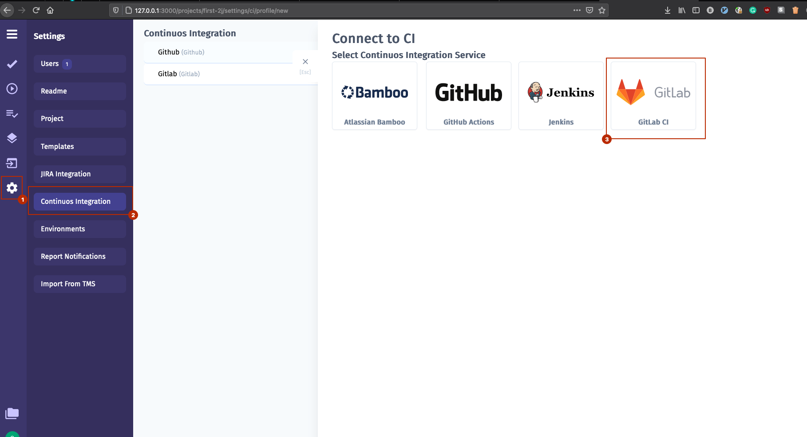
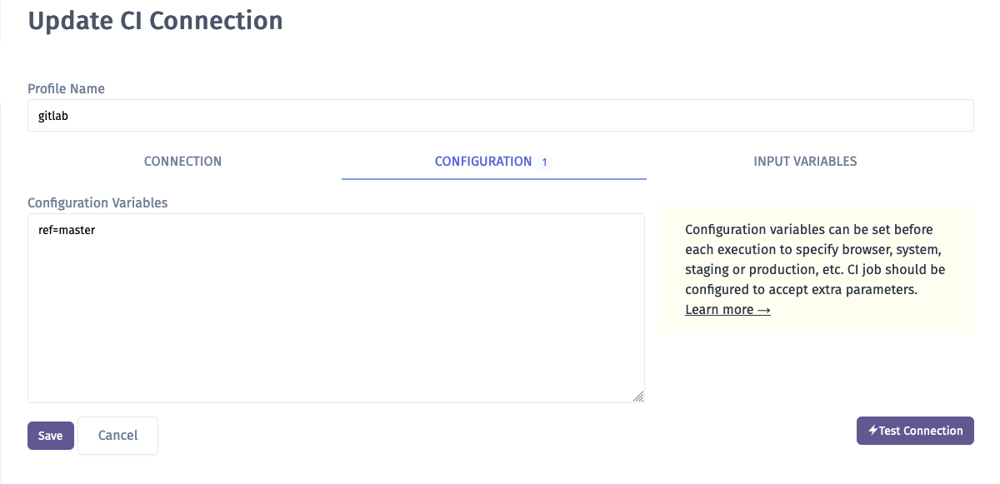
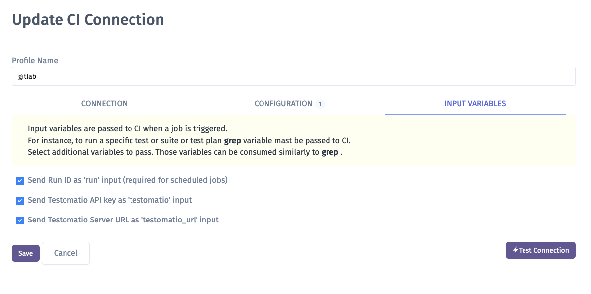

#1. Add new trigger https://docs.gitlab.com/ee/ci/triggers/#trigger-a-pipeline



2. Create .gitlab-ci.yml file or add the job to existing one. E.g. -
https://gitlab.com/TetianaKhomenko/prod-setup/-/blob/main/.gitlab-ci.yml


It should contain next commands:
```
    - export TESTOMATIO="${testomatio}"
    - export TESTOMATIO_URL="${testomatio_url}"
    - export TESTOMATIO_RUN="${run}"
```
3. The job should include a step where the test runner is executed with --grep option and TESTOMATIO environment variables passed in. For instance:
```
    - npx codeceptjs run-workers 2 --grep "${grep}"
```
4. Connect a GitLab CI in Testomatio:



5. Save your connection

6. Now, open the "Configuration" tab and check the default ref value. ref is a target branch or a tag on which tests will be executed. By default, it is set to master (most of the repositories still use master as the main branch name, but we will adjust defaults accordingly when things change), but you can choose a different one, like main.



7. Run and testomatio inputs are passed from Testomatio. Enable them on the Input Variables tab. You can pass more input variables if you set them in Environment Configuration



8. When the connection is saved, open a test and select "Run in CI". Select a target ref and click "Launch"

9. This will start a new pipeline in GitLab CI please check that the job was successfully triggered and completed. After the job has finished a run report will be available on Runs page of Testomatio