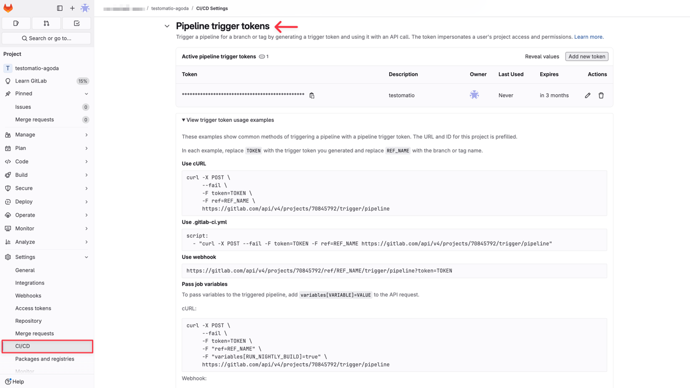
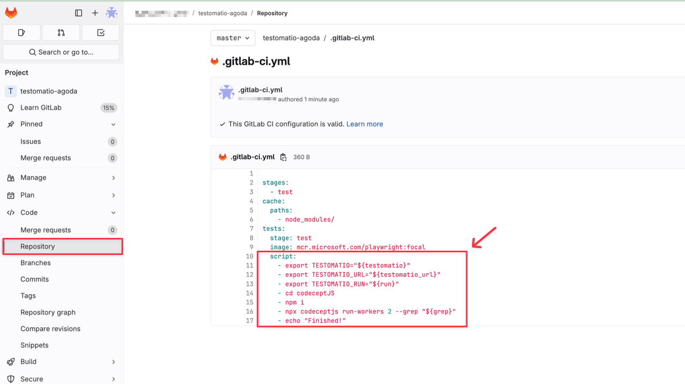
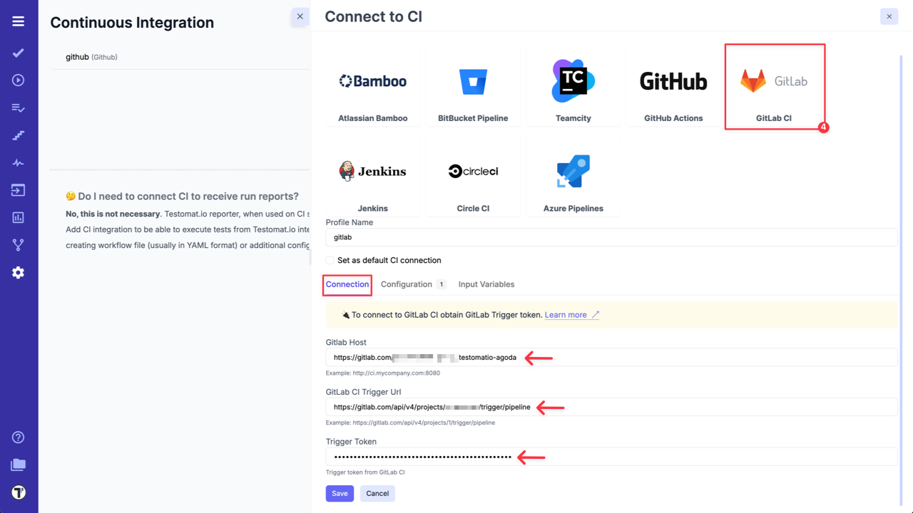
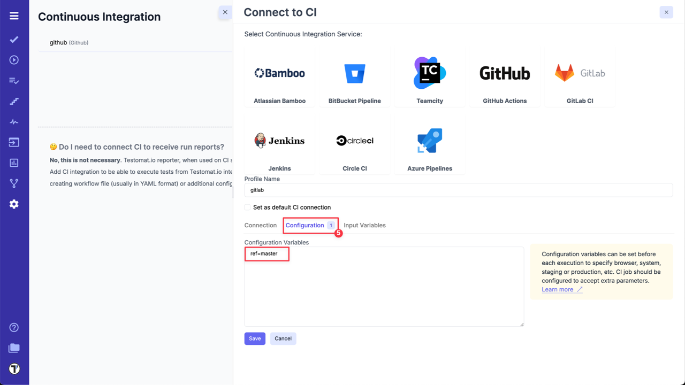
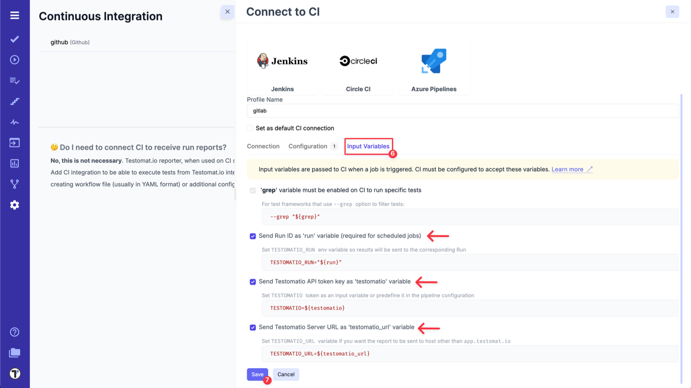
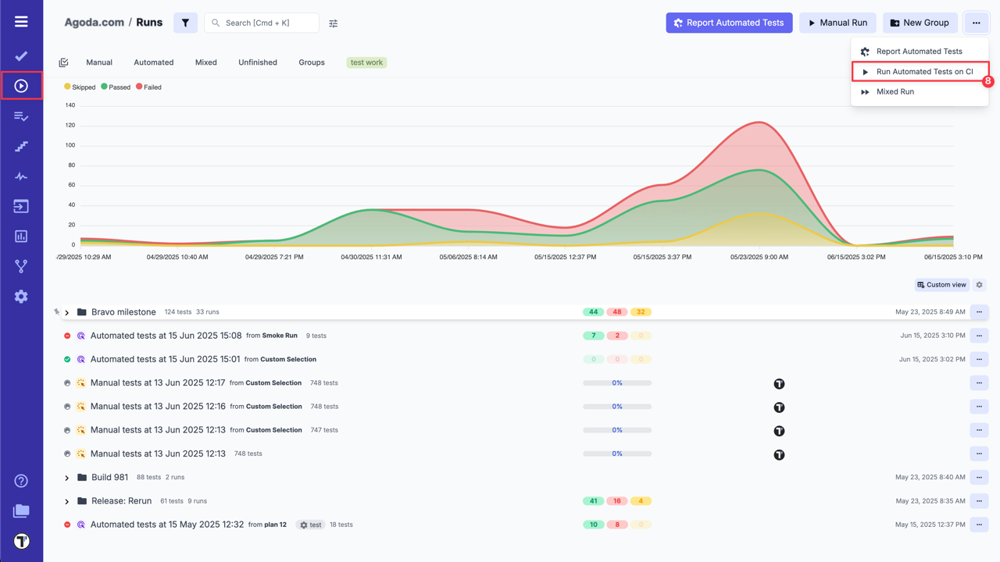
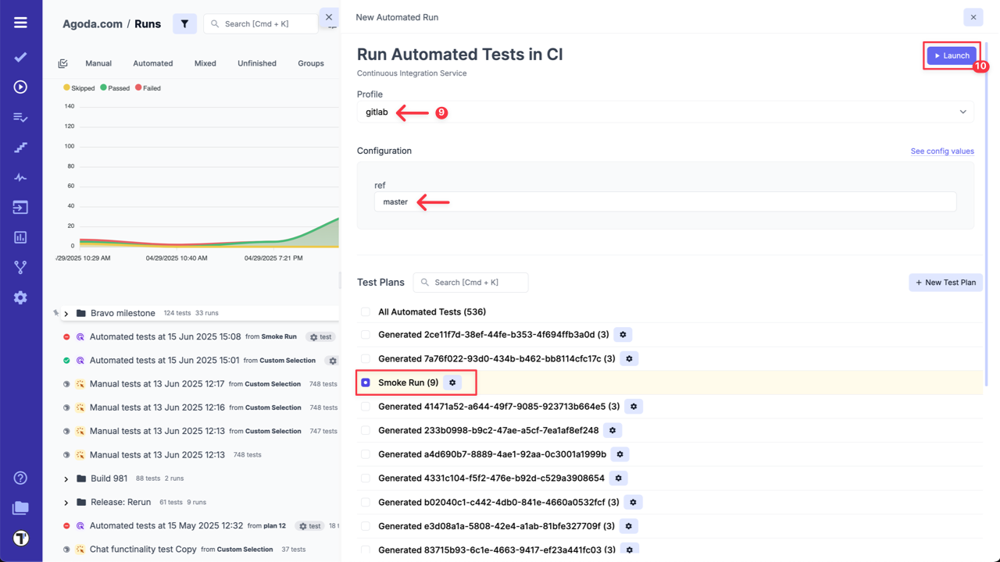
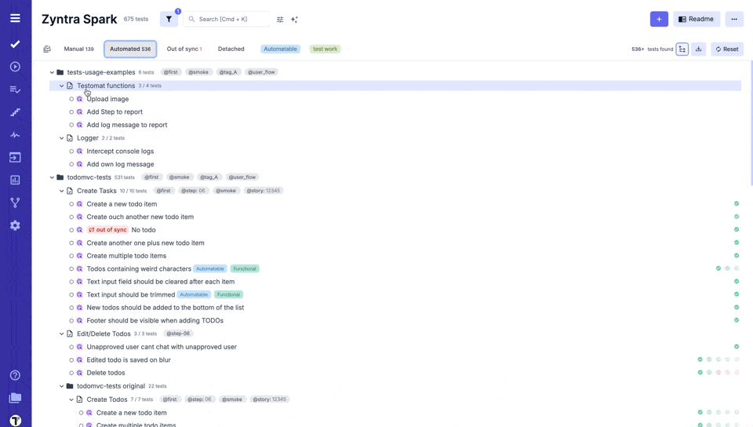
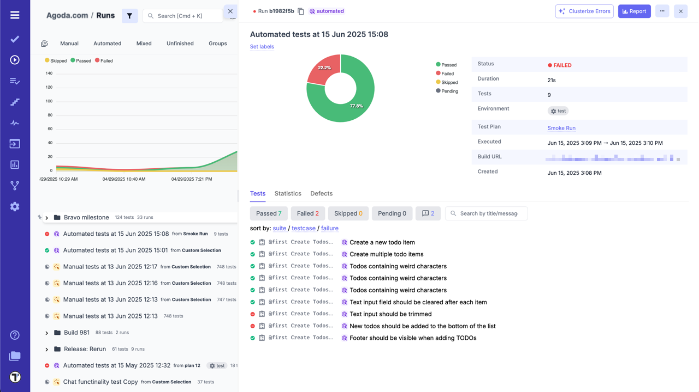

To set up connection between GitLab and Testomat.io, first, you need to configure your GitLab account:

1. Add new **Pipeline Trigger** in your GitLab Project - [read more](https://docs.gitlab.com/ee/ci/triggers/#trigger-a-pipeline).



2. Go to **'Code' -> 'Repository'** and create **.gitlab-ci.yml** file or add the job to existing one. E.g. check by [link](https://gitlab.com/TetianaKhomenko/prod-setup/-/blob/main/.gitlab-ci.yml).



It should contain next commands:
```
    - export TESTOMATIO="${testomatio}"
    - export TESTOMATIO_URL="${testomatio_url}"
    - export TESTOMATIO_RUN="${run}"
```
3. The **Job** should include a step where the test runner is executed with `--grep` option and `TESTOMATIO` environment variables passed in. For instance:

```
    - npx codeceptjs run-workers 2 --grep "${grep}"
```
When GitLab is set up, go to your Project in Testomat.io and configure GitLab CI connection:

1. Go to **'Settings'**.
2. Select **'Continuous Integration'**.
3. Click **'Connect to CI'**.


4. Select **'GitLab'** and enter following details on the **'Connection'** tab:

- `Gitlab Host`.
- `GitLab CI Trigger Url` - trigger pipeline URL, created in GitLab during Step 1.
- `Trigger Token` - Active pipeline trigger token, created in GitLab during Step 1.



5. Open **'Configuration'** tab and check the default `ref` value. `ref` specifies the target branch or tag for test execution. By default, it is set to `master`, but you can adjust this if your main branch uses a different name, such as `main`.



6. Go to **'Input Variables'** tab and enable `run`, `testomatio token` and `TESTOMATIO_URL` variables to pass them from Testomat.io.

:::note

You can set and pass more input variables if you set them in [Environment Configuration](./index.md#environment-configuration). For example: test environment, browser, branch, etc.
:::

7. Click on **'Save'** button to save the connection.



8a. When the connection is saved, open **'Runs'** page and select `Run Automated Tests in CI` option in extra menu.



9a. Select **'GitLab'** profile in a list, select a target ref and any other variables, if any were configured. Optionally, select a **Test Plan** or create a new one.

10a. Click on **'Launch'** button and wait for the results.



OR

8b. On **'Tests'** page select any automated suite or test case -> click **'Extra menu'** button -> select **'Run Tests'** option -> open **'Run in CI'** tab.

9b. Select **'GitLab'** profile in a list, as well, select a target ref and any other variables, if any were configured.

10b. Click on **'Launch'** button and wait for the results.




This will start a new pipeline in GitLab CI. Please check that the job was successfully triggered and completed. After the job has finished, a run report will be available on Runs page of Testomat.io.

