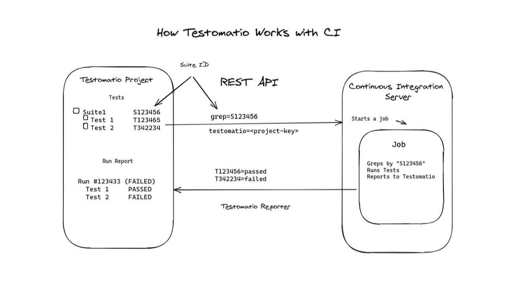
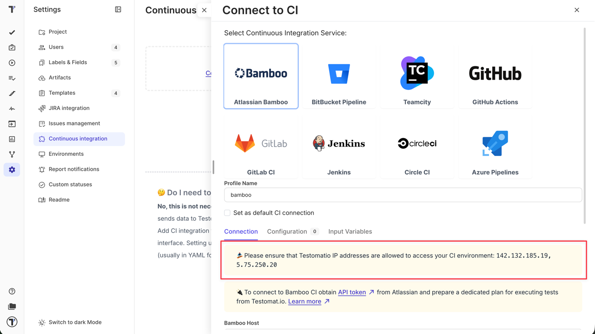
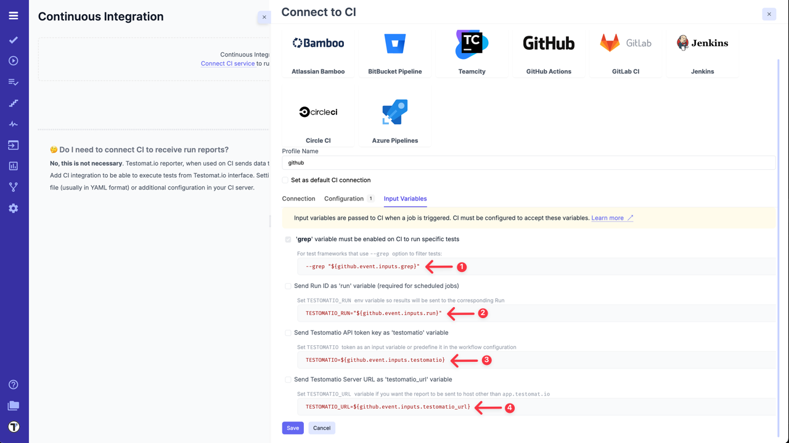
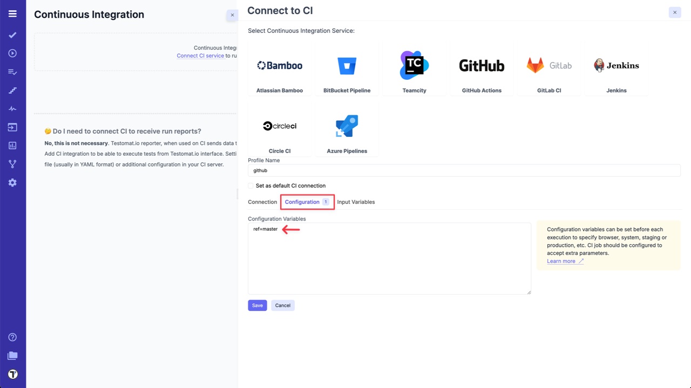
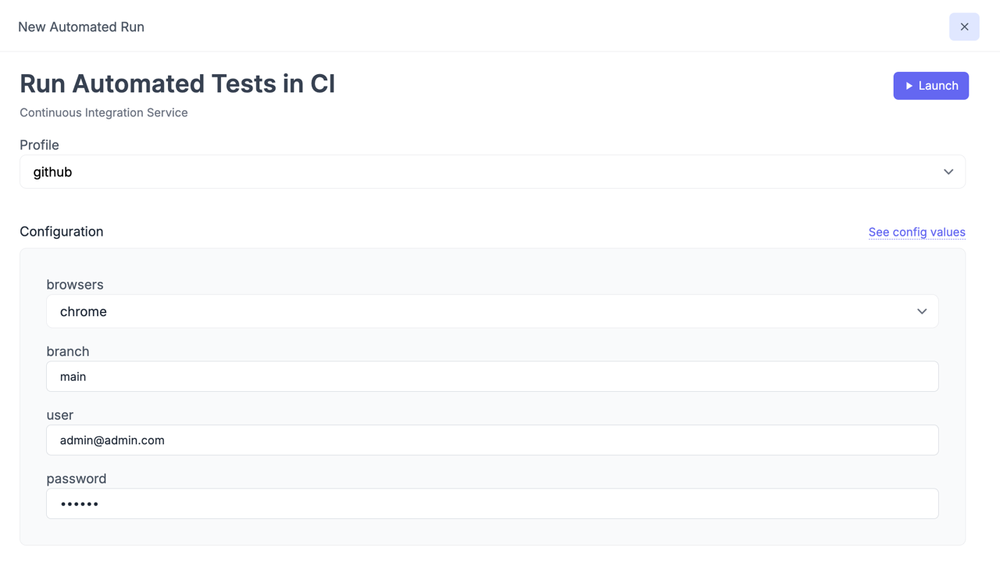

import DirectoryLinks from '/src/components/DirectoryLinks.astro';

<DirectoryLinks directory="integrations/continuous-integration" />

Testomat.io allows executing tests on CI from its interface.
A single test, suite, test plan, or all tests can be executed automatically on CI.

**Currently following CI systems supported:**

* [Atlassian Bamboo](https://docs.testomat.io/integrations/continuous-integration/bamboo)
* [BitBucket Pipelines](https://docs.testomat.io/integrations/continuous-integration/bitbucket)
* [Teamcity](https://docs.testomat.io/integrations/continuous-integration/teamcity)
* [GitHub Actions](https://docs.testomat.io/integrations/continuous-integration/github)
* [GitLab CI](https://docs.testomat.io/integrations/continuous-integration/gitlab)
* [Jenkins](https://docs.testomat.io/integrations/continuous-integration/jenkins)
* [Circle CI](https://docs.testomat.io/integrations/continuous-integration/circle)
* [Azure Pipelines](https://docs.testomat.io/integrations/continuous-integration/azure)

Testomat.io uses REST API to trigger jobs on external CI systems. IDs of tests or suites can be passed to the job so only a specific test or suite will be executed. The test runner greps all tests by their IDs and executes a subset of tests. Then a report is sent back to Testomat.io via reporter.



**Connecting CI server to Testomat.io consist of the following steps:**

1. Create Testomat.io Project.
2. Import automated tests into that project from a repository.
3. [Assign IDs](#assigning-ids) for imported tests source code.
4. Create a new job in CI according to instructions on this page.
5. Connect CI server to Testomat.io.
6. Run your tests or suites to get reports!

## Configuring CI

CI configuration has 3 steps:

1. Establishing a connection with CI.
2. Setting up required input variables.
3. Setting up custom configuration variables.

Follow the guide for a corresponding CI to set it up.

:::note

Please ensure that Testomat.io IP addresses are allowed to access your CI environment: 142.132.185.19, 5.75.250.20



:::

### Input Variables

While connection settings can be different across CI settings, the list of input variables is the same.

Here is how `run` input variable can be accessed on different CIs:

- Atlassian Bamboo: `${bamboo.run}`
- GitHub Actions: `${github.event.inputs.run}`

It may as well pass other input variables which can be used on CI to improve reporting.

**Here is the list of preconfigured input variables:**

1. `grep` - Testomat.io sends `grep` variable to CI to identify which tests should be executed. `grep` variable is required and selected by default in Testomat.io.

2. `run` - passes Run ID to CI. If this option is toggled on, when a run is created in Testomat.io, it is instantly added to the list of runs marked as 'Scheduled'. On CI `run` variable must be passed as `TESTOMATIO_RUN` environment variable to a reporter. This allows mapping a scheduled run to the run which is currently processed. **If `TESTOMATIO_RUN` is not set, a duplicate run will be created**.

3. `testomatio` - passes project access key to CI. This input variable must be passed as `TESTOMATIO` environment variable to match the Testomat.io project. Toggle on this option if you prefer not to hardcode Testomat.io Project ID in CI configuration but to obtain this value on launch. This may be useful if you have a different Testomat.io project configured on CI run.

4. `testomatio_url` - when working on a self-hosted Testomat.io instance, this variable can be used to pass Testomat.io endpoint to CI system. Pass `testomatio_url` environment variable to `TESTOMATIO_URL`.



### Environment Configuration

Sometimes extra configuration is required for CI job. For instance, extra configuration variables can be used to specify:

- browser.
- target branch.
- staging/production environments.
- suites.

Testomat.io allows to predefine configuration variables and adjust them for each run. Config variables can be set in **'Configuration'** tab on CI connection settings.



Config variables should be put per line with the default value passed in with `=`. The format is similar to `.env` file format:

```
browsers=chrome,firefox,safari
branch=main
user=admin@admin.com
password=123456
suites=[3f4290f0,b89df296,78b10b62]
```

`ref=master` config variable is set up by default for some CI services in Testomat.io but it can be changed at any time.

:::note

To set a variable without a default value just pass it as on a line without `=`

:::

Those variables will be available for a reconfiguration on each CI Run executed from Testomat.io.
If a variable value contains comma `,` like in example above: `chrome,firefox,safari`, these values will be displayed with the select box. Otherwise, a simple input will be shown.



These variables will be passed to CI in the same manner as `grep` parameter. So, CI job should be prepared to handle these config variables. For instance, if GitHub Actions are used, values are passed as `inputs` and can be used like this:

```yaml
    - run: npx codeceptjs run --grep "${{ github.event.inputs.grep }}" --profile "${{ github.event.inputs.branch }}"
      env:
        TESTOMATIO: "${{ github.event.inputs.testomatio }}" # passed from Testomatio by default
        BROWSER: "${{ github.event.inputs.browser }}"
        TEST_USER: "${{ github.event.inputs.user }}"
        TEST_PASSWORD: "${{ github.event.inputs.password }}"
```

### Assigning IDs

To execute a specific test or a suite a test runner should have a way to find a test by its unique name. For this reason, Testomat.io IDs can be used. If tests in the source code will have Testomat.io IDs it will be very simple to filter tests. We provide a semi-automatic way to assign Testomat.io IDs to tests in source code.

For JavaScript frameworks use the same `check-tests` command you used for importing tests with `--update-ids`. The tests must be already imported in Testomat.io:

```
TESTOMATIO={apiKey} npx check-tests <framework> <pattern> --update-ids
```

For Cucumber tests use `check-cucumber` command with the similar `--update-ids` command. The command should be the same as for importing plus `--update-ids` option:

```
TESTOMATIO={apiKey} npx check-cucumber <pattern> --update-ids
```

This command will update your source code. Please check the changes before committing it.
If the Testomat.io IDs were placed correctly you can commit your changes to repository.

From now on, Testomat.io can use Test IDs to run exact tests and suites on Continuous Integration servers.