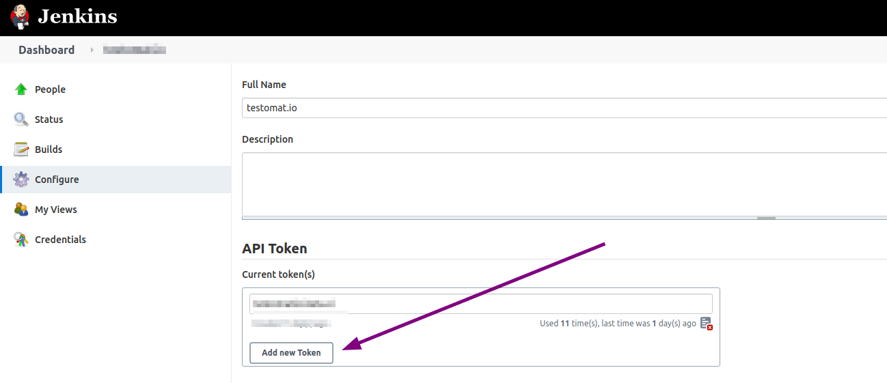
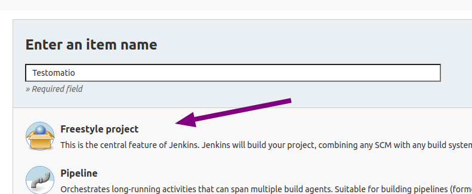
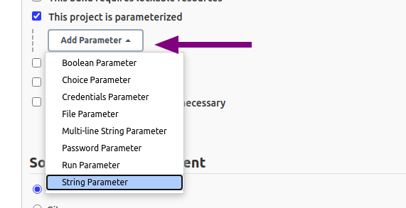
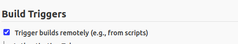
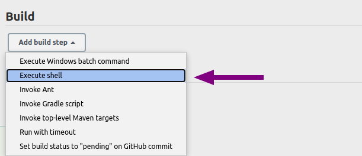
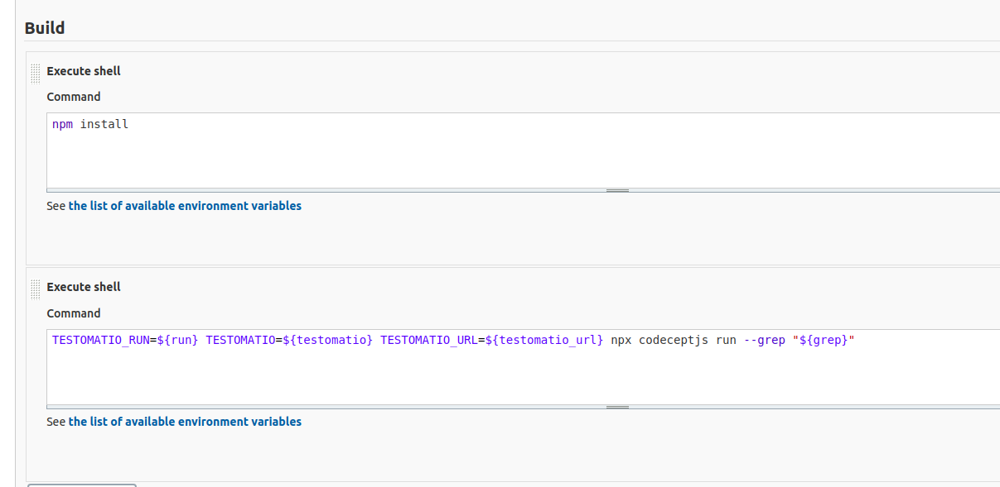
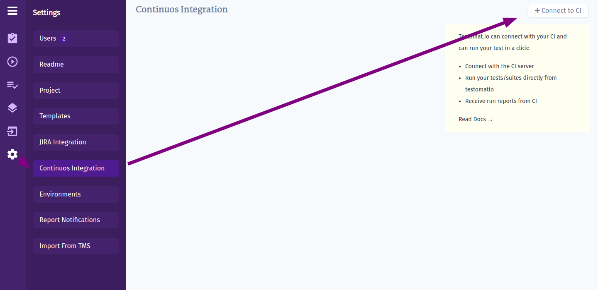
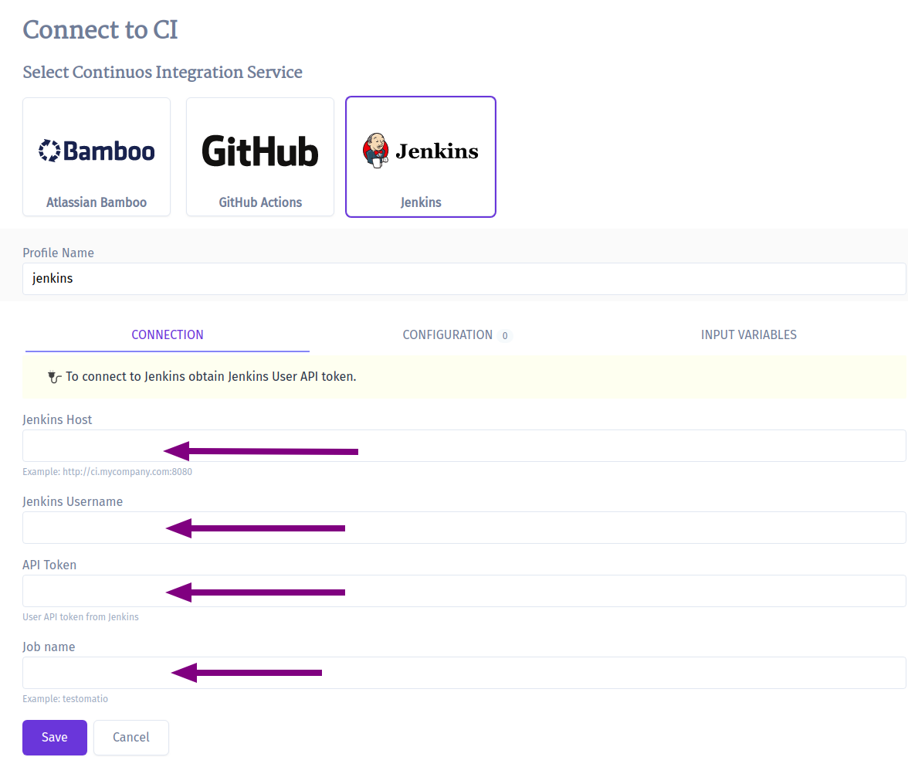
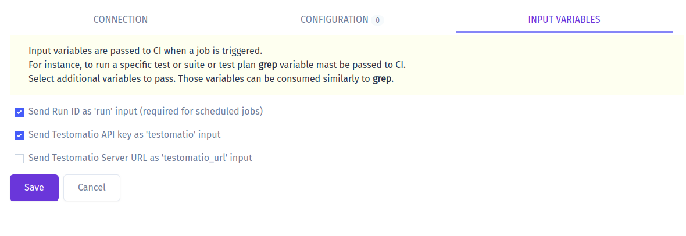

To connect Jenkins to Testomatio you will need a user and an API Token created.
API token can be added on "Configure" page of current user:



Then create a new Jenkins job. Select "Freestyle project".



> It is recommended to avoid spaces in job name to prevent issues with connecting to this job via URL

Make this build parametrized:



Add the following parameters as a string with empty default values:

* `run`
* `testomatio`
* `grep`

If you use on-premise Testomatio setup you will also need to add `testomatio_url` parameter.

Inside "Build Triggers" select "Trigger build remotely"



Proceed with configuring the job and set all required parameters like SCM and build steps.



Within a step pass in configured parameters as environment variables into the test runner. Let's take CodeceptJS command as an example:

```
TESTOMATIO_RUN=${run} TESTOMATIO=${testomatio} npx codeceptjs run --grep "${grep}"
```

> Prepend `TESTOMATIO_URL=${testomatio_url}` if you use on-premise versoin




Save the build and switch to Testomat.io.

Open Settings and Connect a new CI:



Select "Jenkins" and fill in all required fields:



* `Jenkins Hostname` - URL of Jenkins host
* `Username` - a user on Jenkins which will trigger builds
* `API Token` - a token we created previously in the user's settings.
* `Job Name` - the name of a job we just created

Switch to Input variables tab and enable variables that was configured for parametrized builds:



> Select `testomatio_url` if you use on-premise version.

Click "Save" and check the connection.

Now you can run a test or a group of tests via Jenkins CI. For a custom configuration read about [Environment Variables](./index.md#environment-configuration)