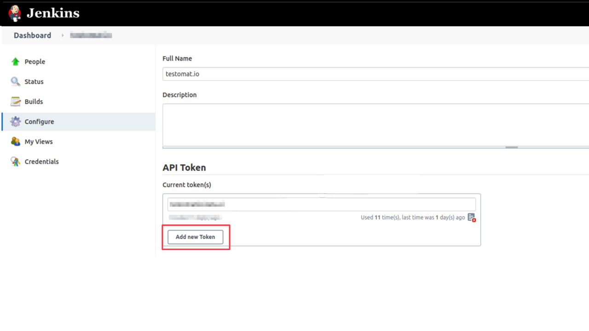
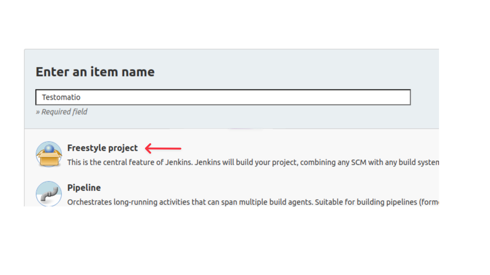
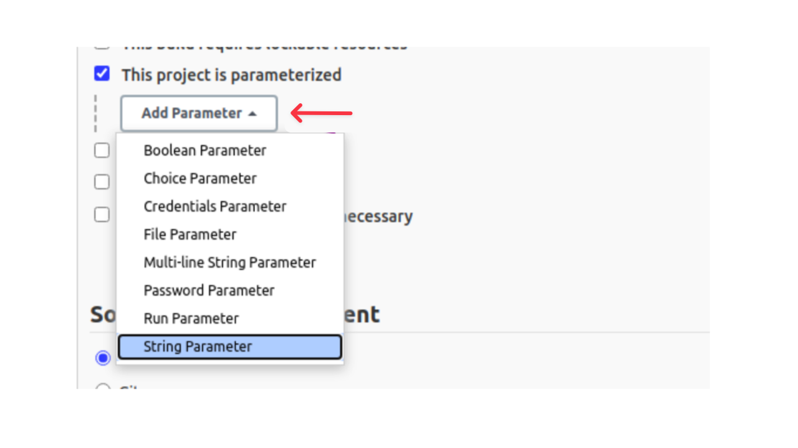
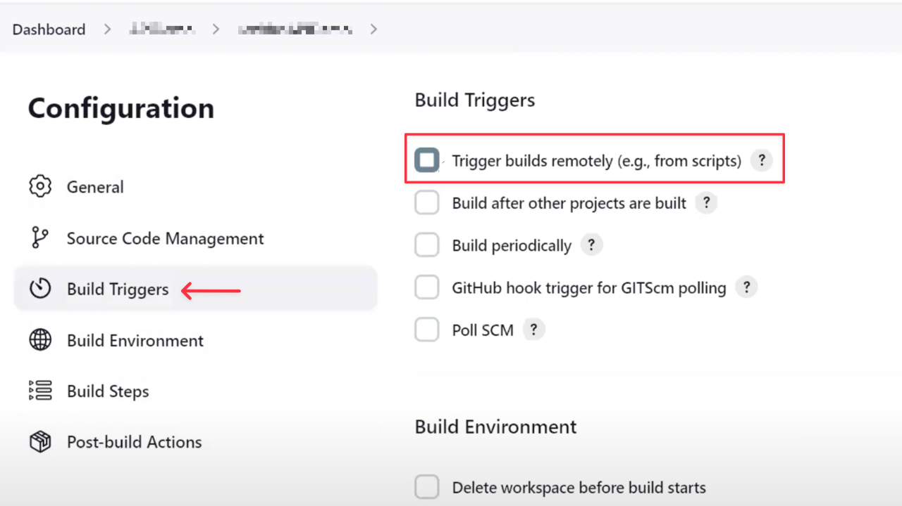
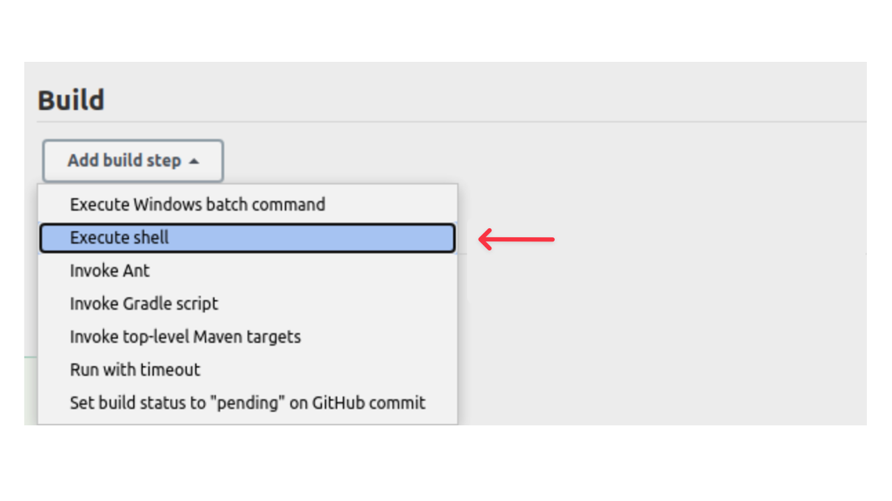
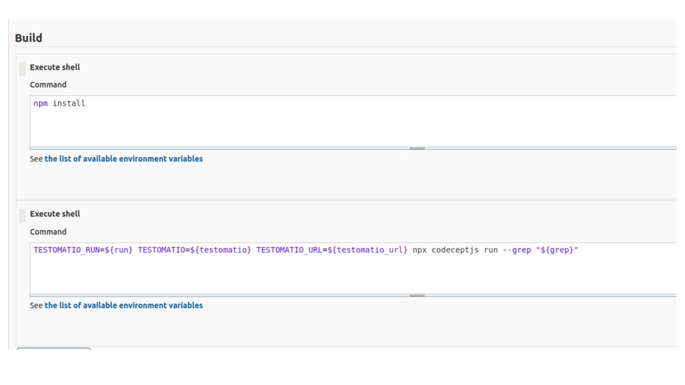
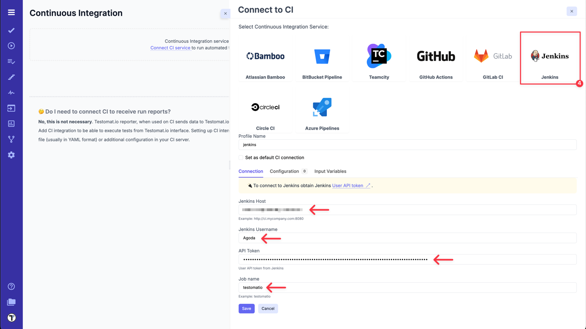
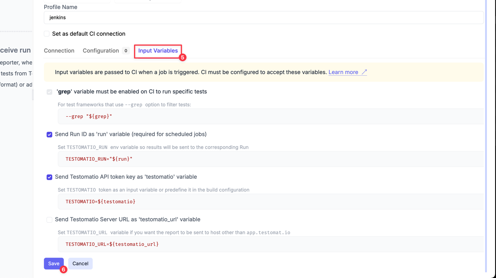

To connect Jenkins to Testomat.io you will need a user and an API Token created on Jenkins.
API token can be added on **'Configure'** page of the current user:



Then, follow the instructions added below:

1. Create a new Jenkins job. Select **'Freestyle project'**.



:::note

It is recommended to avoid spaces in Job Name to prevent issues with connecting to this job via URL.

:::

2. Make this build parametrized



3. Add the following parameters as a string with empty default values:

- `run`
- `testomatio`
- `grep`

:::note

If you use on-premise Testomat.io setup you will also need to add `testomatio_url` parameter.

:::

4. Go to **'Build Triggers'** and select **'Trigger build remotely'**.



5. Proceed with configuring the Job and set all required parameters like SCM and build steps.



Within a step pass in configured parameters as environment variables into the test runner. Let's take CodeceptJS command as an example:

```
TESTOMATIO_RUN=${run} TESTOMATIO=${testomatio} npx codeceptjs run --grep "${grep}"
```

:::note

Prepend `TESTOMATIO_URL=${testomatio_url}` if you use on-premise version

:::



6. Save the build.

After Jenkins is set up, go to Testomat.io and create a new **CI connection** inside your project: 

1. Go to **Settings**.
2. Select **Continuous Integration**.
3. Click **'Connect to CI'**.


4. Select **'Jenkins'** and fill in all required fields:

- `Jenkins Hostname` - URL of Jenkins host.
- `Username` - a user on Jenkins which will trigger builds.
- `API Token` - a token we created previously in the user's settings.
- `Job Name` - the name of a job we just created.



5. Switch to **'Input variables'** tab and enable variables that was configured for parametrized builds

:::note

Don't forget to select `testomatio_url` if you use on-premise version.

:::

6. Click **'Save'** button and check the connection.



Now you can run a test or a group of tests via Jenkins CI. 
For a custom configuration read about [Environment Variables](./index.md#environment-configuration)