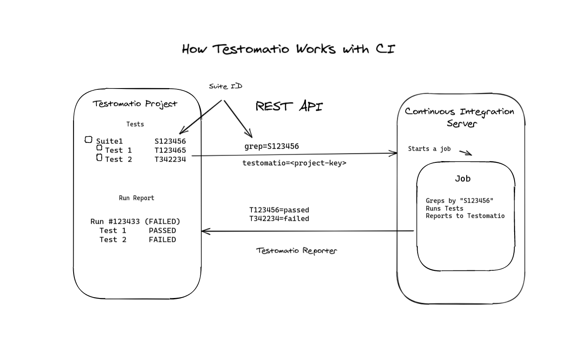
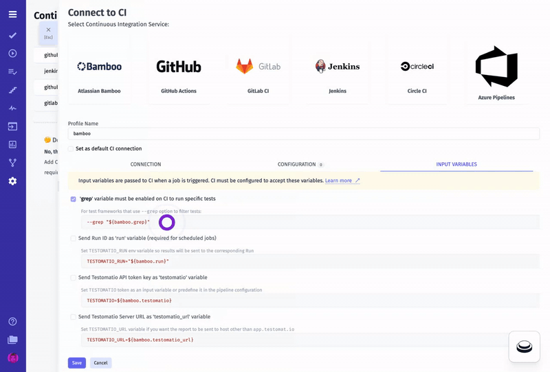
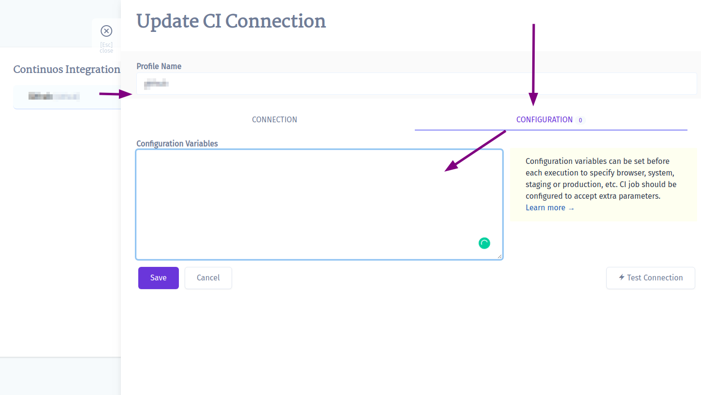
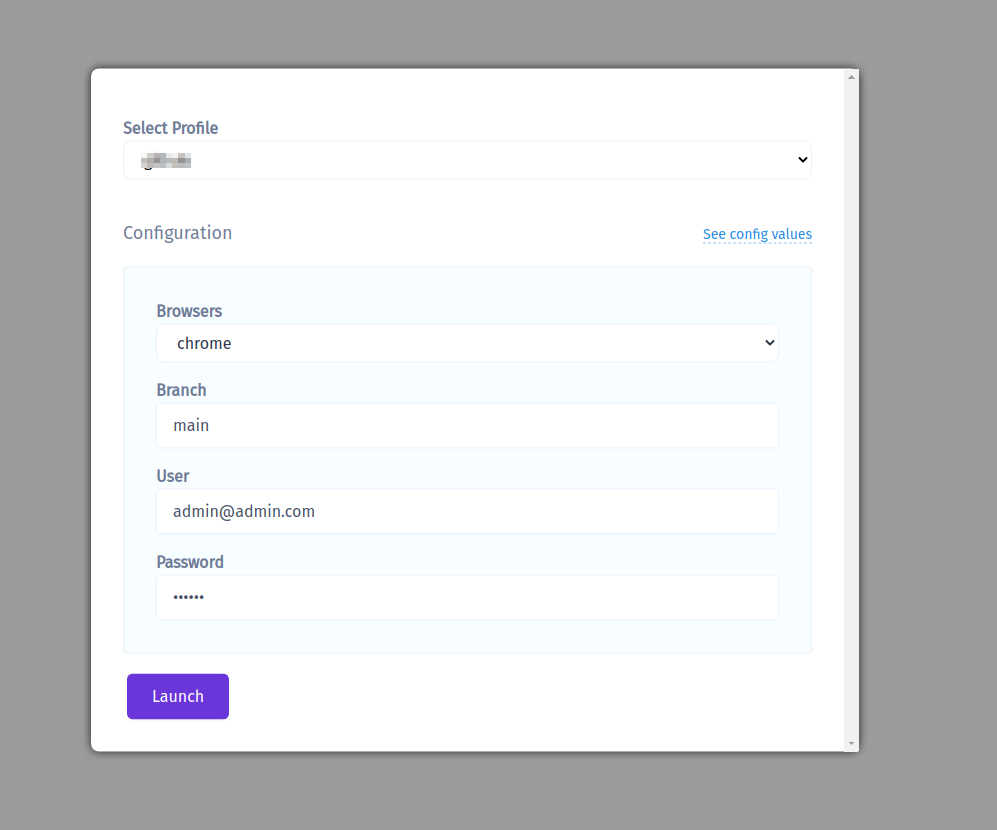

Testomatio allows executing tests on CI from its interface.
A single test, suite, test plan, or all tests can be executed automatically on CI.

Currently following CI systems supported:

* [Jenkins](https://docs.testomat.io/integrations/continuous-integration/jenkins)
* [Atlassian Bamboo](https://docs.testomat.io/integrations/continuous-integration/bamboo)
* [GitHub Actions](https://docs.testomat.io/integrations/continuous-integration/github)
* [GitLab CI](https://docs.testomat.io/integrations/continuous-integration/gitlab)
* [Azure Pipelines](https://docs.testomat.io/integrations/continuous-integration/azure)
* [Circle CI](https://docs.testomat.io/integrations/continuous-integration/circle)
* [BitBucket Pipelines](https://docs.testomat.io/integrations/continuous-integration/bitbucket)
* [Teamcity](https://docs.testomat.io/integrations/continuous-integration/teamcity)

Testomatio uses REST API to trigger jobs on external CI systems. IDs of tests or suites can be passed to the job so only a specific test or suite will be executed. The test runner greps all tests by their IDs and executes a subset of tests. Then a report is sent back to Testomatio via reporter.



Connecting CI server to Testomatio consist of the following steps:

1. Create Testomatio Project
2. Import automated tests into that project from a repository
3. [Assign Ids](#assigning-ids) for imported tests source code
4. Create a new job in CI according to instructions on this page
5. Connect CI server to Testomatio
6. Run your tests or suites to get reports!

## Configuring CI

CI configuration has 3 steps:

* establishing a connection with CI
* setting up required input variables
* setting up custom configuration variables

Follow the guide for a corresponding CI to set it up.

### Input Variables

While connection settings can be different across CI settings, the list of input variables is the same.



For example, Testomatio sends `grep` variable to CI to identify which tests should be executed. It may pass other input variables
which can be used on CI to improve reporting.

Here is how `run` input variable can be accessed on different CIs:

* Atlassian Bamboo: `${bamboo.run}`
* GitHub Actions: `${github.event.inputs.run}`

Here is the list of preconfigured input variables:

* `run` - passes Run ID to CI. If this option is toggled on, when a run is created in Testomatio it is instantly added to the list of runs marked as "Scheduled". On CI `run` variable must be passed as `TESTOMATIO_RUN` environment variable to a reporter. This allows mapping a scheduled run to the run which is currently processed. **If `TESTOMATIO_RUN` is not set, a duplicate run will be created**.
* `testomatio` - passes project access key to CI. This input variable must be passed as `TESTOMATIO` environment variable to match the Testomatio project. Toggle on this option if you prefer not to hardcode Testomatio Project ID in CI configuration but to obtain this value on launch. This may be useful if you have a different Testomatio project configured for on CI run.
* `testomatio_url` - when working on a self-hosted Testomatio instance, this variable can be used to pass Testomatio endpoint to CI system. Pass `testomatio_url` environment variable to `TESTOMATIO_URL`

### Environment Configuration

Sometimes extra configuration is required for CI job. For instance, extra configuration variables can be used to specify:

* browser
* target branch
* staging/production environments

Testomatio allows to predefine configuration variables and adjust them for each run. Config variables can be set in "Configuration" tab on CI connection settings.



Config variables should be put per line with the default value passed in with `=`. The format is similar to `.env` file format:

```
browsers=chrome,firefox,safari
branch=main
user=admin@admin.com
password=123456
```

> To set a variable without a default value just pass it as on a line without `=`

Those variables will be available for a reconfiguration on each CI Run executed from Testomatio.
If a variable value contains comma `,` like in example above: `chrome,firefox,safari`, these values will be displayed with the select box. Otherwise, a simple input will be shown:



These variables will be passed to CI in the same manner as `grep` parameter. So, CI job should be prepared to handle these config variables. For instance, if GitHub Actions are used, values are passed as `inputs` and can be used like this:

```yaml
    - run: npx codeceptjs run --grep "${{ github.event.inputs.grep }}" --profile "${{ github.event.inputs.branch }}"
      env:
        TESTOMATIO: "${{ github.event.inputs.testomatio }}" # passed from Testomatio by default
        BROWSER: "${{ github.event.inputs.browser }}"
        TEST_USER: "${{ github.event.inputs.user }}"
        TEST_PASSWORD: "${{ github.event.inputs.password }}"
```

### Assigning IDs

To execute a specific test or a suite a test runner should have a way to find a test by its unique name. For this reason, Testomatio IDs can be used. If tests in the source code will have Testomatio IDs it will be very simple to filter tests. We provide a semi-automatic way to assign Testomatio IDs to tests in source code.

For JavaScript frameworks use the same `check-tests` command you used for importing tests with `--update-ids`. The tests must be already imported in Testomatio:

```
TESTOMATIO={apiKey} npx check-tests <framework> <pattern> --update-ids
```

For Cucumber tests use `check-cucumber` command with the similar `--update-ids` command. The command should be the same as for importing plus `--update-ids` option:

```
TESTOMATIO={apiKey} npx check-cucumber <pattern> --update-ids
```

This command will update your source code. Please check the changes before committing it.
If the Testomatio IDs were placed correctly you can commit your changes to repository.

From now on, Testomatio can use Test IDs to run exact tests and suites on Continuous Integration servers.