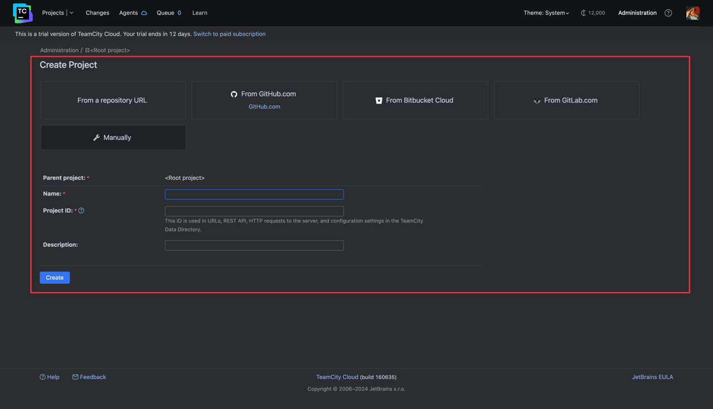
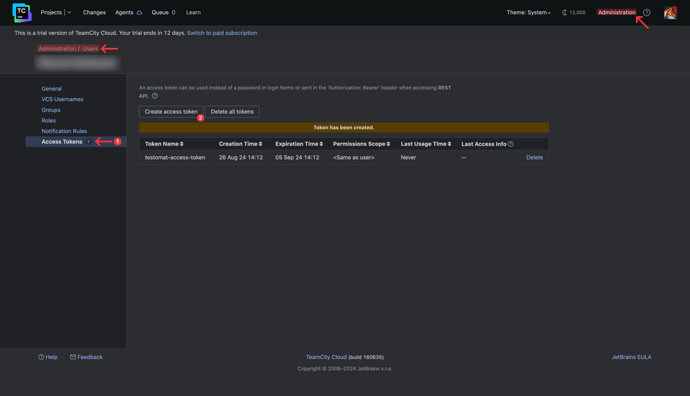
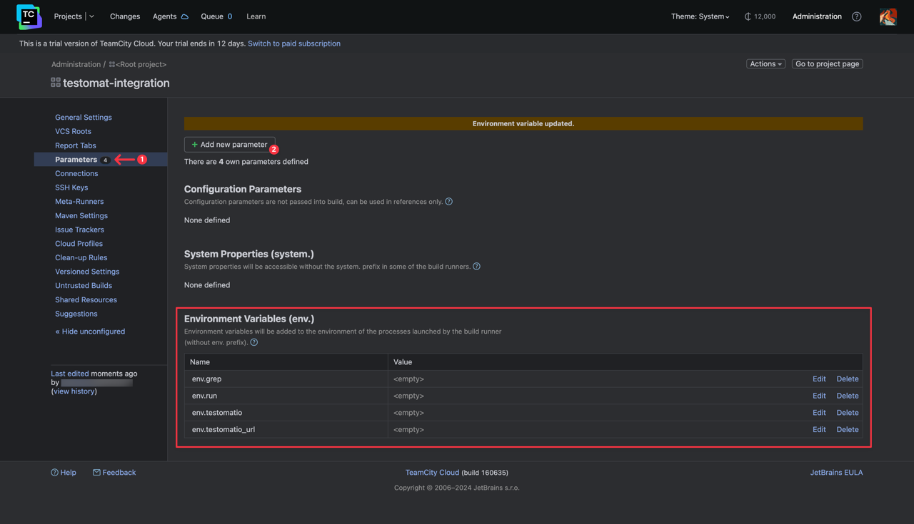
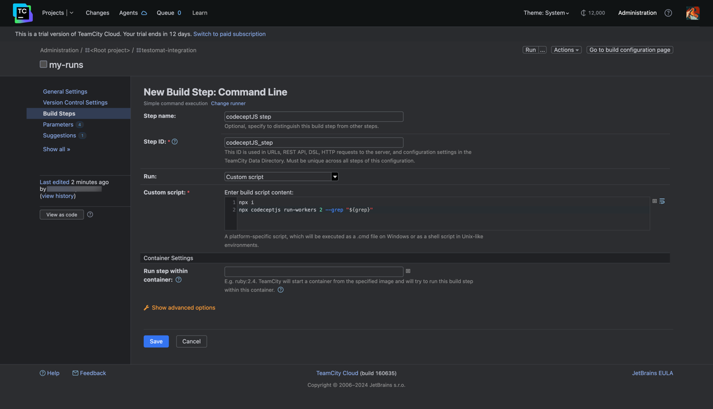
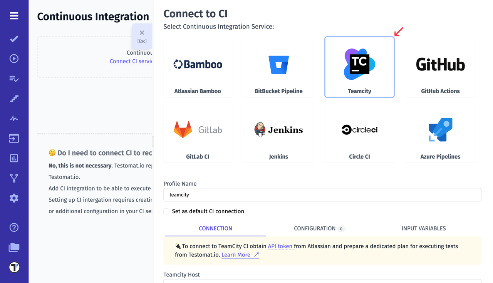

Let's create a new project in your Teamcity workspace:

On the same page Create Build Configuration.

_Build configurations define how to retrieve and build sources of a project._

Create a Access Key for the user:

Setup variables:

Add a new Build Step: Command Line.

Connect a Teamcity in Testomatio:

