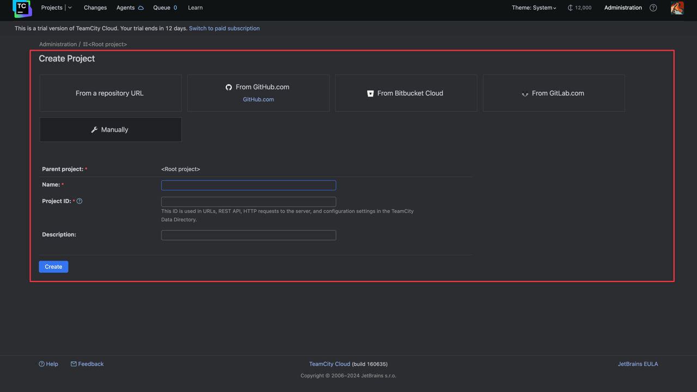
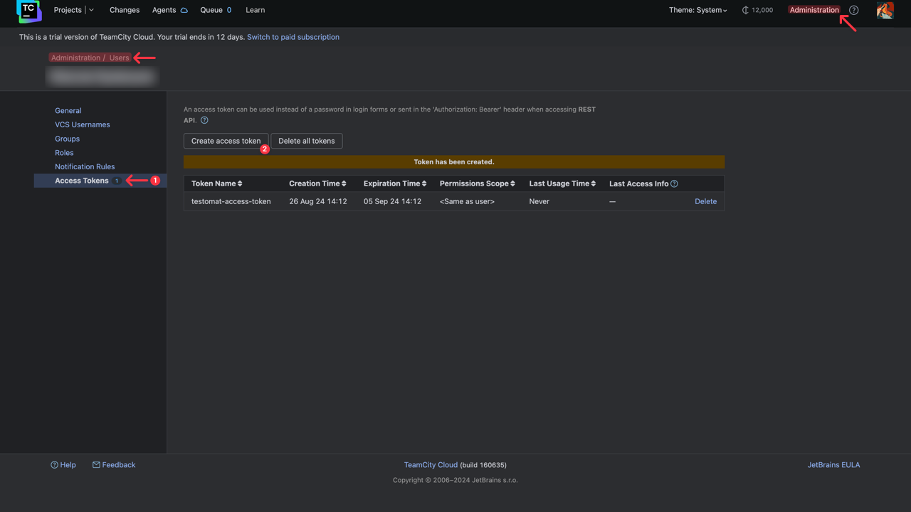
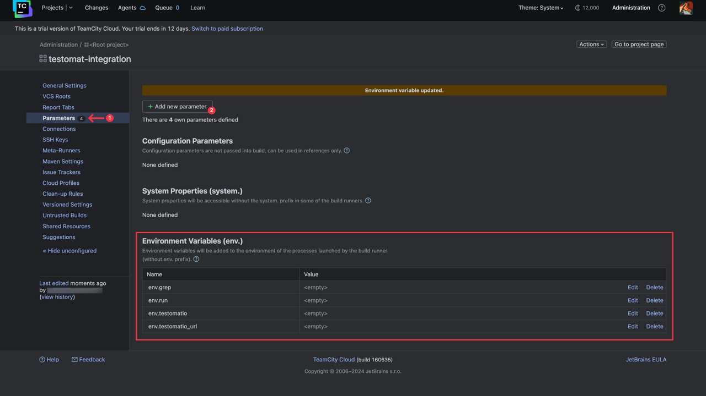
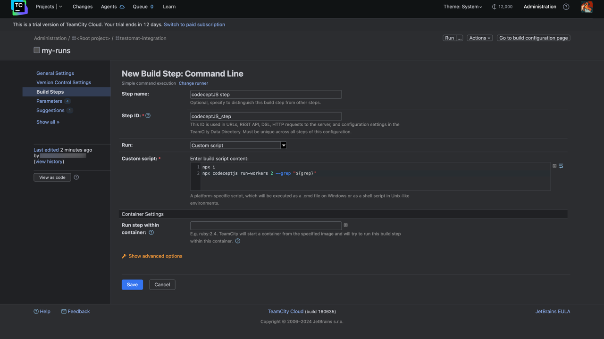
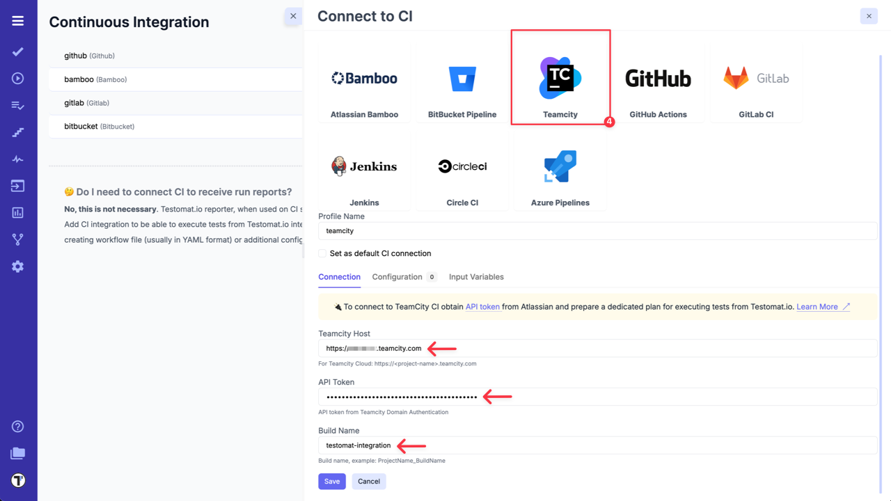
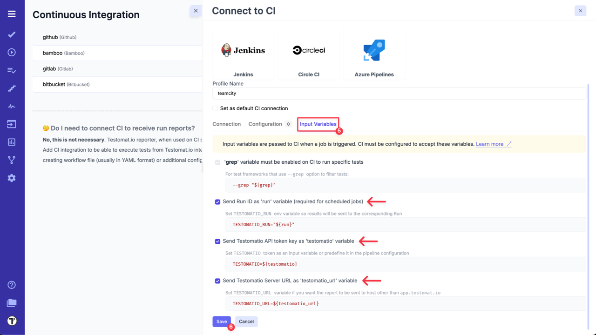
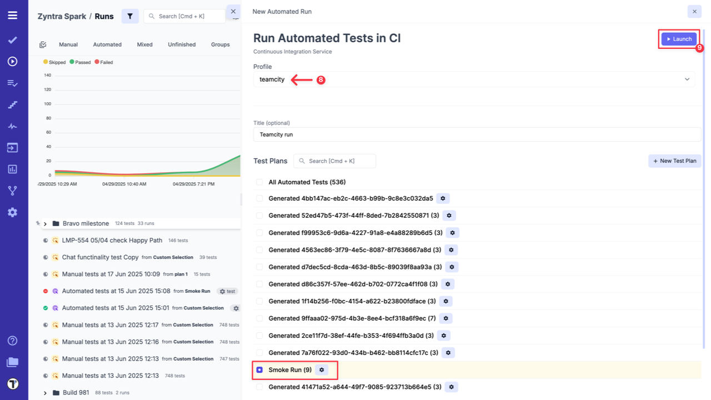
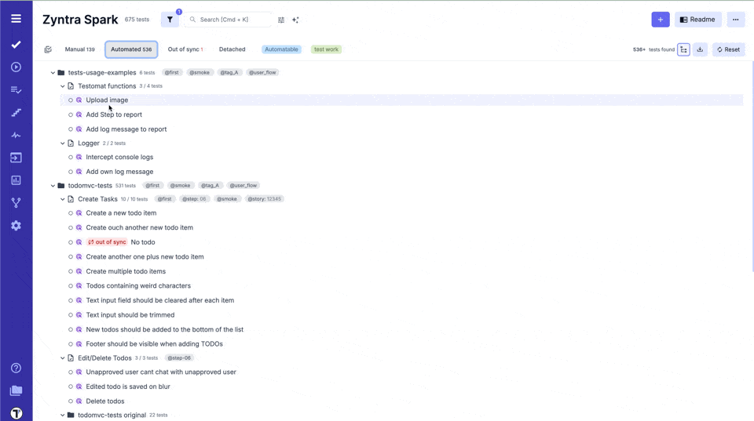
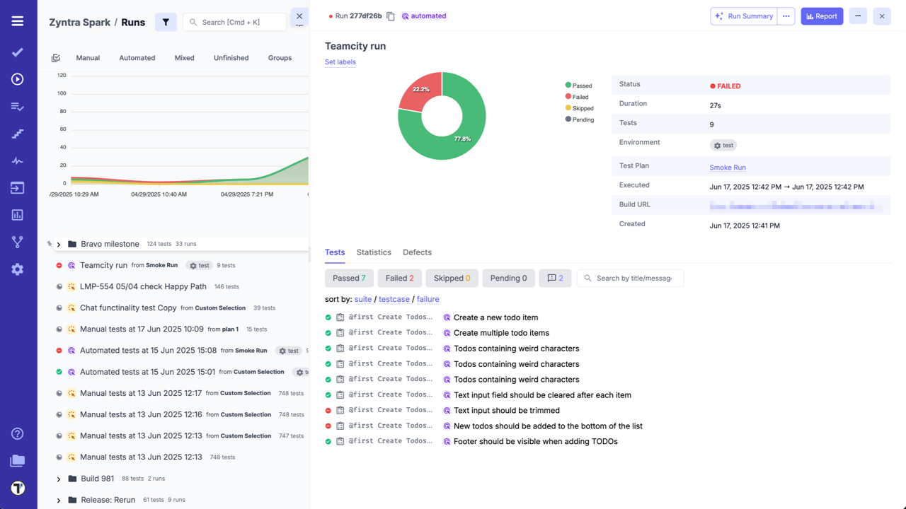

Before configuring the TeamCity and Testomat.io integration, create a new project in your TeamCity workspace:



On the same page Create Build Configuration.

**Build configurations define how to retrieve and build sources of a project.**

Create a Access Token for the user:



Open **'Parameters'** and setup new environment variables with empty default values:

- ```run```
- ```testomatio```
- ```grep```
- ```testomatio_url```



Add a new Build Step: Command Line.

Script should include a step where the test runner is executed with `—grep` option and `TESTOMATIO` environment variables passed in.

For instance: ```- npx codeceptjs run-workers 2 --grep "${grep}"```



Save the build and switch to Testomat.io. To integrate TeamCity with your Testomat.io project follow the steps described below:

1. Go to **'Settings'**.
2. Select **'Continuous Integration'**.
3. Click **'Connect to CI'**.


4. Select **'TeamCity'** and enter following details on the **'Connection'** tab:

- `Teamcity Host`.
- `API token` - API token from TeamCity Domain Authentication.
- `Build Name`.



5. Switch to **'Input Variables'** tab and select checkboxes:

- Send Run ID as `run` input (required for scheduled jobs).
- Send Testomat.io API key as `testomatio` input.
- Send Testomat.io Server URL as `testomatio_url` input (if you use on-premise setup).

:::note

You can set and pass more input variables if you set them in [Environment Configuration](./index.md#environment-configuration). For example: test environment, browser, branch, etc.

:::

6. Click on **'Save'** button to save the connection.



7a. When the connection is saved, open **'Runs'** page and select `Run Automated Tests in CI` option in extra menu.


8a. Select **'TeamCity'** profile in a list, select a target ref or any other variables, if any were configured. Optionally, select a **Test Plan** or create a new one.

9a. Click on **'Launch'** button and wait for the results.



OR

7b. On **'Tests'** page select any automated suite or test case -> click **'Extra menu'** button -> select **'Run Tests'** option -> open **'Run in CI'** tab.

8b. Select **'TeamCity'** profile in a list, as well, select a target ref or any other variables, if any were configured.

9b. Click on **'Launch'** button and wait for the results.



This will start a new job in TeamCity, please check that the job was successfully triggered and completed. After the job has finished, a run report will be available on Runs page of Testomat.io.

