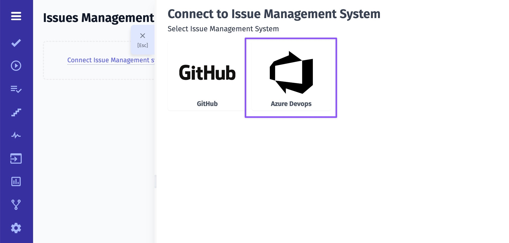
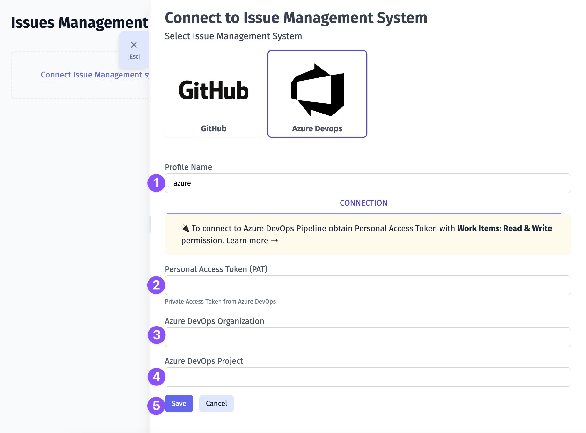
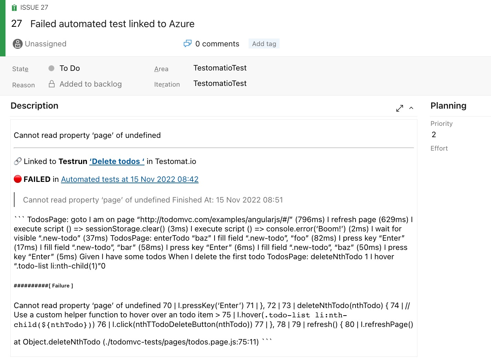

1. Give a name to your profile 
2. Enter your Private Access Token from Azure DevOps ([learn more](https://learn.microsoft.com/en-us/azure/devops/organizations/accounts/use-personal-access-tokens-to-authenticate?view=azure-devops&tabs=Windows))
3. Enter your Azure DevOps Organization name
5. Enter your Azure DevOps Project name
6. Click on Save button

Once your Issues Management System is configured you can link a test or create a defect. As a result, Testomat.io will create a ticket in your Azure DevOps project with dedicated links and data, so you can easily look through the testing data you need. Here is an example:

