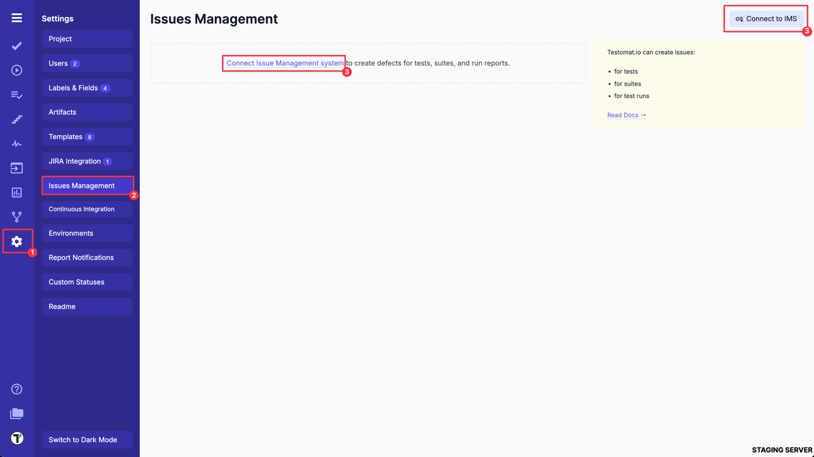
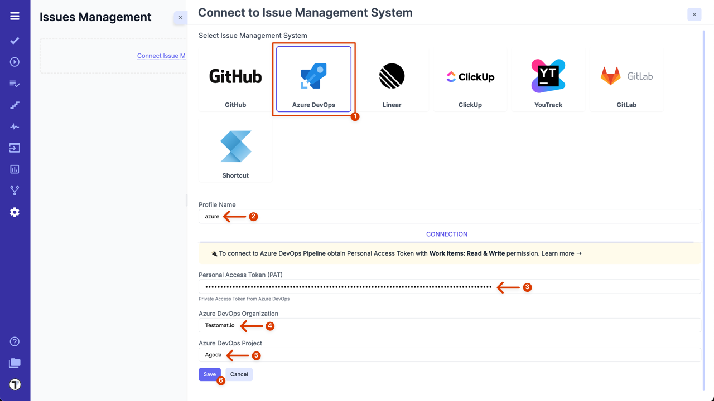
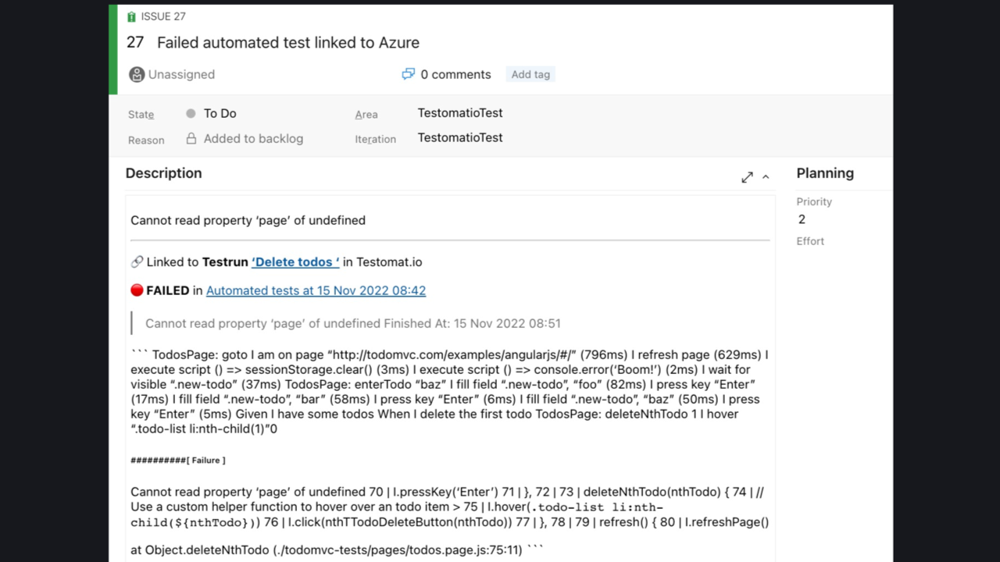

To connect Azure DevOps with Testomat.io you need to open **Settings (1) -> Issues Management (2)** and click on **'Connect to IMS' (3)** button.

When **'Connect to Issue Management System'** page is opened, follow the instructions below:

1. Select **'Azure DevOps'** from the list.
2. Change the **Profile Name** if needed.
3. Enter your **Private Access Token** from Azure DevOps ([learn more about how to create a PAT](https://learn.microsoft.com/en-us/azure/devops/organizations/accounts/use-personal-access-tokens-to-authenticate?view=azure-devops&tabs=Windows)).
4. Enter your **Azure DevOps Organization** name.
5. Enter your **Azure DevOps Project** name.
6. Click **'Save'** button.

Once your Issues Management System is configured you can link a test case or create a defect. As a result, Testomat.io will create a ticket in your Azure DevOps project with dedicated links and data, so you can easily look through the testing data you need. Here is an example:

