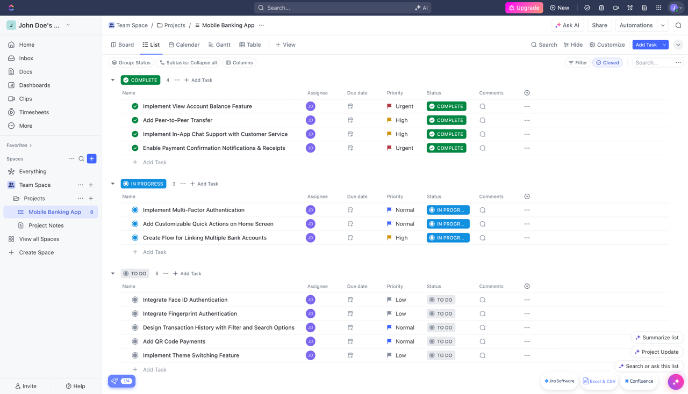
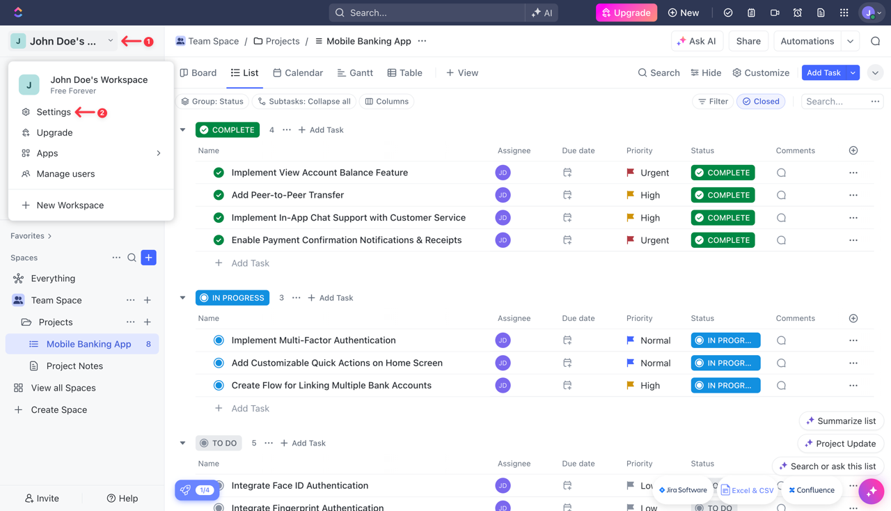
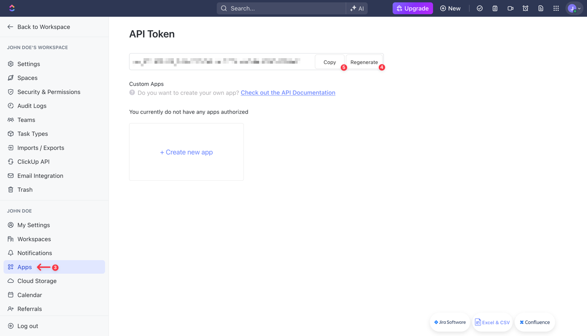
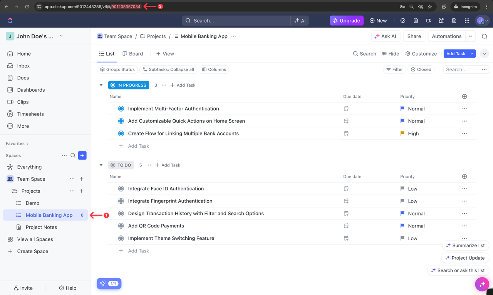
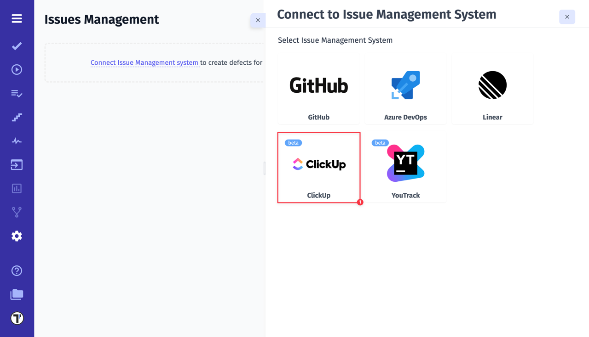
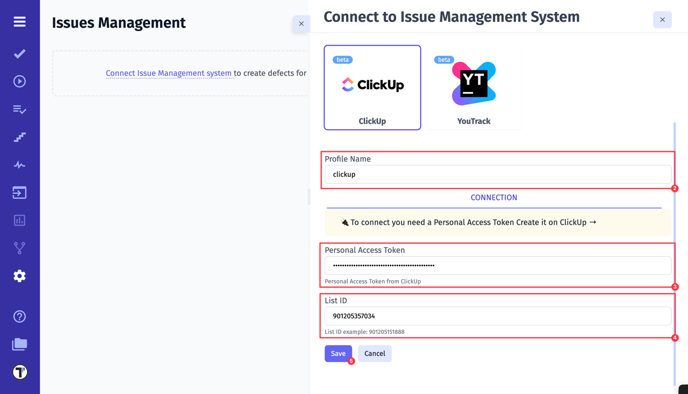
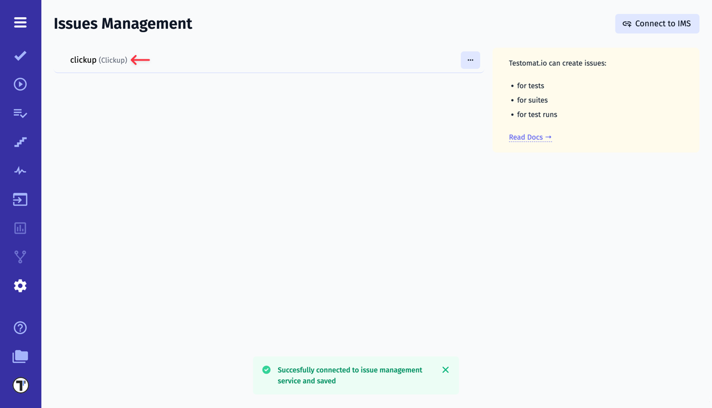

If you already have a workspace set up and configured in **ClickUp**, we can proceed with integrating it with Testomat.io. All you need is a **Personal Access Token** and a **List ID**. We’ll guide you step-by-step on how to retrieve this information and use it to connect with Testomat.io.

1. Click on **Workspace name** in the top-left corner
2. Then click on **Settings**

3. Go to **Apps**
4. Click on **Generate** button to create **API Token**
5. Copy your API Token

Keep your API Token secure, as you’ll need it for the integration with Testomat.io.

Next, we need to find the **List ID**. In ClickUp, the List ID is a unique identifier assigned to each list within a folder in a workspace. You can find the List ID **in the URL when viewing a specific list** on the ClickUp website.

After collecting all necessary data, we can move on to Testomat.io. 

1. Select ClickUp from the list of available Issue Management Systems.

2. Enter a **Profile Name**
3. Paste ClickUp **API Token**
4. Paste ClickUp **List ID**
5. Click on **Save** button

If everything was done correctly, you will receive a confirmation message indicating that the ClickUp profile was successfully created.

