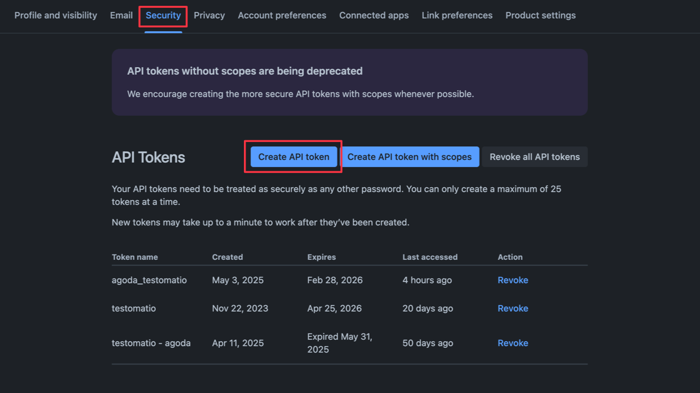
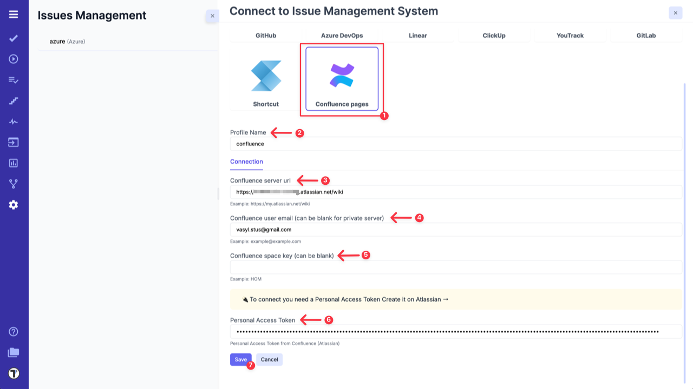

Testomat.io allows you to link your Confluence space to a Testomat.io project and use it as a source of requirements.

To connect your **Confluence space** with Testomat.io you need to open **Settings (1) -> Issues Management (2)** and click on **'Connect to IMS' (3)** button.

When **'Connect to Issue Management System'** page is opened, follow the instructions below:

1. Select **'Confluence pages'** from the list.
2. Change the **Profile Name** if needed.
3. Enter your **'Confluence server url'**.
4. Enter your **Confluence user email** (can be blank for private server).
5. Enter your **Confluence space key** (can be blank).
6. Enter your **Private Access Token** from Atlassian ([learn more about how to create a PAT](https://support.atlassian.com/atlassian-account/docs/manage-api-tokens-for-your-atlassian-account/#Create-an-API-token)).

7. Click **'Save'** button.

Once the connection between Confluence space and Testomat.io project is set up, the system can analyze your Confluence pages to extract requirement descriptions, assess traceability, identify edge cases, and generate relevant test suites and test cases.