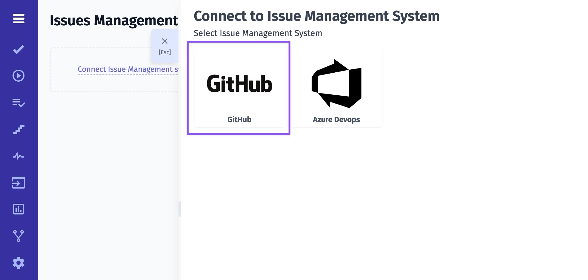
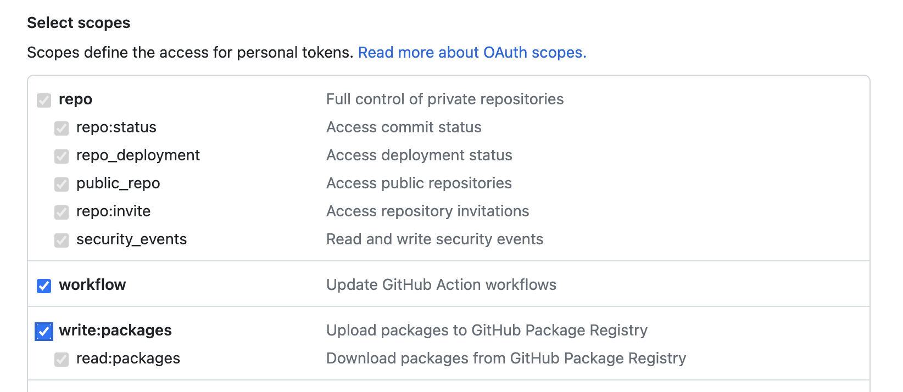
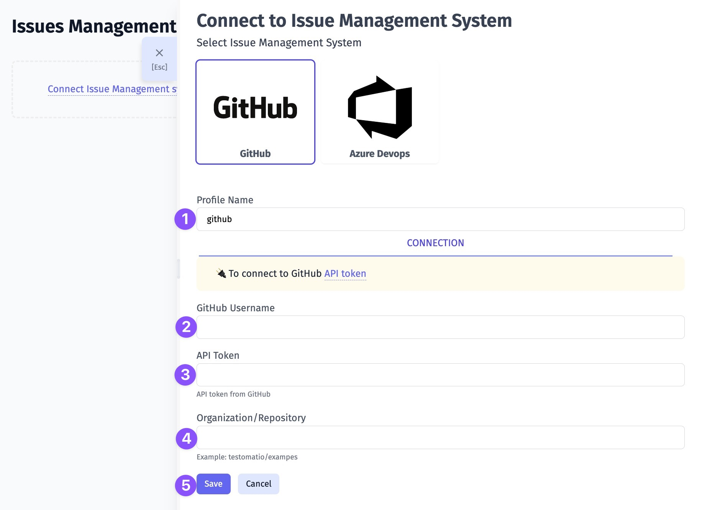
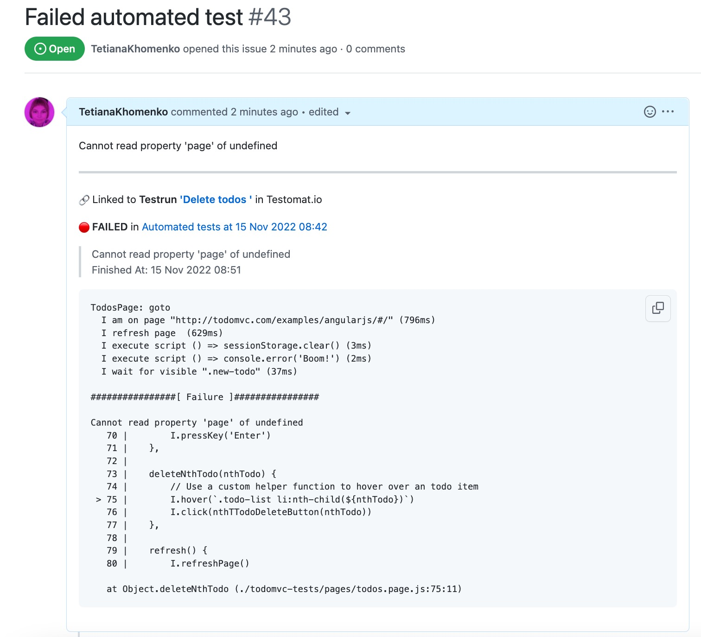

1. Give a name to your profile 
4. Enter your GitHub Username
8. Enter your GitHub API Token with access to workflow scope and write permissions ([learn more](https://docs.github.com/en/authentication/keeping-your-account-and-data-secure/creating-a-personal-access-token))

10. Enter your GitHub Organization/Repository
11. Click on Save button

Once your Issues Management System is configured you can link a test or create a defect. As a result, Testomat.io will create a ticket in your GitHub project with dedicated links and data, so you can easily look through the testing data you need. Here is an example:

