If you already have a **Group** and **Project** set up and configured in **GitLab**, we can proceed with integrating it with Testomat.io. All you need is a **Group Name**, **Project ID**  and a **Project Access Token**. We’ll guide you step-by-step on how to retrieve this information and use it to connect with Testomat.io.

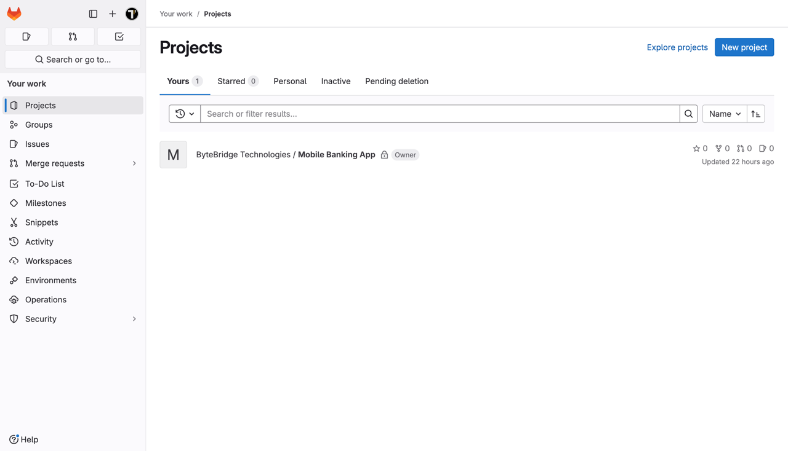

To get the **Group Name**: 

1. Go to the **Groups** section 
2. Select the group in which your project is located

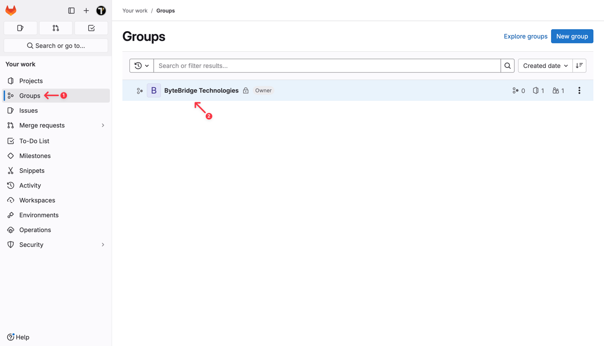

3. The **Group Name** you need to integrate with Testomat.io is in the **URL**. Copy and save it

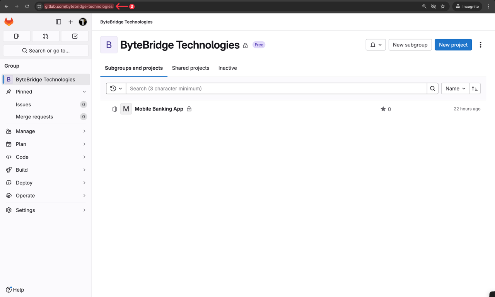

Next, let's find the **Project ID**. 

1. On your project page, go to **Settings** 
2. Select the **General** section

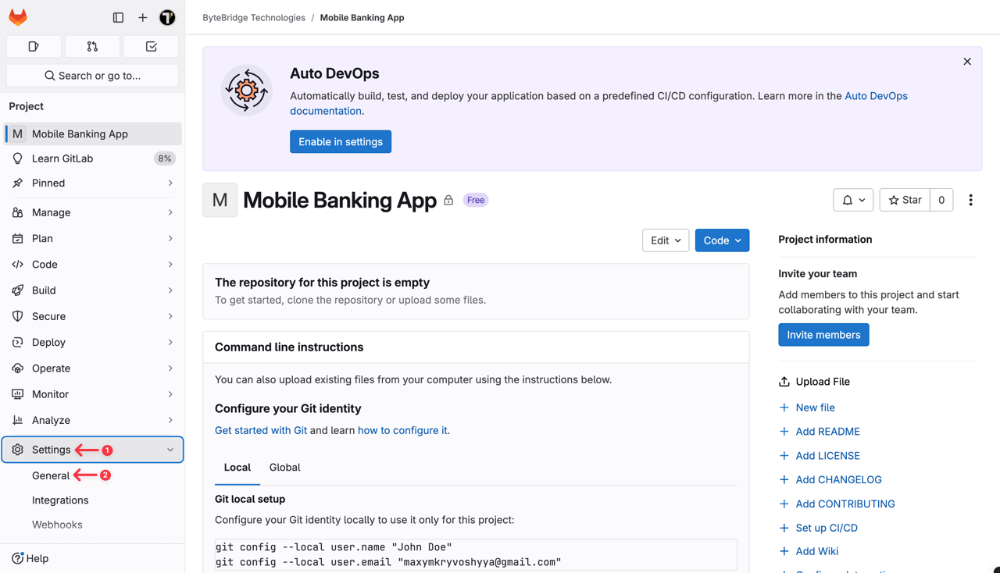

3. You will see your **Project ID** in the corresponding field. Copy and save it.

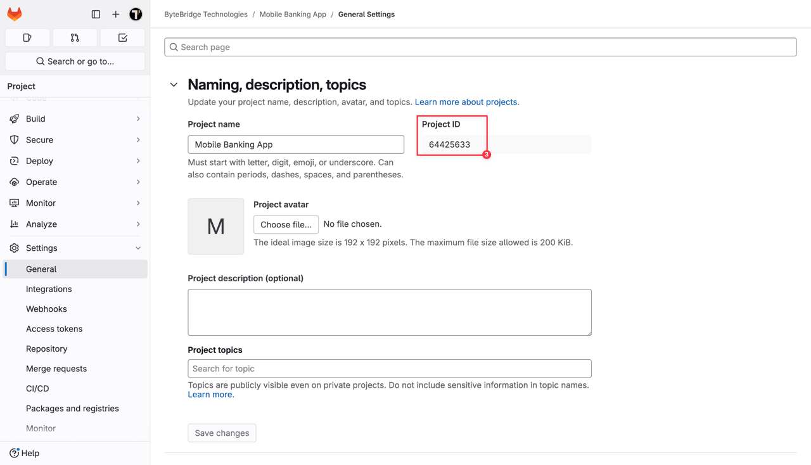

Finally, let's find the last element that we need to integrate with Testomat.io.

To create a **Project Access Token**:

1. Click on the **profile icon** 
2. Go to the **Edit profile** page

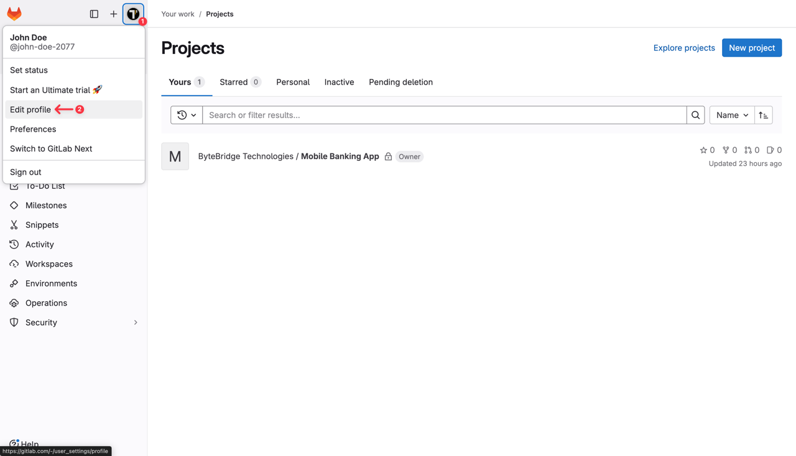

3. Then go to the **Access token** section 
4. Click on the **Add new token** button

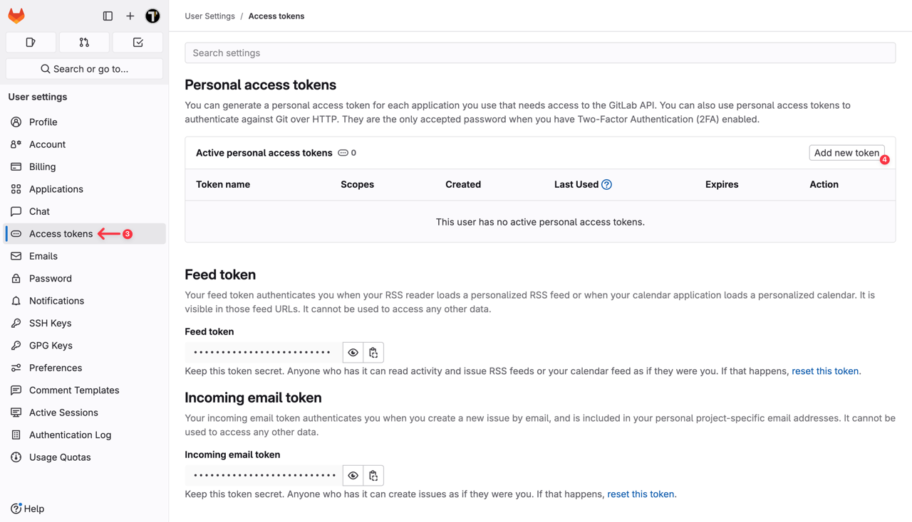

5. Name your token
6. Select the **api** option to give the token the required access level for API operations
7. Click the **Create personal access token** button

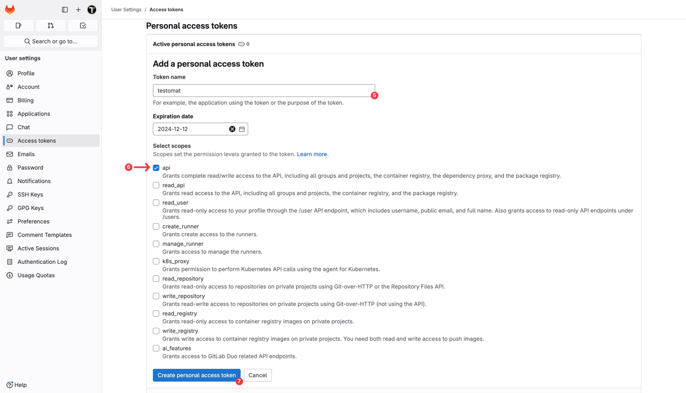

8. Once the token has been created, copy it. 

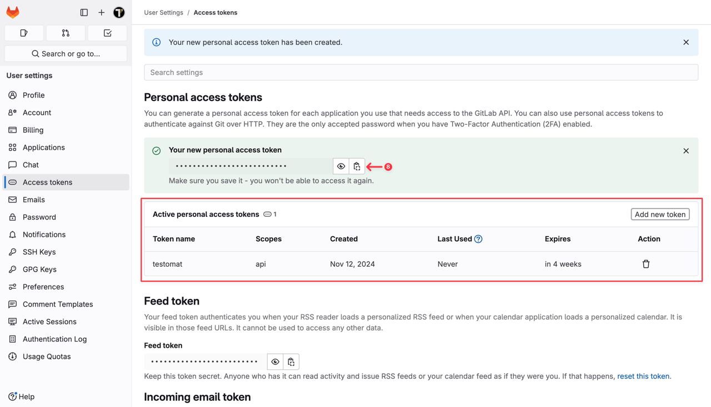

Keep your **Project Access Token** secure, as you’ll need it for the integration with Testomat.io.

After collecting all necessary data, we can move on to Testomat.io. 

1. Select **GitLab** from the list of available Issue Management Systems.

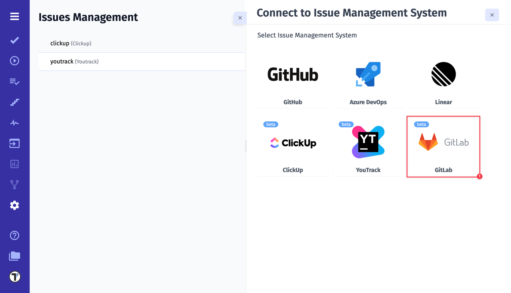

2. Enter a **Profile Name**
3. Paste GitLab **Group Name**
4. Paste GitLab **Project Access Token**
5. Paste GitLab **Project ID**
6. Click on **Save** button

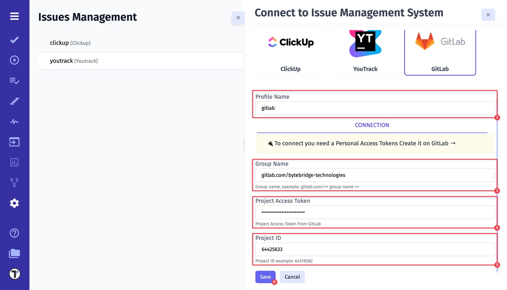

If everything was done correctly, you will receive a confirmation message indicating that the GitLab profile was successfully created.

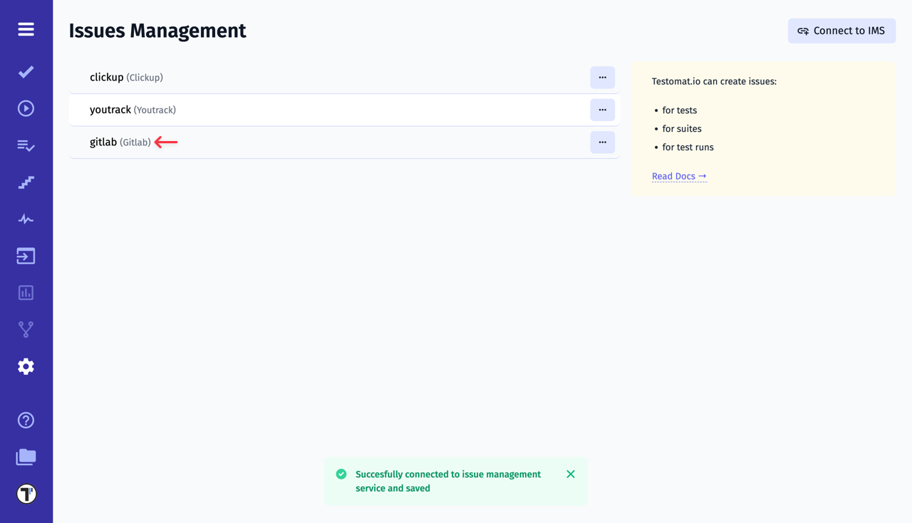