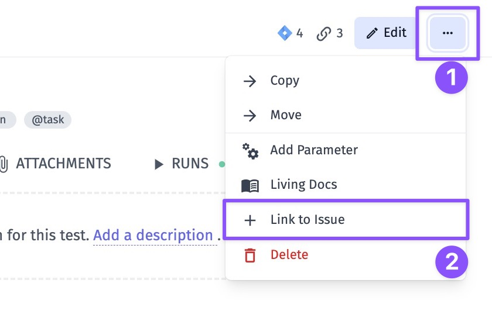
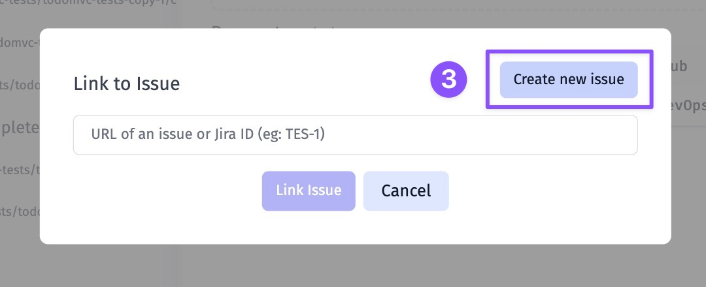
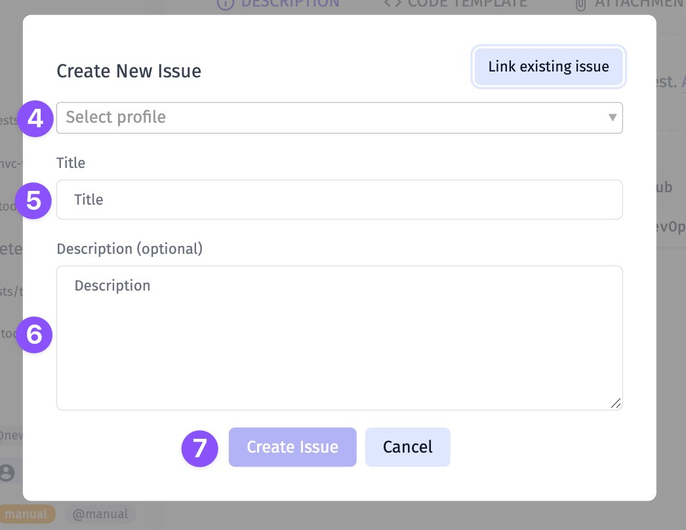
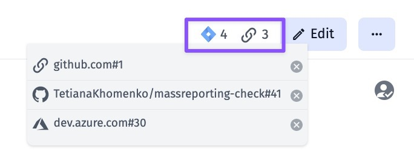
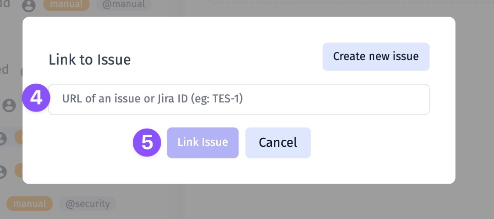
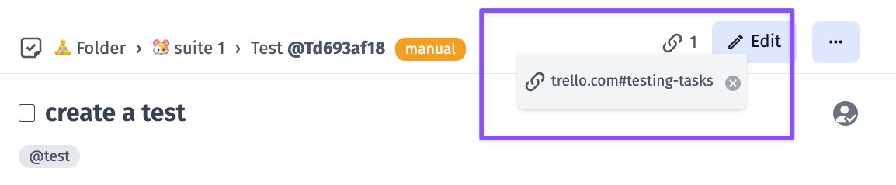
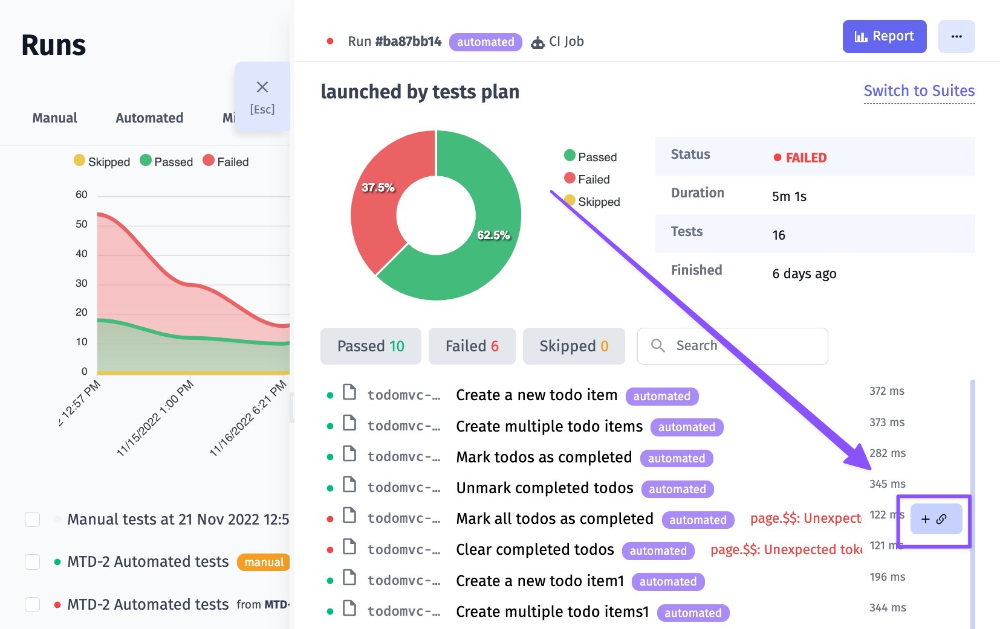
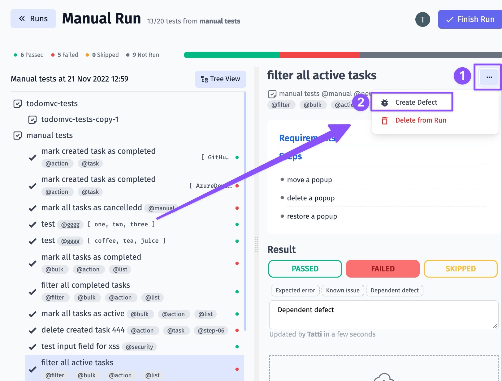

Quality assurance is closely connected to Issue management, which means the process of identifying and addressing any problems that occur over the course of a project. This involves documenting the issues and resolving them through review and consideration of all relevant information. Testomat.io provides Issues Management Systems integration to meet this need and link your testing data to your Issue Management System.

Namely, you can link tests and suites to your tickets (helps to provide tests coverage) and create defects for failed tests from run reports or ongoing manual runs.

Testomat.io provides integration for Issues Management Systems:

- [Jira](https://docs.testomat.io/integrations/issues-management/jira)
- [GitHub Issues](https://docs.testomat.io/integrations/issues-management/github)
- [Azure DevOps](https://docs.testomat.io/integrations/issues-management/azure)
- [Linear](https://docs.testomat.io/integrations/issues-management/linear)
- [ClickUp](https://docs.testomat.io/integrations/issues-management/clickup)
- [YouTrack](https://docs.testomat.io/integrations/issues-management/youtrack)
- [GitLab](https://docs.testomat.io/integrations/issues-management/gitlab)
- [Shortcut](https://docs.testomat.io/integrations/issues-management/shortcut)

See how to connect your Issues Management System and how to link your tests to issues below.

## Connect To IMS

1. Go to Settings
2. Click on the Issues Management Button
3. Click on Connect to IMS button

4. Pick the Issues Management profile 
5. Setup the Issues Management profile
6. Create tickets directly from Testomat.io

## Work With Linking Tests

As was mentioned Testomat.io allows linking Tests, Suites, Run Reports, or Failed Tests from a finished run or ongoing manual run.

1. Click on Extra button
2. Click on Link to Issue button

3. Click on Create new issue button
    Or insert a link for the existing ticket

4. Select Issues Management Systems profile
5. Enter title for your ticket
6. Enter description (optional)
7. Click on Create Issue button

8. See the link appear in UI

## Link Tests Without Connecting To IMS

You can add a link to your Test, Suite, or Run Report without connecting any Issues Management System. This allows binding important data to enrich your testing flow. 

You can do this in a few steps:

1. Open a Test/ Suite/ Run Report
2. Click on Extra button
3. Click on Link to Issue button
4. Enter the link
5. Click on Link Issue button

6. See the link appear in UI

## Create A Defect For Failed Test

There are several ways how to create a defect for failed test:

1. Open Run Report, hover failed test and click on the Link button

2. Create a defect from ongoing manual run

