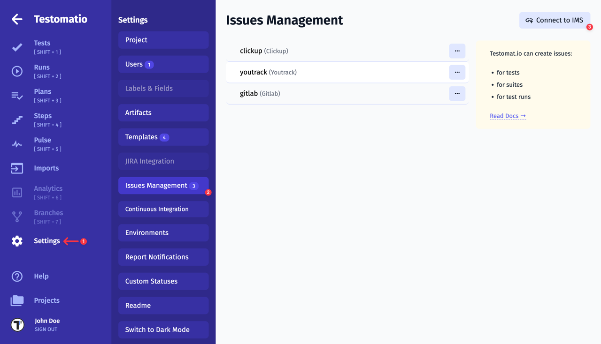
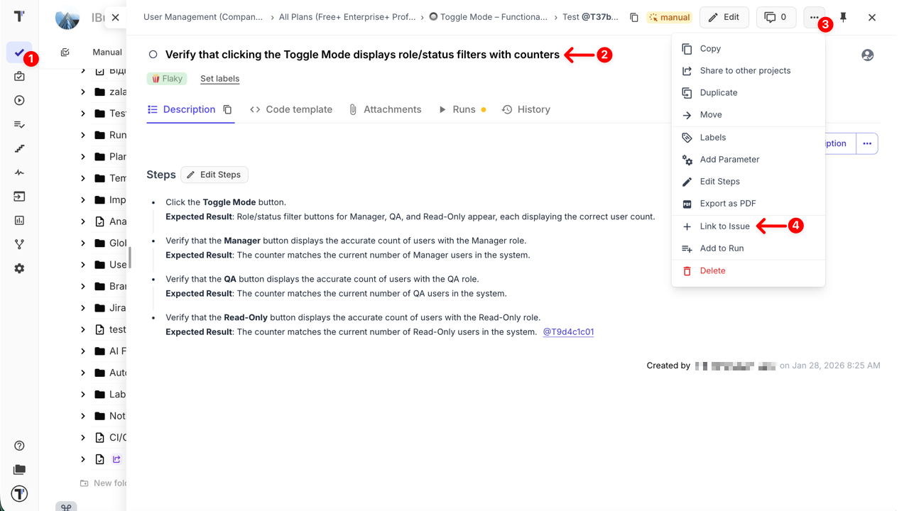
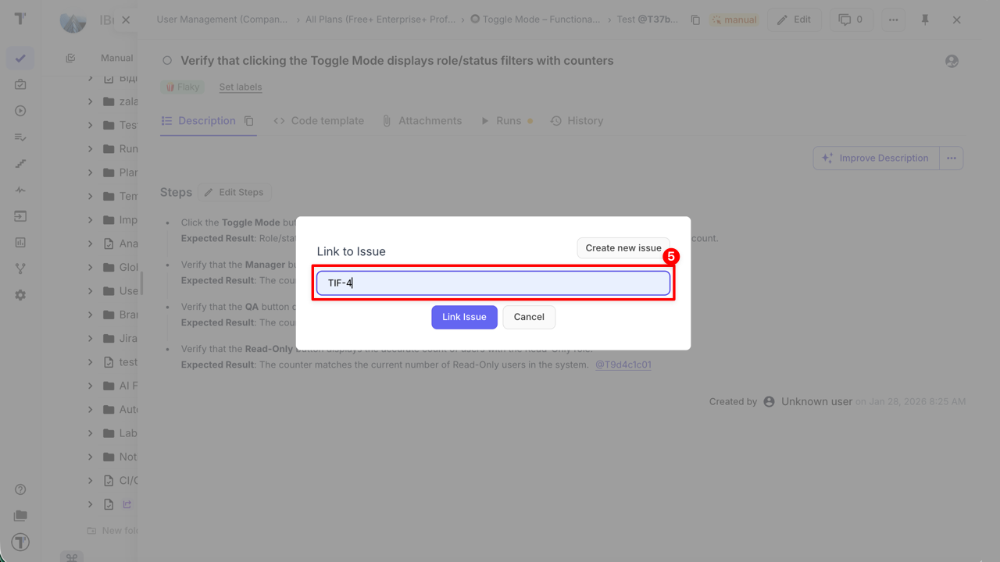
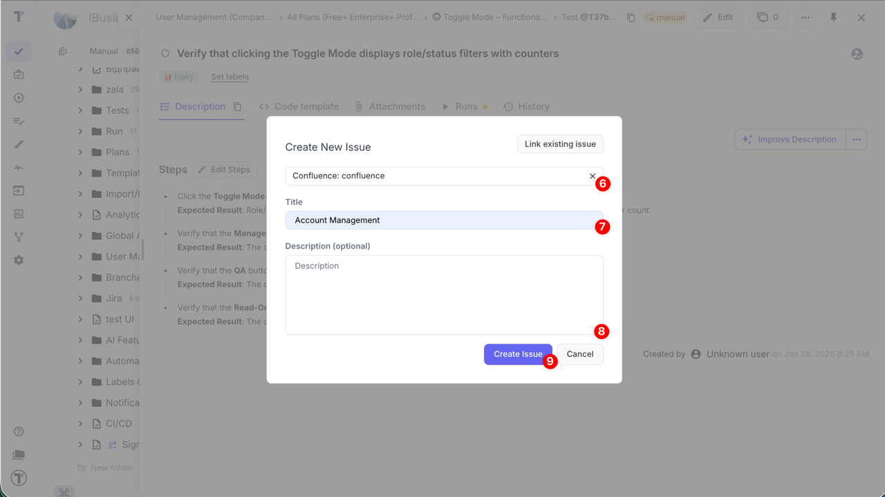
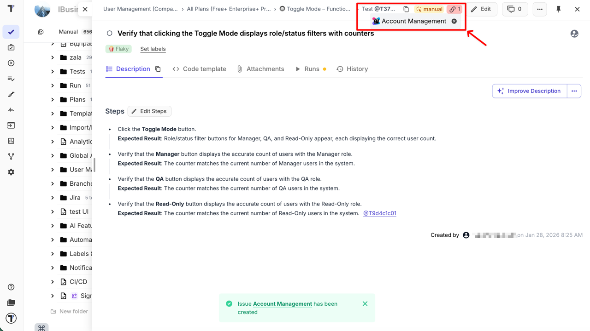
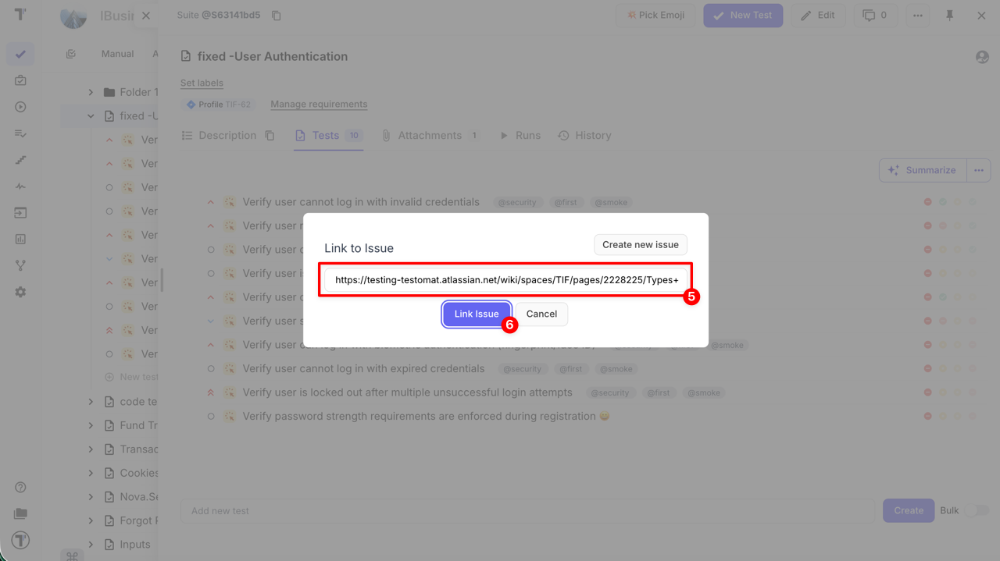
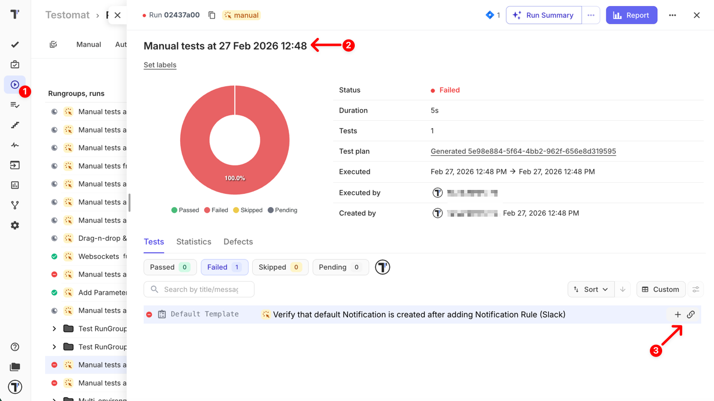
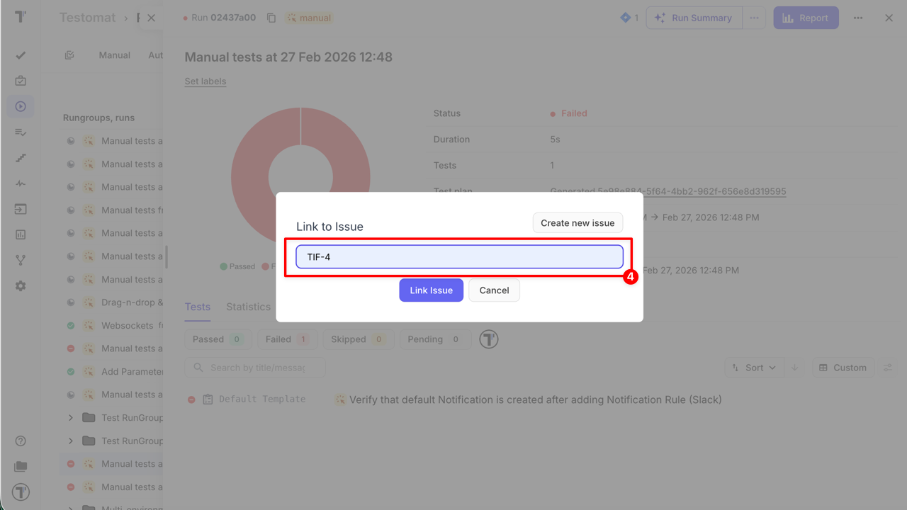
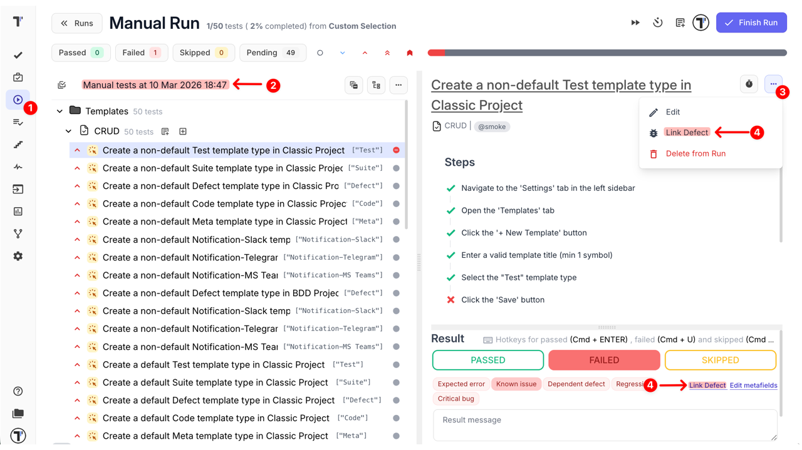
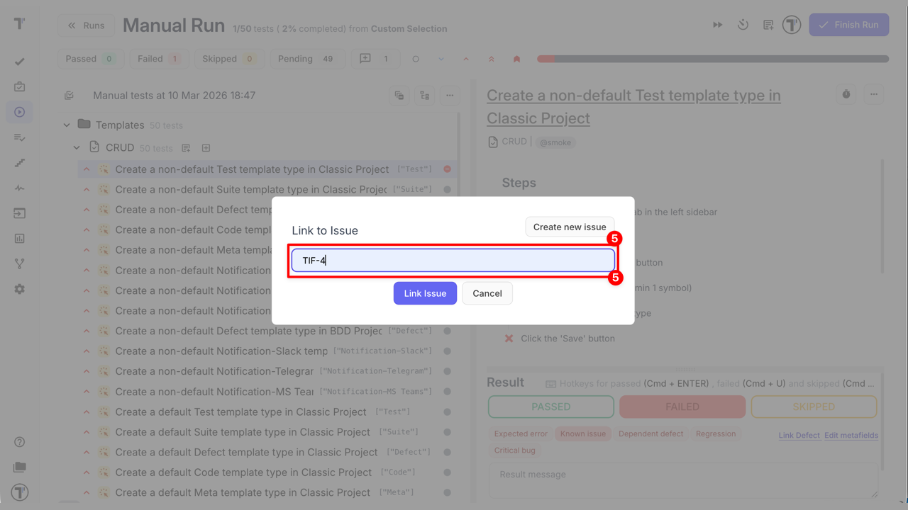

import DirectoryLinks from /src/components/DirectoryLinks.astro;

Quality assurance is closely connected to Issue management, which means the process of identifying and addressing any problems that occur over the course of a project. This involves documenting the issues and resolving them through review and consideration of all relevant information. Testomat.io provides Issues Management Systems integration to meet this need and link your testing data to your Issue Management System.

Namely, you can link tests and suites to your tickets (helps to provide tests coverage) and create defects for failed tests from run reports or ongoing manual runs.

Testomat.io provides integration for Issues Management Systems:

<DirectoryLinks directory="integrations/issues-management" />

See how to connect your Issues Management System and how to link your tests to issues below.

## How to Connect to IMS

1. Go to Settings
2. Click on the Issues Management Button
3. Click on Connect to IMS button

4. Pick the Issues Management profile
5. Set up the Issues Management profile
6. Create tickets directly from Testomat.io

## How to Link Issue to Test with IMS Connection

You can link issues to:

- Tests
- Suites
- Runs
- Failed Test Runs

Linking issues connects testing activities with development work. It helps teams understand why a test exists, what functionality or defect it relates to, and which tests should be executed to validate changes or verify bug fixes.

1. Navigate to the **Tests** page
2. Open any existing test or suite
3. Click the **...** extra menu
4. Select the **Link to Issue**

5. Click the **Create new issue** button

- Or insert a link / Jira ID for the existing ticket (optional)

6. Select the **Issue Management System** profile
7. Enter title for your ticket
8. Enter description (optional)
9. Click the **Create Issue** button

The linked issue will appear in the UI:

## How to Link Issue to Test without Connecting to IMS

You can link external issues to a Test, Suite, Failed Test Runs, or Run Report even without configuring an Issues Management System integration.

This is useful when you want to reference related work — such as bug reports, support tickets, or external tracking tools — while keeping testing context centralized in Testomat.io.

1. Navigate to the **Tests** page
2. Open any existing test or suite
3. Click the **...** extra menu
4. Select the **Link to Issue**

5. Paste the issue URL
6. Click **Link Issue** button

The linked reference will appear in the UI and remain attached to the selected item.

## How to Create Defect For Failed Test

Defects can be created directly from failed tests, ensuring issues are reported while context is still fresh. This improves accuracy and speeds up the feedback loop with developers.

### Method 1 — From a Run Report

1. Navigate to the **Runs** page
2. Open a **Run Report**
3. Hover over the failed test and click the **Link Issue** button

4. Create a new defect or link an existing issue

### Method 2 — From an Ongoing Manual Run

1. Navigate to the **Runs** page
2. Open an ongoing run
3. Click the **...** extra menu
4. Click the **Link Defect** option

5. Create a new defect or link an existing issue

**Why this matters:**

- **Preserves execution context:** All relevant information—steps, environment, screenshots, and logs—is automatically attached to the defect, making it easier for developers to reproduce and fix the issue.
- **Reduces forgotten or duplicate bug reports:** By creating defects directly from failed tests, QA teams avoid missing issues or accidentally reporting the same bug multiple times.
- **Provides immediate traceability:** Links between test failures and IMS issues ensure you can quickly see which tests verify a fix and which features are impacted.
- **Speeds up regression verification:** Developers and QA can quickly re-run linked tests to confirm fixes, improving efficiency in release cycles.
