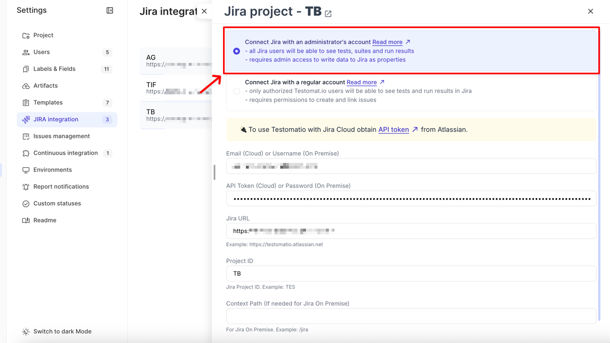
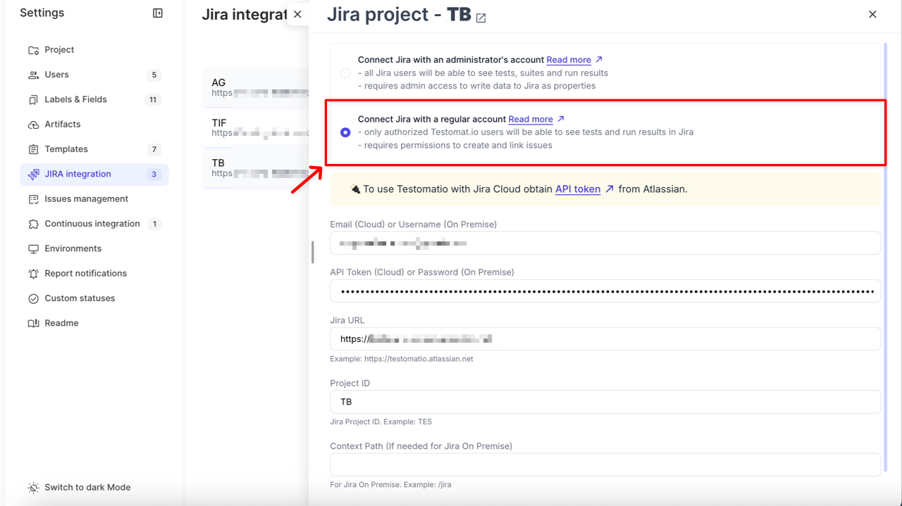
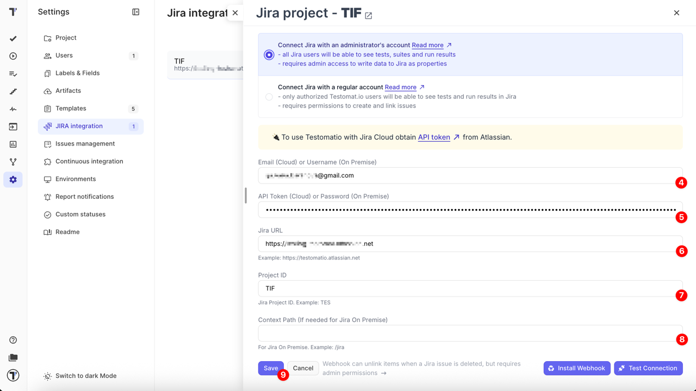
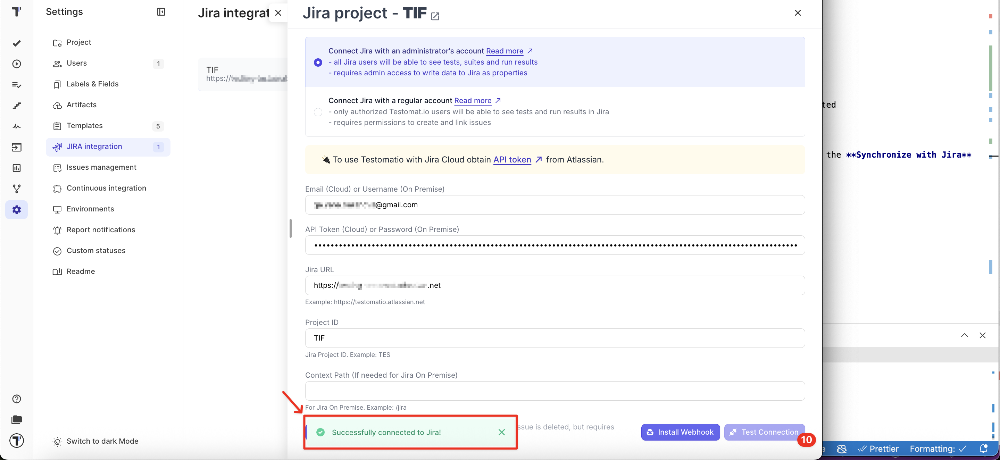
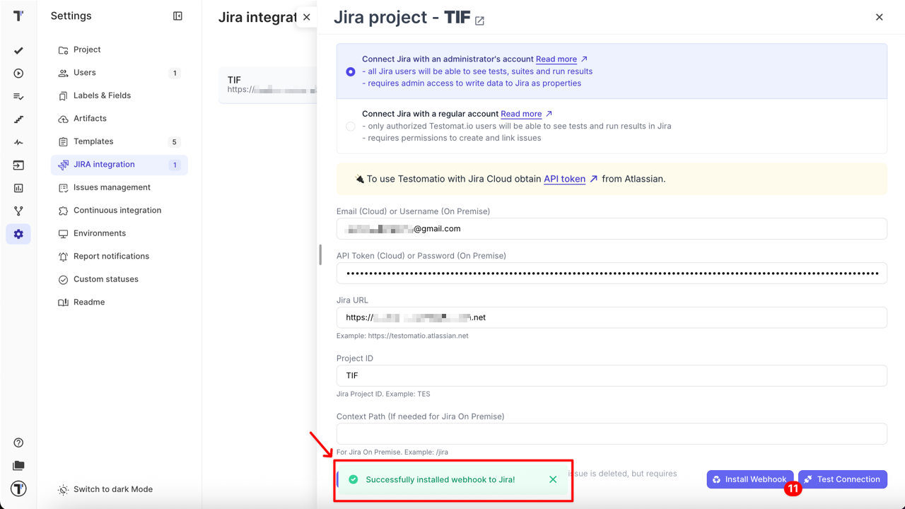

The Testomat.io Plugin for Jira is an integration tool that allows QA engineers, developers, and product teams to manage tests directly inside Jira. With this plugin you can link test cases, report execution results, and track testing progress without leaving your Jira workspace.

- Bridge the gap between test management and issue tracking
- Simplify QA and development collaboration
- Ensure full traceability between Jira issues and Testomat.io test cases

## Requirements

Before starting integration, ensure you have:

- Jira Cloud or Jira Server access
- Administrator rights in Jira workspace
- Project Manager or Owner role in Testomat.io project

## How to Install Testomat.io Plugin in Jira

- **Cloud:** Install [Testomat.io Plugin from Atlassian Marketplace](https://marketplace.atlassian.com/apps/1224120/testomatio?hosting=cloud&tab=overview)
- **Jira Server**: Contact [Testomat.io Team](https://docs.testomat.io/support/)

## Jira Connection Types

When connecting your Jira project to Testomat.io, you can use either an **Administrator’s account** or a **Regular account**. The connection type determines who in Jira can review linked tests, suites, and results.

### Connect Jira with an Administrator’s Account

This option grants **read-only visibility** to all Jira users, even if they don’t have a Testomat.io account.

- Linked tests, suites, and run results are visible to all Jira users via the plugin
- Test Coverage visibility is enabled to all Jira users via the plugin
- Editing test cases or executing runs is available only to logged-in Testomat.io users with proper permissions
- Requires Jira admin rights to install webhooks and write data to Jira as properties

Use this setup if you want all Jira users to see testing data, but only authorized Testomat.io users can modify it.

### Connect Jira with a Regular Account

This option limits plugin visibility to only **authorized Testomat.io users**.

- Linked tests and run results in the Jira plugin are visible only to users who are logged in to Testomat.io
- Editing or executing tests also requires a Testomat.io login and proper permissions
- Requires permissions to create and link issues

Use this setup if you need to restrict access to test data.

## How to Connect to Jira Project

:::note

Connecting a Jira project requires Jira **administrator rights** to enable two-way integration features, such as editing test cases or executing tests directly in Jira.
The user who configures the integration in Project Settings → Jira Integration must have Jira admin rights; otherwise, the Testomat.io project cannot be connected.

:::

You can connect your Testomat.io project to Jira to enable linking between tests and Jira issues. Follow the steps below to set up the integration.

1. Navigate to **Settings** in the sidebar
2. Click on **JIRA integration**
3. Click **Add Jira project** button

Once **New Jira project** window opens in the sidebar, fill in details:

At this stage, select the appropriate [Jira connection type](https://docs.testomat.io/integrations/issues-management/jira/#jira-connection-types)
based on the level of access you want to grant.

4. **Email (Cloud)** or **Username (On Premise)** (required)
5. **API Token (Cloud)** or **Password (On Premise)** (required)
6. **Jira URL** (required)
7. **Project ID** (required)
8. **Context Path** (optional, for Jira On Premise only)
9. Click **Save** button

Once the project is connected you will see your integration listed on the **Jira integration** page.

10. Open the Jira integration again and click the **Test Connection** button to ensure that it is connected properly

11. Click the **Install Webhook** button to enable automatic unlinking of items when a related Jira issue is deleted

:::note

Webhook installation requires **Jira administrator permissions**. If you don’t have **admin rights**, you can use the **Synchronize with Jira** option in the Jira Settings menu to manually sync test cases and issues.

:::

You can connect multiple Jira projects to a single Testomat.io project by following the same steps for each additional connection.

## Supported Jira Field Types

The **Create New Issue** form is built from the field schema that Jira returns for the selected project and issue type. Required fields appear immediately, the rest are hidden behind the **Show Optional Fields** link. Because of that, the exact set of fields you see depends on how your Jira project is configured.

### Supported Field Types

- **Text** — single-line and multi-line text fields
- **Number** — integer and decimal fields
- **Date and date-time** — filled in with a date picker
- **Single select** — dropdown lists, including **Priority**; the default value configured in Jira is pre-selected
- **Multi select** — dropdown lists that accept several values, such as **Components**, **Affects versions**, and **Fix versions**; the list is searchable
- **Checkboxes** — a group of checkboxes with multiple options
- **Cascading select** — parent and child options are combined into a single list in the `Parent -> Child` format
- **Labels** — a text field; type the values and use a comma as a separator to pass multiple values
- **Issue link** — a text field that accepts an issue key

### Fields Not Shown in the Form

These fields never appear in the form, because Testomat.io either fills them in itself or does not support them:

- **Summary** and **Description** — set through the **Title** and **Description** fields of the form
- **Issue type** and **Project** — selected at the top of the form
- **Attachment**
- **Assignee** and **Reporter**
- **Sprint** and **Flagged**

### Fields Shown as Read-Only

If Jira returns no list of allowed values for a field that requires one, the field is displayed but cannot be filled in. It shows the `<field is not available, value can't be set>` placeholder together with the *This type of field can not be set via this interface* hint. Set such a value in Jira after the issue is created.

:::note

Fields of the **user**, **security level**, and **time tracking** types — for example **Owner**, **Security Level**, and **Original Estimate** — have no dedicated control yet. Set these values in Jira after the issue is created.

:::

## FAQ & Troubleshooting

**Q: Why do I see the message: 'Oops! No project is linked.' in Jira?**

A: This message appears when the Jira Plugin cannot access the linked project:

- You don’t have access to the project in Testomat.io and cannot view it in Jira.
- Or the integration was set up using a Regular Account, and you are not logged in to Testomat.io.

**Q: Why do I get a "Forbidden" message when linking a Jira project?**

A: Your Jira instance may require adding Testomat.io’s IP addresses to the IP allowlist. Please contact your admin for assistance. The Testomat.io IPs are: 142.132.185.19, 5.75.250.20 and 88.99.148.154.
