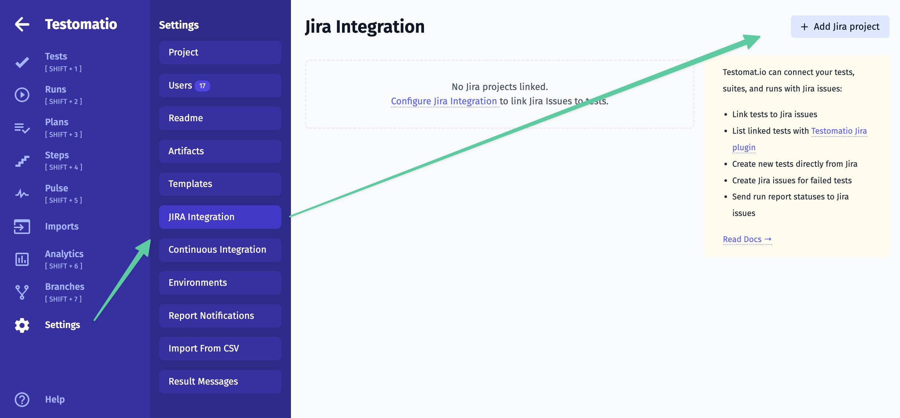
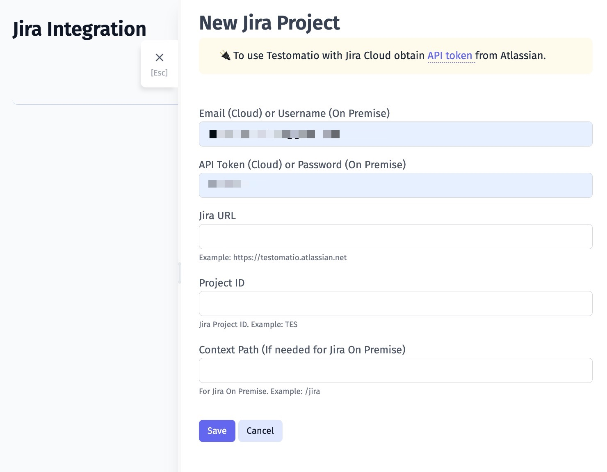
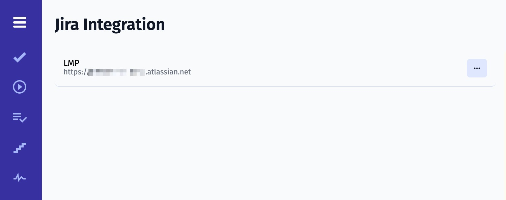

## Installing Testomatio Plugin in JIRA

Install [Testomatio Plugin from Atlassian Marketplace](https://marketplace.atlassian.com/apps/1224120/testomatio?hosting=cloud&tab=overview)

> We also provide a Testomatio Plugin for Jira Server. Contact Testomatio Team to learn more about it.

## Connecting to JIRA project

<Aside>
Please note connecting to JIRA project requires admin rights to enable two-way integration capabilities like editing test cases or executing tests directly in JIRA. So user that is used to make JIRA configuration on project settings should have JIRA admin rights otherwise Testomat.io project won't possible to connect to JIRA.
</Aside>

To link tests to JIRA issues connect a Testomatio project to JIRA project.

* Open a Testomatio project
* Navigate to "Setting" > "JIRA Integration"
* Click "Add Jira project"

Provide connection details:

* Email (or username for Jira Server setup)
* API token (or password for Jira Server setup)
* Jira URL
* Project ID

If you use JIRA Cloud, obtain an API token for your user account.
If you use JIRA Server, use the password from your user account.

Click "Save"

Once the project is connected you will see your integration listed on the Settings page

> You can connect to multiple JIRA projects from a Testomatio project. Follow the same instructions to connect to another project.

