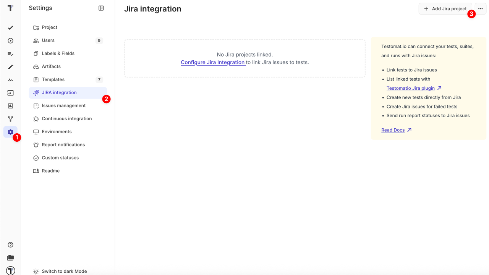
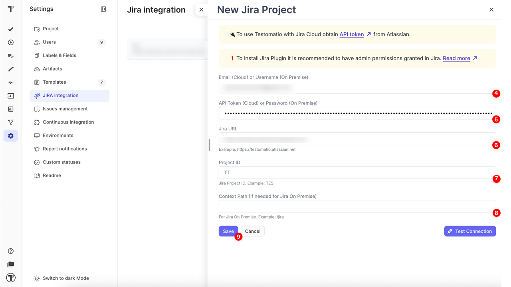
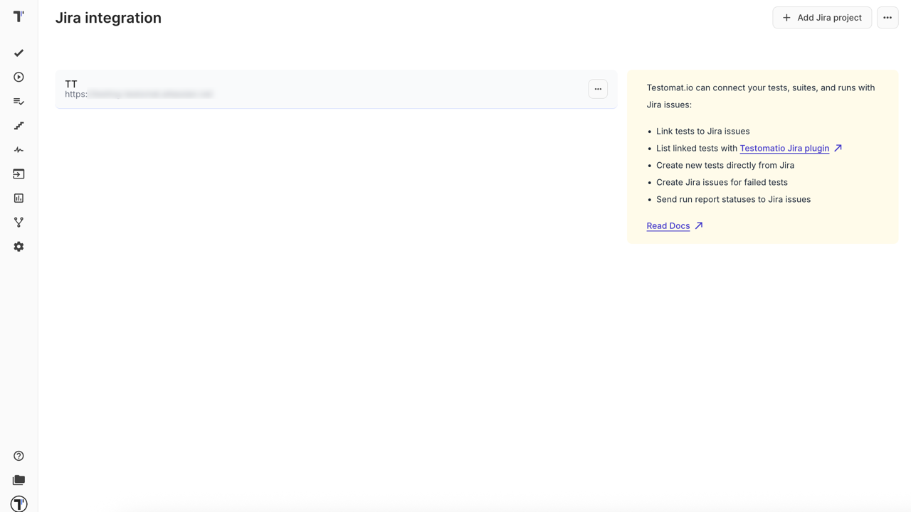
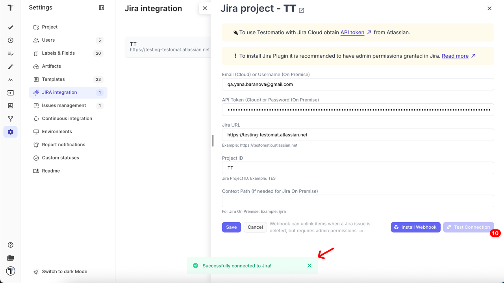
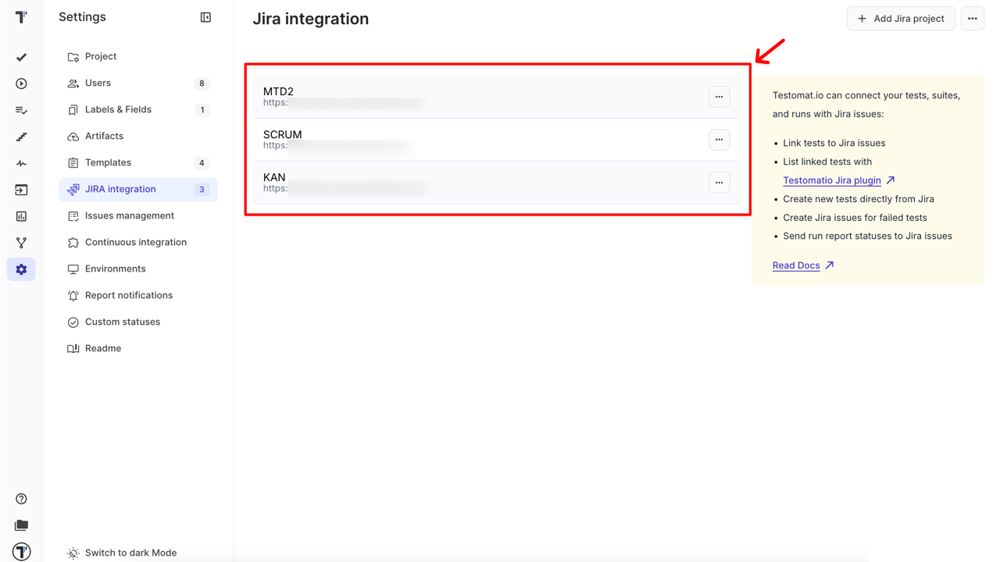

The Testomat.io Plugin for Jira is an integration tool that allows QA engineers, developers, and product teams to manage tests directly inside Jira. With this plugin you can link test cases, report execution results, and track testing progress without leaving your Jira workspace.

**Benefits**:

- Bridge the gap between test management and issue tracking
- Simplify QA and development collaboration
- Ensure full traceability between Jira issues and Testomat.io test cases

## Requirements

Before starting integration, ensure you have:

- Jira Cloud or Jira Server access
- Administrator rights in Jira workspace
- Project Manager or Owner role in Testomat.io project

## How to Install Testomat.io Plugin in Jira

- **Cloud:** Install [Testomat.io Plugin from Atlassian Marketplace](https://marketplace.atlassian.com/apps/1224120/testomatio?hosting=cloud&tab=overview)

- **Jira Server**: Contact [Testomat.io Team](https://docs.testomat.io/support/)

## How to Connect to Jira Project

:::note

Connecting to a Jira project requires **administrator rights** to enable two-way integration capabilities, such as editing test cases or executing tests directly in Jira. The user who configures Jira integration in project settings must have Jira admin rights, otherwise the Testomat.io project cannot be connected.

:::

To link tests to Jira issues, connect a Testomat.io project to your Jira project. Follow these steps:

1. Navigate to **Settings** in the sidebar
2. Click on **JIRA integration**
3. Click **Add Jira project** button

Once **New Jira Project** window opens in the sidebar, fill in details:

4. **Email (Cloud)** or **Username (On Premise)** (required)
5. **API Token (Cloud)** or **Password (On Premise)** (required)
6. **Jira URL** (required)
7. **Project ID** (required)
8. **Context Path** (optional, for Jira On Premise only)
9. Click **Save** button

Once the project is connected you will see your integration listed on the **Jira integration** page.

10. Open the integration again and click the **Test Connection** button to ensure that it is connected properly

11. Click the **Install Webhook** button to enable automatic unlinking of items when a related Jira issue is deleted

:::note

Webhook installation requires **Jira administrator permissions**. If you don’t have **admin rights**, you can use the **Synchronize with Jira** option in the Jira Settings menu to manually sync test cases and issues.

:::

## Supported Jira Field Types

Testomat.io integrates with Jira and supports the following field types when creating or editing issues:

### Basic Field Types

- **Text fields** — for entering single-line or multi-line text
- **Number fields** — for entering numeric values
- **Date fields** — for selecting dates and times
- **Dropdown menus** — for selecting a single option from a list
- **Priority fields** — for setting issue priority levels

### Advanced Field Types

- **Checkboxes** — for selecting multiple options from a set of checkboxes
- **Multi-select fields** — for choosing multiple values from dropdown lists
- **Custom fields (single, multiple, cascading)** — for selecting single, multiple, or nested values from Jira custom select lists
- **Issue links** — for connecting to other Jira issues

### Special Handling

- **Text arrays** — multiple text values can be entered, separated by commas
- **Default values** — the system respects default values set in Jira

### Not Supported

Some Jira fields are not currently supported in our integration:

- Attachments
- Assignee and Reporter fields
- Description (handled separately in our interface)
- Issue type (selected elsewhere in our interface)
- Project field (selected elsewhere in our interface)
- Labels (not currently supported)
- Fields named **Flagged** or **Sprint**

You can connect multiple Jira projects to a single Testomat.io project by following the same steps for each additional connection.

## Troubleshooting & FAQ
