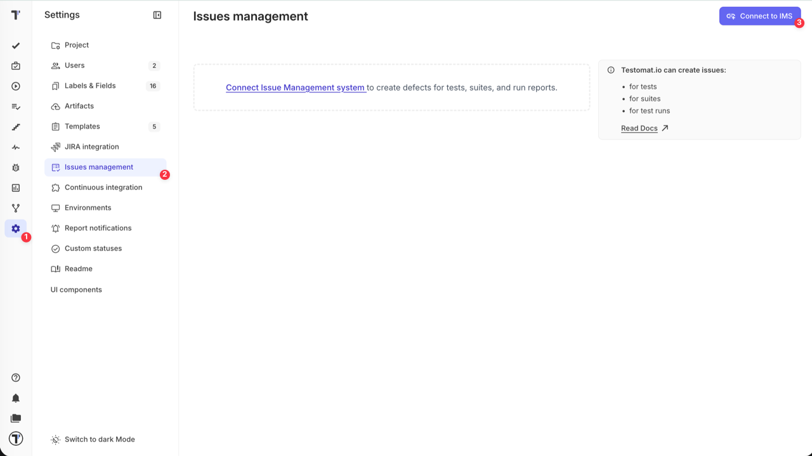
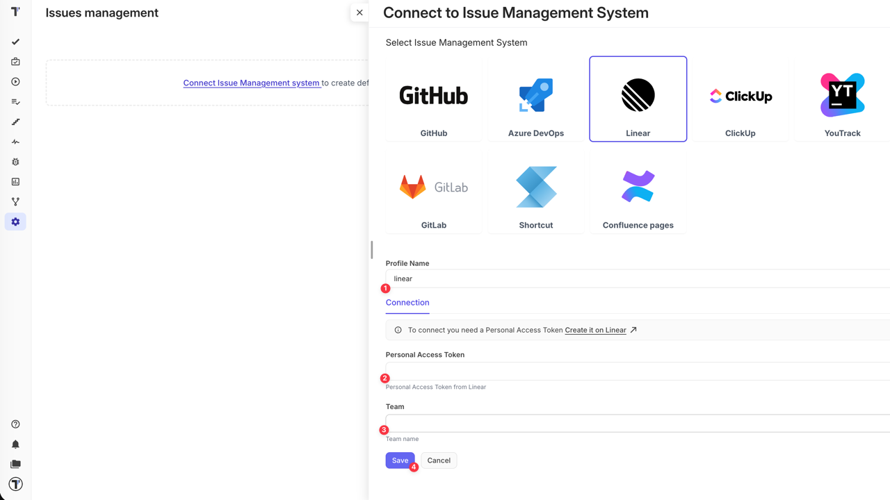
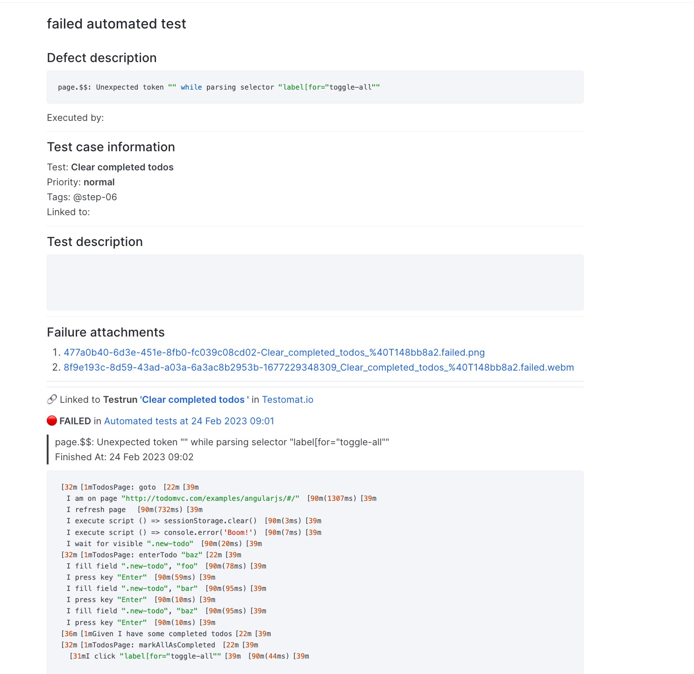

If you already have a workspace configured in Linear, you're ready to integrate it with Testomat.io. To get started, you'll need your Team name and Personal Access Token. We'll walk you through each step to locate this information and connect it with Testomat.io.

To connect your Linear space with Testomat.io you need to open Settings (1) -> Issues management (2) and click on 'Connect to IMS' (3) button.

When ‘Connect to Issue Management System’ sidebar is opened, follow the instructions below:

1. Give a name to your profile
2. Enter your Personal Access Token from Linear ([learn more](https://linear.app/settings/account/security))
3. Enter your Team name ([more details on Linear Teams](https://linear.app/docs/teams))
4. Click on Save button

:::note

Use the full Team name as shown in Linear (e.g. "Test Team"), not the short identifier/key (e.g. "TES") used in issue IDs.

:::

Once your Issues Management System is configured you can link a test or create a defect. As a result, Testomat.io will create a ticket in your Linear Team with dedicated links and data, so you can easily look through the testing data you need. Here is an example:

