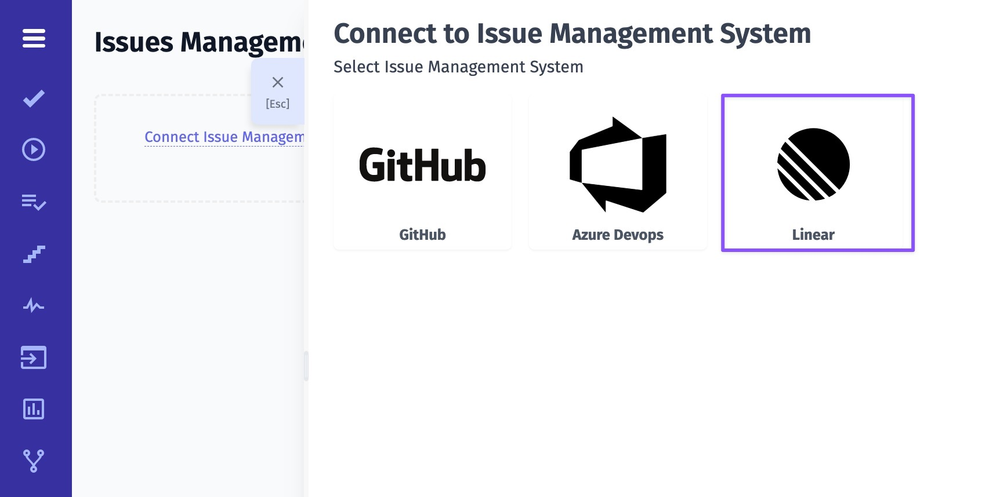
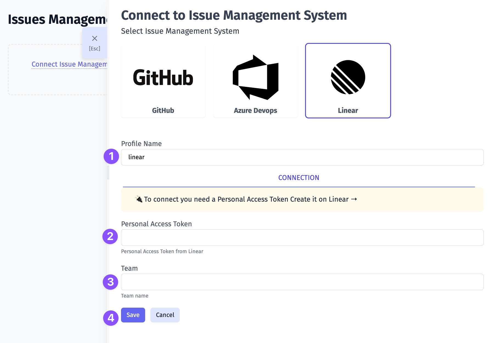

1. Give a name to your profile
2. Enter your Personal Access Token from Linear ([learn more](https://linear.app/testomat-workspace/settings/api))
3. Enter your Team name ([more details on Linear Teams](https://linear.app/docs/teams))
4. Click on Save button

Once your Issues Management System is configured you can link a test or create a defect. As a result, Testomat.io will create a ticket in your Linear Team with dedicated links and data, so you can easily look through the testing data you need. Here is an example:

