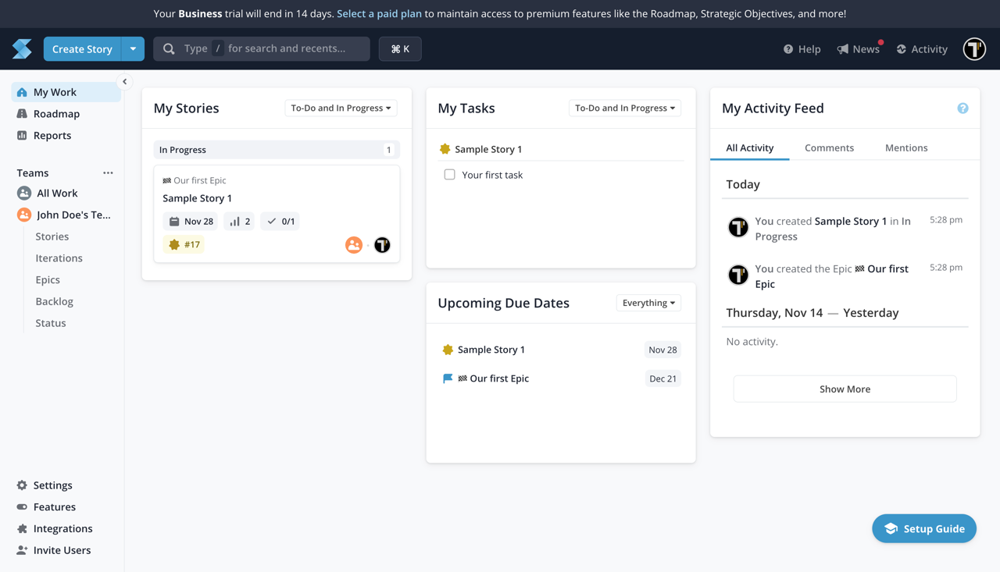
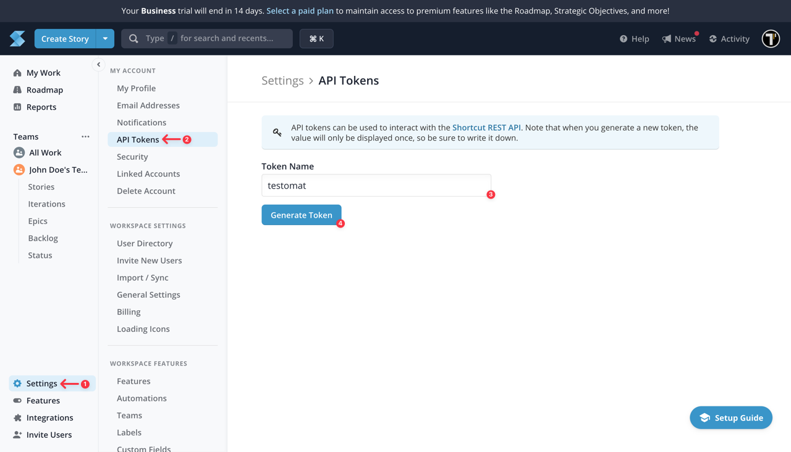
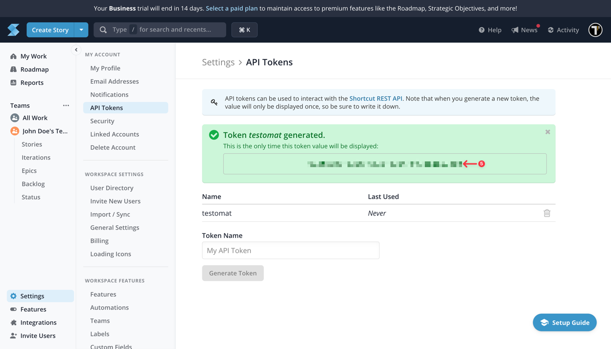
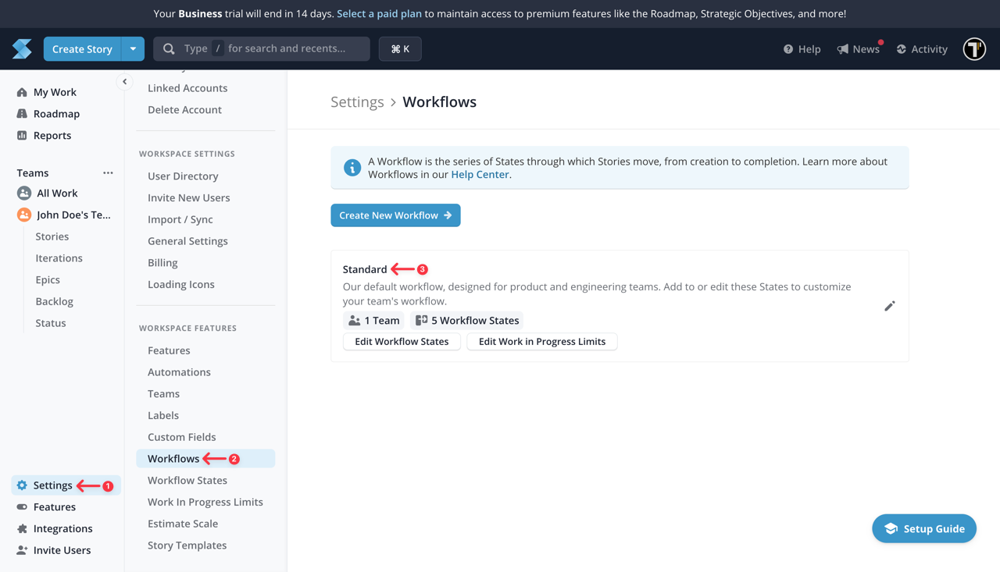
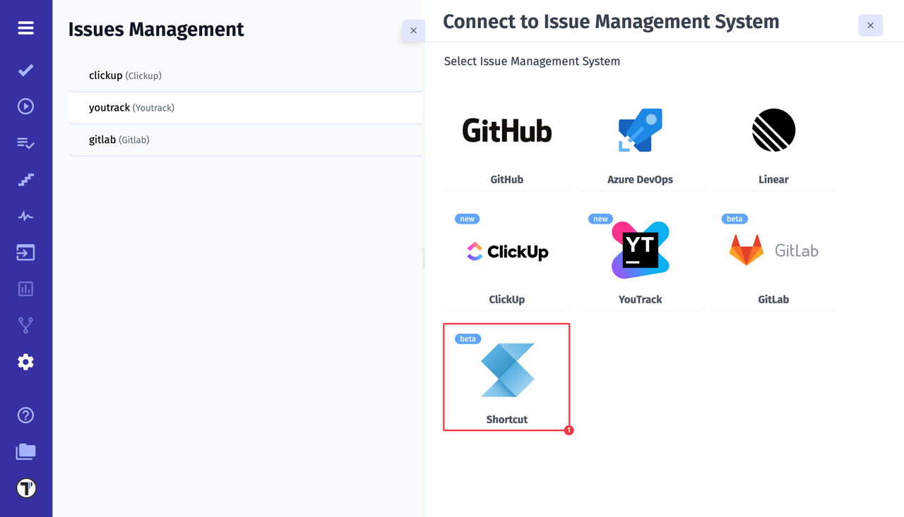
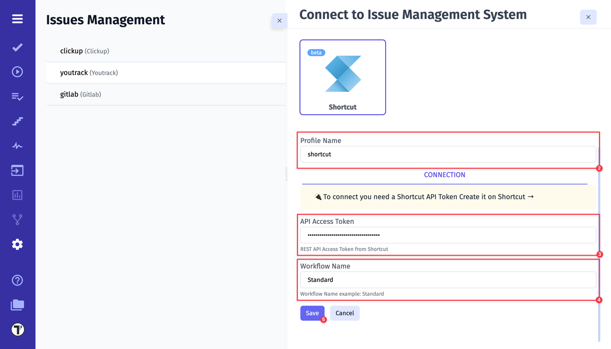
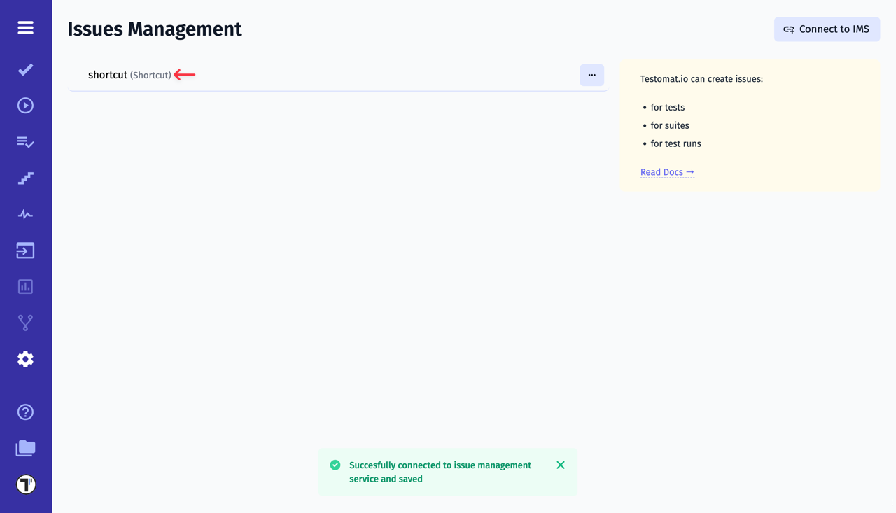

If you already have a workspace configured in **Shortcut**, you're ready to integrate it with Testomat.io. To get started, you’ll need your **Workflow Name**, and **API Access Token**. We’ll walk you through each step to locate this information and connect it with Testomat.io.

To create the **API Access Token**, follow these steps:

1. Click on **Settings** button
2. Go to **API Tokens**
3. Enter **Token Name**
4. Click on **Generate Token** button

5. Copy your API Token

Keep your **API Access Token** secure, as you’ll need it for the integration with Testomat.io.

To locate the **Workflow Name**, follow these steps:

1. Click on **Settings** button
2. Go to **Workflows**
5. Copy your Workflow Name

After collecting all necessary data, we can move on to Testomat.io. 

1. Select Shortcut from the list of available Issue Management Systems.

2. Enter a **Profile Name**
3. Paste Shortcut **API Access Token**
4. Paste Shortcut **Workflow Name**
5. Click on **Save** button

If everything was done correctly, you will receive a confirmation message indicating that the Shortcut profile was successfully created.

