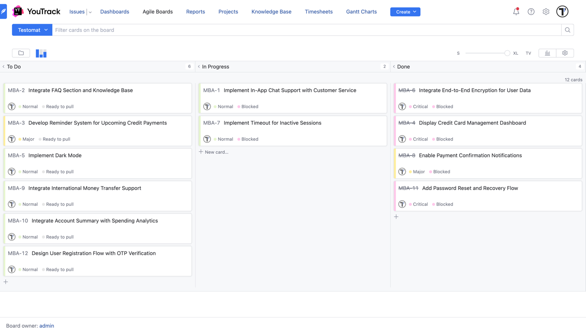
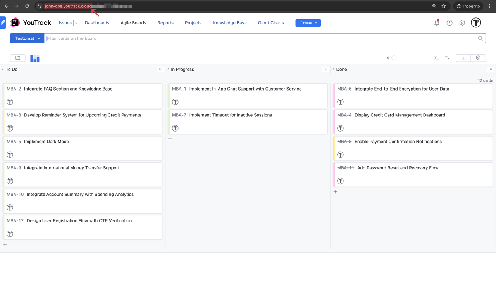
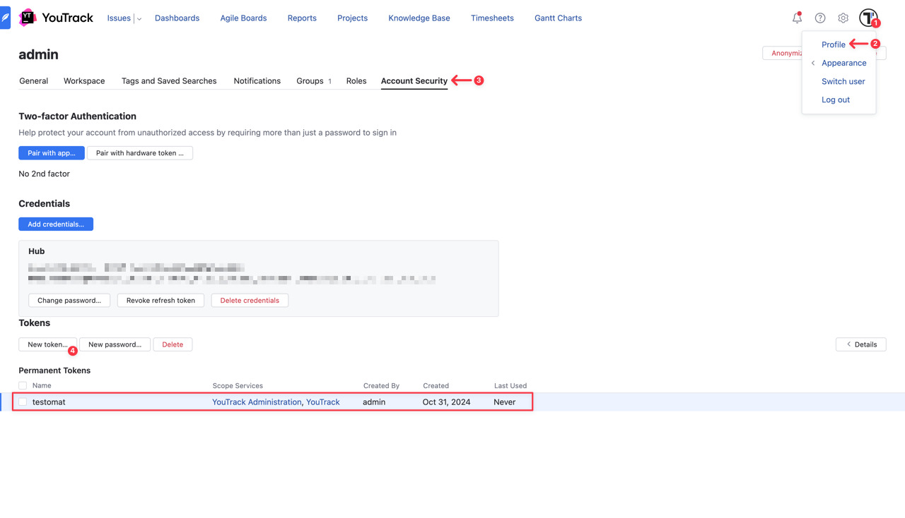
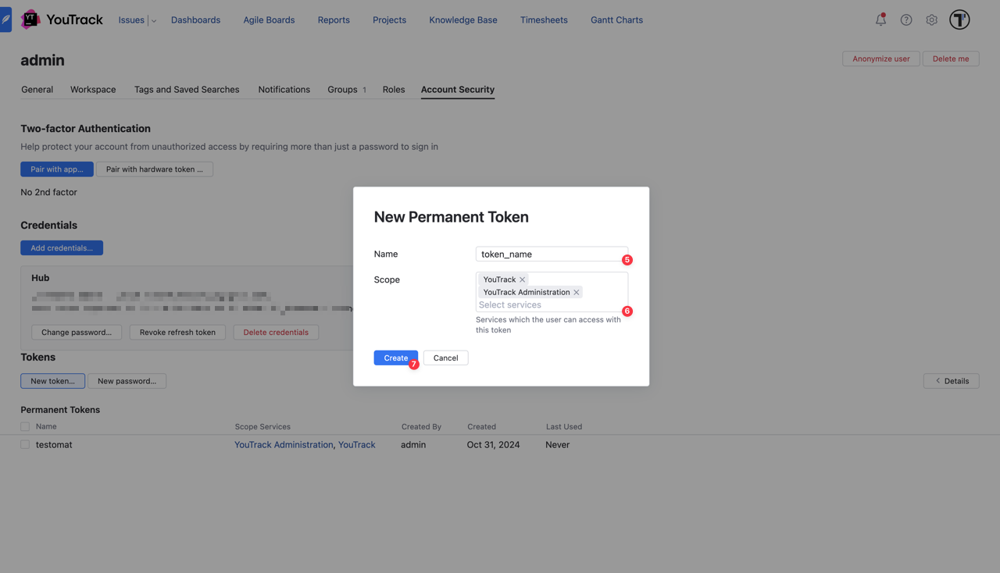
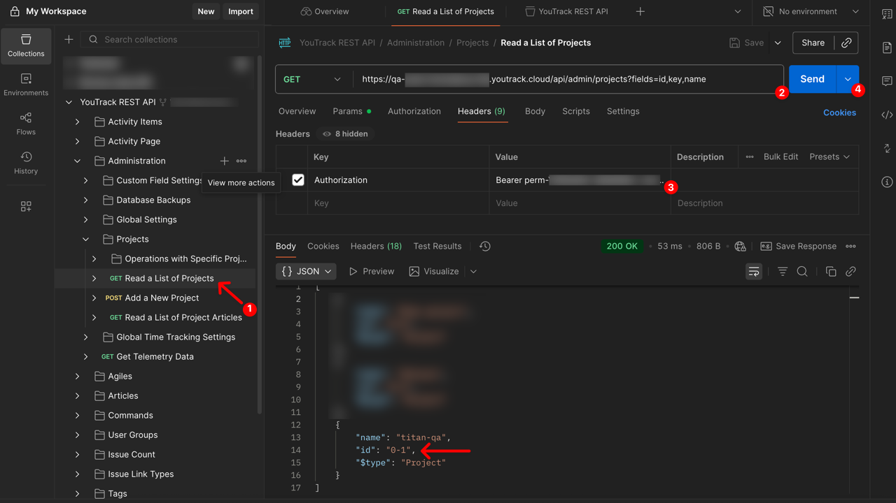
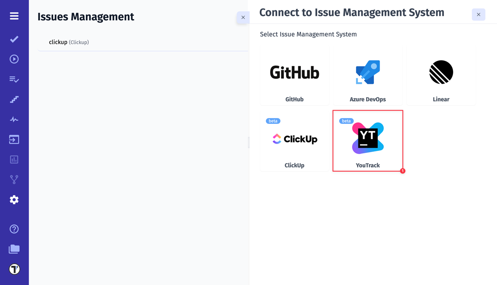
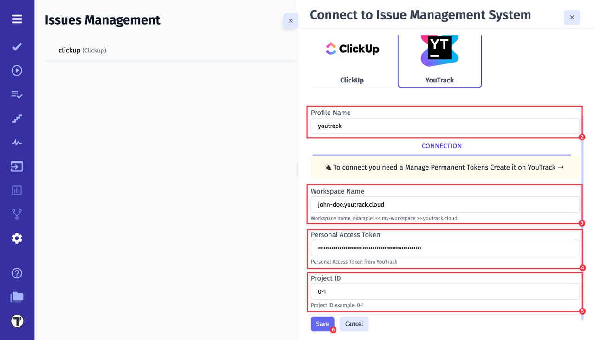
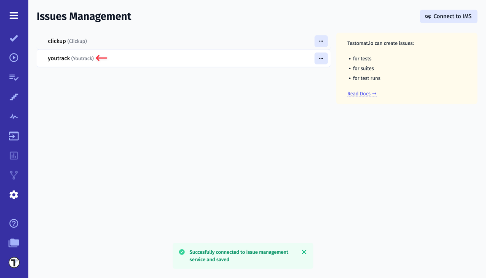

If you already have a workspace and project in YouTrack, you’re ready to integrate it with Testomat.io. To do so, you’ll need three items:

- Workspace Name
- Personal Access Token
- Project ID

This guide walks you through where to find each.



## How to Find a Workspace Name

You can find your **Workspace Name** in the browser **URL** when you're logged into YouTrack. For example: `[my-workspace].youtrack.cloud`



## How to Create a Personal Access Token

To create the **Personal Access Token**, follow these steps:

1. Click on the profile avatar
2. Go to **Profile**
3. Then go to **Account Security**
4. Click on **New token...** button



5. Enter a **Token** name
6. Select services (**YouTrack, YouTrack Administration**)
7. Click on **Create** button



Once the token has been created, copy it. Keep your Personal Access Token secure, as you’ll need it for the integration with Testomat.io.

## How to Get a Project ID

Finally, to get the **Project ID**, follow these steps:

1. Open YouTrack [API Documentation](https://www.postman.com/youtrack-dev/youtrack/documentation/sd7pq8x/youtrack-rest-api)-> Administration -> Projects -> Read a List of Projects
2. Get a request:

```
https://<your-workspace>.youtrack.cloud/api/admin/projects?fields=id,key,name

```

3. Paste your Personal Access Token
4. Click **Send** button and get your Project ID in the response body (e.g. `"id": "0-1"`)



:::note

The ID in the browser URL isn't the same as the project ID in the database.

:::

After collecting all necessary data, we can move on to Testomat.io.

## How to Connect YouTrack in Testomat.io

1. Select YouTrack from the list of available Issue Management Systems.



2. Enter a **Profile Name**
3. Paste YouTrack **Workspace Name**
4. Paste YouTrack **Personal Access Token**
5. Paste YouTrack **Project ID**
6. Click on **Save** button



If everything was done correctly, you will receive a confirmation message indicating that the YouTrack profile was successfully created.


