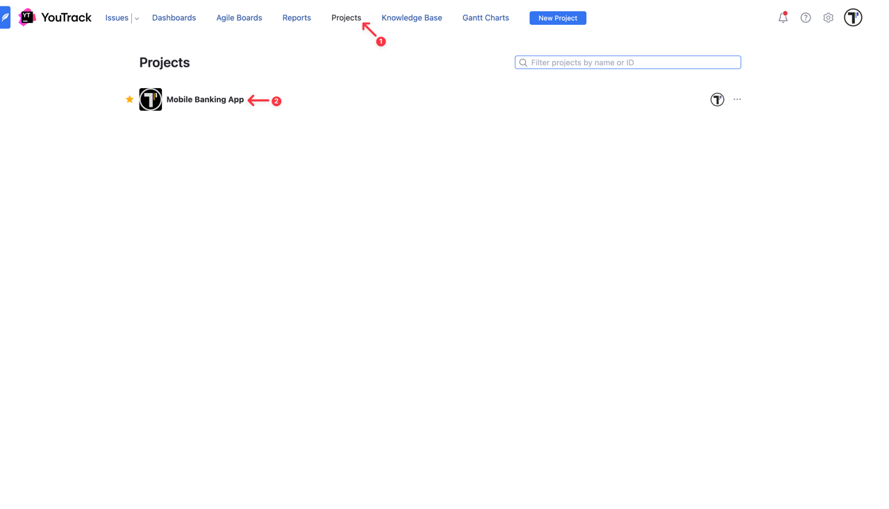
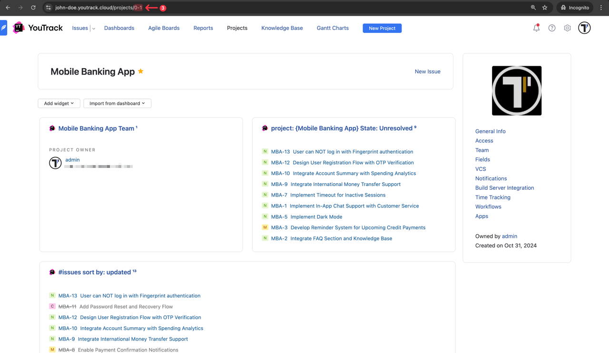

If you already have a workspace and project configured in **YouTrack**, you're ready to integrate it with Testomat.io. To get started, you’ll need your **Workspace Name**, **Personal Access Token**, and **Project ID**. We’ll walk you through each step to locate this information and connect it with Testomat.io.

You can find your **Workspace Name** in the browser **URL** when you're logged into YouTrack. For example: `[my-workspace].youtrack.cloud`

To locate the **Project ID**, follow these steps:

1. Go to **Projects** in the header
2. Click on your project

3. Find your **Project ID** in the browser **URL**; For example: `0-1`

Finally, to create the **Personal Access Token**, follow these steps:

1. Click on the profile avatar
2. Go to **Profile**
3. Then go to **Account Security**
4. Click on **New token...** button

5. Enter a **Token** name
6. Select services (YouTrack, YouTrack Administration)
7. Click on **Create** button

Once the token has been created, copy it. Keep your Personal Access Token secure, as you’ll need it for the integration with Testomat.io.

After collecting all necessary data, we can move on to Testomat.io. 

1. Select YouTrack from the list of available Issue Management Systems.

2. Enter a **Profile Name**
3. Paste YouTrack **Workspace name**
4. Paste YouTrack **Personal Access Token**
5. Paste YouTrack **Project ID**
6. Click on **Save** button

If everything was done correctly, you will receive a confirmation message indicating that the YouTrack profile was successfully created.

