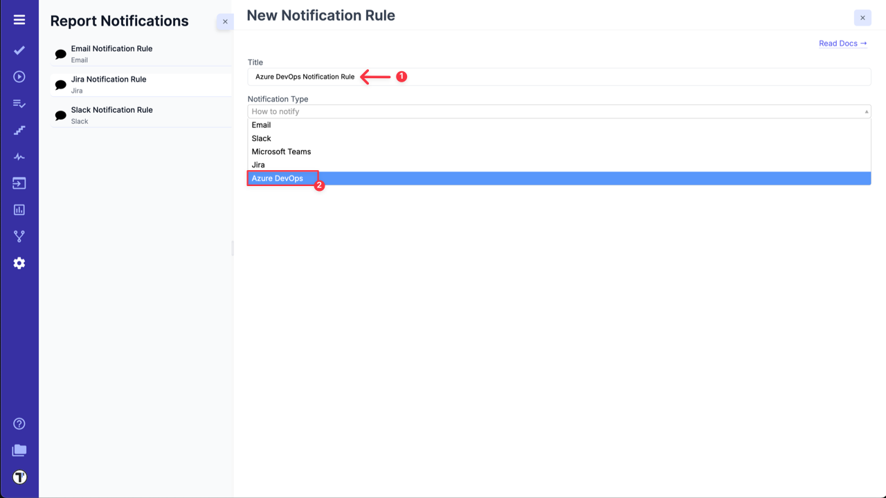
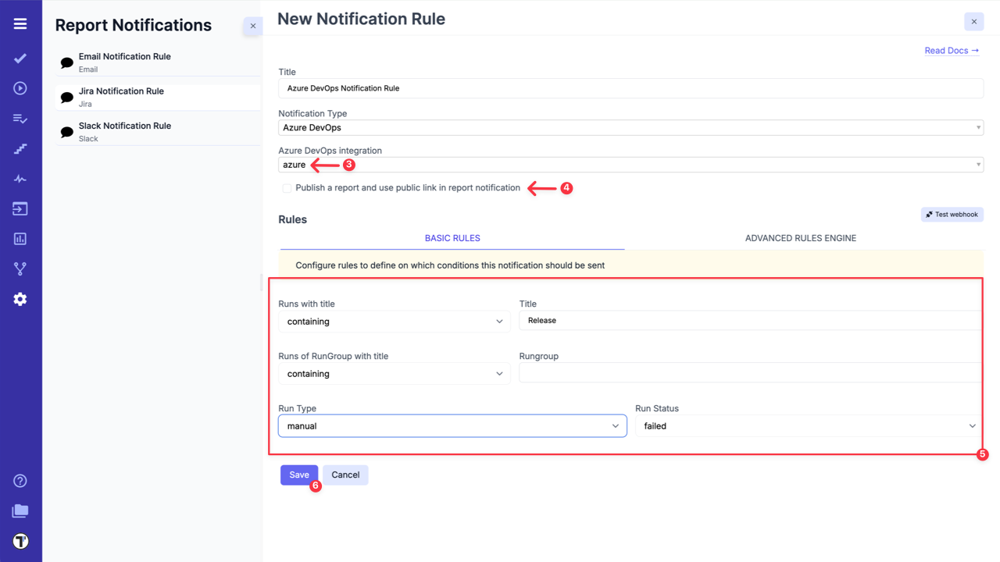
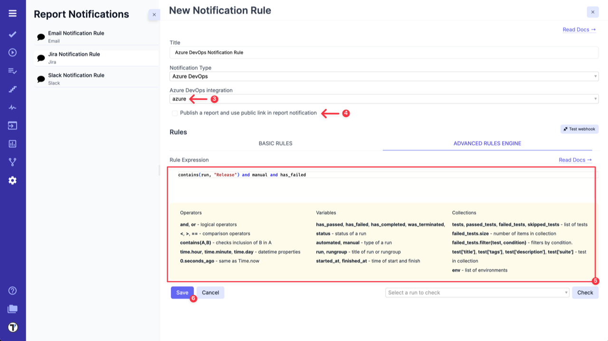
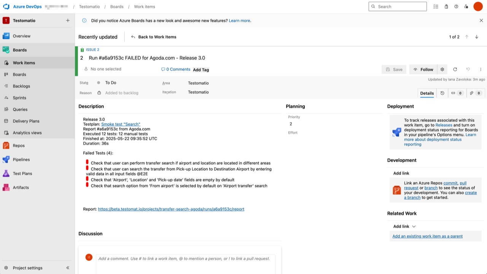

Testomat.io allows to create issue for failed test runs automatically in Azure DevOps. This option can be enabled in **Settings**.

Before you set up Notification rules for Azure DevOps, you need to connect your Azure DevOps project with Testomat.io. Please follow the instuction in dedicated section - [Azure DevOps Configuration.](https://docs.testomat.io/integrations/issues-management/azure/)

After the Azure DevOps is connected with Testomat.io, go to the **Settings (1) -> Report Notifications(2)** and click on **Add Notification Rule (3)**.

To enable Notification for Azure DevOps follow next steps:

1. Add a title for Notification Rule.
2. Choose **Azure DevOps** from the dropdown list.

3. Select **Azure DevOps integration** from dropdown list.
4. Select **'Publish a report and use public link in report notification'** option, if you need it.
5. Configure rules to define on which conditions this notification should be sent in **BASIC RULES** section 

OR 

use **ADVANCED RULES ENGINE** to enter your rule expression.

6. Click on **Save** button.

| **Basic Rules**             | **Advanced Rules Engine**             |
| --------------------------- | ------------------------------------- |
|  |  |

Testomat.io will now automatically create an issue with detailed Test Run results in your Azure DevOps project for any failed Test Runs. This eliminates the need to manually input data for each Test Run, saving you time and ensuring that all contributors are notified in a convenient way.

:::note

When **'Publish a report and use public link in report notification'** option is enabled, the public report will be generated and everyone who has this link will be able to see it.

:::
