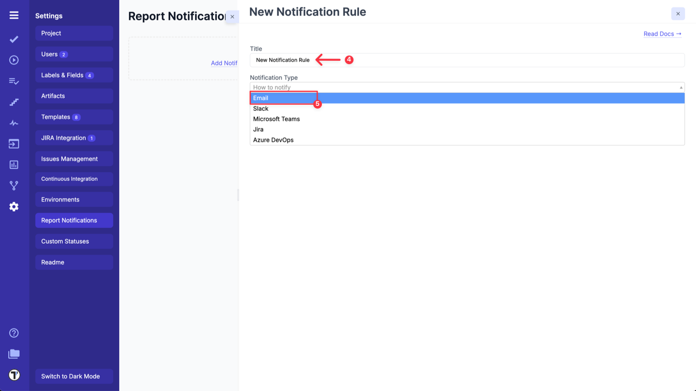
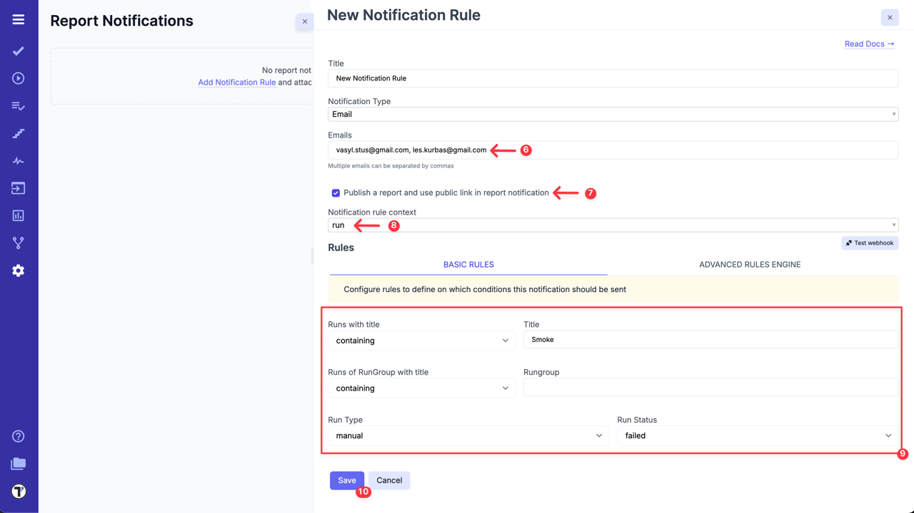
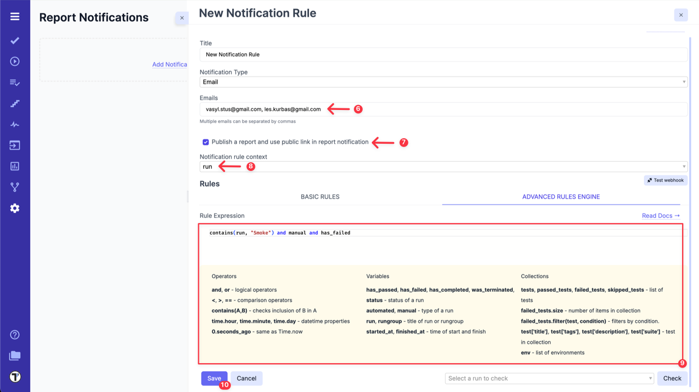
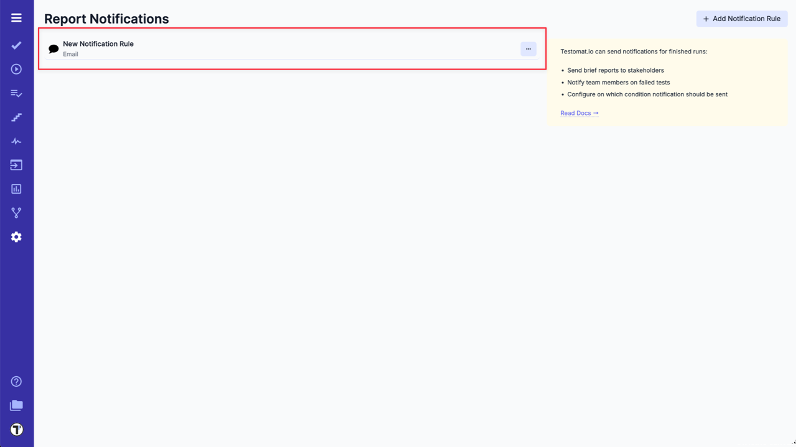
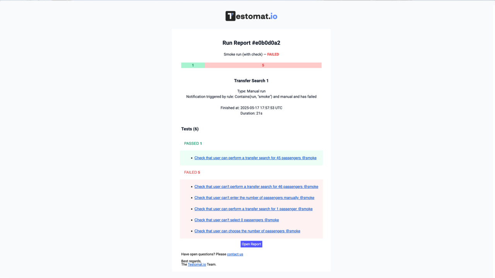
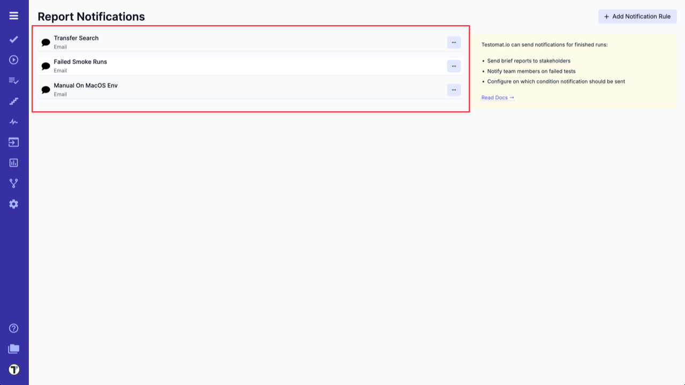

Testomat.io allows sending Notifications for finished runs via Email.
Let's see how it works!

First, you need to set up Email notifications in the Settings tab:

1. Go to **Settings**.
2. Select **Report Notifications** option.
3. Click on **Add Notification Rule**.

At this point your next steps are:

4. Add a title for Notification Rule.
5. Choose **Email** from the dropdown list.

6. Enter one or multiple email addresses (separated by coma) to receive notifications.
7. Select **'Publish a report and use public link in report notification'** option, if you need it.
8. Select **Notification rule context**: Run or RunGroup.
9. Add notification rules in **BASIC RULES** section

OR

use **ADVANCED RULES ENGINE** to enter your rule expression.

10. Click on **Save** button.

| **Basic Rules**             | **Advanced Rules Engine**             |
| --------------------------- | ------------------------------------- |
|  |  |

Now you have Email Notification enabled for the project. 

**How does it work?**
Each time Testomat.io creates Run Report, which corresponds to your Email Notification Rule, it will be sent to email.

:::note

You can set up multiple Email Notifications for different Rules.

:::

:::note

When **'Publish a report and use public link in report notification'** option is enabled, the public report will be generated and everyone who has this link will be able to see it.

:::

