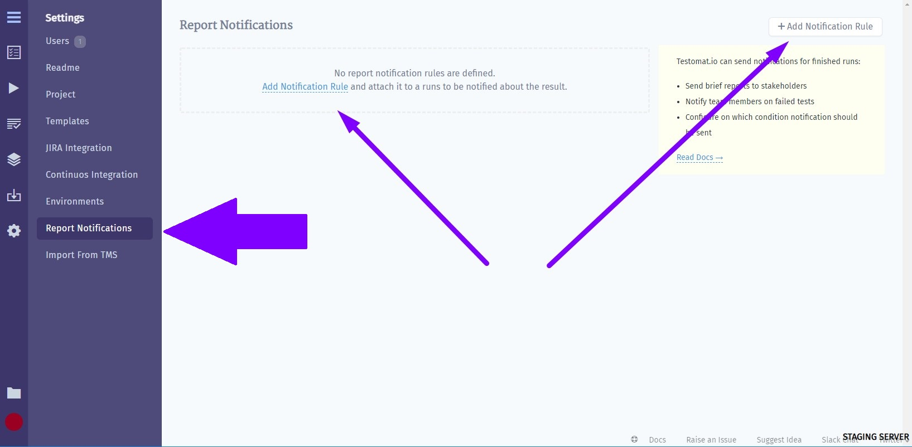
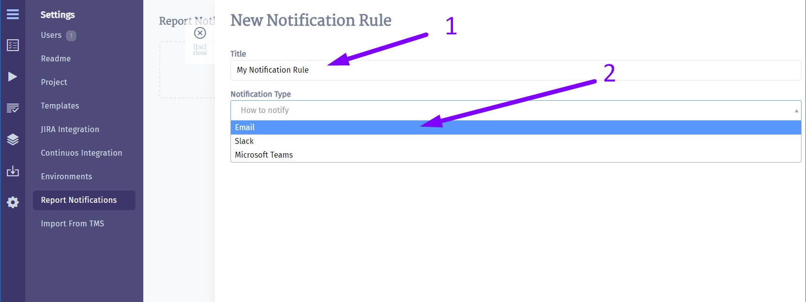
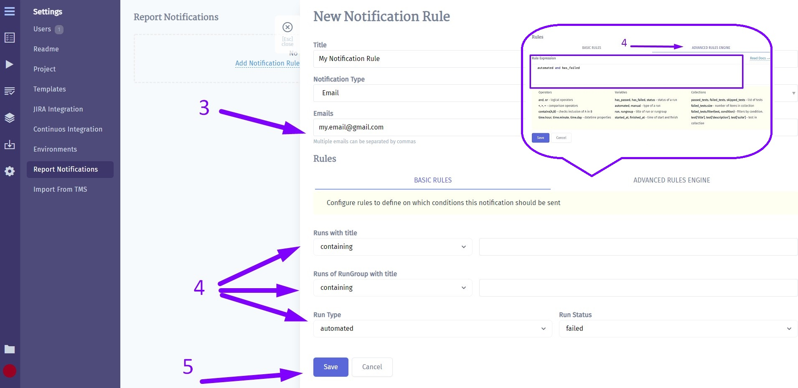
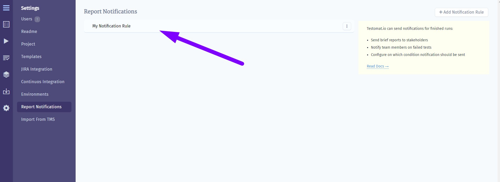
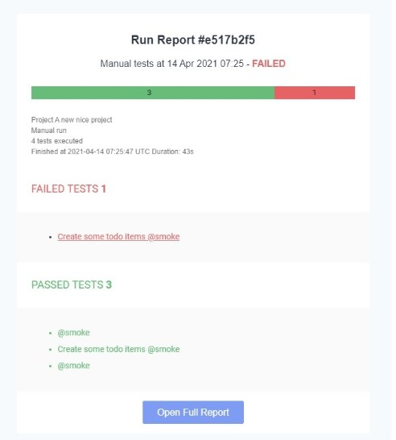
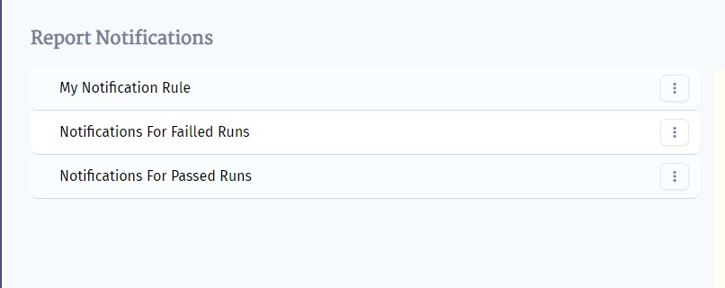

Testomat.io allows sending notifications for finished runs via Email.
Let's see how it works!
First, you need to set up Email notifications in the Settings tab. 
Click on **Report Notifications** and click on **Add Notification Rule**

At this point your next steps are:

1. Enter a title for Notification Rule
2. Choose **Email** from the list

3. Enter Email or multiple Emails you want to response
4. Customize these fields in BASIC RULES or use ADVANCED RULES ENGINE to enter your rule expression
5. Click on Save button

Now you have Email Notification enabled for the project. 

How does it work?
Each time Testomat.io creates Run Report which corresponds to your Email Notification Rule it will be sent to email.

Please note, that you can set up multiple Email Notifications for different Run reports.

