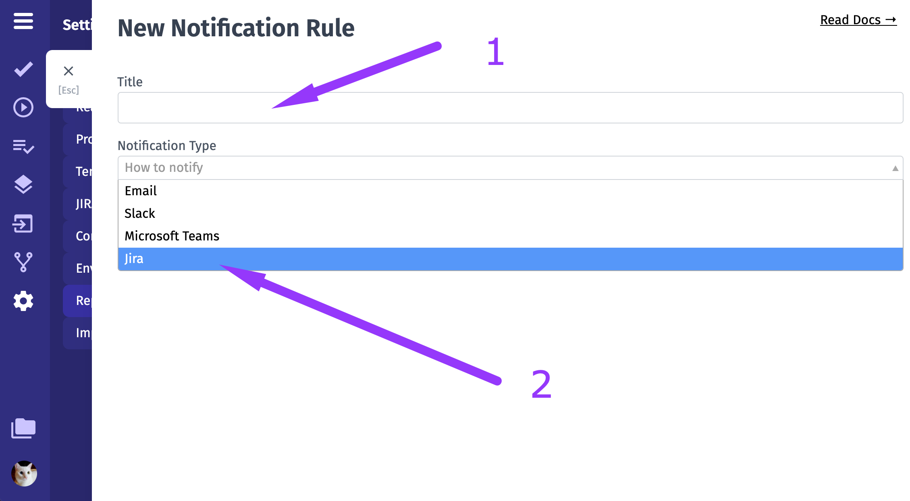
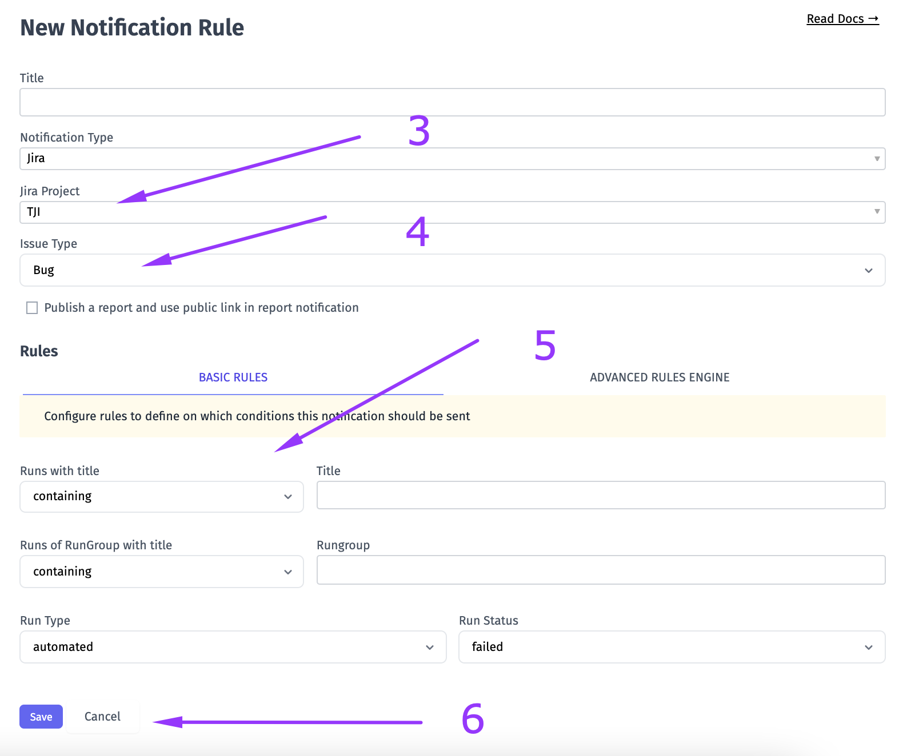
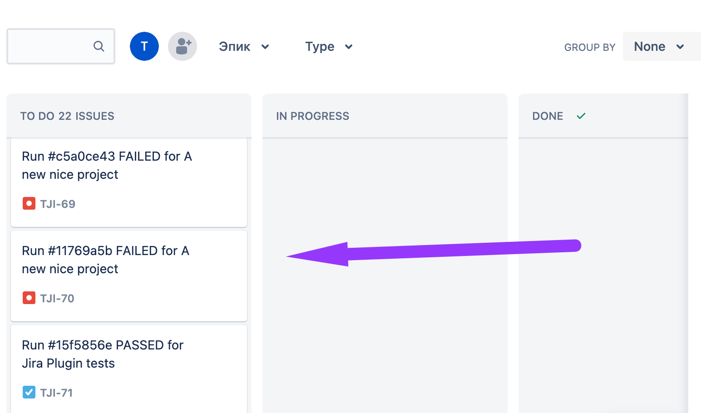
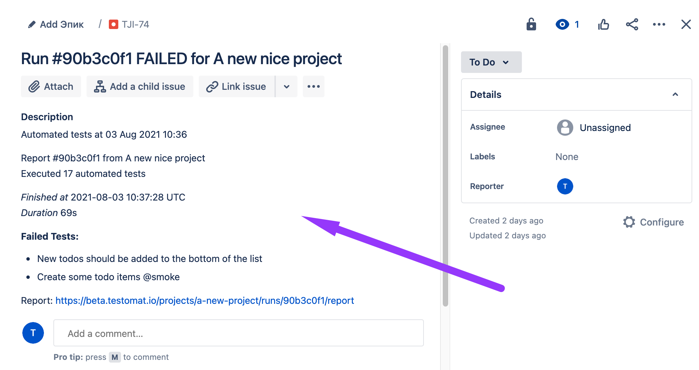

Testomat.io allows to create Jira issue for failed test runs automatically. This option can be enabled in settings.
To do this, you need to connect Jira project with Testomat.io. Please see dedicated  [documentation. ](https://docs.testomat.io/integration/jira/#connecting-to-jira-project)

1. Enter a name to your Notification rule
2. Pick Jira from Notification Type drop-down

3. Pick your dedicated Jira project from Jira Project drop-down
4. Pick needed issue type from Issue Type drop-down
5. Configure rules to define on which conditions this notification should be sent
6.  Click on Save button

Now Testomat.io will create an issue with detailed information on Test Run results within your Jira project for failed Test Runs. So you don't need to put all the data on each Test Run manually. This helps to save time and notify all contributors in a convenient way.

