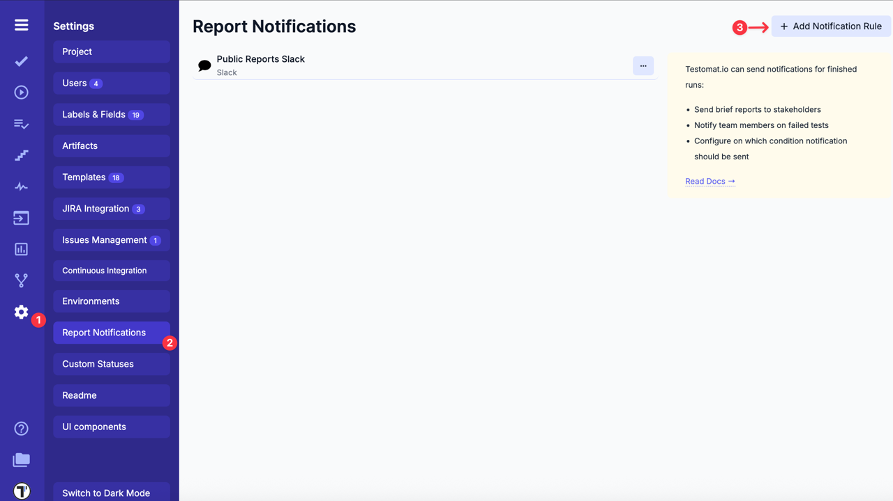
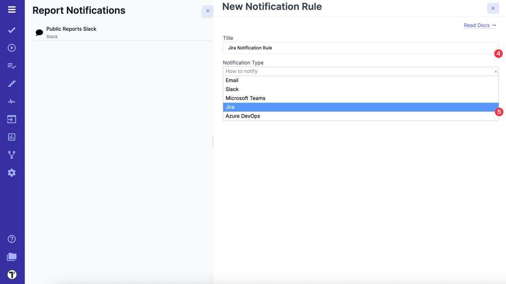
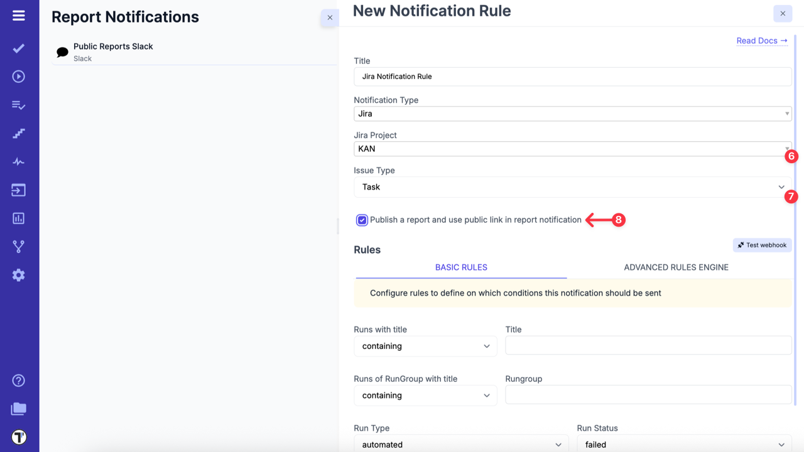
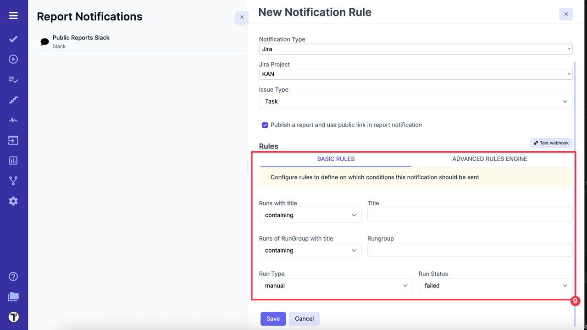
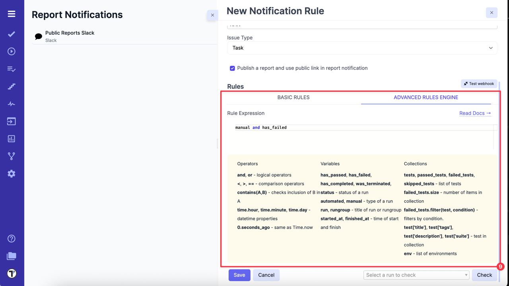
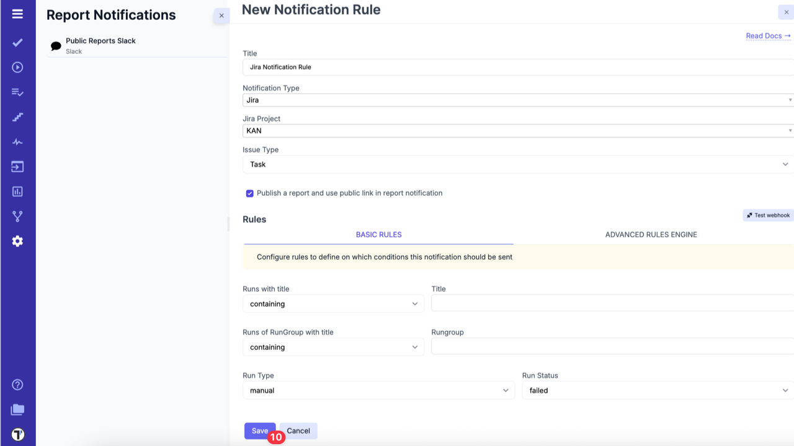
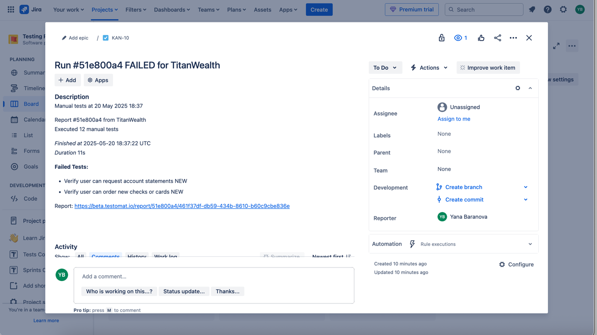

## How to set up Jira Notification Rule

Testomat.io lets you integrate with Jira to streamline how your team tracks test results. With notification rules, you can automatically create Jira issues based on specific test run conditions - for example, when an automated test fails, or when any mixed test run completes successfully.

This helps reduce manual work and ensures important test outcomes are shared directly with your team in Jira.

Testomat.io can send notifications for finished runs. You can use this feature to:

- Send brief reports to stakeholders
- Notify team members about failed tests
- Configure exactly when and under which conditions the notification should be sent

Before you begin, make sure your Jira project is connected to Testomat.io. See the integration [guide](https://docs.testomat.io/integration/jira/#connecting-to-jira-project) for connection steps.

To create a Jira notification rule, follow these steps:

1. Click on **Settings** in the sidebar
2. Open the **Report Notifications** tab
3. Click on **'Add Notification Rule'** button

Once the sidebar **'New Notification Rule'** is opened, fill in the fields:

4. Enter a title for notification rule
5. Select **'Jira'** type from Notification Type dropdown

6. Select a specific Jira project from the dropdown
7. Select **Issue Type** from dropdown
8. Check **'Publish a report and use public link in report notification'** if necessary

9. Then, configure rules to define the conditions that will trigger this notification.

There are 2 available options:

| **Basic Rules**             | **Advanced Rules Engine**             |
| --------------------------- | ------------------------------------- |
|  |  |

10. Click the **Save** button to apply the new notification rule

Once saved, Testomat.io will automatically create Jira issues with detailed information about test run results according to your configured rules. This automation saves you time by eliminating manual data entry and helps keep all contributors informed in an efficient way.

