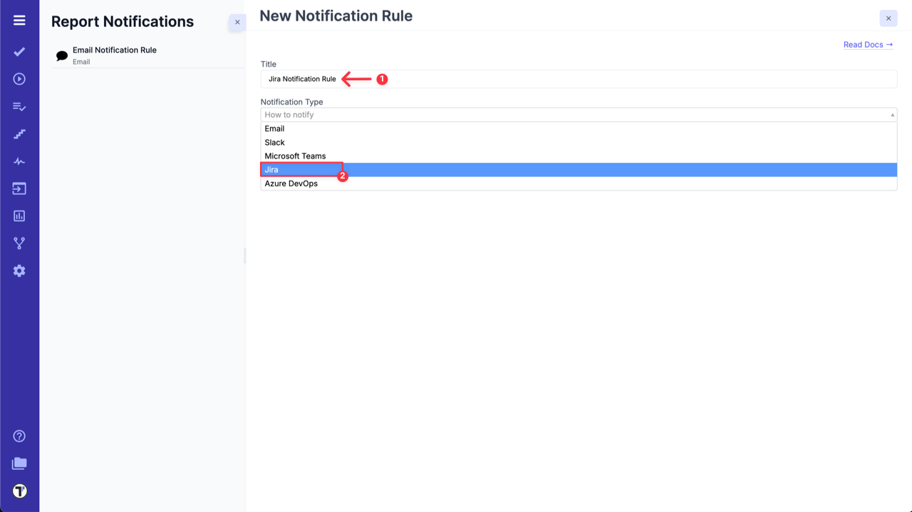
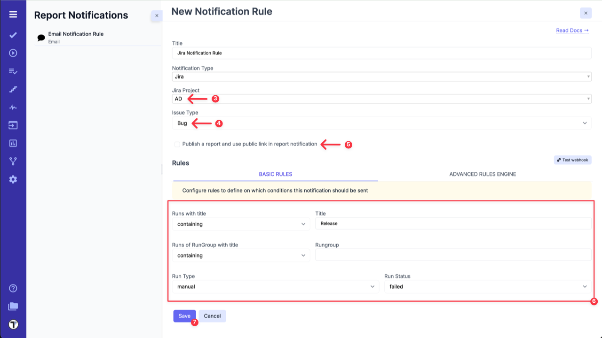
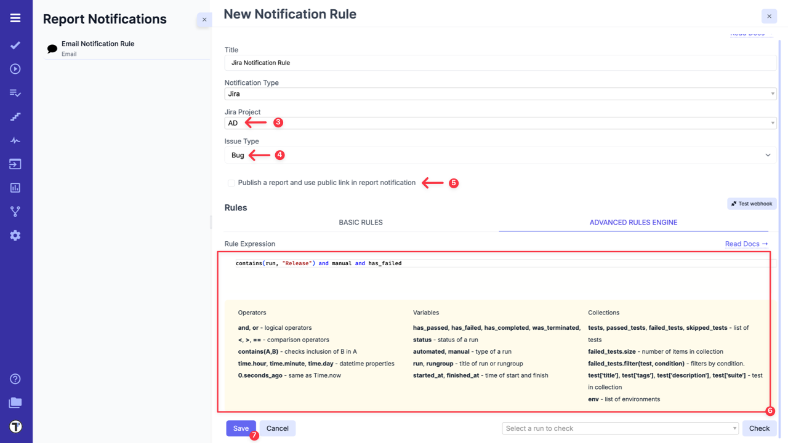
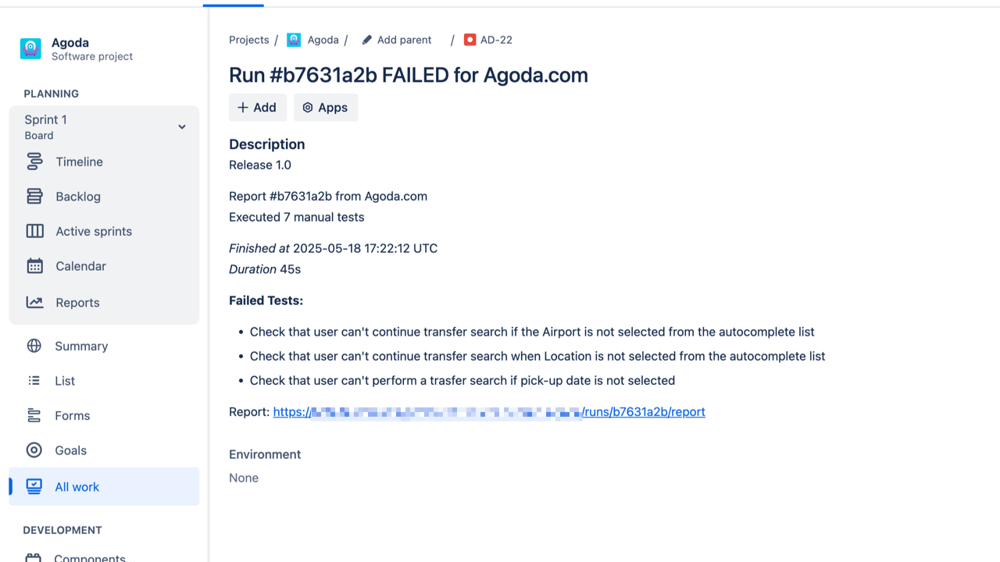

Testomat.io allows to create Jira issue for failed test runs automatically. This option can be enabled in **Settings**.
To do this, you need to connect Jira project with Testomat.io. Please see dedicated documentation - [Connecting to JIRA project.](https://docs.testomat.io/integration/jira/#connecting-to-jira-project)

After the Jira is connected with Testomat.io, go to the **Settings (1) -> Report Notifications(2)** and click on **Add Notification Rule (3)**.

To create a new Notification Rule for Jira follow next steps:

1. Add a title for Notification Rule.
2. Choose **Jira** from the dropdown list.

3. Select your dedicated Jira project from **Jira Project** dropdown list.
4. Select needed issue type from **Issue Type** dropdown list.
5. Select **'Publish a report and use public link in report notification'** option, if you need it.
6. Configure rules to define on which conditions this notification should be sent in **BASIC RULES** section

OR

use **ADVANCED RULES ENGINE** to enter your rule expression.

7. Click on **Save** button.

| **Basic Rules**             | **Advanced Rules Engine**             |
| --------------------------- | ------------------------------------- |
|  |  |

Now Testomat.io will create an issue with detailed information on Test Run results within your Jira project for failed Test Runs. So you don't need to put all the data on each Test Run manually. This helps to save time and notify all contributors in a convenient way.

:::note

When **'Publish a report and use public link in report notification'** option is enabled, the public report will be generated and everyone who has this link will be able to see it.

:::