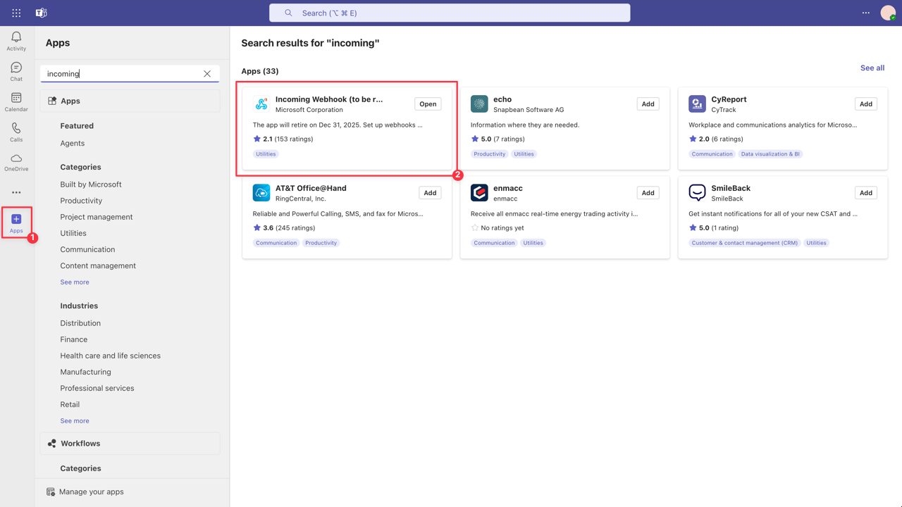
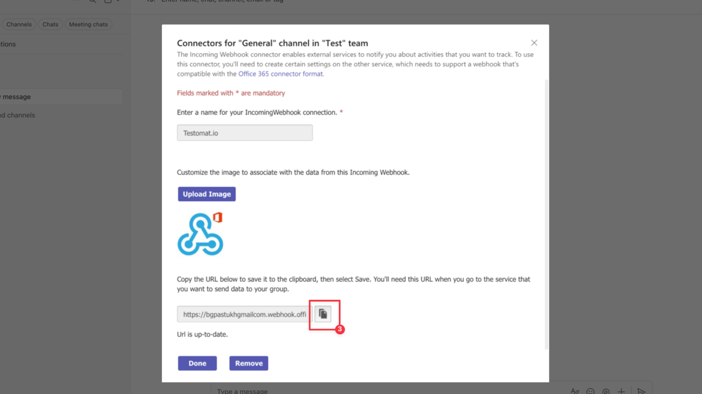
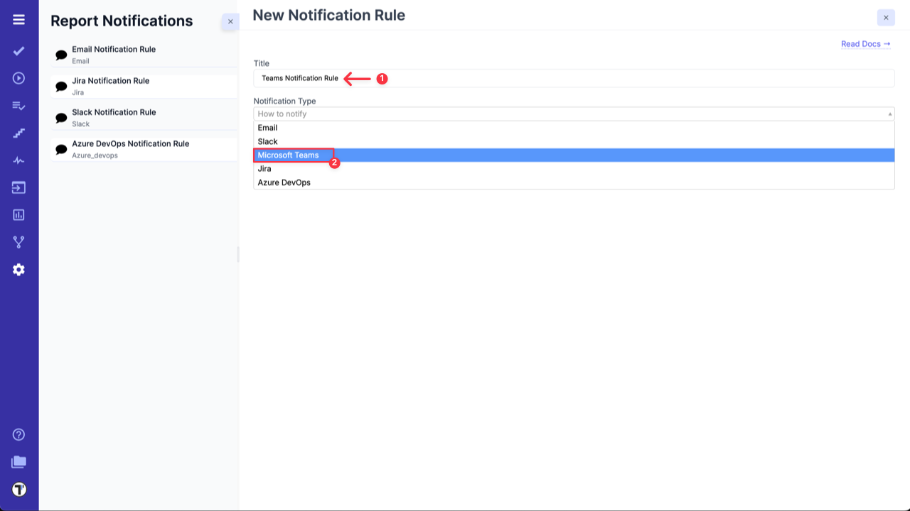
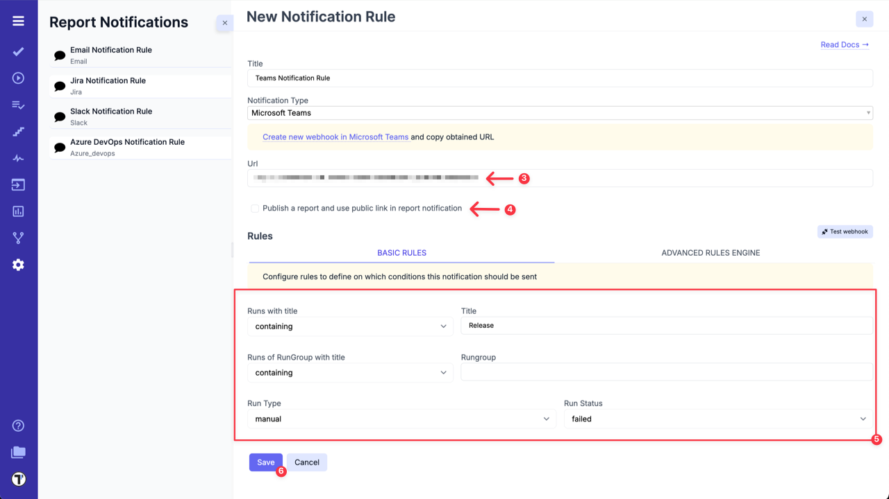
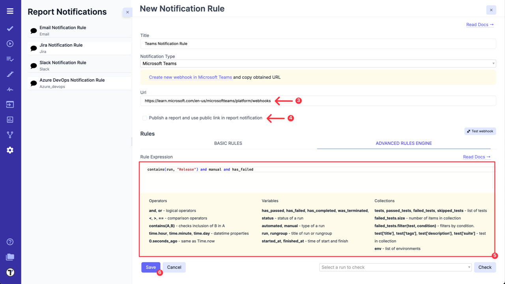

To send noitifcations in MS Teams, first you need to set up **Incoming Webhooks** for your channel.

Steps to configure:

1. Navigate to **Apps** panel.
2. Search for **Incoming Webhook** and add it ([read more here](https://learn.microsoft.com/en-us/microsoftteams/platform/webhooks-and-connectors/how-to/add-incoming-webhook?tabs=newteams%2Cdotnet)).

3. Configure it and copy Webhook URL.

After Teams is Set up, open your Project in Testomat.io and go to the **Settings (1) -> Report Notifications(2)** and click on **Add Notification Rule (3)**.

Create a new Notification Rule for Teams in Testomat.io following next steps:

1. Add a title for Notification Rule.
2. Choose **Microsoft Teams** from the dropdown list.

3. Paste Teams Webhook URL.
4. Select **'Publish a report and use public link in report notification'** option, if you need it.
5. Configure rules to define on which conditions this notification should be sent in **BASIC RULES** section

OR

using **ADVANCED RULES ENGINE** to enter your rule expression.

6. Click on **Save** button.

| **Basic Rules**             | **Advanced Rules Engine**             |
| --------------------------- | ------------------------------------- |
|  |  |

**How does it work?**
Each time Testomat.io creates Run Report, which corresponds to your Teams Notification Rule, it will be sent to selected Teams channel.

:::note

When **'Publish a report and use public link in report notification'** option is enabled, the public report will be generated and everyone who has this link will be able to see it.

:::