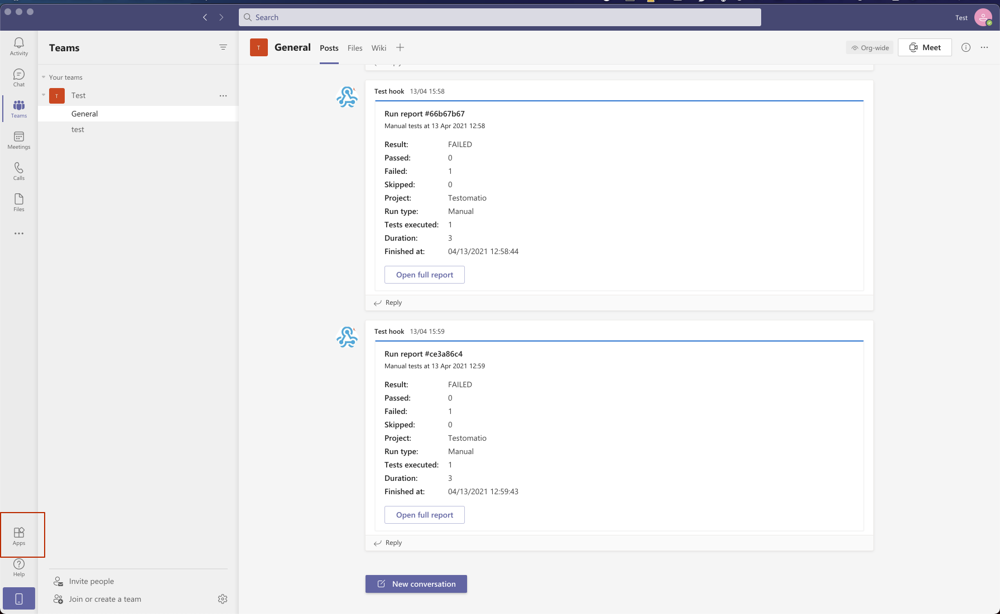
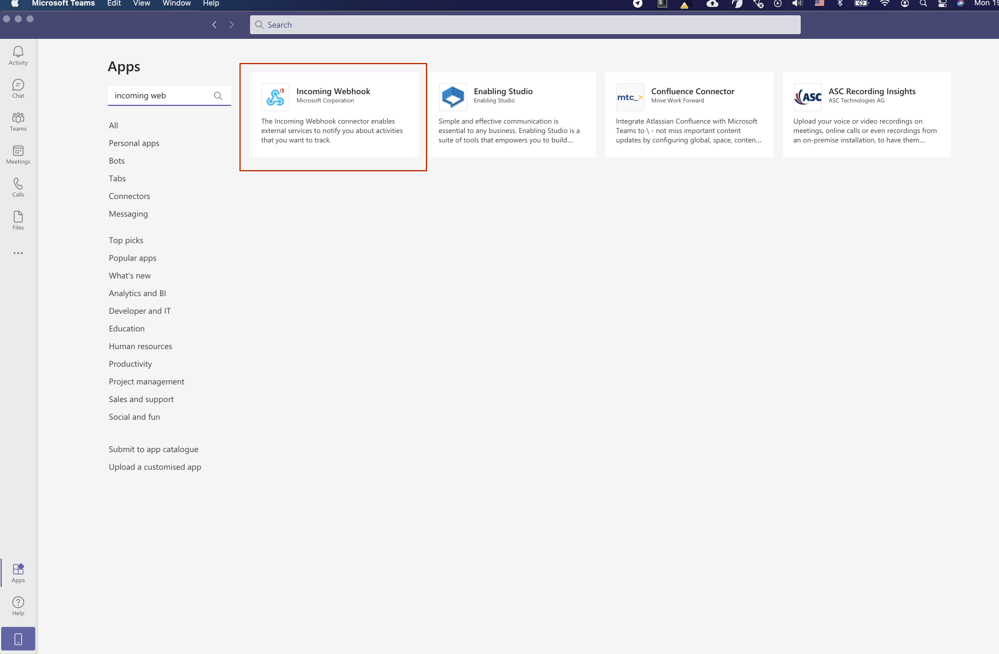
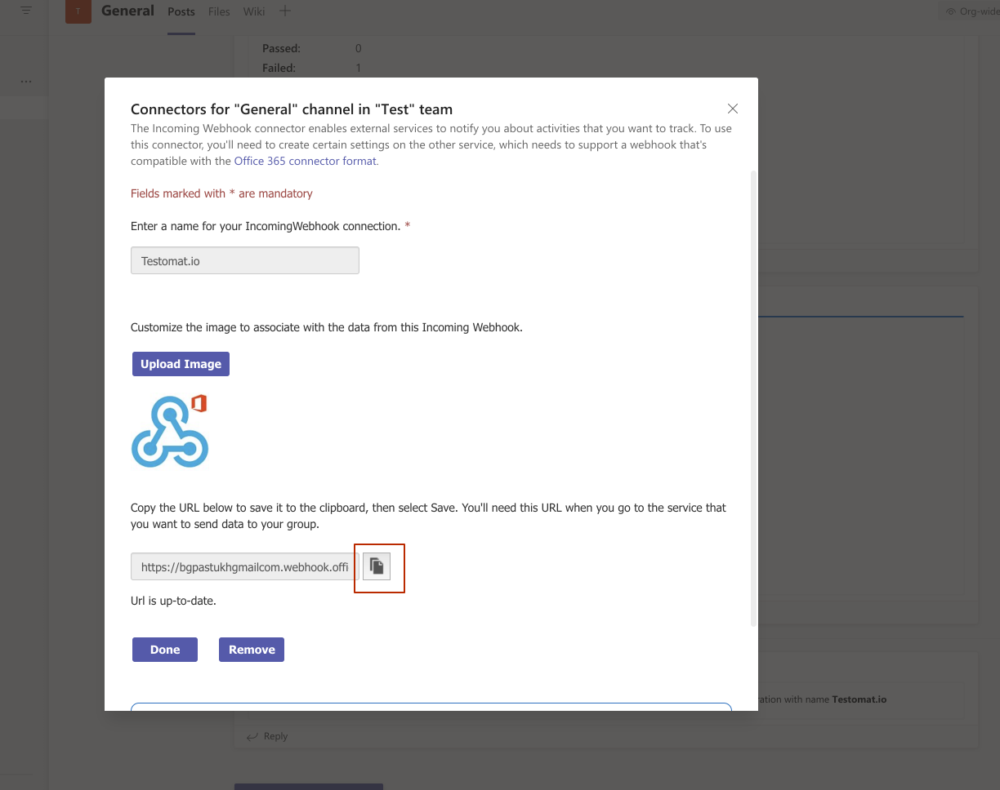
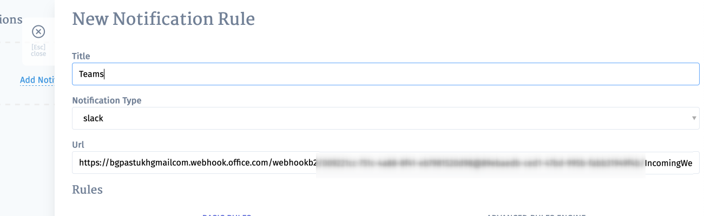

To send noitifcations in MS Teams you need to set up incoming webhooks for your channel. Steps to configure:
* Navigate to "Apps" panel 

* Search for "Incoming Webhook" and add it

* Configure it and copy webhook url

* Create a new notification in Testomatio, select "ms_teams" and paste webhook URL into Url:

