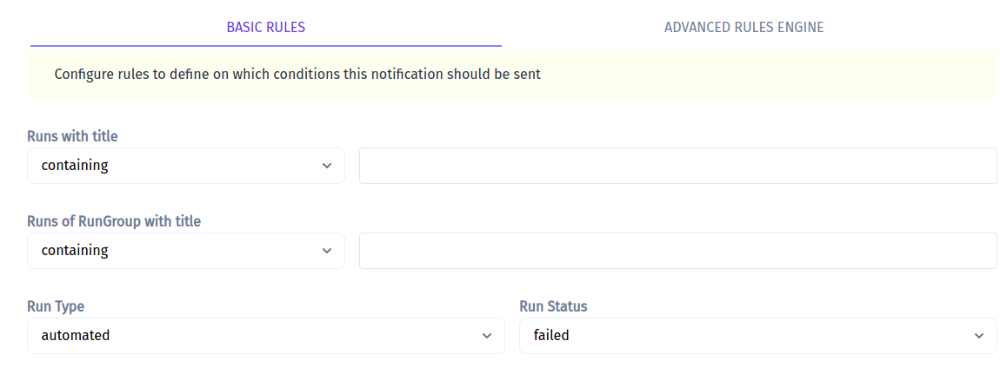
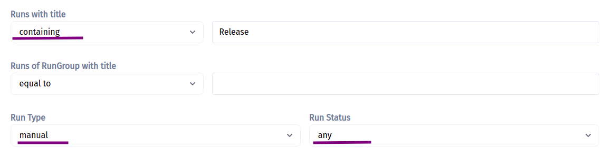
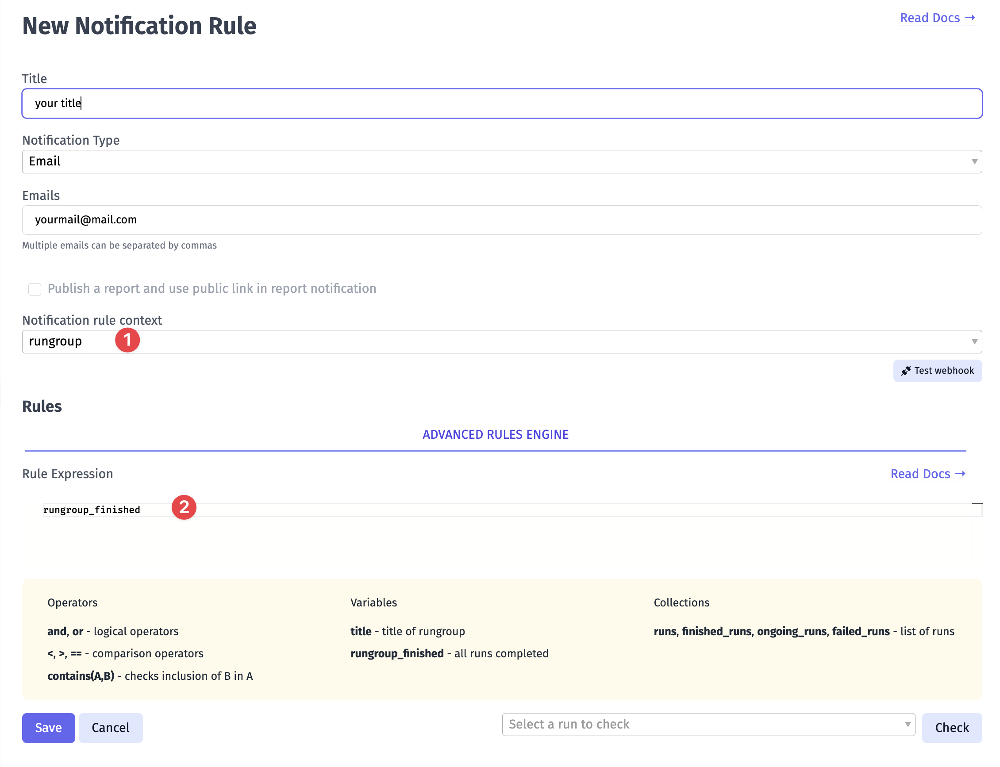

Testomat.io allows sending notifications for finished runs:
- Send brief reports to stakeholders
- Notify team members of failed tests
- Configure on which condition notification should be sent

Testomatio has powerful rule engine which can be used to define on which conditions a notification should be sent. You can have multiple notification types with different notification channels in use for a single project.

## Basic Rules

There is a basic and advanced rules engine:



Inside Basic rules you can define simple conditions on which notifications should be sent. For instance, here is the rule for all manual with "Release" word to be reported:



## Advanced Rules

The advanced rules engine allows writing conditions in a special expression language similar to Ruby or JavaScript.

This is the same rule we defined previously in Basic mode written in the format of Advanced mode. A notification will be sent for all manual runs that contain the word "Release":

```
manual and contains(run, "Release")
```

A complete list of allowed variables:

* `automated` - boolean. True if a run is automated
* `manual` - boolean. True if a run is manual
* `has_failed` - boolean. True if a run has failed
* `has_passed` - boolean. True if a run has passed
* `was_terminated` - boolean. True if a run was terminated
* `run` - string. Title of a run
* `rungroup` - title. Title of rungroup a run belongs to
* `status` - string. Status of run, 'passed' or 'failed' as a string.
* `started_at` - datetime. Time when the run was started.
* `finished_at` - datetime. Time when the run was finished
* `passed_tests` - collection. A list of all passed tests in a run.
* `failed_tests` - collection. A list of all failed tests in a run.
* `skipped_tests` - collection. A list of all skipped tests in a run.

An expression should return a boolean value. To deal with types other than boolean functions and methods can be used:

**String**

String values can be checked with equal `==` or not equal `!=` operators. Also there is `contains` function which checks inclusion of a string in another string:

```
contains(run, "New")
```

**Collection**

Collections contain an array of objects. 

Use `.size` to check for the size of items in the collection. For instance, this rule is activated when a number of failed tests is more than 10.

```
failed_tests.size > 10
```
Collection of tests can be filtered. Tests in the collection have following properties:

* `test['title']` - title of a test
* `test['suite']` - title of a suite of a test
* `test['id']` - id of a test
* `test['suite_id']` - id of a suite
* `test['status']` - status of a test in collection

For instance, this is how to check if a collection of failed tests contains at least one test with `@important` tag in its name:

```
failed_tests.filter(test, contains(test["title"], "@important")).size > 0
```

**DateTime**

`started_at` and `finished_at` variables are of datetime type. They have properties from [Date](https://ruby-doc.org/stdlib-2.6.1/libdoc/date/rdoc/Date.html) and [DateTime](https://ruby-doc.org/stdlib-2.6.1/libdoc/date/rdoc/DateTime.html) classes of Ruby that can be used in expressions. Most used ones are:

* `hour`
* `minute`
* `day`
* `wday`
* `month`
* `year`
* [etc](https://ruby-doc.org/stdlib-2.6.1/libdoc/date/rdoc/Date.html)

For instance, this is how notification can be enabled for reports finished in non-business time:

```
(finished_at.hour > 18 or finished_at.hour < 9)
```

## Examples

**Notify when tests are failing on CI:**

To match tests executed on CI specify a Run title with "[CI]" prefix to identify that these tests were executed on CI:

```
TESTOMATIO_TITLE="[CI] Automated Tests"
```

Then write a notification rule that will check only for failing runs with "[CI]" in their title:

```
contains(run, "[CI]") and has_failed
```

**Notify when automated tests are terminated:**

```
automated and was_terminated
```

## Run Group Notifications

<Aside> 
Please note that Run Group Notifications are available for Email notification type only
</Aside>

To configure Notification Rule for Run Group you need to:

1. pick rungroup for Notification rule context
2. add your Rule Expression, for example, you can use `rungroup_finished` variable if you want to get notification when all Run report inside the group are finished.



### Rules for Run Group Notifications

The rules engine allows writing conditions in a special expression language similar to Ruby or JavaScript.

A list of allowed variables:

* `title` - string. Title of a rungroup
* `rungroup_finished` -  boolean. True if all runs completed => True if rungroup contains only finished runs.
* `runs` - collection. A list of all runs inside a rungroup
* `finished_runs` - collection. A list of finished (passed or failed) runs inside a rungroup
* `ongoing_runs` - collection. A list of pending runs (scheduled, in progress) runs inside a rungroup
* `failed_runs` - collection. A list of failed runs inside a rungroup
